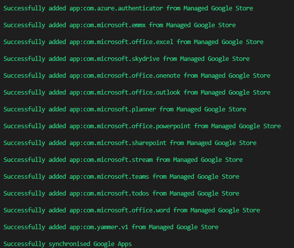
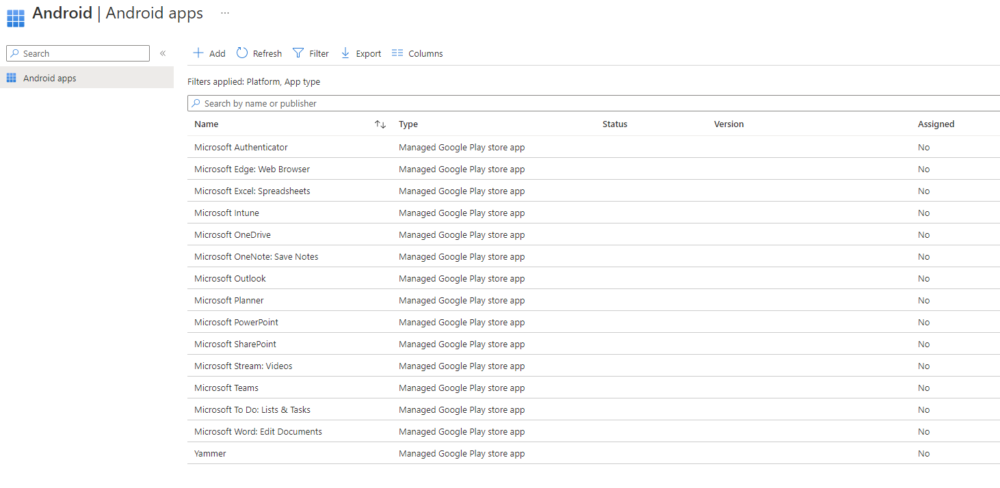

# The Easy Way to Approve Managed Google Play Apps


We've all had to add [Managed Google Play Apps](https://learn.microsoft.com/en-us/mem/intune/apps/apps-add-android-for-work) in bulk to Microsoft Intune for your Android Enterprise enrolled devices, whether this is just the raft of Microsoft Apps now that all your data is in Office 365, or the hundreds you have in a rival MDM (Mobile Device Management) solution that you're looking to migrate away from.

Anyone fancy doing this one by one with lots of mouse clicks and early onset repetitive strain injury? Didn't think so.

This will be a quick one, and annoyingly does require a bit of effort to get the app details...more on that later though. Onto the fun part.

## Managed Google Play Apps

As always we're leaning on Graph again, as with everything in Microsoft Intune, and knowing we've setup our Managed Google Play account already, we can leverage this to add some Android Enterprise Apps into our tenant.

Android Enterprise apps can't be added to Microsoft Intune in the same way as iOS Store Apps or even Play Store Apps, so we can't use [POST /deviceAppManagement/mobileApps](https://learn.microsoft.com/en-us/graph/api/intune-apps-managediosstoreapp-create?view=graph-rest-1.0) for creating these in the tenant. All the work is done at the Google side, so luckily we have a way to call this via the Graph API.

## Approving and Syncing Applications

We're not actually creating anything here, all the Apps and the associated data exists within the Managed Play Store, what we need to do is approve an app. We can use the [POST /deviceManagement/androidManagedStoreAccountEnterpriseSettings/approveApps](https://learn.microsoft.com/en-us/graph/api/intune-androidforwork-androidmanagedstoreaccountenterprisesettings-approveapps?view=graph-rest-beta) action to our advantage.

We can make a POST call to `https://graph.microsoft.com/beta/deviceManagement/androidManagedStoreAccountEnterpriseSettings/approveApps` with some JSON to approve the applications we need.

The JSON format we need to pass through using this call is in the format below.

```JSON
{
  "packageIds": [
    "Package Ids value"
  ],
  "approveAllPermissions": true
}
```


What Microsoft don't tell you in the documentation is that the "Package Ids value" actually needs to be in the format `app:PackageId`, i.e. `app:com.microsoft.emmx`, thanks Microsoft.


So we've got the bare bones of an idea, so what we need to do is get our App Package Ids together for all the Mobile Apps we want. What? You don't have these to hand? Well sadly there isn't a 'scripty' way of getting these, not for free at least, so I'll do you a solid and provide a list of some of the common Microsoft ones.

| Mobile App Name | Package ID |
| :- | :- |
| Microsoft Authenticator | `com.azure.authenticator` |
| Microsoft Edge | `com.microsoft.emmx`|
| Microsoft Excel | `com.microsoft.office.excel` |
| Microsoft OneDrive | `com.microsoft.skydrive`|
| Microsoft OneNote | `com.microsoft.office.onenote`|
| Microsoft Outlook | `com.microsoft.office.outlook` |
| Microsoft Planner | `com.microsoft.planner` |
| Microsoft PowerPoint | `com.microsoft.office.powerpoint` |
| Microsoft SharePoint | `com.microsoft.sharepoint` |
| Microsoft Stream | `com.microsoft.stream`|
| Microsoft Teams | `com.microsoft.teams` |
| Microsoft To Do | `com.microsoft.todos` |
| Microsoft Word | `com.microsoft.office.word`|
| Microsoft Yammer | `com.yammer.v1` |

For any others, maybe your existing MDM has them listed next the App Name, otherwise you can find an app's package name in the URL of the app’s Google Play Store listing.

For example, the URL of an app page is **play.google.com/store/apps/details?id=com.example.app123**. The app's package name is **com.example.app123**.

As we're using PowerShell, we could do with throwing these Package Ids into an array of some sort, just so we can loop through them later on.

```PowerShell
$AndroidAppIds = New-Object -TypeName System.Collections.ArrayList
$AndroidAppIds.AddRange(@(
        'com.azure.authenticator',
        'com.microsoft.emmx',
        'com.microsoft.office.excel',
        'com.microsoft.skydrive',
        'com.microsoft.office.onenote',
        'com.microsoft.office.outlook',
        'com.microsoft.planner',
        'com.microsoft.office.powerpoint',
        'com.microsoft.sharepoint',
        'com.microsoft.stream',
        'com.microsoft.teams',
        'com.microsoft.todos',
        'com.microsoft.office.word',
        'com.yammer.v1'
    )
)
```

We could have also prefixed the Package Id with the required *'app:'* but that's one for later me.

## The Functions

Now we have our list of Package Ids for the Mobile Apps in a nice format, we need to build a couple of functions (obviously) to approve the Mobile Apps and then synchronise the Apps to the Microsoft Intune tenant.

### Approving Managed Google Apps

You would have seen this format for Graph functions a lot on this site, but the important thing here is how we're building the JSON object and adding in the required prefix.

```PowerShell
Function Add-GoogleApplication() {

    param
    (
        $PackageID
    )

    $graphApiVersion = 'Beta'
    $App_resource = 'deviceManagement/androidManagedStoreAccountEnterpriseSettings/approveApps'

    try {
        if (!$PackageID) {}
            Write-Host 'No PackageID was passed to the function, provide a valid PackageID variable' -f Red
            break
        }

        $PackageID = 'app:' + $PackageID
        $Packages = New-Object -TypeName psobject
        $Packages | Add-Member -MemberType NoteProperty -Name 'approveAllPermissions' -Value 'true'
        $Packages | Add-Member -MemberType NoteProperty -Name 'packageIds' -Value @($PackageID)
        $JSON = $Packages | ConvertTo-Json -Depth 3
        $uri = "https://graph.microsoft.com/$graphApiVersion/$($App_resource)"
        Invoke-MgGraphRequest -Uri $uri -Method Post -ContentType 'application/json' -Body $JSON
        write-host "Successfully added $PackageID from Managed Google Store" -ForegroundColor Green
    }
    catch {
        Write-Error $Error[0].ErrorDetails.Message
        break
    }
}
```

### Synchronising Managed Google Apps

Now that we have a way to Approve the apps, we need a way to sync them...bring on the [POST /deviceManagement/androidManagedStoreAccountEnterpriseSettings/syncApps](https://learn.microsoft.com/en-us/graph/api/intune-androidforwork-androidmanagedstoreaccountenterprisesettings-syncapps?view=graph-rest-beta) the below function, and a POST call to the below URI

```txt
https://graph.microsoft.com/beta/deviceManagement/androidManagedStoreAccountEnterpriseSettings/syncApps
```

```PowerShell
Function Invoke-SyncGoogleApplication() {

    [cmdletbinding()]

    param
    (
        $PackageID
    )

    $graphApiVersion = 'Beta'
    $App_resource = 'deviceManagement/androidManagedStoreAccountEnterpriseSettings/syncApps'

    try {
        $uri = "https://graph.microsoft.com/$graphApiVersion/$($App_resource)"
        Invoke-MgGraphRequest -Uri $uri -Method Post -ContentType 'application/json' -Body $JSON
        Write-Host "Successfully synchronised Google Apps" -ForegroundColor Green
    }
    catch {
        Write-Error $Error[0].ErrorDetails.Message
        break
    }

}
```

## Running the Script

Throwing in the `Get-AuthTokenMSAL` function we know and love to the above functions, the authentication section to Graph API, the array variable we created, and the below little snippet of a `foreach` loop, we can happily run through each of the Mobile App Package Ids and approve them, rounding it off with a quick sync.

```PowerShell
foreach($AndroidAppId in $AndroidAppIds) {
    Add-GoogleApplication -PackageID $AndroidAppId
}
Invoke-SyncGoogleApplication
```

The full [Script](https://github.com/ennnbeee/oddsandendpoints-scripts/blob/main/Intune/Apps/AddGoogleApps/Invoke-AddGoogleApps.ps1) can be found in my [GitHub Repo](https://github.com/ennnbeee/oddsandendpoints-scripts/) and as always, please test this before adding hundreds of apps to the variable, you'll thank me later.

Running the script gives us the following output:



After a little while, we'll see the Mobile Apps in the [Microsoft Intune Android Apps Portal](https://endpoint.microsoft.com/#view/Microsoft_Intune_DeviceSettings/AppsAndroidMenu/~/androidApps):



With the Mobile Apps now in the tenant, you can go ahead and assign them to your hearts content...or maybe script something to do this for you?

## Summary

Even if grabbing the **packageId** for each mobile app you want to approve and synchronise to Microsoft Intune is a a bit of a pain, and trust me, I looked at free ways to query the Play Store, this at least cuts the time down for synchronising Managed Google Play apps, especially as part of a migration to Intune.

