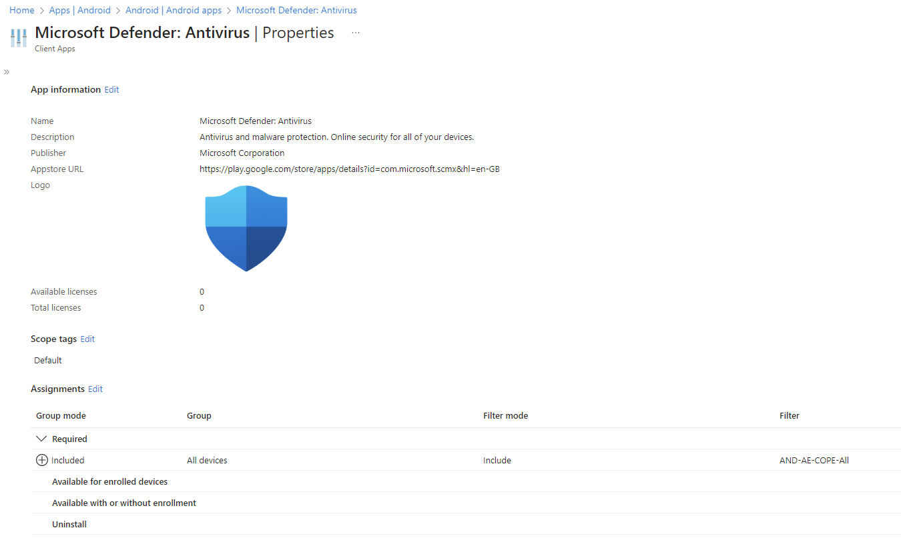
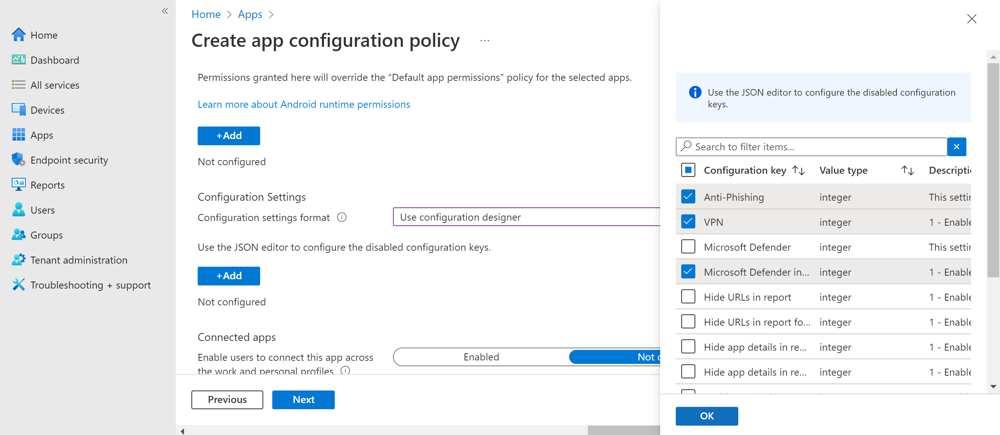
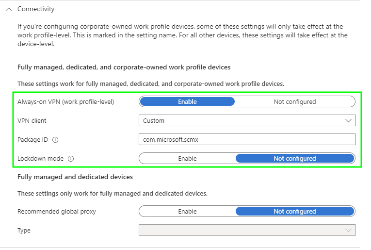
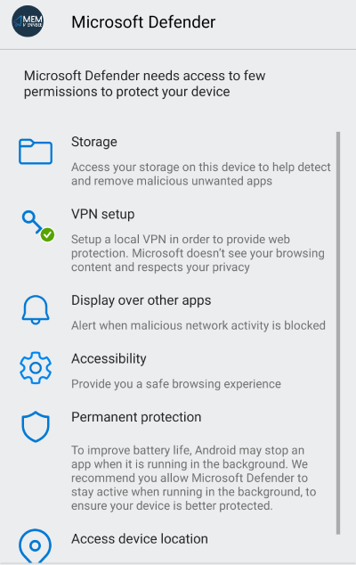
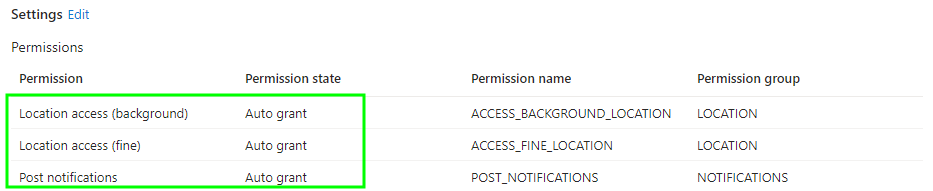
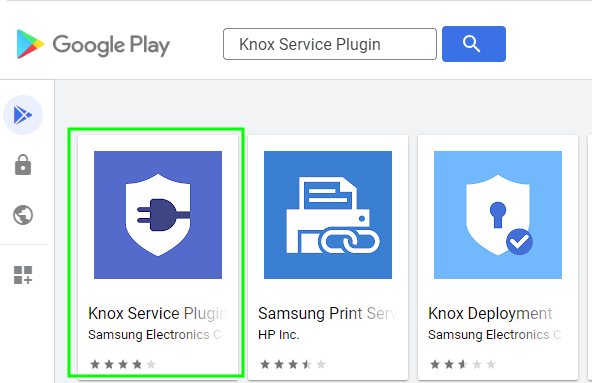
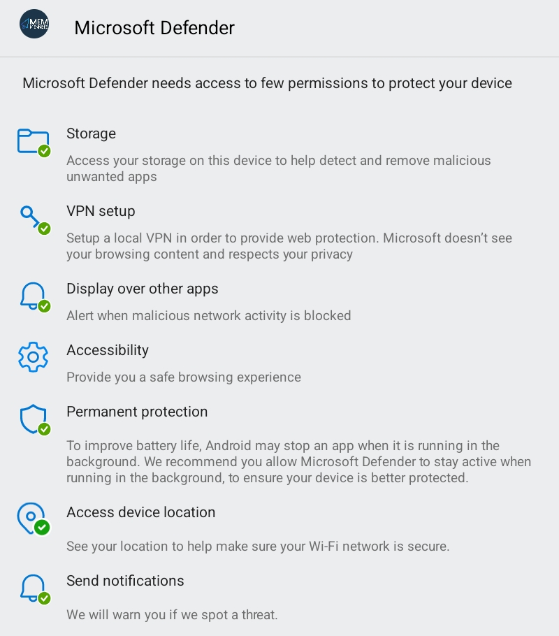

# Lower-Touch Defender for Endpoint Onboarding for Android Devices


Onboarding corporate mobile devices managed by Intune into Defender for Endpoint shouldn't require your end users to do *anything*, and with supervised iOS/iPadOS devices this is exactly the case with Microsoft providing [great documentation](https://learn.microsoft.com/en-us/defender-endpoint/ios-install) on the process and corresponding configuration profiles to support silent onboarding.

The same however can't be said for Android Enterprise devices, even with the feature for [low-touch onboarding](https://learn.microsoft.com/en-us/defender-endpoint/android-intune#configure-low-touch-onboarding) ~currently in preview~ now [Generally Available](https://learn.microsoft.com/en-us/defender-endpoint/android-whatsnew#android-low-touch-onboarding-is-now-ga).

Although low-touch onboarding reduces the amount of hoops a user has to jump through, it doesn't remove them all.

Can we help with that?

## Defender App

First off, before we go configuring devices with their Microsoft Defender for Endpoint onboarding settings, we actually need our devices to have the app itself.

So go and [add the app](https://learn.microsoft.com/en-us/defender-endpoint/android-intune#add-microsoft-defender-for-endpoint-on-android-as-a-managed-google-play-app) following along with Microsoft nicely.



Once added to your Intune tenant, you're going to need to deploy it, with a **Required** assignment target.

Good, your devices have the app, but what about the configuration.

## Low-Touch Onboarding

To configure [low-touch onboarding](https://learn.microsoft.com/en-us/defender-endpoint/android-intune#configure-low-touch-onboarding), we need to configure two main things on the Android Enterprise devices:

1. The Defender App to give the app permissions and configuration settings
2. A loopback VPN profile to allow for enabling Web Protection

We'll expand a bit more on some of the other permission and configurations you can apply, but for now we'll just deal with onboarding the Microsoft way.

### App Configuration Policy

If you skipped ahead when following the Microsoft article about deploying the Android Enterprise App, you may have noticed the section from [Step 9](https://learn.microsoft.com/en-us/defender-endpoint/android-intune#:~:text=for%20Endpoint%20supports-,App%20configuration%20policies,-for%20managed%20devices) about App Configuration policies.



We'll need one of these to turn on or off Defender App settings, or at least be definite with our choices instead of relying on the defaults.

To make sure that the Defender App is actually doing something, go ahead and configure a new policy with the below Configuration Settings.

| Configuration Key | Value Type | Configuration Value |
| :- | :- | :- |
| Anti-phishing | integer | `1 - Enable` |
| Microsoft Defender | integer | `1 - Enable` |
| VPN | integer | `1 - Enable` |

With these basic settings we can at least ensure that the Defender App on the Android Enterprise device will be ready for onboarding.

### Always-on VPN Profile

As we've configured the Defender app with the VPN setting, we need to deploy one to our Android Enterprise devices. This VPN isn't really giving your devices access to anything, but is required to support the [Web Protection](https://learn.microsoft.com/en-us/defender-endpoint/android-configure#configure-web-protection) functionality.

> Defender for Endpoint on Android would use a VPN in order to provide the Web Protection feature. This VPN is not a regular VPN. Instead, it's a local/self-looping VPN that does not take traffic outside the device.

We can easily create a new Device Restriction configuration profile (please can Settings Catalog come to Android Enterprise 🙏) based on the information in the [Learn article](https://learn.microsoft.com/en-us/defender-endpoint/android-intune#auto-setup-of-always-on-vpn), but save you clicking away, here are the settings required:

| Category | Setting | Value |
| :- | :- | :- |
| Connectivity | Always-on VPN (work profile-level) | `Enabled` |
| Connectivity | VPN client | `Custom` |
| Connectivity | Package ID | `com.microsoft.scmx` |
| Connectivity | Lockdown mode | `Not configured` |

The Package ID of **com.microsoft.scmx** is the Defender for Endpoint Android app, we'll need this later on.



With the VPN in place, we can now look at the specific Low-Touch onboarding settings.

### Low-Touch Onboarding Settings

If we just configure the above, a user will still need to approve the permissions the Defender App is requesting.

We've dealt with the VPN, but it's still going to ask for the following permissions:

- File Access
- Location Access
- Permanent Protection
- Accessibility
- Display over other apps



Now for *all* Android Enterprise device types we can only make this onboarding a little easier with Intune, by updating our App Configuration policy for Defender to include the below permissions and settings.

#### App Settings

These settings allow for the configuration of the low-touch onboarding approach:

| Configuration Key | Value Type | Configuration Value |
| :- | :- | :- |
| Low touch onboarding | integer | `1 - Enable` |
| User UPN | variable | `User Principal Name` |


The **User Principal Name** variable will just change itself to a string value type, and a configuration value of `{{userprincipalname}}`, so don't be alarmed when you see this.


#### App Permissions

To make the onboarding process a little smoother, we can give the Defender app some of the permissions it's asking for, so again update your App Configuration policy and add in the below permissions.

| Permission | Permission State | Permission Name | Permissions Group |
| :- | :- | :- | :- |
| Post notifications | `Auto grant` | POST_NOTIFICATIONS | NOTIFICATIONS |
| Location access (fine) | `Auto grant` | ACCESS_FINE_LOCATION | LOCATION |
| Location access (background) | `Auto grant` | ACCESS_BACKGROUND_LOCATION | LOCATION |


The **Location access (background)** permission isn't mentioned in the documentation, but it is required by the Defender app.




This now means that users now won't be prompted for three of the six permissions the ~~greedy~~ Defender app is requesting.

Can we sort out the remaining permissions though?

## Lower-Touch Onboarding

The answer is *maybe*, and only if you have Samsung Android Enterprise devices running at least [Android 13](https://docs.samsungknox.com/admin/knox-platform-for-enterprise/knox-service-plugin/kbas/kba-1261-grant-special-permissions-for-an-app/#:~:text=EMM-,Environment,-Knox%20Service%20Plugin).

> If a special permission is granted through the policy, the device doesn’t request the permission from the device user.

What started me on this journey was a post about the changes to the [Shared Device mode for Android Enterprise on Samsung devices](https://techcommunity.microsoft.com/blog/microsoftendpointmanagerblog/frontline-workers-get-a-better-experience-from-microsoft-and-samsung/4078801) detailing how to use the [Knox Service Plugin](https://docs.samsungknox.com/admin/knox-platform-for-enterprise/knox-service-plugin/welcome/) and an [OEMConfig profile](https://learn.microsoft.com/en-us/mem/intune/configuration/android-oem-configuration-overview) in Intune to give Microsoft Launcher overlay, or display over other app permissions on-behalf of a user.

Surely we can do the same for Defender on our supported Samsung devices?

### Knox Service Plugin

Before we dive into attempting to configure these additional permissions for our users, we need an OEMConfig App available in Intune. So go an approve the Knox Service Plugin from the Managed Google Play Store.



Once available in Intune, I strongly suggest deploying this to all your Samsung Android Enterprise devices as the app is required before the configuration will apply.

Use a [Device Filter](https://learn.microsoft.com/en-us/mem/intune/fundamentals/filters) with a rule looking like the below for your assignment:

```PowerShell
(device.deviceOwnership -eq "Corporate") and (device.manufacturer -eq "samsung")
```

Once the app has installed, we can now move onto configuring a profile.

### OEMConfig

From my experience with [OEMConfig profiles](https://learn.microsoft.com/en-us/mem/intune/configuration/android-oem-configuration-overview) there [can be only one](https://www.youtube.com/watch?v=sqcLjcSloXs) assigned per Samsung device ([Zebra devices are different](https://learn.microsoft.com/en-us/mem/intune/configuration/oemconfig-zebra-android-devices)), so if you're already applying a Knox Service Plugin based profile, you're going to have to amend that one instead of creating a new one.

Either way, to setup the Android Enterprise profile, if you need to create a new one, and to configure the required Defender for Endpoint settings:

- Navigate to the Microsoft Intune admin center and select **Configuration** under **Manage devices**, create a new policy for the **Android Enterprise** platform of type **OEMConfig**.
  - Give the profile a suitable name and a description if you'd like e.g., `MVE-AND-AE-D-CO-KSP-Defender`
  - Select `Knox Service Plugin` as the OEMConfig app
  - Select **Next** to continue to the configuration page
- Under **Knox Service Plugin** enter in a name for the Knox profile i.e., `DefenderforEndpoint(1.0)`
- Under **Knox Service Plugin** select **Configure** for **Device-wide policies (Selectively applicable to Fully Manage Device (DO) or Work Profile-on company owned devices (WP-C mode as noted)**
  - Under Device-wide policies set **Enable device policy controls** to `true` to enable it.
  - Select **Configure** for **Application management policies**
    - Under Application management policies set **Enable application management controls** to `true` to enable it.
    - In **Battery optimization allowlist** enter in `com.microsoft.scmx`
    - Under Application management policies set **Enable permission controls** to `true` to enable it.
- Under **Knox Service Plugin** select **Configure** for **Permission Controls**
  - Select the **ellipsis (...)** that's next to **Permission Controls** and select **Add Setting**
  - Under **Permission Configuration** select the **Permission Policy** dropdown
    - Select **Appear on top** and **All files access**
    - For **Package or Component Name**, add the Defender app package name `com.microsoft.scmx`

This process should look something like the below:



The settings look like the this when all together in a nice table:

| Category | Setting | Value |
| :- | :- | :- |
| Knox Service Plugin | Profile name(version) | `DefenderforEndpoint(1.0)` |
| Knox Service Plugin | Debug Mode | `true` |
| Device-wide policies | Enable device policy controls | `true` |
| Application management policies | Enable application management controls | `true` |
| Application management policies | Battery optimization allowlist | `com.microsoft.scmx` |
| Application management policies | Enable permission controls | `true` |
| Permission Controls > Permission Configuration | Permission Policy | `All files access`<br>`Appear on top` |
| Permission Controls > Permission Configuration | Package or Component Name | `com.microsoft.scmx` |

We're setting **Debug Mode** to true for now, as we want to see the outcome of the application of the profile in the Knox Service Plugin app on the device, once happy that it's working we change this to `false`.


For reference to how to configure these additional special permissions, the [Knox documentation](https://docs.samsungknox.com/admin/knox-platform-for-enterprise/knox-service-plugin/kbas/kba-1261-grant-special-permissions-for-an-app/) covers it in more detail.


What we have here is a new profile that should help our users on their way to onboarding their devices to Defender, without having to faff about setting up the additional requested permissions that Defender needs.

So when a user now opens the Defender app, they are only presented with one permission for Accessibility to configure:



I haven't worked out a way to implement this using Intune or the Knox Service Plugin, so you're end users will still have to do something to finish the onboarding process, sorry 🫠.

## Defender Features

Now that you've got your Android Enterprise, and/or Samsung devices onboarded to Defender for Endpoint, it's worth covering off some additional [settings and features](https://learn.microsoft.com/en-us/defender-endpoint/android-configure) to ensure that the app is not either misused, or to just be definite with some default settings.

So back to your [App Configuration](https://learn.microsoft.com/en-us/mem/intune/apps/app-configuration-policies-overview) policy we go, to add in some or all of the below settings:

| Configuration Key | Value Type | Configuration Value | Description |
| :- | :- | :- | :- |
| Enable Network Protection in Microsoft Defender | integer | `1 - Enable` | [Turns on Network protection](https://learn.microsoft.com/en-us/defender-endpoint/android-configure#network-protection) |
| Enable Users to Trust Networks and Certificates | integer | `0 - Disable` | [Stops users from accessing untrusted network or sites](https://learn.microsoft.com/en-us/defender-endpoint/android-configure#network-protection) |
| Automatic Remediation of Network Protection Alerts | integer | `1 - Enable` | [Turns on the praising of users for doing some sensible security things](https://learn.microsoft.com/en-us/defender-endpoint/android-configure#network-protection) |
| Disable sign out | integer | `1 - Enable` | [Stops a user from signing out of the Defender App](https://learn.microsoft.com/en-us/defender-endpoint/android-configure#disable-sign-out) |
| Global Secure Access | integer | `0 - Disable` | [Disables the Global Secure Access settings](https://learn.microsoft.com/en-us/entra/global-secure-access/how-to-install-android-client) |

Obviously these can be amended based on your needs after reading through the associated documentation, and if you've got the bankroll to use Global Secure Access then can I borrow some money? 🤑.

## Summary

Even with the additional configuration implemented for supported Samsung devices, it's still not as seamless as the zero-touch onboarding available for iOS devices. Whether this is down to Android being ~~fussy~~ more particular with permissions and privacy settings than iOS or otherwise, users *should not* have to actively onboard their devices to a security service.

At least we've made the whole process a little easier for the Android users, and fixed some gaps with the Microsoft documentation.

