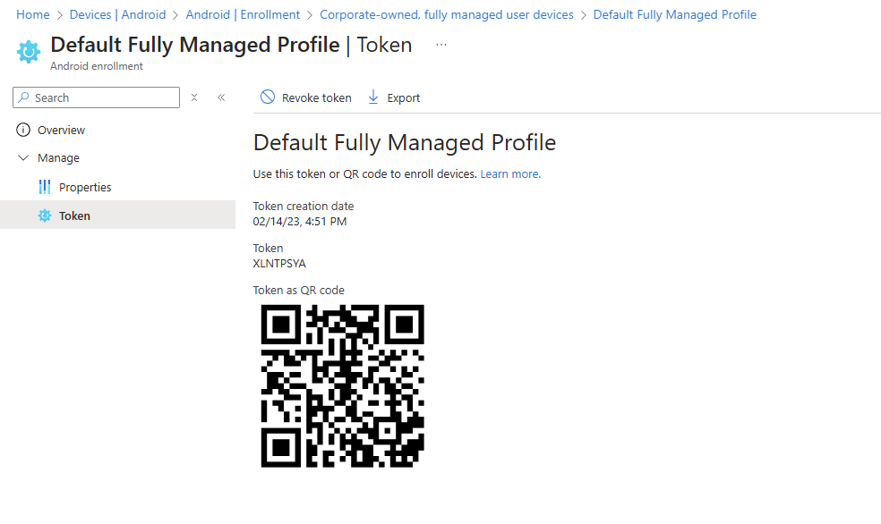

# Improving the Android Enterprise Enrolment Experience


Enrolling Android Enterprise devices in Intune is pretty straightforward, with the options to use either [Google Zero Touch](https://learn.microsoft.com/en-us/mem/intune/enrollment/android-dedicated-devices-fully-managed-enroll#enroll-by-using-google-zero-touch) or [QR Codes](https://learn.microsoft.com/en-us/mem/intune/enrollment/android-dedicated-devices-fully-managed-enroll#enroll-by-using-a-qr-code) to ~make~ empower your end users to enrol their own devices.

If you are using QR codes, we can improve the enrolment experience for your users, saving then either the need to connect to a wireless network to start the enrolment, or by pre-provisioning a wireless network for them so they don't have to smush their fingers on a keyboard to enter in wireless network details.

## Enrolment Tokens

Before we look at updating or creating new tokens to allow for enrolment using either a configured Wi-Fi network, or with mobile data, we need to get a copy of the enrolment token from Intune for your chosen enrolment profile.

You can find these tokens under **Devices > Android > Enrolment**, and for this example we'll be using the **Default Fully Managed Profile** enrolment token for **Corporate-owned, fully managed user devices**:



Take a screenshot of the code and save it, then using an [online reader](https://scanqr.org/#scan) we can extract the JSON data held within it:

```json {title="Default Fully Managed Profile"}
{
    "android.app.extra.PROVISIONING_DEVICE_ADMIN_COMPONENT_NAME": "com.google.android.apps.work.clouddpc/.receivers.CloudDeviceAdminReceiver",
    "android.app.extra.PROVISIONING_DEVICE_ADMIN_SIGNATURE_CHECKSUM": "I5YvS0O5hXY46mb01BlRjq4oJJGs2kuUcHvVkAPEXnb",
    "android.app.extra.PROVISIONING_DEVICE_ADMIN_PACKAGE_DOWNLOAD_LOCATION": "https://play.google.com/managed/downloadManagingApp?identifier=setup",
    "android.app.extra.PROVISIONING_ADMIN_EXTRAS_BUNDLE": {
        "com.google.android.apps.work.clouddpc.EXTRA_ENROLLMENT_TOKEN": "XLNTPSZB"
    }
}
```

Now we have the enrolment data, let's look at how we can add in additional properties to improve the enrolment experience.

### Mobile Data

With the change to Android 11 and above requiring a wireless network to go through the Fully Managed device enrolment process, you may be asking, *"Well what if my users don't have access to a wireless network?"*, don't fret, we can amend the JSON data in the token to allow for use of mobile data.

To allow for use of mobile data, add in the below code snippet into the extracted JSON data, before the **android.app.extra.PROVISIONING_ADMIN_EXTRAS_BUNDLE** section:

```json
"android.app.extra.PROVISIONING_USE_MOBILE_DATA":true,
```


Details of the enrolment token data configuration is available on the Google Developers pages [here](https://developers.google.com/android/management/provision-device)


With the full JSON string looking like the below:

```json {hl_lines=5, title="Default Fully Managed Profile with Mobile Data"}
{
   "android.app.extra.PROVISIONING_DEVICE_ADMIN_COMPONENT_NAME": "com.google.android.apps.work.clouddpc/.receivers.CloudDeviceAdminReceiver",
   "android.app.extra.PROVISIONING_DEVICE_ADMIN_SIGNATURE_CHECKSUM": "I5YvS0O5hXY46mb01BlRjq4oJJGs2kuUcHvVkAPEXnb",
   "android.app.extra.PROVISIONING_DEVICE_ADMIN_PACKAGE_DOWNLOAD_LOCATION": "https://play.google.com/managed/downloadManagingApp?identifier=setup",
   "android.app.extra.PROVISIONING_USE_MOBILE_DATA":true,
   "android.app.extra.PROVISIONING_ADMIN_EXTRAS_BUNDLE": {
      "com.google.android.apps.work.clouddpc.EXTRA_ENROLLMENT_TOKEN": "XLNTPSZB"
   }
}
```

However, if allowing enrolment using mobile data is enough for you, then skip to the end to create a new QR code, otherwise, keep reading for more ways to make your users lives easier.

### Wi-Fi Settings

To support wireless network integration, we can add in additional properties into the JSON structure, to configure a known wireless network for our users, and if it's in range, the device will automatically connect.

The Wi-Fi settings we're after have come from the [Android Developer Reference Guide](https://developer.android.com/reference/android/app/admin/DevicePolicyManager):

| Item | Value | Description |
| :- | :- | :- |
| `android.app.extra.PROVISIONING_WIFI_SSID` | `WIFI_SSID` | The SSID of the wireless network you want to connect to |
| `android.app.extra.PROVISIONING_WIFI_PASSWORD` | `WIFI_PASSWORD` | The password of the wireless network if using WPA |
| `android.app.extra.PROVISIONING_WIFI_SECURITY_TYPE` | `None/WPA/WEP/EAP` | The security type of the network |
| `android.app.extra.PROVISIONING_WIFI_HIDDEN` | `true/false` | Whether the network is hidden to broadcast |


Please be aware that these settings are all available in plain text by anyone scanning the QR code, so I would recommend using a guest wireless network if you are going to allow you end users to use a pre-configured Wi-Fi network to go through the enrolment process.


Update the data with your required network information, here we're using a network secured only by pre-shared key.

The below settings based on the settings from the table, need to go after the **android.app.extra.PROVISIONING_ADMIN_EXTRAS_BUNDLE** section:

```json
"android.app.extra.PROVISIONING_WIFI_SSID":"corp-guest-wifi",
"android.app.extra.PROVISIONING_WIFI_PASSWORD":"supersecurepassword",
"android.app.extra.PROVISIONING_WIFI_SECURITY_TYPE":"WPA",
"android.app.extra.PROVISIONING_WIFI_HIDDEN": false
```

So the full JSON data, with mobile data and a wireless network should look like the below:

```json {hl_lines=["9-12"], title="Default Fully Managed Profile with Mobile Data and Wi-Fi network"}
{
   "android.app.extra.PROVISIONING_DEVICE_ADMIN_COMPONENT_NAME": "com.google.android.apps.work.clouddpc/.receivers.CloudDeviceAdminReceiver",
   "android.app.extra.PROVISIONING_DEVICE_ADMIN_SIGNATURE_CHECKSUM": "I5YvS0O5hXY46mb01BlRjq4oJJGs2kuUcHvVkAPEXnb",
   "android.app.extra.PROVISIONING_DEVICE_ADMIN_PACKAGE_DOWNLOAD_LOCATION": "https://play.google.com/managed/downloadManagingApp?identifier=setup",
   "android.app.extra.PROVISIONING_USE_MOBILE_DATA":true,
   "android.app.extra.PROVISIONING_ADMIN_EXTRAS_BUNDLE": {
      "com.google.android.apps.work.clouddpc.EXTRA_ENROLLMENT_TOKEN": "XLNTPSZB"
   },
   "android.app.extra.PROVISIONING_WIFI_SSID":"corp-guest-wifi",
   "android.app.extra.PROVISIONING_WIFI_PASSWORD":"supersecurepassword",
   "android.app.extra.PROVISIONING_WIFI_SECURITY_TYPE":"WPA",
   "android.app.extra.PROVISIONING_WIFI_HIDDEN": false
}
```

## Creating the Enrolment Token

For completions sake, we should validate the JSON formatting using an [online tool](https://jsonlint.com/) before using a [QR Code Generator](https://www.the-qrcode-generator.com/) to create our new QR code with the updated JSON data:



This enrolment token QR code can now be provided to your end users, to improve their Android Enterprise enrolment experience.

## Summary

With very little effort, and minimal thinking on our part, we can finally get our end users to start enrolling their Android devices themselves, without complaints that they don't want to connect a work phone to their own wireless network, or they can't enrol their device because they work from McDonald's 🤡 all day.

