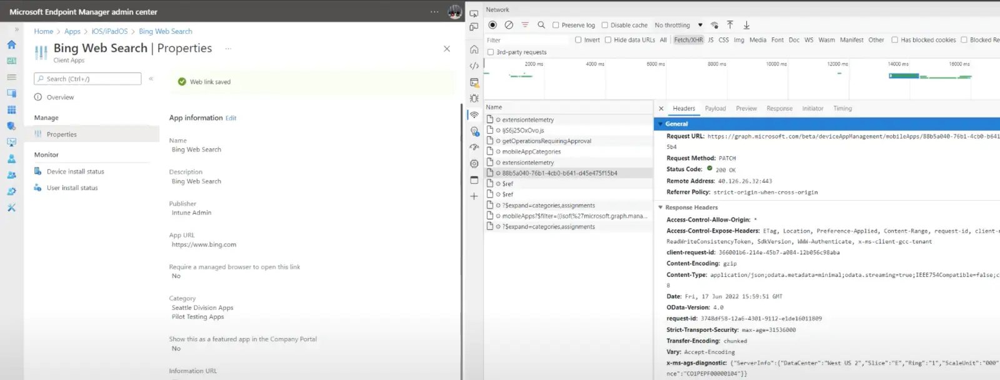
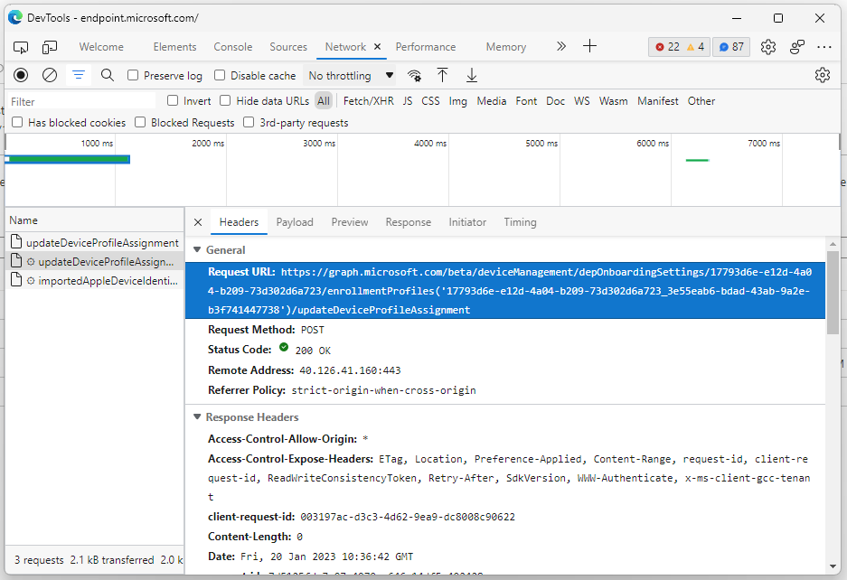
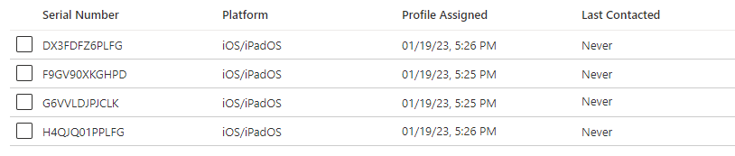
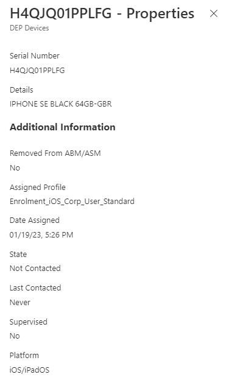

# Device Migration and Automated Device Enrolment Profile Assignment


Now that you've made the ~~financial~~ sensible decision to migrate to Microsoft Intune for your Apple device management needs, you've got your [Apple Push Certificate](https://learn.microsoft.com/en-us/mem/intune/enrollment/apple-mdm-push-certificate-get), sorted your [Enrolment Token](https://learn.microsoft.com/en-us/mem/intune/enrollment/device-enrollment-program-enroll-ios#get-an-apple-automated-device-enrollment-token), added [Intune as an MDM provider](https://learn.microsoft.com/en-us/mem/intune/enrollment/device-enrollment-program-enroll-ios#assign-devices-to-the-apple-token-mdm-server), and now you've got all your iOS/iPadOS devices happily sitting synchronised in Intune waiting to be deployed using [Apple's Automated Device Enrolment.](https://learn.microsoft.com/en-us/mem/intune/enrollment/device-enrollment-program-enroll-ios) Life is good.

Until you realise that in your excitement you've created loads of Enrolment Profiles (up to 1000 in fact, *help*), and you now have the daunting task of assigning your thousands (up to 200,000, *fml*) iOS/iPadOS devices to these profiles.

No one likes clicking *that* much.

## Developer Tool Sneaking

If you hadn't realised already, everything in Microsoft Intune is backed by the Graph API, to the point where if you open your browser developer tools, usually by pressing F12, you can actually see the calls to Graph being made when you click around.



This makes it pretty easy to identify the resource in Graph being used, as well as the call you'll be making to the API.

Using this method, and actually assigning a profile to an iOS/iPadOS device in Intune, and watching what calls are made using the developer tools, allows us to capture the Graph resource endpoint and ultimately throw together the functions we need, in this case, to get and assign the Enrolment Profiles.



### Apple Enrolment Token

To get all the Enrolment Profiles and Devices associated with the Apple Enrolment Program Token, we've got to call the Token itself using the [GET /deviceManagement/depOnboardingSettings](https://learn.microsoft.com/en-us/graph/api/intune-enrollment-deponboardingsetting-list?view=graph-rest-beta) resource.


Connect to Graph using the latest module and `Connect-MgGraph -Scopes 'DeviceManagementConfiguration.ReadWrite.All'`.


```PowerShell
Function Get-ADEEnrolmentToken() {

    $graphApiVersion = 'Beta'
    $Resource = 'deviceManagement/depOnboardingSettings'

    try {
        $uri = "https://graph.microsoft.com/$graphApiVersion/$($Resource)"
            (Invoke-MgGraphRequest -Uri $uri -Method Get).Value
    }
    catch {
        Write-Error $Error[0].ErrorDetails.Message
        break
    }
}
```

This function gives us the below output, and the necessary `id` we can use to call the Enrolment Profiles and everything else associated with out Apple Enrolment Program Token:

```txt
id                                  : 17793d6e-e12d-4a04-b209-73d302b9a563
appleIdentifier                     : memv@ennbee.uk
tokenExpirationDateTime             : 16/05/2023 14:40:28
lastModifiedDateTime                : 16/05/2022 14:40:52
lastSuccessfulSyncDateTime          : 22/01/2023 12:30:03
lastSyncTriggeredDateTime           : 18/01/2023 14:45:26
shareTokenWithSchoolDataSyncService : False
lastSyncErrorCode                   : 0
tokenType                           : dep
tokenName                           : MEMVENNBEE Intune
syncedDeviceCount                   : 4
dataSharingConsentGranted           : True
roleScopeTagIds                     : {0}
```

### Enrolment Profiles

With the Token, and more importantly the `id` of the Token in hand, we can now call [GET /deviceManagement/depOnboardingSettings/{depOnboardingSettingId}/enrollmentProfiles](https://learn.microsoft.com/en-us/graph/api/intune-enrollment-depenrollmentprofile-list?view=graph-rest-beta) to pull back all the enrolment profiles associated with that Token ID.

```PowerShell
Function Get-ADEEnrolmentProfile() {

    Param(
        [Parameter(Mandatory = $true)]
        $Id
    )

    $graphApiVersion = 'Beta'
    $Resource = "deviceManagement/depOnboardingSettings/$Id/enrollmentProfiles"

    try {
        $uri = "https://graph.microsoft.com/$graphApiVersion/$($Resource)"
            (Invoke-MgGraphRequest -Uri $uri -Method Get).Value
    }
    catch {
        Write-Error $Error[0].ErrorDetails.Message
        break
    }
}
```

Punting `Get-ADEEnrolmentToken` into a variable `$Token`, we can now pull back all the Enrolment Profiles associated with Enrolment Program Token:

```PowerShell
$Token = Get-ADEEnrolmentToken
Get-ADEEnrolmentProfile -Id $Token.Id
```

This will now list out all the Enrolment Profiles linked to the Token, with full details of each of the Enrolment Profiles:

```txt
@odata.type                                         : #microsoft.graph.depIOSEnrollmentProfile
id                                                  : 17793d6e-e12d-4a04-b209-73d302b9a563_289e29a1-34ec-404c-a1d3-9c8dc712ea80
displayName                                         : Enrolment_iOS_Clinical_Shared_User
description                                         :
requiresUserAuthentication                          : False
configurationEndpointUrl                            : https://appleconfigurator2.manage.microsoft.com/MDMServiceConfig?id=61513957-6e30-4b9f-a30a-051a20ffe3da&AADTenantId=58775aec-3fd5-42a9-9c65-b4a34d4e78f2
enableAuthenticationViaCompanyPortal                : False
requireCompanyPortalOnSetupAssistantEnrolledDevices : False
isDefault                                           : False
supervisedModeEnabled                               : True
supportDepartment                                   : Clinical Shared Device Users
isMandatory                                         : True
locationDisabled                                    : False
supportPhoneNumber                                  : 01904
profileRemovalDisabled                              : True
restoreBlocked                                      : True
appleIdDisabled                                     : True
termsAndConditionsDisabled                          : True
touchIdDisabled                                     : True
applePayDisabled                                    : True
siriDisabled                                        : True
diagnosticsDisabled                                 : True
displayToneSetupDisabled                            : False
privacyPaneDisabled                                 : True
screenTimeScreenDisabled                            : True
deviceNameTemplate                                  : CLIN-S-STD-{{SERIAL}}
configurationWebUrl                                 : False
enabledSkipKeys                                     : {Android, HomeButtonSensitivity, iMessageAndFaceTime, OnBoarding…}
iTunesPairingMode                                   : allow
restoreFromAndroidDisabled                          : True
awaitDeviceConfiguredConfirmation                   : False
sharedIPadMaximumUserCount                          : 0
enableSharedIPad                                    : False
companyPortalVppTokenId                             : 00000000-0000-0000-0000-000000000000
enableSingleAppEnrollmentMode                       : False
homeButtonScreenDisabled                            : True
iMessageAndFaceTimeScreenDisabled                   : True
onBoardingScreenDisabled                            : True
simSetupScreenDisabled                              : True
softwareUpdateScreenDisabled                        : False
watchMigrationScreenDisabled                        : True
appearanceScreenDisabled                            : True
expressLanguageScreenDisabled                       : False
preferredLanguageScreenDisabled                     : False
deviceToDeviceMigrationDisabled                     : True
welcomeScreenDisabled                               : True
passCodeDisabled                                    : False
zoomDisabled                                        : False
restoreCompletedScreenDisabled                      : True
updateCompleteScreenDisabled                        : False
forceTemporarySession                               : False
temporarySessionTimeoutInSeconds                    : 0
userSessionTimeoutInSeconds                         : 0
passcodeLockGracePeriodInSeconds                    :
carrierActivationUrl                                :
userlessSharedAadModeEnabled                        : False
managementCertificates                              : {}
```

### Assigning Devices

I had to continue sneaking into the Graph API calls, as I couldn't find any reference in the [Graph documentation](https://learn.microsoft.com/en-us/graph/api/resources/intune-enrollment-depenrollmentprofile?view=graph-rest-beta), to the resource used for assigning devices to a profile.

I managed to find the following call to support the assignment `deviceManagement/depOnboardingSettings/$Id/enrollmentProfiles('$ProfileID')/updateDeviceProfileAssignment`, this his references the Enrolment Profile Id, which we can now get using the above function, but it also needs a JSON formatted object containing the serial numbers of the devices:

```JSON
{
  "deviceIds": "SERIAL1, SERIAL2, SERIAL3"
}
```

We can use a PowerShell `psobject` to build this for us in the function.

Being able to pass through many device serial numbers is good news for us, as instead of having to call Graph like a million times for each device, we can just make the call for each profile, so you know, only hundreds of times.

```PowerShell
Function Add-ADEEnrolmentProfileAssignment() {

    Param(
        [Parameter(Mandatory = $true)]
        $Id,
        [Parameter(Mandatory = $true)]
        $ProfileID,
        [Parameter(Mandatory = $true)]
        $DeviceSerials
    )

    $graphApiVersion = 'Beta'
    $Resource = "deviceManagement/depOnboardingSettings/$Id/enrollmentProfiles('$ProfileID')/updateDeviceProfileAssignment"

    $Output = New-Object -TypeName psobject
    $Output | Add-Member -MemberType NoteProperty -Name 'deviceIds' -Value $DeviceSerials
    $JSON = $Output | ConvertTo-Json -Depth 3

    try {
        $uri = "https://graph.microsoft.com/$graphApiVersion/$($Resource)"
        Invoke-MgGraphRequest -Uri $uri -Method Post -Body $JSON -ContentType 'application/json'
    }
    catch {
        Write-Error $Error[0].ErrorDetails.Message
        break
    }

}
```

## Hash Hash Array

We've now got all the functions we could ever need, now we need to be able to ingest a list of serial numbers and the Enrolment Profile name that they should be associated with; easy, a CSV file and some effort is all that is required:

```csv
Serial,EnrolmentProfile
DX3FDFZ6PLFG,Enrolment_iOS_Corp_User_Standard
H4QJQ01PPLFG,Enrolment_iOS_Corp_User_Standard
F9GV90XKGHPD,Enrolment_iOS_Clinical_Shared_User
G6VVLDJPJCLK,Enrolment_iOS_Clinical_Shared_User
```

The tricky part, was how we actually have to use this data, creating a unique list of the Enrolment Profiles, and then based on the association of the device serial number to the profile, add each serial number to each profile.

If we don't do this, then we **are** going to be calling graph for each device serial number in the list, and I'd rather not piss off Microsoft. Time for a [hashtable](https://learn.microsoft.com/en-us/powershell/scripting/learn/deep-dives/everything-about-hashtable?view=powershell-7.3), and maybe an [array](https://learn.microsoft.com/en-us/powershell/scripting/learn/deep-dives/everything-about-arrays?view=powershell-7.3).

### Up, Up and Array

We can now import the CSV file and assign it to a variable:

```PowerShell
$CSVPath = "C:\Somepath\SomeCSV.csv"
$Devices = Import-Csv -Path $CSVPath
```

Giving us a wonderful output:

```txt
Serial       EnrolmentProfile
------       ----------------
DX3FDFZ6PLFG Enrolment_iOS_Corp_User_Standard
H4QJQ01PPLFG Enrolment_iOS_Corp_User_Standard
F9GV90XKGHPD Enrolment_iOS_Clinical_Shared_User
G6VVLDJPJCLK Enrolment_iOS_Clinical_Shared_User
```

Creating a new array `$DeviceProfiles = @()` and looping through each `$Device in $Devices`, we can add all the Enrolment Profiles in the CSV file to the array, finally using `Get-Unique` to ensure that we only have a unique list of Enrolment Profile names.

```PowerShell
$DeviceProfiles = @()
foreach ($Device in $Devices) {
    $DeviceProfiles += $Device.EnrolmentProfile
}
$UniqueDeviceProfiles = $DeviceProfiles | Get-Unique
```

Giving us an output similar to the below:

```txt
Enrolment_iOS_Clinical_Shared_User
Enrolment_iOS_Corp_User_Standard
```

### Hash Bang Wallop

With a hashtable, `Assignments = @{}` we can loop through each `$UniqueDeviceProfile in $UniqueDeviceProfiles` adding each unique Enrolment Profile as an array to the hashtable.

```PowerShell
Assignments = @{}
foreach ($UniqueDeviceProfile in $UniqueDeviceProfiles){
    $Assignments[$UniqueDeviceProfile] = @()
}
```

With an output of the below:

```txt
Name                           Value
----                           -----
Enrolment_iOS_Clinical_Shared… {}
Enrolment_iOS_Corp_User_Stand… {}
```

With the hashtable and an array for each Enrolment Profile, we can finally loop through `$Device in $Devices` and add the device serial to the matching Enrolment Profile array.

```PowerShell
foreach ($Device in $Devices) {
    $Assignments["$($Device.EnrolmentProfile)"] += $Device.Serial
}
```

Giving us our final form hash table, that we can at last use, to assign devices to Enrolment Profiles. This honestly broke my brain.

```txt
Name                           Value
----                           -----
Enrolment_iOS_Corp_User_Stand… {DX3FDFZ6PLFG, H4QJQ01PPLFG}
Enrolment_iOS_Clinical_Shared… {F9GV90XKGHPD, G6VVLDJPJCLK}
```

## Assigning Device Enrolment Profiles

With that horrible mess we created, we can combine it all into a sub-par script, to actually assign these devices to the Enrolment Profiles.

The [full script](https://github.com/ennnbeee/oddsandendpoints-scripts/blob/main/Intune/Enrolment/ADEProfileAssignment/Invoke-ADEProfileAssignment.ps1) as always is in my GitHub repo, and gives you some nice messages along the way as it runs off plays with your Intune environment, it also catches errors, which I've been told is important.

The bits you care about now, and the final pay off to our work, can be found below, remember to include the functions and authentication otherwise everything will look a little red in the PowerShell console:

```PowerShell
$CSVPath = Read-Host 'Please provide the path to the CSV file containing a list of Serial Numbers and ADE Profile Names e.g. C:\temp\ADEDevices.csv'
$Devices = Import-Csv -Path $CSVPath

$DeviceProfiles = @()
foreach ($Device in $Devices) {
    $DeviceProfiles += $Device.EnrolmentProfile
}

$UniqueDeviceProfiles = $DeviceProfiles | Get-Unique

$Assignments = @{}
foreach ($UniqueDeviceProfile in $UniqueDeviceProfiles){
    $Assignments[$UniqueDeviceProfile] = @()
}
foreach ($Device in $Devices) {
    $Assignments["$($Device.EnrolmentProfile)"] += $Device.Serial
}

$Token = Get-ADEEnrolmentToken

foreach ($Assignment in $Assignments.GetEnumerator()) {
    $EnrolmentProfile = Get-ADEEnrolmentProfile -Id $Token.id | Where-Object { ($_.displayName -eq $Assignment.Name) }
    Add-ADEEnrolmentProfileAssignment -Id $Token.id -ProfileID $EnrolmentProfile.id -DeviceSerial $Assignment.Value
}
```

After carefully stepping through the script, we can now see the results of our efforts, and although this was only targetted to four devices, the approach will scale:



Digging in a little deeper, we can see that the device has been assigned to the correct Enrolment Profile:



Everything looks good, you'll now just need to add all your serials numbers and the associated Enrolment Profile name to the CSV file and you can starting assigning the devices in anger.

## Summary

In short, this is a pretty straight forward approach to assist with assignment of profiles in bulk, especially as part of migrating Apple Business or School Manager registered Apple devices from one MDM to Intune, without the need to click around so much.

Realistically I should have encountered this problem a lot sooner, as there are hundreds of thousands of organisations moving away from their existing MDM provider to Microsoft Intune, maybe the ones with this many Apple devices weren't lucky enough to work with me and my incessant need to script everything.

