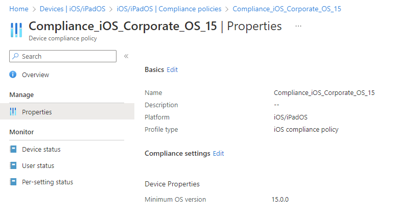
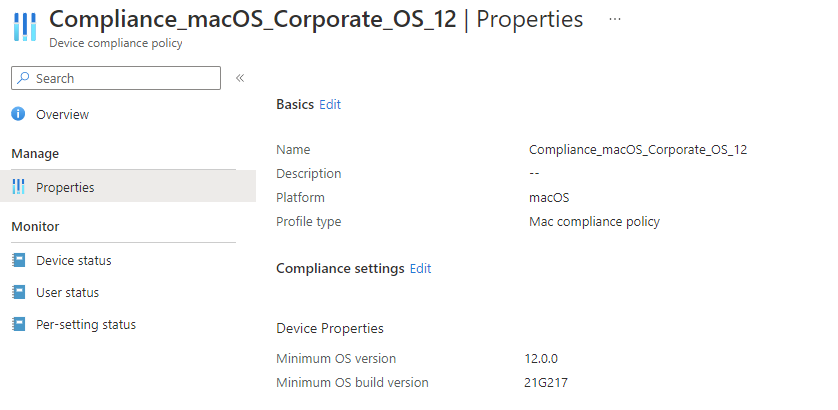
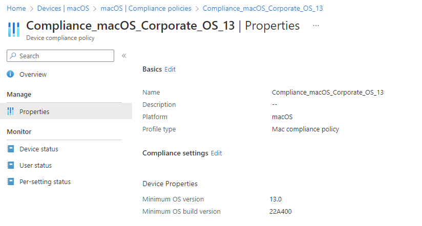
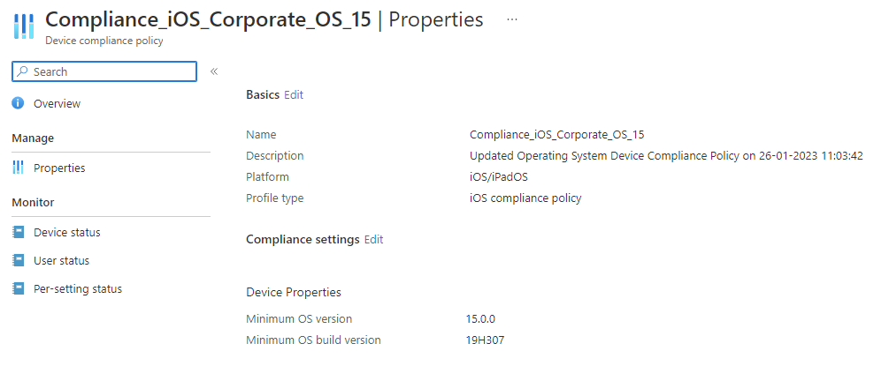
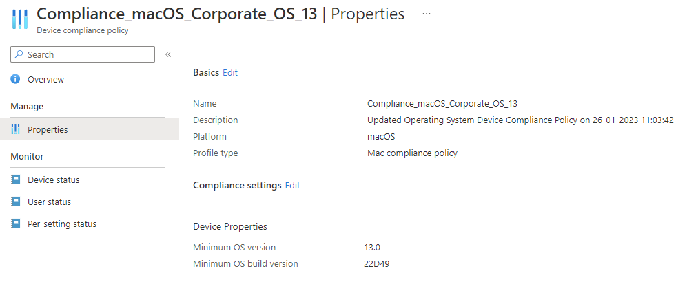

# Updating Apple Operating System Compliance Policies


I'm not going to go over old ground in too much detail, as I've already covered the importance of keeping your  up to date in line with the release of new updates, as well as a way to update your compliance policies using Graph and PowerShell.

What I am going to do is extend this automated Compliance Policy update functionality to Apple Updates as well, it's like I've been working with a customer that only has iOS/iPadOS devices in Intune or something.

I guess when I end up working with a customer with only Android devices, that I'll finally be able to put all the pieces together and have one script to update them all.

## Operating System Build Versions

Unlike the Windows [Valid Operating System Builds](https://learn.microsoft.com/en-us/mem/intune/protect/compliance-policy-create-windows#operating-system-version) option in Compliance Policies, Apple policies don't give you the option of having a set of versions to work with, limited to only the following settings:

- Minimum OS version
- Maximum OS version
- Minimum OS build version
- Maximum OS build version

With Apple having different build versions per Operating System, whether this is iOS/iPadOS or macOS, we're unable to have one Compliance Policy that covers all the supported OS versions, and need to have specific policies per supported Operating System.

### Device Filters

Now we all know where I stand on  and they come to the rescue once again, as we need separate Compliance Policies and the ability to target these to the correct devices.

We can create filters for each of the current supported (at time of writing) iOS/iPadOS and macOS operating systems:

| Description | OS | Filter Rule |
| :- | :- | :- |
| All Corporate iOS 15 devices | `iOS` | `(device.deviceOwnership -eq "Corporate") and (device.osVersion -startsWith "15")` |
| All Corporate iOS 16 devices | `iOS` | `(device.deviceOwnership -eq "Corporate") and (device.osVersion -startsWith "16")` |
| All Corporate Big Sur devices | `macOS` | `(device.deviceOwnership -eq "Corporate") and (device.osVersion -startsWith "11")` |
| All Corporate Monterey devices | `macOS` | `(device.deviceOwnership -eq "Corporate") and (device.osVersion -startsWith "12")` |
| All Corporate Ventura devices | `macOS` | `(device.deviceOwnership -eq "Corporate") and (device.osVersion -startsWith "13")` |

Using these we can now create a Compliance Policy for each Operating System version, assigning it to the `All Devices` or `All Users` groups and include the corresponding Device Filter.

### Compliance Policies

You've probably created Compliance Policies before, and if you haven't there are only a few clicks needed to configure one in preparation for the Operating System compliance check.

As the Apple build versions are unique, we don't need to add in the settings `Minimum OS version` and `Maximum OS version`, though they are both a useful visual aide, and I could do with referencing them when I come to write a script to update the Compliance Policy.

So go ahead and create your Compliance Policies for each supported Operating System version, assigning them to the required group and filter:

| OS | Version | Minimum OS version |
| :- | :- | :- |
| iOS | iOS 15 | 15.0.0 |
| iOS | iOS 16 | 16.0.0 |
| macOS | Big Sur | 11.0.0 |
| macOS | Monterey | 12.0.0 |
| macOS | Ventura | 13.0.0 |

With both the Compliance Policies and the Device Filters in place, now we can move onto how we update the Build Versions.

## Updates and RSS Feeds

As with the Windows Updates, Apple make their updates available in an easy to digest [RSS feed](https://developer.apple.com/news/releases/rss/releases.rss) which should make scraping back the information we need pretty straight forward:

```xml
<item>
    <title>iOS 16.3 (20D47)</title>
    <link>https://developer.apple.com/news/releases/?id=01232023f</link>
    <guid>https://developer.apple.com/news/releases/?id=01232023f</guid>
    <description>View downloadsView release notes</description>
    <pubDate>Mon, 23 Jan 2023 09:00:00 PST</pubDate>
    <content:encoded><![CDATA[<p><a href=/download class=more>View downloads</a></p><il><p><a href=/go/?id=ios-16.3-rn class=more>View release notes</a></p></il>]]></content:encoded>
</item>
<item>
    <title>iPadOS 16.3 (20D47)</title>
    <link>https://developer.apple.com/news/releases/?id=01232023e</link>
    <guid>https://developer.apple.com/news/releases/?id=01232023e</guid>
    <description>View downloadsView release notes</description>
    <pubDate>Mon, 23 Jan 2023 09:00:00 PST</pubDate>
    <content:encoded><![CDATA[<p><a href=/download class=more>View downloads</a></p><il><p><a href=/go/?id=iPadOS-16.3-rn class=more>View release notes</a></p></il>]]></content:encoded>
</item>
<item>
    <title>macOS 13.2 (22D49)</title>
    <link>https://developer.apple.com/news/releases/?id=01232023d</link>
    <guid>https://developer.apple.com/news/releases/?id=01232023d</guid>
    <description>View downloadsView release notes</description>
    <pubDate>Mon, 23 Jan 2023 09:00:00 PST</pubDate>
    <content:encoded><![CDATA[<p><a href=/download class=more>View downloads</a></p><il><p><a href=/go/?id=macos-13.2-rn class=more>View release notes</a></p></il>]]></content:encoded>
</item>
```

So all the information we need is contained within the `title` of each `item` in the feed, in particular we'll be needing the [Build Version](https://learn.microsoft.com/en-us/mem/intune/protect/compliance-policy-create-ios#operating-system-version) in order to use this to update our Compliance Policy.

### Getting the Build Version

With the `$uri` set to the RSS feed, we can `Invoke-WebRequest` to pull through the data into the variable `$Updates`, making sure we're processing it as XML, and removing any unsupported characters.

```PowerShell
$uri = 'https://developer.apple.com/news/releases/rss/releases.rss'
[xml]$Updates = (Invoke-WebRequest -Uri $uri -UseBasicParsing -ContentType 'application/xml').Content -replace '[^\x09\x0A\x0D\x20-\xD7FF\xE000-\xFFFD\x10000-x10FFFF]', ''
```

As the feed has multiple update releases for each Operating System, we need to pass them into an array, so we can select the most recent one:

```PowerShell
$BuildVersion = @()
```

Whilst looping through each item in the feed, we can filter each `$Update` based on both the Operating System `$OS`, and the version `$Version`, to ensure that we're only pulling back the data we require, returning only the first and newest update.

```PowerShell
foreach ($Update in $Updates.rss.channel.Item) {
    if (($Update.title -like "*$OS*") -and ($Update.title -like "*$Version*")) {
        $BuildVersion += $Update.title
    }
}
return $BuildVersion[0]
```

Running this all together, passing through `iOS` and `16` for the variables, we get an output of:

```txt
iOS 16.3 (20D47)
```

This looks promising.

### Creating the Function

As the aim is to repeat both the process of updating Compliance Policies, and tailoring for the multiple Operating Systems and versions, we should wrap the above in a Function.

```PowerShell
Function Get-AppleUpdates() {

    <#
    .SYNOPSIS
    This function is used to get the latest Apple Updates from the Apple Developer RSS Feeds
    .DESCRIPTION
    The function pulls the RSS feed from the Apple Developer RSS Feeds
    .EXAMPLE
    Get-AppleUpdates -OS iOS -Version 15
    #>

    [cmdletbinding()]
    param
    (
        [Parameter(Mandatory = $true)]
        [ValidateSet('iOS', 'macOS')]
        $OS,
        [Parameter(Mandatory = $true)]
        $Version
    )

    try {
        $uri = 'https://developer.apple.com/news/releases/rss/releases.rss'
        [xml]$Updates = (Invoke-WebRequest -Uri $uri -UseBasicParsing -ContentType 'application/xml').Content -replace '[^\x09\x0A\x0D\x20-\xD7FF\xE000-\xFFFD\x10000-x10FFFF]', ''

        $BuildVersion = @()
        foreach ($Update in $Updates.rss.channel.Item) {
            if (($Update.title -like "*$OS*") -and ($Update.title -like "*$Version*")) {
                $BuildVersion += $Update.title
            }
        }
        return $BuildVersion[0]
    }
    catch {

        Write-Error $Error[0].ErrorDetails.Message
        break
    }
}
```

This can now be called within PowerShell using the below as examples:

```PowerShell
Get-AppleUpdates -OS iOS -Version 16
Get-AppleUpdates -OS macOS -Version 13
```

## Updating Compliance

We've already got functions from our last expedition into this topic for  and  Compliance Policies, checking for  as well as the usual suspect for authentication using `Connect-MgGraph`, so thank you to previous me for this.

Armed with our new function for getting the latest Apple Build versions, we now need to build out the script to do our job for us.

### Getting the Policies

As we only care about iOS/iPadOS and macOS today, we need to filter the policies we are retrieving using the `Get-DeviceCompliancePolicy` function, this can be accomplished by using the `@odata.type`, and also only those policies with a `osMinimumVersion` configured:

```PowerShell
$OSCompliancePolicies = Get-DeviceCompliancePolicy | Where-Object { (($_.'@odata.type').contains('iosCompliancePolicy') -or ($_.'@odata.type').contains('macOSCompliancePolicy')) -and ($_.osMinimumVersion) -ne $null }
```

Now with the policies in the variable, we can loop through each and set our `$OS` variable based on the `@odata.type` of the policy, and grab the `$Version` variable using the first two digits of `osMinimumVersion`, as we'll need these for the `Get-AppleUpdates` parameters.

```PowerShell
foreach ($OSCompliancePolicy in $OSCompliancePolicies) {
    If ($OSCompliancePolicy.'@odata.type' -like '*ios*') {
        $OS = 'iOS'
    }
    elseif ($OSCompliancePolicy.'@odata.type' -like '*macOS*') {
        $OS = 'macOS'
    }

    $Version = $OSCompliancePolicy.osMinimumVersion.SubString(0, 2)
}
```

### Handling Build Versions

Now the output of the function gives us all the information we could ask for, but we actually only need a small part of it, the bit in brackets: iOS 16.3 **(20D47)**

So we can strip out the data between the brackets, using the magic of Regex and add this to a new variable we'll use later to update the Compliance Policy in question:

```PowerShell
$Build = (Get-AppleUpdates -OS $OS -Version $Version | Select-String '(?<=\()[^]]+(?=\))' -AllMatches).Matches.Value
```

### Building the JSON Data

To update our Compliance Policy, we need to send it some JSON data in a particular format as part of the `Update-DeviceCompliancePolicy` function, we can build this using both the existing information captured from the `Get-DeviceCompliancePolicy` and the newly acquired build version, then finally calling the function to update the Compliance Policy.

```PowerShell
$Update = New-Object -TypeName psobject
$Update | Add-Member -MemberType NoteProperty -Name '@odata.type' -Value $OSCompliancePolicy.'@odata.type'
$Update | Add-Member -MemberType NoteProperty -Name 'description' -Value $Description
$Update | Add-Member -MemberType NoteProperty -Name 'osMinimumBuildVersion' -Value $Build

$JSON = $Update | ConvertTo-Json -Depth 3
Update-DeviceCompliancePolicy -Id $OSCompliancePolicy.id -JSON $JSON
```

All being good, this data looks something like this for our iOS 16 Compliance Policy:

```JSON
{
  "@odata.type": "#microsoft.graph.iosCompliancePolicy",
  "description": "Updated Operating System Device Compliance Policy on 26-01-2023 10:39:29",
  "osMinimumBuildVersion": "20D47"
}
```

We can now submit this JSON data to Graph, passing through the required Compliance Policy id, allowing us to update the required policy:

```PowerShell
Update-DeviceCompliancePolicy -Id $OSCompliancePolicy.id -JSON $JSON
```

All going well, we now have an updated policy with the correct and most recent build version for the Operating System.

## The Solution

We have all the component parts to bring the [full script](https://github.com/ennnbeee/oddsandendpoints-scripts/blob/main/Intune/Compliance/AppleOSCompliance/Set-AppleOSCompliance.ps1) together, of which you can see below without the functions and Graph Authentication.

Key things to note here that we haven't covered individually is the check to see if the build version is already up to date, as there's no point triggering a Compliance Check on devices if nothing has changed.

```PowerShell {hl_lines=[17]}
$Date = Get-Date -Format 'dd-MM-yyyy hh:mm:ss'
$Description = "Updated Operating System Device Compliance Policy on $Date"
$OSCompliancePolicies = Get-DeviceCompliancePolicy | Where-Object { (($_.'@odata.type').contains('iosCompliancePolicy') -or ($_.'@odata.type').contains('macOSCompliancePolicy')) -and ($_.osMinimumVersion) -ne $null }

foreach ($OSCompliancePolicy in $OSCompliancePolicies) {
    If ($OSCompliancePolicy.'@odata.type' -like '*ios*') {
        $OS = 'iOS'
    }
    elseif ($OSCompliancePolicy.'@odata.type' -like '*macOS*') {
        $OS = 'macOS'
    }

    $Version = $OSCompliancePolicy.osMinimumVersion.SubString(0, 2)

    $Build = (Get-AppleUpdates -OS $OS -Version $Version | Select-String '(?<=\()[^]]+(?=\))' -AllMatches).Matches.Value

    If ($OSCompliancePolicy.osMinimumBuildVersion -ne $Build) {
        $Update = New-Object -TypeName psobject
        $Update | Add-Member -MemberType NoteProperty -Name '@odata.type' -Value $OSCompliancePolicy.'@odata.type'
        $Update | Add-Member -MemberType NoteProperty -Name 'description' -Value $Description
        $Update | Add-Member -MemberType NoteProperty -Name 'osMinimumBuildVersion' -Value $Build

        $JSON = $Update | ConvertTo-Json -Depth 3
        Update-DeviceCompliancePolicy -Id $OSCompliancePolicy.id -JSON $JSON
        Write-Host "Updated $OS Compliance Policy $($OSCompliancePolicy.displayName) with latest Build: $Build" -ForegroundColor Green
        Write-Host
    }
    Else {
        Write-Host "$OS Compliance Policy $($OSCompliancePolicy.displayName) already on latest Build: $Build" -ForegroundColor Cyan
        Write-Host
    }
}
```

### Script in Action

We should practice what we preach and test our script in our own Intune environment before letting loose on a production one, so here we go.

**iOS 15** Compliance Policy **without an existing** build version


**macOS Big Sur** Compliance Policy **with a current** build version


**macOS Ventura** Compliance Policy **with an existing** build version


Running the script will give us the below output:

```txt
Updated macOS Compliance Policy Compliance_macOS_Corporate_OS_13 with latest Build: 22D49

macOS Compliance Policy Compliance_macOS_Corporate_OS_12 already on latest Build: 21G217

Updated iOS Compliance Policy Compliance_iOS_Corporate_OS_15 with latest Build: 19H307

Updated iOS Compliance Policy Compliance_iOS_Corporate_OS_16 with latest Build: 20D47
```

Resulting in our Compliance Policies getting updated with the latest build versions:

**iOS 15** Compliance Policy updated to **19H307**


Checking this against the [Apple Developer Release Feed](https://developer.apple.com/news/releases/rss/releases.rss) that we haven't made a mistake.

```XML { hl_lines=[2]}
<item>
    <title>iOS 15.7.3 (19H307)</title>
    <link>https://developer.apple.com/news/releases/?id=01232023b</link>
    <guid>https://developer.apple.com/news/releases/?id=01232023b</guid>
    <description>View downloads</description>
    <pubDate>Mon, 23 Jan 2023 09:00:00 PST</pubDate>
    <content:encoded><![CDATA[<p><a href=/download class=more>View downloads</a></p>]]></content:encoded>
</item>
```

**macOS Ventura** Compliance Policy updated to **22D49**


Again checking this against the [Apple Developer Release Feed](https://developer.apple.com/news/releases/rss/releases.rss) that we still haven't made a mistake.

```XML {linenos=false, hl_lines=[2]}
<item>
    <title>macOS 13.2 (22D49)</title>
    <link>https://developer.apple.com/news/releases/?id=01232023d</link>
    <guid>https://developer.apple.com/news/releases/?id=01232023d</guid>
    <description>View downloadsView release notes</description>
    <pubDate>Mon, 23 Jan 2023 09:00:00 PST</pubDate>
    <content:encoded><![CDATA[<p><a href=/download class=more>View downloads</a></p><il><p><a href=/go/?id=macos-13.2-rn class=more>View release notes</a></p></il>]]></content:encoded>
</item>
```

Or resulting in the current build version Compliance Policies not getting updated:

**macOS Big Sur** Compliance Policy **not updated**


Overall this looks pretty good to me.

## Summary

We're almost there with maintaining Operating System Compliance Policies, with Windows, iOS/iPadOS, and macOS under our belt, our next challenge will be Android, and bringing them all together into one single script.

For now though, we've reduced the overhead of having to manually update these Compliance Policies for three out of ~~six~~ four *(let's not mention Linux or ChromeOS just yet)* Operating Systems supported in Microsoft Intune, so something to be happy about I guess.

