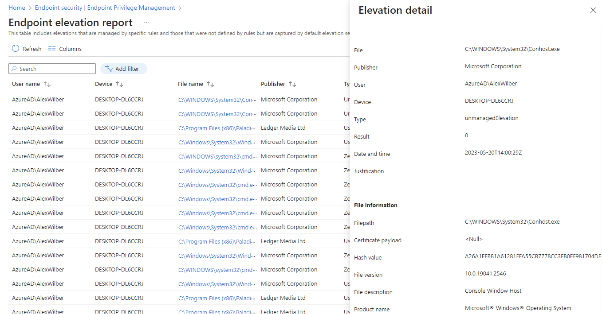
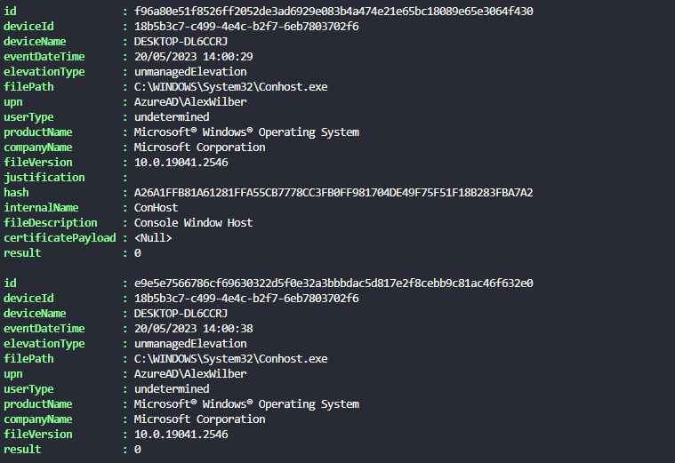
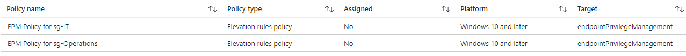
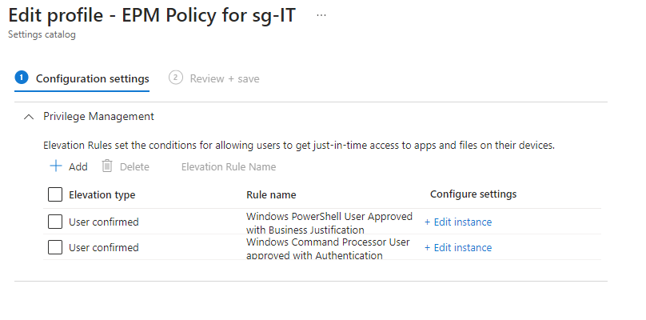
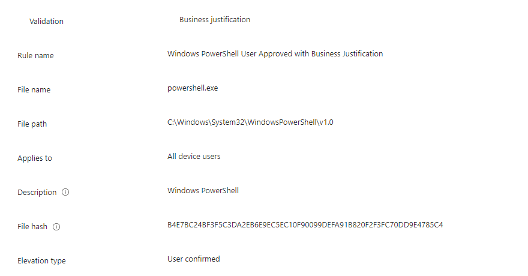
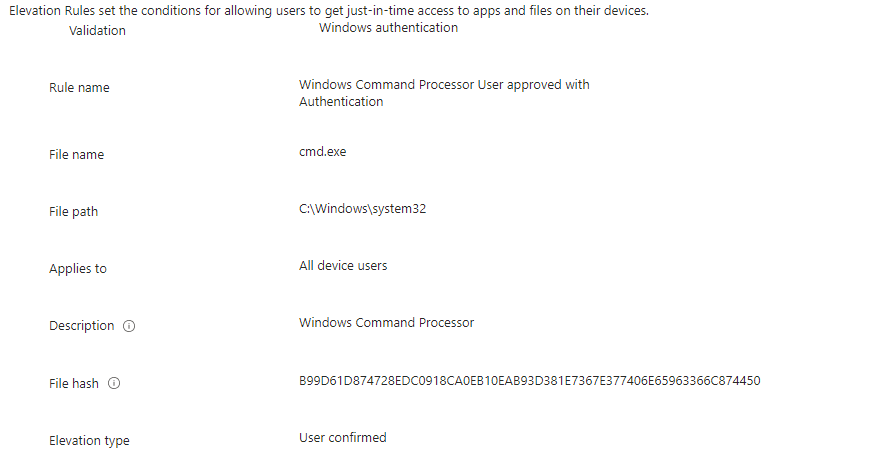
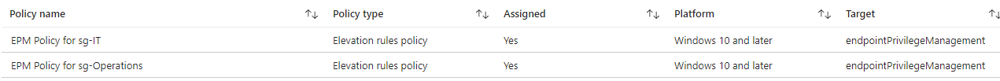

# Automating Endpoint Privilege Management Policies with PowerShell


So you're interested in [Endpoint Privilege Management](https://learn.microsoft.com/en-us/mem/intune/protect/epm-overview) in Microsoft Intune, you've found, begged for, borrowed or stolen the money for shiny new [Intune Suite or EPM licenses](https://learn.microsoft.com/en-us/mem/intune/protect/epm-overview#licensing), and in you're excitement you've gone and deployed a new policy to audit using the [Reporting Scope](https://learn.microsoft.com/en-us/mem/intune/protect/epm-policies#about-windows-elevation-settings-policy) options, all elevations across your managed Windows 10 and later devices. Now what?

Well it's policy creation time, but that seems like a labour intensive (well many clicks) task, and as much as the [reports](https://learn.microsoft.com/en-us/mem/intune/protect/epm-reports) give you all the required information you need to review unmanaged elevations and create new policies and elevation rules, there has to be a better way to take the data in the report and create these policies and subsequent rules for you.


The functions, authentication, and script have now been updated to support the use of the Graph PowerShell SDK.


## EPM Reporting

The Endpoint elevation report in Microsoft Intune will give us the data we need to create [hash based](https://learn.microsoft.com/en-us/mem/intune/protect/epm-policies#about-windows-elevation-rules-policy) rules, so let's find a way to get the report data and export it with some collated information to make reviewing the elevations a little easier, as no one wants to review individual elevations from each user on a case by case basis, unless you're in InfoSec.



### Getting Report Data

Once connected to Graph API using `Connect-MgGraph` we can use the `deviceManagement/privilegeManagementElevations` endpoint (of which there is no documentation currently, tut tut Microsoft) to pull back the report data. I've given the option to pull back Managed, Unmanaged, and All elevation types with this function so it's at least reusable, though for now we only care about the Unmanaged elevations.

```PowerShell {hl_lines=["7-9","17-28"]}
Function Get-DeviceEPMReport() {

    [cmdletbinding()]

    param (

        [Parameter(Mandatory = $false)]
        [ValidateSet('Managed', 'Unmanaged')]
        [String]$Elevation,

        [Parameter(Mandatory = $false)]
        $Top

    )

    $graphApiVersion = 'beta'
    $Resource = 'deviceManagement/privilegeManagementElevations'

    try {
        if ($Elevation -eq 'Managed') {
            $uri = "https://graph.microsoft.com/$graphApiVersion/$($Resource)?filter=(elevationType ne 'unmanagedElevation')"
            (Invoke-MgGraphRequest -Uri $uri -Method Get).value
        }
        elseif ($Elevation -eq 'Unmanaged') {
            $uri = "https://graph.microsoft.com/$graphApiVersion/$($Resource)?filter=(elevationType eq 'unmanagedElevation')"
            (Invoke-MgGraphRequest -Uri $uri -Method Get).value
        }
        else {
            $uri = "https://graph.microsoft.com/$graphApiVersion/$($Resource)"
            (Invoke-MgGraphRequest -Uri $uri -Method Get).value
        }
    }
    catch {
        Write-Error $Error[0].ErrorDetails.Message
        break
    }
}
```

Running the PowerShell function will give us an output of each Unmanaged elevation, which we can then process, apply some groupings, and eventually export.

```PowerShell
Get-DeviceEPMReport -Elevation Unmanaged
```



### Exporting Report Data

Now that we have the data from the elevation report, I thought it best we group the elevations by hash value, as this is a unique identifier for each application that has been elevated by a user, as well as counting the number of elevations for that application, the users who have elevated, and the devices they have elevated from.

The above information, and below details required for rule creation, allows us to review the elevations and whether we want to create rules from them:

- **Count of Elevations for the application**: so we can see whether this is a widely used elevated application
- **Elevated application file name**: required for rule creation
- **Elevated application internal name**
- **Elevated application publisher**
- **Elevated application product name**
- **Elevated application description**
- **Elevated application file path**: formatted with `\\` as is required by the rule creation
- **Elevated application file version**
- **Users who have elevated the application**: formatted for only unique users so we can assess which users are elevating the application
- **Devices where the application has been elevated**: formatted for only unique devices so we can assess from which devices the application is being elevated

The below PowerShell captures all the required data in the correct formats to a new `$Report` array variable, which we can then export to CSV once we've cycled through all elevations.

```PowerShell {hl_lines=["10-18","22-34"]}
$Report = @()
$Hashes = Get-DeviceEPMReport -Elevation Unmanaged | Group-Object -Property hash
foreach ($Hash in $Hashes) {

    $Elevations = $Hash.Group
    $Users = @()
    $Devices = @()

    foreach ($Elevation in $Elevations) {
        $FileName = $Elevation.filePath | Split-Path -Leaf
        $FileInternalName = $Elevation.internalName
        $FileCompany = $Elevation.companyName
        $FileProduct = $Elevation.productName
        $FileDescription = $Elevation.fileDescription
        $FilePath = ($Elevation.filePath | Split-Path) -replace '\\', '\\'
        $FileVersion = $Elevation.fileVersion
        $Users += $Elevation.upn
        $Devices += $Elevation.deviceName
    }

    $Data = [PSCustomObject]@{
        ElevationCount   = $Hash.Count
        Product          = $FileProduct
        Description      = $FileDescription
        Publisher        = $FileCompany
        FileName         = $FileName
        FileInternalName = $FileInternalName
        FileVersion      = $FileVersion
        FilePath         = $FilePath
        FileHash         = $Hash.Name
        Users            = (($Users | Get-Unique) -join ' ' | Out-String).Trim()
        Devices          = (($Devices | Get-Unique) -join ' ' | Out-String).Trim()
        ElevationType    = 'Automatic/UserAuthentication/UserJustification'
        Group            = 'GroupName'
    }

    $Report += $Data
}
```

Exporting the `$Report` variable to CSV using the append function for each elevation, we get something like the below.

```csv
"ElevationCount","Product","Description","Publisher","FileName","FileInternalName","FileVersion","FilePath","FileHash","Users","Devices","ElevationType","Group"
"6","Microsoft® Windows® Operating System","Windows PowerShell","Microsoft Corporation","powershell.exe","POWERSHELL","10.0.19041.2913","C:\\Windows\\System32\\WindowsPowerShell\\v1.0","B4E7BC24BF3F5C3DA2EB6E9EC5EC10F90099DEFA91B820F2F3FC70DD9E4785C4","AzureAD\AlexWilber AzureAD\ChristieCline","DESKTOP-DL6CCRJ DESKTOP-7KFLL12","Automatic/UserAuthentication/UserJustification","GroupName"
"4","PaladinVPN","PaladinVPN","Ledger Media Ltd","PaladinVPN.exe","PaladinVPN.exe","2.1.3.102","C:\\Program Files (x86)\\PaladinVPN","B6EF395DE2F28162DBAFCA79BAABEBB211245A68425CE096402030417FEA1160","AzureAD\AlexWilber","DESKTOP-DL6CCRJ","Automatic/UserAuthentication/UserJustification","GroupName"
"12","Microsoft® Windows® Operating System","Windows Command Processor","Microsoft Corporation","cmd.exe","cmd","10.0.19041.746","C:\\Windows\\system32","B99D61D874728EDC0918CA0EB10EAB93D381E7367E377406E65963366C874450","AzureAD\AlexWilber AzureAD\ChristieCline","DESKTOP-DL6CCRJ DESKTOP-7KFLL12","Automatic/UserAuthentication/UserJustification","GroupName"

```

Now we have something to review, with two additional fields of `ElevationType` and `Group` that we will use for creation of new EPM policies and rules later on, forward planning here.

## EPM Policies

I have no shame when I say that I started from [Andrew Taylor's](https://andrewstaylor.com/2023/03/27/adding-endpoint-privilege-management-rules-via-powershell/) script to create EPM rules using PowerShell, allowing the creation of new EPM Policies and associated rules in Microsoft Intune based on a local files on the machine the script is being executed from. For me what this was missing was the ability to create multiple rules per EPM policy, and the to not rely on the file being local to the machine running the script to capture the required rule data.

### Importing Rule Data

With the CSV report exported, we now need to update the file itself, removing entries where we don't want to create rules, and updating those we do want to create with both the `ElevationType` and `Group` for each rule we want to create. The `ElevationType` field needs to be populated with one of the below entries based on the approval type to be used:

- **Automatic**: elevation happens invisibly to the user. There's no prompt, and no indication that the file is running in an elevated context.
- **UserAuthentication**: A user confirmed elevation always requires the user to click on a confirmation prompt to run the file requiring users to authenticate using their organization credentials.
- **UserJustification**: A user confirmed elevation always requires the user to click on a confirmation prompt to run the file requiring the user to enter a business justification.

The `group` field is there to not only reference which Azure Active Directory or synchronised Active Directory group the rule will apply to, but will allow for grouping of rules into a single policy, as this just makes sense as we'll be applying the policy to the same group.

### Grouping EPM Rules

As we want to create a single policy for each provided group, containing all applicable rules, we need to capture the data based on the assignment group, this can be done pretty easily using the `Group-Object` command.

```PowerShell
$Policies = Import-Csv -Path $ImportPath | Group-Object -Property Group
```

Now we can check if the supplied group exists, using the below function to search for the group based on it's name.

```PowerShell {hl_lines=["15"]}
Function Get-IntuneGroup() {

    [cmdletbinding()]

    param
    (
        [parameter(Mandatory = $true)]
        [string]$Name
    )

    $graphApiVersion = 'beta'
    $Resource = 'groups'

    try {
        $authToken['ConsistencyLevel'] = 'eventual'
        $searchterm = 'search="displayName:' + $Name + '"'
        $uri = "https://graph.microsoft.com/$graphApiVersion/$Resource`?$searchterm"
        (Invoke-MgGraphRequest -Uri $uri -Method Get).Value
    }
    catch {
        Write-Error $Error[0].ErrorDetails.Message
        break
    }
}
```


Take note of the change to the `$authtoken` variable which needs updating to include 'ConsistencyLevel' to support [advanced queries](https://devblogs.microsoft.com/microsoft365dev/microsoft-graph-advanced-queries-for-directory-objects-are-now-generally-available/) using Graph API.


We can ensure that the group exists prior to deploying the EPM policies to Microsoft Intune, and set the variables for each new rule to be created based on the data in the CSV file.

```PowerShell {hl_lines=["12-19"]}
foreach ($Policy in $Policies) {
    $Group = Get-IntuneGroup -Name $Policy.Name
    if ($null -eq $Group) {
        Write-Output "$($Policy.Name) group does not exist, unable to create EPM Policy"
        break
    }
    else {
        $Rules = $Policy.Group
        $JSONRules = @()

        foreach ($Rule in $Rules) {
            $FileName = $Rule.FileName
            $FileInternalName = $Rule.FileInternalName
            $FilePath = $Rule.FilePath
            $FileHash = $Rule.FileHash
            $ElevationType = $Rule.ElevationType
            $FileProduct = $Rule.Product -replace '[^\x30-\x39\x41-\x5A\x61-\x7A]+', ' '
            $FileDescription = $Rule.Description
            $RuleDescription = $($Rule.Publisher + ' ' + $Rule.Description) -replace '[^\x30-\x39\x41-\x5A\x61-\x7A]+', ' '
```

Now onto the fun that is EPM policy and rule creation.

## Creating Settings Catalog Policies

The EPM Policies sit within the Setting Catalog space in Microsoft Intune, and it's no secret that creating new Settings Catalog policies in Microsoft Intune is no walk in the park as per this post from [Powers Hell](https://powers-hell.com/2021/03/08/working-with-intune-settings-catalog-using-powershell-and-graph/). Our issue, in addition to Settings Catalogs creation being a pain in the arse, is that we want to create multiple rules in one EPM policy which comes with it's own headache.

Using [add-epmfilerule.ps1](https://github.com/andrew-s-taylor/public/blob/main/Powershell%20Scripts/Intune/add-epmfilerule.ps1) and exports of EPM policies using [Intune PowerShell Samples](https://github.com/microsoftgraph/powershell-intune-samples/blob/master/SettingsCatalog/SettingsCatalog_Export.ps1) as a basis for the JSON structure, we can build the policy with multuple rules in stages with separate sections for the policy and rules.

### Policy Start JSON

Easy one to start with as this section will be the same for each policy created, passing in variables from the imported CSV report.

```PowerShell {hl_lines=["3-4"]}
$JSONPolicyStart = @"
    {
        "description": "EPM Policy for $($Group.displayName)",
        "name": "EPM Policy for $($Group.displayName)",
        "platforms": "windows10",
        "settings": [
            {
                "settingInstance": {
                    "@odata.type": "#microsoft.graph.deviceManagementConfigurationGroupSettingCollectionInstance",
                    "settingDefinitionId": "device_vendor_msft_policy_privilegemanagement_elevationrules_{elevationrulename}",
                    "settingInstanceTemplateReference": {
                        "settingInstanceTemplateId": "ee3d2e5f-6b3d-4cb1-af9b-37b02d3dbae2"
                    },
                    "groupSettingCollectionValue": [
"@
```

### Policy End JSON

This finishes off the JSON file needed to submit to Graph API, again this will be the same for each EPM policy.

```PowerShell
$JSONPolicyEnd = @"
                        ]
                    }
                }
            ],
        "technologies": "endpointPrivilegeManagement",
        "templateReference": {
            "templateId": "cff02aad-51b1-498d-83ad-81161a393f56_1"
        }
    }
"@
```

That's the simple part done, now to get our head around the rules.

## Creating the Initial Rule

The first rule in an EPM policy has differing JSON formatting than any subsequent rules, requiring `settingValueTemplateId` values. We'll use logic in the PowerShell script to identify whether the each rule is the first in the list by querying the array of rules to check if the rule being processed is the first.

### Initial Rule Start JSON

The variables we created, and populated by the CSV file, are added to the JSON for the following values:

- Rule Description
- Application Product Name
- Application Internal Name
- File Hash

```PowerShell {hl_lines=["28","43","58","73"]}
$JSONRuleStart = @"
    {
        "settingValueTemplateReference": null,
        "children": [
            {
                "@odata.type": "#microsoft.graph.deviceManagementConfigurationChoiceSettingInstance",
                "settingDefinitionId": "device_vendor_msft_policy_privilegemanagement_elevationrules_{elevationrulename}_appliesto",
                "settingInstanceTemplateReference": {
                    "settingInstanceTemplateId": "0cde1c42-c701-44b1-94b7-438dd4536128"
                },
                "choiceSettingValue": {
                    "value": "device_vendor_msft_policy_privilegemanagement_elevationrules_{elevationrulename}_allusers",
                    "settingValueTemplateReference": {
                        "settingValueTemplateId": "2ec26569-c08f-434c-af3d-a50ac4a1ce26",
                        "useTemplateDefault": false
                        },
                    "children": []
                }
            },
            {
                "@odata.type": "#microsoft.graph.deviceManagementConfigurationSimpleSettingInstance",
                "settingDefinitionId": "device_vendor_msft_policy_privilegemanagement_elevationrules_{elevationrulename}_description",
                "settingInstanceTemplateReference": {
                    "settingInstanceTemplateId": "b3714f3a-ead8-4682-a16f-ffa264c9d58f"
                },
                "simpleSettingValue": {
                    "@odata.type": "#microsoft.graph.deviceManagementConfigurationStringSettingValue",
                    "value": "$RuleDescription",
                    "settingValueTemplateReference": {
                        "settingValueTemplateId": "5e82a1e9-ef4f-43ea-8031-93aace2ad14d",
                        "useTemplateDefault": false
                    }
                }
            },
            {
                "@odata.type": "#microsoft.graph.deviceManagementConfigurationSimpleSettingInstance",
                "settingDefinitionId": "device_vendor_msft_policy_privilegemanagement_elevationrules_{elevationrulename}_productname",
                "settingInstanceTemplateReference": {
                    "settingInstanceTemplateId": "234631a1-aeb1-436f-9e05-dcd9489caf08"
                },
                "simpleSettingValue": {
                    "@odata.type": "#microsoft.graph.deviceManagementConfigurationStringSettingValue",
                    "value": "$FileProduct",
                    "settingValueTemplateReference": {
                        "settingValueTemplateId": "e466f96d-0633-40b3-86a4-9e093b696077",
                        "useTemplateDefault": false
                    }
                }
            },
            {
                "@odata.type": "#microsoft.graph.deviceManagementConfigurationSimpleSettingInstance",
                "settingDefinitionId": "device_vendor_msft_policy_privilegemanagement_elevationrules_{elevationrulename}_internalname",
                "settingInstanceTemplateReference": {
                    "settingInstanceTemplateId": "08511f12-25b5-4218-812c-39a2db444ef1"
                },
                "simpleSettingValue": {
                    "@odata.type": "#microsoft.graph.deviceManagementConfigurationStringSettingValue",
                    "value": "$FileInternalName",
                    "settingValueTemplateReference": {
                        "settingValueTemplateId": "ec295dd4-6bbc-4fa8-a503-960784c53f41",
                        "useTemplateDefault": false
                    }
                }
            },
            {
                "@odata.type": "#microsoft.graph.deviceManagementConfigurationSimpleSettingInstance",
                "settingDefinitionId": "device_vendor_msft_policy_privilegemanagement_elevationrules_{elevationrulename}_filehash",
                "settingInstanceTemplateReference": {
                    "settingInstanceTemplateId": "e4436e2c-1584-4fba-8e38-78737cbbbfdf"
                },
                "simpleSettingValue": {
                    "@odata.type": "#microsoft.graph.deviceManagementConfigurationStringSettingValue",
                    "value": "$FileHash",
                    "settingValueTemplateReference": {
                        "settingValueTemplateId": "1adcc6f7-9fa4-4ce3-8941-2ce22cf5e404",
                        "useTemplateDefault": false
                    }
                }
            },
"@
```

### Initial Rule Elevation JSON

Based on the updated `$ElevationType` variable in the CSV file, we can define which of the below three elevation type JSON formats are passed into the policy JSON.

#### Initial Rule Elevation Automatic

```PowerShell {hl_lines=["10"]}
$JSONRuleElev = @"
    {
        "@odata.type": "#microsoft.graph.deviceManagementConfigurationChoiceSettingInstance",
        "choiceSettingValue": {
            "@odata.type": "#microsoft.graph.deviceManagementConfigurationChoiceSettingValue",
            "children": [],
            "settingValueTemplateReference": {
                "settingValueTemplateId": "cb2ea689-ebc3-42ea-a7a4-c704bb13e3ad"
            },
            "value": "device_vendor_msft_policy_privilegemanagement_elevationrules_{elevationrulename}_automatic"
        },
        "settingDefinitionId": "device_vendor_msft_policy_privilegemanagement_elevationrules_{elevationrulename}_ruletype",
        "settingInstanceTemplateReference": {
            "settingInstanceTemplateId": "bc5a31ac-95b5-4ec6-be1f-50a384bb165f"
        }
    },
"@
```

#### Initial Rule Elevation User Authentication

```PowerShell {hl_lines=["13","22"]}
$JSONRuleElev = @"
    {
        "@odata.type": "#microsoft.graph.deviceManagementConfigurationChoiceSettingInstance",
        "choiceSettingValue": {
            "@odata.type": "#microsoft.graph.deviceManagementConfigurationChoiceSettingValue",
            "children": [
                {
                    "@odata.type": "#microsoft.graph.deviceManagementConfigurationChoiceSettingCollectionInstance",
                    "choiceSettingCollectionValue": [
                        {
                            "@odata.type": "#microsoft.graph.deviceManagementConfigurationChoiceSettingValue",
                            "children": [],
                            "value": "device_vendor_msft_policy_privilegemanagement_elevationrules_{elevationrulename}_ruletype_validation_1"
                        }
                    ],
                    "settingDefinitionId": "device_vendor_msft_policy_privilegemanagement_elevationrules_{elevationrulename}_ruletype_validation"
                }
            ],
            "settingValueTemplateReference": {
                "settingValueTemplateId": "cb2ea689-ebc3-42ea-a7a4-c704bb13e3ad"
            },
            "value": "device_vendor_msft_policy_privilegemanagement_elevationrules_{elevationrulename}_self"
        },
        "settingDefinitionId": "device_vendor_msft_policy_privilegemanagement_elevationrules_{elevationrulename}_ruletype",
        "settingInstanceTemplateReference": {
            "settingInstanceTemplateId": "bc5a31ac-95b5-4ec6-be1f-50a384bb165f"
        }
    },
"@
```

#### Initial Rule Elevation User Business Justification

```PowerShell {hl_lines=["13","22"]}
$JSONRuleElev = @"
    {
        "@odata.type": "#microsoft.graph.deviceManagementConfigurationChoiceSettingInstance",
        "choiceSettingValue": {
            "@odata.type": "#microsoft.graph.deviceManagementConfigurationChoiceSettingValue",
            "children": [
                {
                    "@odata.type": "#microsoft.graph.deviceManagementConfigurationChoiceSettingCollectionInstance",
                    "choiceSettingCollectionValue": [
                        {
                            "@odata.type": "#microsoft.graph.deviceManagementConfigurationChoiceSettingValue",
                            "children": [],
                            "value": "device_vendor_msft_policy_privilegemanagement_elevationrules_{elevationrulename}_ruletype_validation_0"
                        }
                    ],
                    "settingDefinitionId": "device_vendor_msft_policy_privilegemanagement_elevationrules_{elevationrulename}_ruletype_validation"
                }
            ],
            "settingValueTemplateReference": {
                "settingValueTemplateId": "cb2ea689-ebc3-42ea-a7a4-c704bb13e3ad"
            },
            "value": "device_vendor_msft_policy_privilegemanagement_elevationrules_{elevationrulename}_self"
        },
        "settingDefinitionId": "device_vendor_msft_policy_privilegemanagement_elevationrules_{elevationrulename}_ruletype",
        "settingInstanceTemplateReference": {
            "settingInstanceTemplateId": "bc5a31ac-95b5-4ec6-be1f-50a384bb165f"
        }
    },
"@
```

### Initial Rule End JSON

The JSON contained below tails the first rule creation, with variables passed through based on the CSV report imported data for the following values:

- File Description
- Rule Name
- File Name
- File Path

```PowerShell {hl_lines=["10","25","40","55"]}
$JSONRuleEnd = @"
    {
        "@odata.type": "#microsoft.graph.deviceManagementConfigurationSimpleSettingInstance",
        "settingDefinitionId": "device_vendor_msft_policy_privilegemanagement_elevationrules_{elevationrulename}_filedescription",
        "settingInstanceTemplateReference": {
            "settingInstanceTemplateId": "5e10c5a9-d3ca-4684-b425-e52238cf3c8b"
        },
        "simpleSettingValue": {
            "@odata.type": "#microsoft.graph.deviceManagementConfigurationStringSettingValue",
        "value": "$FileDescription",
        "settingValueTemplateReference": {
            "settingValueTemplateId": "df3081ea-4ea7-4f34-ac87-49b2e84d4c4b",
            "useTemplateDefault": false
        }
        }
    },
    {
        "@odata.type": "#microsoft.graph.deviceManagementConfigurationSimpleSettingInstance",
        "settingDefinitionId": "device_vendor_msft_policy_privilegemanagement_elevationrules_{elevationrulename}_name",
        "settingInstanceTemplateReference": {
            "settingInstanceTemplateId": "fdabfcf9-afa4-4dbf-a4ef-d5c1549065e1"
        },
        "simpleSettingValue": {
            "@odata.type": "#microsoft.graph.deviceManagementConfigurationStringSettingValue",
            "value": "$FileDescription $TypeDescription",
            "settingValueTemplateReference": {
                "settingValueTemplateId": "03f003e5-43ef-4e7e-bf30-57f00781fdcc",
                "useTemplateDefault": false
            }
        }
    },
    {
        "@odata.type": "#microsoft.graph.deviceManagementConfigurationSimpleSettingInstance",
        "settingDefinitionId": "device_vendor_msft_policy_privilegemanagement_elevationrules_{elevationrulename}_filename",
        "settingInstanceTemplateReference": {
            "settingInstanceTemplateId": "0c1ceb2b-bbd4-46d4-9ba5-9ee7abe1f094"
        },
        "simpleSettingValue": {
            "@odata.type": "#microsoft.graph.deviceManagementConfigurationStringSettingValue",
            "value": "$FileName",
            "settingValueTemplateReference": {
                "settingValueTemplateId": "a165327c-f0e5-4c7d-9af1-d856b02191f7",
                "useTemplateDefault": false
            }
        }
    },
    {
        "@odata.type": "#microsoft.graph.deviceManagementConfigurationSimpleSettingInstance",
        "settingDefinitionId": "device_vendor_msft_policy_privilegemanagement_elevationrules_{elevationrulename}_filepath",
        "settingInstanceTemplateReference": {
            "settingInstanceTemplateId": "c3b7fda4-db6a-421d-bf04-d485e9d0cfb1"
        },
        "simpleSettingValue": {
            "@odata.type": "#microsoft.graph.deviceManagementConfigurationStringSettingValue",
            "value": "$FilePath",
            "settingValueTemplateReference": {
                "settingValueTemplateId": "f011bcfc-03cd-4b28-a1f4-305278d7a030",
                "useTemplateDefault": false
            }
        }
    }
]
"@
```

## Creating Subsequent Rules

This is where I was on the strugglebus understanding what format the JSON needed to be in when a policy has multiple rules. Eventually I worked out that any additional rule added to the policy has different JSON formatting, with no need for the `settingValueTemplateId` values, so here we go.

### Rule Start JSON

The variables we created are added to the JSON in the same was as the initial rule, but with a differing JSON  structure.

```PowerShell {hl_lines=["32","22","42","52"]}
$JSONRuleStart = @"
{
    "settingValueTemplateReference": null,
    "children": [
        {
            "@odata.type": "#microsoft.graph.deviceManagementConfigurationChoiceSettingInstance",
            "settingDefinitionId": "device_vendor_msft_policy_privilegemanagement_elevationrules_{elevationrulename}_appliesto",
            "settingInstanceTemplateReference": null,
            "choiceSettingValue": {
                "settingValueTemplateReference": null,
                "value": "device_vendor_msft_policy_privilegemanagement_elevationrules_{elevationrulename}_allusers",
                "children": []
            }
        },
        {
            "@odata.type": "#microsoft.graph.deviceManagementConfigurationSimpleSettingInstance",
            "settingDefinitionId": "device_vendor_msft_policy_privilegemanagement_elevationrules_{elevationrulename}_description",
            "settingInstanceTemplateReference": null,
            "simpleSettingValue": {
                "@odata.type": "#microsoft.graph.deviceManagementConfigurationStringSettingValue",
                "settingValueTemplateReference": null,
                "value": "$RuleDescription"
            }
        },
        {
            "@odata.type": "#microsoft.graph.deviceManagementConfigurationSimpleSettingInstance",
            "settingDefinitionId": "device_vendor_msft_policy_privilegemanagement_elevationrules_{elevationrulename}_productname",
            "settingInstanceTemplateReference": null,
            "simpleSettingValue": {
                "@odata.type": "#microsoft.graph.deviceManagementConfigurationStringSettingValue",
                "settingValueTemplateReference": null,
                "value": "$FileProduct"
            }
        },
        {
            "@odata.type": "#microsoft.graph.deviceManagementConfigurationSimpleSettingInstance",
            "settingDefinitionId": "device_vendor_msft_policy_privilegemanagement_elevationrules_{elevationrulename}_internalname",
            "settingInstanceTemplateReference": null,
            "simpleSettingValue": {
                "@odata.type": "#microsoft.graph.deviceManagementConfigurationStringSettingValue",
                "settingValueTemplateReference": null,
                "value": "$FileInternalName"
            }
        },
        {
            "@odata.type": "#microsoft.graph.deviceManagementConfigurationSimpleSettingInstance",
            "settingDefinitionId": "device_vendor_msft_policy_privilegemanagement_elevationrules_{elevationrulename}_filehash",
            "settingInstanceTemplateReference": null,
            "simpleSettingValue": {
            "@odata.type": "#microsoft.graph.deviceManagementConfigurationStringSettingValue",
            "settingValueTemplateReference": null,
            "value": "$FileHash"
            }
        },
"@
```

### Rule Elevation JSON

Based on the `$ElevationType` variable, we can define which of the below three elevation type JSON formats are passed into the policy JSON, but this time with different JSON structure.

#### Rule Elevation Automatic

```PowerShell {hl_lines=["8"]}
$JSONRuleElev = @"
    {
        "@odata.type": "#microsoft.graph.deviceManagementConfigurationChoiceSettingInstance",
        "settingDefinitionId": "device_vendor_msft_policy_privilegemanagement_elevationrules_{elevationrulename}_ruletype",
        "settingInstanceTemplateReference": null,
        "choiceSettingValue": {
            "settingValueTemplateReference": null,
            "value": "device_vendor_msft_policy_privilegemanagement_elevationrules_{elevationrulename}_automatic",
            "children": []
        }
    },
"@
```

#### Rule Elevation User Authentication

```PowerShell {hl_lines=["8","17"]}
$JSONRuleElev = @"
    {
        "@odata.type": "#microsoft.graph.deviceManagementConfigurationChoiceSettingInstance",
        "settingDefinitionId": "device_vendor_msft_policy_privilegemanagement_elevationrules_{elevationrulename}_ruletype",
        "settingInstanceTemplateReference": null,
        "choiceSettingValue": {
            "settingValueTemplateReference": null,
            "value": "device_vendor_msft_policy_privilegemanagement_elevationrules_{elevationrulename}_self",
            "children": [
                {
                    "@odata.type": "#microsoft.graph.deviceManagementConfigurationChoiceSettingCollectionInstance",
                    "settingDefinitionId": "device_vendor_msft_policy_privilegemanagement_elevationrules_{elevationrulename}_ruletype_validation",
                    "settingInstanceTemplateReference": null,
                    "choiceSettingCollectionValue": [
                        {
                            "settingValueTemplateReference": null,
                            "value": "device_vendor_msft_policy_privilegemanagement_elevationrules_{elevationrulename}_ruletype_validation_1",
                            "children": []
                        }
                    ]
                }
            ]
        }
    },
"@
```

#### Rule Elevation User Business Justification

```PowerShell {hl_lines=["8","17"]}
$JSONRuleElev = @"
    {
        "@odata.type": "#microsoft.graph.deviceManagementConfigurationChoiceSettingInstance",
        "settingDefinitionId": "device_vendor_msft_policy_privilegemanagement_elevationrules_{elevationrulename}_ruletype",
        "settingInstanceTemplateReference": null,
        "choiceSettingValue": {
            "settingValueTemplateReference": null,
            "value": "device_vendor_msft_policy_privilegemanagement_elevationrules_{elevationrulename}_self",
            "children": [
                {
                    "@odata.type": "#microsoft.graph.deviceManagementConfigurationChoiceSettingCollectionInstance",
                    "settingDefinitionId": "device_vendor_msft_policy_privilegemanagement_elevationrules_{elevationrulename}_ruletype_validation",
                    "settingInstanceTemplateReference": null,
                    "choiceSettingCollectionValue": [
                        {
                            "settingValueTemplateReference": null,
                            "value": "device_vendor_msft_policy_privilegemanagement_elevationrules_{elevationrulename}_ruletype_validation_0",
                            "children": []
                        }
                    ]
                }
            ]
        }
    },
"@
```

### Rule End JSON

The JSON below tails rule creation, with variables passed through based on the CSV report imported data, again with different JSON structure.

```PowerShell {hl_lines=["9","19","29","39"]}
$JSONRuleEnd = @"
    {
        "@odata.type": "#microsoft.graph.deviceManagementConfigurationSimpleSettingInstance",
        "settingDefinitionId": "device_vendor_msft_policy_privilegemanagement_elevationrules_{elevationrulename}_filedescription",
        "settingInstanceTemplateReference": null,
        "simpleSettingValue": {
            "@odata.type": "#microsoft.graph.deviceManagementConfigurationStringSettingValue",
            "settingValueTemplateReference": null,
            "value": "$FileDescription"
        }
    },
    {
        "@odata.type": "#microsoft.graph.deviceManagementConfigurationSimpleSettingInstance",
        "settingDefinitionId": "device_vendor_msft_policy_privilegemanagement_elevationrules_{elevationrulename}_name",
        "settingInstanceTemplateReference": null,
        "simpleSettingValue": {
            "@odata.type": "#microsoft.graph.deviceManagementConfigurationStringSettingValue",
            "settingValueTemplateReference": null,
            "value": "$FileDescription $TypeDescription"
        }
    },
    {
        "@odata.type": "#microsoft.graph.deviceManagementConfigurationSimpleSettingInstance",
        "settingDefinitionId": "device_vendor_msft_policy_privilegemanagement_elevationrules_{elevationrulename}_filename",
        "settingInstanceTemplateReference": null,
        "simpleSettingValue": {
            "@odata.type": "#microsoft.graph.deviceManagementConfigurationStringSettingValue",
            "settingValueTemplateReference": null,
            "value": "$FileName"
        }
    },
    {
        "@odata.type": "#microsoft.graph.deviceManagementConfigurationSimpleSettingInstance",
        "settingDefinitionId": "device_vendor_msft_policy_privilegemanagement_elevationrules_{elevationrulename}_filepath",
        "settingInstanceTemplateReference": null,
        "simpleSettingValue": {
            "@odata.type": "#microsoft.graph.deviceManagementConfigurationStringSettingValue",
            "settingValueTemplateReference": null,
            "value": "$FilePath"
        }
    }
]
"@
```

### Rule Ending JSON

By this point I'm tired of looking at JSON, but we need to close off the rules before we complete the policy JSON as a whole; we have to identify whether the rule being processed is last rule, as the end of the JSON for rules will need to be different, in this case whether a `},` or a `}`, so we can use a quick query as to whether the rule being processed is the last in the array.

```PowerShell {hl_lines=["3","8"]}
if ($Rule -eq $Rules[-1]) {
        $JSONRuleEnding = @'
    }
'@
    }
    else {
        $JSONRuleEnding = @'
    },

'@
    }
```

## Submitting EPM Policies

At this point we should have the all the JSON content we need, now is time to combine them all to form the master JSON which can be submitted to Graph API, but we need to firstly combine all the JSON variables, and secondly have a way to pass it to the API.

### Final Policy JSON

Luckily we can define an array variable `$JSONRules` which we can add each combined rule to as we loop through each rule in the set.

```PowerShell
$JSONRule = $JSONRuleStart + $JSONRuleElev + $JSONRuleEnd + $JSONRuleEnding
$JSONRules += $JSONRule
```

Adding these combined rules to the `$JSONPolicyStart` and `$JSONPolicyEnd` variables will give us the required JSON file we can submit to Graph API.

```PowerShell
$JSONOutput = $JSONPolicyStart + $JSONRules + $JSONPolicyEnd
```

### Pushing to Graph API

JSON file complete, let's use a function to push the data to Microsoft Intune via Graph API, as I'm not hand cranking this for every policy we want to create.

```PowerShell
Function New-DeviceSettingsCatalog() {

    [cmdletbinding()]

    param
    (
        [parameter(Mandatory = $true)]
        $JSON
    )

    $graphApiVersion = 'Beta'
    $Resource = 'deviceManagement/configurationPolicies'

    try {
        Test-Json -Json $JSON
        $uri = "https://graph.microsoft.com/$graphApiVersion/$($Resource)"
        Invoke-MgGraphRequest -Uri $uri -Method Post -Body $JSON -ContentType 'application/json'
    }
    catch {
        Write-Error $Error[0].ErrorDetails.Message
        break
    }
}
```

We can now pass through the `$JSONOutput` variable to the above function.

```PowerShell
$EPMPolicy = New-DeviceSettingsCatalog -JSON $JSONOutput
```

With this we now have a method to push new policies, and if required, with multiple rules to Microsoft Intune.

### Assigning EPM Policies

Now we have a way to create new EPM policies and rules, grouping the rules by the assignment group, it would only be right to square this all off by assigning the policy to the same group, outrageous I know. To do this we need another function using the `deviceManagement/configurationPolicies/$Id/assign` Graph API endpoint to create a new Settings Catalog policy assignment.

```PowerShell
Function Add-DeviceSettingsCatalogAssignment() {

    [cmdletbinding()]

    param
    (
        [parameter(Mandatory = $true)]
        [string]$Id,

        [parameter(Mandatory = $false)]
        [string]$Name,

        [parameter(Mandatory = $true)]
        [string]$TargetGroupId,

        [parameter(Mandatory = $true)]
        [ValidateSet('Include', 'Exclude')]
        [string]$AssignmentType
    )

    $graphApiVersion = 'Beta'
    $Resource = "deviceManagement/configurationPolicies/$Id/assign"

    try {
        $TargetGroup = New-Object -TypeName psobject

        if ($AssignmentType -eq 'Exclude') {
            $TargetGroup | Add-Member -MemberType NoteProperty -Name '@odata.type' -Value '#microsoft.graph.exclusionGroupAssignmentTarget'
        }
        elseif ($AssignmentType -eq 'Include') {
            $TargetGroup | Add-Member -MemberType NoteProperty -Name '@odata.type' -Value '#microsoft.graph.groupAssignmentTarget'
        }

        $TargetGroup | Add-Member -MemberType NoteProperty -Name 'groupId' -Value "$TargetGroupId"

        $Target = New-Object -TypeName psobject
        $Target | Add-Member -MemberType NoteProperty -Name 'target' -Value $TargetGroup
        $TargetGroups = $Target

        # Creating JSON object to pass to Graph
        $Output = New-Object -TypeName psobject
        $Output | Add-Member -MemberType NoteProperty -Name 'assignments' -Value @($TargetGroups)
        $JSON = $Output | ConvertTo-Json -Depth 3

        # POST to Graph Service
        $uri = "https://graph.microsoft.com/$graphApiVersion/$($Resource)"
        Invoke-MgGraphRequest -Uri $uri -Method Post -Body $JSON -ContentType 'application/json'
        Write-Host "Successfully assigned policy $Name" -ForegroundColor Green
    }
    catch {
        Write-Error $Error[0].ErrorDetails.Message
        break
    }
}
```

We can finally assign the policy passing through the required information from the `$EPMPolicy` variable that contains the details of the newly created EPM policy.

```PowerShell
Add-DeviceSettingsCatalogAssignment -id $EPMPolicy.id -TargetGroupId $Group.id -AssignmentType Include
```

If you're still with me, and you probably are as I haven't posted the full script yet, congratulations, we're almost there.

## EPM Policy Deployment

We're here, finally, with a complete [PowerShell Script](https://github.com/ennnbeee/oddsandendpoints-scripts/blob/main/Intune/EndpointSecurity/EPMAutomation/Invoke-MgEPNRules.ps1) ready to be used and abused. Let's look at the options we have when running the script.

### Report Mode

Running the script with the below parameters we can export the existing Unmanaged elevations to a location of our choosing that you will be prompted for after running the script.

```PowerShell
./Invoke-EPNRules.ps1 -tenantID 'bb690aa6-53c6-4d51-affe-ab80c6d710de' -Deployment Report
```

This CSV file can then updated with the elevation types and groups the rules can be assigned to, as per the example below.

```CSV
"ElevationCount","Product","Description","Publisher","FileName","FilePath","FileHash","Users","Devices","ElevationType","Group"
"6","Microsoft® Windows® Operating System","Windows PowerShell","Microsoft Corporation","powershell.exe","C:\\Windows\\System32\\WindowsPowerShell\\v1.0","B4E7BC24BF3F5C3DA2EB6E9EC5EC10F90099DEFA91B820F2F3FC70DD9E4785C4","AzureAD\AlexWilber AzureAD\ChristieCline","DESKTOP-DL6CCRJ DESKTOP-7KFLL12","UserJustification","sg-IT"
"4","PaladinVPN","PaladinVPN","Ledger Media Ltd","PaladinVPN.exe","C:\\Program Files (x86)\\PaladinVPN","B6EF395DE2F28162DBAFCA79BAABEBB211245A68425CE096402030417FEA1160","AzureAD\AlexWilber","DESKTOP-DL6CCRJ","Automatic","sg-Operations"
"12","Microsoft® Windows® Operating System","Windows Command Processor","Microsoft Corporation","cmd.exe","C:\\Windows\\system32","B99D61D874728EDC0918CA0EB10EAB93D381E7367E377406E65963366C874450","AzureAD\AlexWilber AzureAD\ChristieCline","DESKTOP-DL6CCRJ DESKTOP-7KFLL12","UserAuthentication","sg-IT"
```

### Create Mode

The CSV file can then be used for the creation of rules using the below command (you will be prompted for the path to the CSV file).

```PowerShell
./Invoke-EPNRules.ps1 -tenantID 'bb690aa6-53c6-4d51-affe-ab80c6d710de' -Deployment Import
```

Which will result in the EPM policies being created:



Drilling into the EPM policy we can see the rules that were created:



Digging a little further we can see the settings for the rules:

- PowerShell User Approved with Business Justification



- Command Prompt User Approved with Authentication



### Create and Assign Mode

Or if you want to be ~~reckless~~ bold and create *and* assign the policies, use the below (you will be prompted for the path to the CSV file).

```PowerShell
./Invoke-EPNRules.ps1 -tenantID 'bb690aa6-53c6-4d51-affe-ab80c6d710de' -Deployment ImportAssign
```

Which will give us the above policies created, but also assigned to the relevant groups:



## Summary

This script doesn't take into consideration the members of the groups as part of the assignment, and subsequently any [conflict](https://learn.microsoft.com/en-us/mem/intune/protect/epm-policies#policy-conflict-handling-for-endpoint-privilege-management) or crossover of rules on a per user or device basis, but then I can't script every step of logic as part of an Endpoint Privilege Management implementation, you still have to use your brain somewhere along the way.

What it does give you is an ability to readily identify the priority of elevations required by your user base, a way to review the applications actively being elevated, and importantly a way to use this data and information to automatically create Endpoint Privilege Management policies and rules without the risk of human error when creating rules manually.

