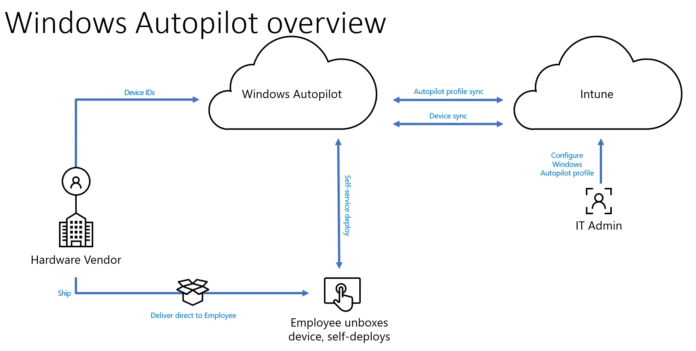

# The Hidden Power of Windows Autopilot Group Tags


So you're using Windows Autopilot in some shape or form to deploy Windows 10/11 devices to your users, and you're probably already familiar with the Autopilot [dynamic group queries](https://docs.microsoft.com/en-us/mem/autopilot/enrollment-autopilot) used for targetting these devices, right? Good.

So what if you have multiple deployment profiles, or different device use cases with the same profile, or different user personas, or test and pilot deployments, or a range of applications, configurations or scripts that you want to separate out to the devices or users of the devices? You probably do...what's that you say, you're using static groups to manage these? Let me show you the way forward.

## Configuration

If you've got this far, you'll probably know that Windows Autopilot is the modern deployment method for Windows 10/11 devices, allowing an organisation to pre-register corporate-owned devices (using their unique hardware hashes) and link these devices to the Azure AD tenant. Once the device is attached to the tenant, it is considered a trusted device that can be enrolled using Autopilot.

Below is an overview of the Windows Autopilot process, the bit we're talking about is the Hardware Vendor adding the Device IDs; this is where the Vendor can also add Group Tags.



### Group Tags

A hidden gem with Autopilot service, is the **Group Tag** attribute for Autopilot devices, this tag can be provided during the pre-registration by a supplier or OEM, and can be configured or updated after the device has been imported.

This attribute is attached the computer object that exists in Azure AD, sadly not labelled as "Group Tag", but as "OrderID" (this will be important later). As this attribute exists, we can utilise it with Dynamic Device groups...do you see where this is going?

### Naming Conventions

Now he have this little beaut of a trick, we can start to look at how we use the Group Tag attribute to our advantage, and address some of the potential use cases for grouping Autopilot devices, whether this be based on deployment type, application assignment or just for overall better management of devices.

I'm a big fan of having things named in a readable way, it just makes life a bit more straight forward in Microsoft Intune, and Group Tags are no different.

### Syntax

Your convention may differ from the below, as it will be entirely based on your own requirements, however I'll give you a syntax starter for ten so you have an understanding of your options.

| Position | Value | Description |
| :- | :- | :- |
| 1-2 | `AJ / HJ` | The Azure AD Join type - Azure AD or Hybrid Joined  |
| 3-4 | `LT / DT / VM`  | The Device Type - Laptop, Desktop or Virtual Machine |
| 5 | `U / S / K` | The Device Use Case - User Assigned, Shared or Kiosk  |
| 6-8 | `STD / ADM` | The User Type - Standard or Admin |
| 9-11 | `FIN / HR / PAY` | The Users Department - Finance, HR or, Payroll etc. |
| 12-13 | `UK / US / FR` | The Device Location - United Kingdom, United States, France etc. |

With this basic syntax in place, we can build out the Group Tag for devices:

| Group Tag | Description |
| :- | :- |
| `AJ-LT-U-STD-PAY-US` | Azure AD Joined Laptop, assigned to a User, with no Admin rights, in Payroll in the United States |
| `HJ-DT-S-ADM-FIN-UK` | Hybrid Azure AD Joined Desktop, configured as a Shared Device, with Admin rights, in Finance in the United Kingdom |

### Dynamic Groups

Now that we have sorted out the syntax and conventions, it's now time to create some dynamic groups in Azure AD. We're not only going to create specific groups that **equal** the Group Tag, but groups that **match** the Group Tag. This allows assignment of Deployment Profiles, Configuration Profiles and Applications to all device types in a dynamic way, alleviating the need to manually manage groups.

### Example Groups

The below dynamic query would contain all Azure AD Joined Autopilot Laptops:

```PowerShell
(device.devicePhysicalIds -any _ –startsWith "[OrderID]:AJ-LT")
```

This one contains all the Autopilot Desktops in Finance, whether Hybrid Joined or Azure AD Joined:

```PowerShell
(device.devicePhysicalIds -any (_ -match "^\[OrderID\]:.*DT.*FIN.*"))
```

This this one with all Laptops in France:

```PowerShell
(device.devicePhysicalIds -any (_ -match "^\[OrderID\]:.*LT.*FR$"))
```

And this this one with all Azure AD joined Laptops with Admin users in Payroll in all countries:

```PowerShell
(device.devicePhysicalIds -any (_ -match "^\[OrderID\]:AJ-LT.*ADM-PAY.*"))
```

You get the picture...the possibilities for both the syntax and the dynamic groups using [Regex](https://docs.microsoft.com/en-us/dotnet/standard/base-types/regular-expression-language-quick-reference) are pretty much endless, and should be tailored to how you manage devices in Microsoft Intune.

### Application

With the creation of these groups, you can now assign, well, pretty much anything in Microsoft Intune, to them.

Lets say you want all Laptops to have a BitLocker Endpoint Protection profile, but not Desktops...you can do this. What about assigning an application to all HR devices that are Hybrid Joined, yup, you can do that too.

If you're really all up in there with Microsoft Intune, you're probably using Role Based Access Control (RBAC), these groups also allow for segregated management of devices based on location, department, join type etc. for specific User Roles or permission such as Remote Wipe or Application Deployment...I know, exciting.

## Summary

What we have here, is a relatively painless way of tagging devices in any way you want to, kind of like creating a classic Organisational Structure but way more interesting and with the ability to do so without being constrained to a flat structure.

The next step is to clearly define your naming convention and syntax for the Group Tags, and have fun I guess.

Now if you're asking how to tag these devices on mass, without having to manually do so, well that's another post.

