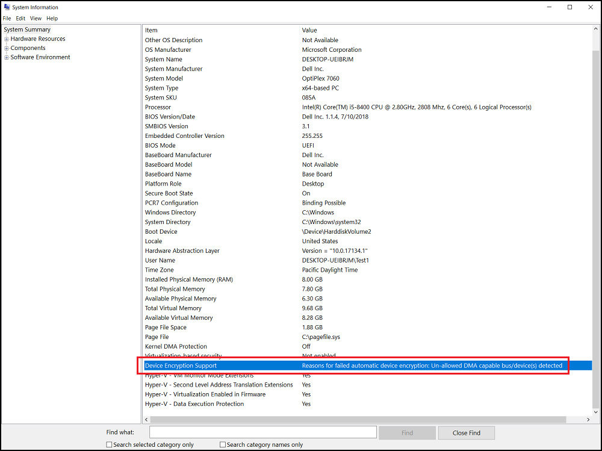
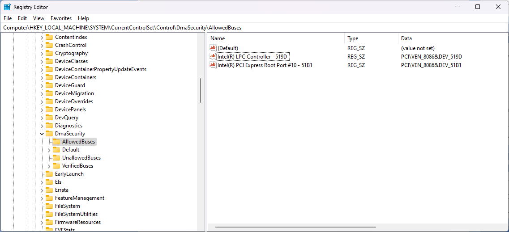

# Remediating BitLocker DMA Exception Errors with Microsoft Intune


Configuring silent encryption for Windows 10 and later devices in [Microsoft Intune](https://learn.microsoft.com/en-us/mem/intune/protect/encrypt-devices#silently-enable-bitlocker-on-devices) isn't anything new, removing reliance on Administrator permissions to encrypt a device, setting the encryption algorithm used, and ensuring that the data on the device is protected.

But what happens when your devices configured for silent encryption, don't even [automatically encrypt](https://learn.microsoft.com/en-us/windows-hardware/design/device-experiences/oem-bitlocker#bitlocker-automatic-device-encryption), with devices complaining about the detection of [Un-allowed DMA capable bus/device(s)](https://learn.microsoft.com/en-us/windows-hardware/design/device-experiences/oem-bitlocker#un-allowed-dma-capable-busdevices-detected) in the event log, preventing automatic encryption from starting.

With the Microsoft recommendation to create registry items to allow for these exceptions on the devices failing to automatically encrypt, we should see if a bit of PowerShell and Microsoft Intune can do to fix this issue.

## Direct Memory Access Exceptions

If you are subject to this DMA-based issue, and if you've got either [Dell](https://www.dell.com/support/kbdoc/en-tt/000124709/system-does-not-meet-bitlocker-automatic-device-encryption-requirements), [HP](https://www.reddit.com/r/Hewlett_Packard/comments/a4t9pr/hp_zbook_15_g5_oem_windows_image_automatic/) or [Lenovo](https://www.reddit.com/r/Intune/comments/b31le3/bitlocker_policy_issues_help/) devices you probably are, with the [BitLocker-API](https://learn.microsoft.com/en-us/troubleshoot/windows-client/windows-security/bitlocker-issues-troubleshooting) Management event log complaining about these Un-allowed DMA exceptions in `Event ID 4112`, with text similar to the below:

```txt
The following DMA (Direct Memory Access) capable devices are not declared as protected from external access, which can block security features such as BitLocker automatic device encryption:

LPC Controller:
    PCI\VEN_8086&DEV_519D (Intel(R) LPC Controller - 519D)

PCI-to-PCI Bridge:
    PCI\VEN_8086&DEV_51B1 (Intel(R) PCI Express Root Port #10 - 51B1)
```

And System Information showing something like this:



Instead of having to manually create the recommended registry settings, only after changing permissions on the Key to allow for these exceptions detailed in the [Microsoft Support Article](https://learn.microsoft.com/en-us/windows-hardware/design/device-experiences/oem-bitlocker#un-allowed-dma-capable-busdevices-detected), we should find a way to do this automatically.

## Platform Scripts

You might be wondering why we're going for a "dumb" PowerShell script instead of the "fancy" [remediation](https://learn.microsoft.com/en-us/mem/intune/fundamentals/remediations) approach that I am fond of?

Well the simple answer is that Platform scripts, running under the required **SYSTEM** context, will run during Windows Autopilot, so we can ensure that devices with the DMA issue are resolved during the deployment process instead of after it, allowing for BitLocker automatic encryption to complete in flight, you know for security and that.

So there.

### Registry Settings

We need a way to easily add the required registry entries to allow for the exceptions, taking into consideration that a single model, or manufacturer, of device could have multiple exceptions.

For this, we can just build a new `pscustomobject` as part of an array variable `$dmaDevices`, and as the actual name of the registry value doesn't matter, our main focus is the value.

```PowerShell
$dmaDevices = @()
$dmaDevices += [pscustomobject]@{name = 'Intel(R) LPC Controller - 519D'; value = 'PCI\VEN_8086&DEV_519D'}
$dmaDevices += [pscustomobject]@{name = 'Intel(R) PCI Express Root Port #10 - 51B1'; value = 'PCI\VEN_8086&DEV_51B1'}
```

With the `$dmaDevices` array variable, we can then loop through each item in the array, and add the required data to the registry key **HKLM:\SYSTEM\CurrentControlSet\Control\DmaSecurity\AllowedBuses** with a `New-ItemProperty` command:

```PowerShell
$regPath = 'HKLM:\SYSTEM\CurrentControlSet\Control\DmaSecurity\AllowedBuses'
foreach ($dmaDevice in $dmaDevices) {
    New-ItemProperty -Path $regPath -Name $dmaDevice.name -Value $dmaDevice.value -PropertyType String -Force
}
```

Great, we have to a way to add in these exceptions, but as they are exceptions, we should be more sniper and less shotgun.

### Device Model Queries

Instead of this blanket set of new registry items assigned to all devices, which from a security stance isn't the best look, we should make sure that make and model specific settings are applying.

Instead of having the create many many Dynamic Device Groups in Entra for each make and model, we can achieve this granularity of model specific settings by using a quick `(Get-WmiObject -Class:Win32_ComputerSystem).Model` to pull back the model of the device, before we start fiddling with its registry.

```PowerShell
$dmaDevices = @()
$deviceModel = (Get-WmiObject -Class:Win32_ComputerSystem).Model

if ($deviceModel -in 'Latitude 1', 'Latitude 2') {
    $dmaDevices += [pscustomobject]@{name = 'Intel(R) LPC Controller - 519D'; value = 'PCI\VEN_8086&DEV_519D'}
    $dmaDevices += [pscustomobject]@{name = 'Intel(R) PCI Express Root Port #10 - 51B1'; value = 'PCI\VEN_8086&DEV_51B1'}
}
elseif ($deviceModel -in 'Lenovo 1', 'Lenovo 2') {
    $dmaDevices += [pscustomobject]@{name = 'Intel(R) PCI Express Root Port #20 - A343'; value = 'PCI\VEN_8086&DEV_A343'}
    $dmaDevices += [pscustomobject]@{name = 'Intel(R) PCI Express Root Port #9 - A330'; value = 'PCI\VEN_8086&DEV_A330'}
    $dmaDevices += [pscustomobject]@{name = 'Intel(R) Xeon(R) E3 - 1200/1500 v5/6th Gen Intel(R) Core(TM) PCIe Controller (x16) - 1901'; value = 'PCI\VEN_8086&DEV_1901'}
    $dmaDevices += [pscustomobject]@{name = 'Intel(R) PCI Express Root Port #15 - A336'; value = 'PCI\VEN_8086&DEV_A336'}
}
```

The **if** and subsequent **elseif** statements allow us to ensure that only the DMA exceptions per model, or groups of models, are going to be applied, with the statement allowing for a lookup of multiple models using the `-in` operator.

So if you have multiple models with the same `PCI\VEN_8086&DEV_A30D` exception for example, these can be grouped together. Nice eh?

## PowerShell Example

Combining both the device model logic, and the creation of new registry items in the correct location, we have the below, which can act as a template or example for the rest of your devices with these issues.



This can be modified based on your own device estate, grouping devices by manufacturer or model, or just by which exceptions need to be made.


You can update or modify the variables used for each of the manufacturers `$devicesLenovo`, `$devicesDell`, and `$devicesHP`, as the likelihood is that you may need more granularity across the manufacturers.


### Script Testing

Now as the registry key has restrictive permissions, you can modify these manually for testing as per the [article](https://learn.microsoft.com/en-us/windows-hardware/design/device-experiences/oem-bitlocker#un-allowed-dma-capable-busdevices-detected), or you can use [PsExec](https://learn.microsoft.com/en-us/sysinternals/downloads/psexec) to run PowerShell as **SYSTEM** using **PsExec.exe -s -i powershell.exe**.

Allowing you to test locally on devices before deploying using Microsoft Intune, and with a bit of luck, you should see something like the below:



After successful testing, you're now ready to deploy this as a Platform Script in Microsoft Intune, using the below configuration.

| Item | Detail |
| :- | :- |
| Name | `BitLocker DMA Exceptions` |
| Description | `https://memv.ennbee.uk/posts/bitlocker-dma-exceptions/` |
| PowerShell script | `Set-BitLockerDMAExceptions.ps1` |
| Run this script using the logged on credentials | `No` |
| Enforce script signature check | `No`  |
| Run script in 64 bit PowerShell Host | `Yes` |
| Included groups | `Dynamic Autopilot Group` |

Now your devices should happily encrypt with BitLocker automatically, without hitting one of these DMA exceptions.

## Summary

Once you've captured the DMA exceptions of devices failing to automatically encrypt with BitLocker, along with the model of device that is effected, you can update the [PowerShell script](https://github.com/ennnbeee/oddsandendpoints-scripts/blob/main/Intune/PlatformScripts/PowerShell/BitLockerDMAExceptions/Set-BitLockerDMAExceptions.ps1), taking care with the model names, this can then be deployed using Microsoft Intune to a dynamic group of Windows Autopilot devices.

As we've gone to the effort of being specific with our exceptions, in the event that a device model is not in the list, then nothing will happen, but if a model *is* in the list of effected devices, the registry will get updated, and BitLocker will stop being a little whinge about not being able to start encryption due to some kind of security issue.

