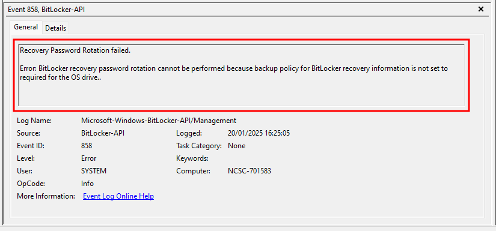

# BitLocker Recovery Key Rotation Requirements in Intune


BitLocker settings in Intune have gone through a transformation in recent years, with these encryption settings existing across multiple profile types, with different wording, settings, and options with Microsoft allow for configuration of BitLocker through three main policy types:

- [Endpoint Security policies](https://learn.microsoft.com/en-us/mem/intune/protect/encrypt-devices#create-an-endpoint-security-policy-for-windows)
- [Endpoint Protection policies](https://learn.microsoft.com/en-us/mem/intune/protect/encrypt-devices#create-an-endpoint-security-policy-for-windows)
- [Settings Catalog policies](https://techcommunity.microsoft.com/blog/intunecustomersuccess/configuring-bitlocker-via-microsoft-intune-settings-catalog/3770382)

Despite all these policies being backed up by the [BitLocker CSP](https://learn.microsoft.com/en-us/windows/client-management/mdm/bitlocker-csp), they all present their information in different ways.

This hasn't made the translation of settings between policies particularly easy, especially if you've been keeping up with the ~~Kardashians~~ Joneses, and moving all your profiles to Settings Catalog backed policies like a good little Intune engineer.

## Key Rotation Issues

What do we actually need though to allow for successful BitLocker key rotation in each of these policy types, and what settings do we need to avoid **Event ID 858** errors in the **BitLocker-API** event log like the below when attempting to rotate the key?



What is this *"BitLocker recovery password rotation cannot be performed because backup policy for BitLocker recovery information is not set to required for the OS drive"* error, and what do we need to fix it?

## Key Rotation Settings

Let's make sure that our BitLocker policies are configured to support the escrow (that's a fancy word for, *"keep hold of"*) of the recovery key to Entra ID, as without this any rotation of the key is going to give us a headache.

We'll assume that your policy in whatever flavour allows for [silent enablement of BitLocker](https://learn.microsoft.com/en-us/mem/intune/protect/encrypt-devices#silently-enable-bitlocker-on-devices), as who can be bothered with ~~secure devices~~ additional pre-boot authentication 🙃?

What exactly do we need to enable key rotation?

Well it's the following settings[^1]:



- Devices must run Windows 10 version 1909 or later, or Windows 11
- Microsoft Entra joined and Microsoft Entra hybrid joined devices must have support for key rotation enabled via BitLocker policy configuration:
  - **Client-driven recovery password rotation** to *Enable rotation on Microsoft Entra joined devices or Enable rotation on Microsoft Entra ID and Microsoft Entra joined hybrid joined devices*
  - **Save BitLocker recovery information to Microsoft Entra ID** to *Enabled*
  - **Store recovery information in Microsoft Entra ID before enabling BitLocker** to *Required*


[^1]: [Rotate BitLocker recovery keys prerequisites](https://learn.microsoft.com/en-us/mem/intune/protect/encrypt-devices#prerequisites)

Assuming you're not still stuck on old versions of Windows 10 😶, what do the other pre-requisites look like across the three policy types, allowing us to avoid recovery key rotation errors?

### Endpoint Security Policy

Below are the Endpoint Security policy settings, and as I cba with hybrid joined devices any more are designed for Entra join only devices.


These settings will still work on your precious hybrid joined devices, just change the rotation setting to `Refresh on for both Azure AD-joined and hybrid-joined devices` or similar in your policies.


First off is the requirement for key rotation:

| Category | Setting | Value |
| :- | :- | :- |
| BitLocker | Configure Recovery Password Rotation | `Refresh on for Azure AD-joined devices` |

With the corresponding setting in Intune:



It would be nice if the wording was updated here, it's **Entra ID** you know Microsoft 😅.


Moving to Operating System drive recovery options:

| Category | Setting | Value |
| :- | :- | :- |
| Administrative Templates > Windows Components > BitLocker Drive Encryption > Operating System Drives | Do not enable BitLocker until recovery information is stored to AD DS for operating system drives | `True` |
| Administrative Templates > Windows Components > BitLocker Drive Encryption > Operating System Drives | Save BitLocker recovery information to AD DS for operating system drives | `True` |

With Intune settings configured with the above values:


Lastly for Endpoint Security policies is the Fixed Data drive settings:

| Category | Setting | Value |
| :- | :- | :- |
| Administrative Templates > Windows Components > BitLocker Drive Encryption > Fixed Data Drives | Do not enable BitLocker until recovery information is stored to AD DS for fixed data drives | `True` |
| Administrative Templates > Windows Components > BitLocker Drive Encryption > Fixed Data Drives | Save BitLocker recovery information to AD DS for fixed data drives | `True` |

Configured in Intune:



There is no mention in this policy type, or with it's missing tooltips on some of the settings, that these settings are required to allow for key rotation to happen.


### Endpoint Protection Policy

Below are the Endpoint Protection policy settings, and if you need a refresh these are available in **Configuration > Windows 10 and later > Templates > Endpoint protection**.

The Operating System Drive settings are configured with the below:

| Category | Setting | Value |
| :- | :- | :- |
| Windows Encryption > BitLocker OS drive settings | Save BitLocker recovery information to Microsoft Entra ID | `Enable` |
| Windows Encryption > BitLocker OS drive settings | Client-driven recovery password rotation | `Key rotation enabled for Microsoft Entra joined devices` |
| Windows Encryption > BitLocker OS drive settings | Store recovery information in Microsoft Entra ID before enabling BitLocker | `Require` |

Looking like the below in Intune:



Microsoft managed to update the wording to **Entra** in a legacy policy, go figure 😅.


With the Fixed Data drive settings configured with the below values:

| Category | Setting | Value |
| :- | :- | :- |
| Windows Encryption > BitLocker fixed data-drive settings | Save BitLocker recovery information to Microsoft Entra ID | `Enable` |
| Windows Encryption > BitLocker fixed data-drive settings  | Store recovery information in Microsoft Entra ID before enabling BitLocker | `Require` |

Intune looking sharp:


### Settings Catalog Policy

If you're like me and punting everything into these policies, this one is for you, and the settings themselves are the same as the Endpoint security policy (as this uses Settings catalog), they're just presented differently, for some unknown reason.

The required key rotation settings:

| Category | Setting | Value |
| :- | :- | :- |
| BitLocker | Configure Recovery Password Rotation | `Refresh on for Azure AD-joined devices` |

With the corresponding setting in Intune:


Operating System drive recovery options:

| Category | Setting | Value |
| :- | :- | :- |
| Administrative Templates > Windows Components > BitLocker Drive Encryption > Operating System Drives | Do not enable BitLocker until recovery information is stored to AD DS for operating system drives | `True` |
| Administrative Templates > Windows Components > BitLocker Drive Encryption > Operating System Drives | Save BitLocker recovery information to AD DS for operating system drives | `True` |

Intune settings configured with the above:


Finally is the Fixed Data drive settings:

| Category | Setting | Value |
| :- | :- | :- |
| Administrative Templates > Windows Components > BitLocker Drive Encryption > Fixed Data Drives | Do not enable BitLocker until recovery information is stored to AD DS for fixed data drives | `True` |
| Administrative Templates > Windows Components > BitLocker Drive Encryption > Fixed Data Drives | Save BitLocker recovery information to AD DS for fixed data drives | `True` |

Configured in Intune:


## Key Rotation in Action

With one of the above policies applying to your devices, you can initiate a rotation of the BitLocker recovery key from Intune, go find a device, select the **ellipsis** (**...**) and select **BitLocker key rotation**:


Read the warning and obviously proceed, you wouldn't be clicking this option unless you know what it does right? 😛


Once you've selected **~Yassss~** **Yes**, on the device in question, go check the event logs, located in:

``` txt {open=true, lineNos=false, wrap=true, title="Event Viewer"}
Applications and Services Logs > Microsoft > Windows > BitLocker-API > Management
```

Intune will have hopefully asked the device nicely to rotate it's keys, with the event log showing the following entries:



With a newly escrowed (there's that new word we learned) into the Intune portal:


## Summary

Luckily for us, Microsoft have made it easy to configure both BitLocker and the Key Rotation options in Intune, in whatever policy type you fancy, whether Endpoint Security, Endpoint Protection, or just a plain old Settings Catalog one.

What they should do, is unify the wording of these settings not just in the policies themselves, but with the tooltips, to allow for a solid understanding of what the setting is doing, and what it enables to happen with BitLocker keys, to save me writing posts about something that should just be easy to understand from the Intune portal 😅.

