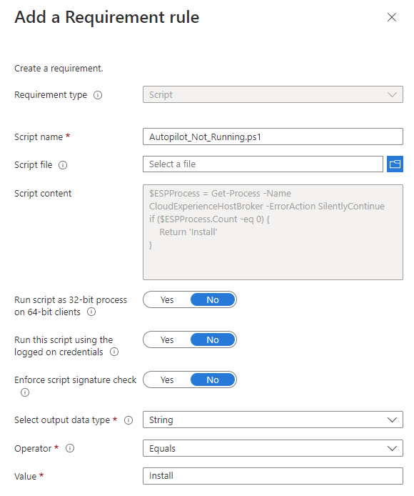
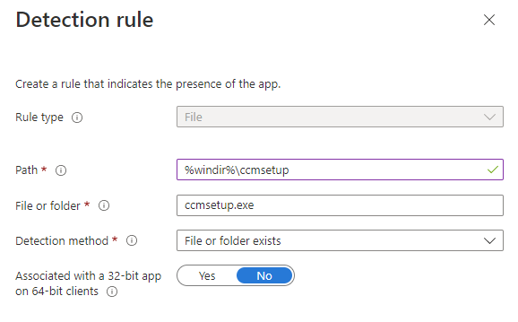
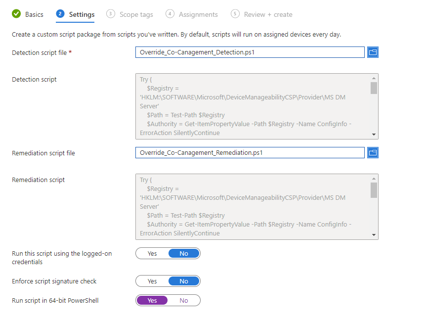

# Co-Managing Windows Autopilot Hybrid Join Devices


As both Microsoft Intune and Configuration Manager are a match made in heaven, there are many reasons to still utilise both, either using [Co-Management](https://learn.microsoft.com/en-us/mem/configmgr/comanage/overview) or just plain old [Tenant Attach](https://learn.microsoft.com/en-us/mem/configmgr/tenant-attach/device-sync-actions), so imagine my joy when Microsoft released [Co-Management Authority](https://learn.microsoft.com/en-us/mem/configmgr/comanage/autopilot-enrollment) in Intune, and I thought the days of packaging the Configuration Manager Client were over.

Now imagine my face when I read the [requirements](https://learn.microsoft.com/en-us/mem/configmgr/comanage/autopilot-enrollment#requirements) and the fact it doesn't support Autopilot Hybrid Join scenarios.

I get it, installing the client during Autopilot will pretty much break the deployment, but there should be a way to install the client and not have it bend over and *only*  accept Configuration Manager deployed workloads.

Packaging the Configuration Manager Client has been [covered](https://www.anoopcnair.com/sccm-internet-client-management/), [many](https://www.anoopcnair.com/how-to-install-sccm-client-using-intune-for-autopilot-provisioned-devices/), [many](https://eskonr.com/2019/07/how-to-install-sccm-client-from-microsoft-intune-for-co-managed-and-cmg-notes-from-the-field/), [many](https://amirsayes.co.uk/2021/11/23/automate-installing-sccm-client-for-azure-ad-autopilot-devices-via-intune-and-powershell/), [many](https://www.imab.dk/deploy-the-sccm-client-using-microsoft-intune-and-the-cloud-management-gateway-no-pki-certificates/) times, almost to death in fact, so I'm not going to show you how to package the client files, what I am going to show you is a couple of tricks to make the installation easier, and not break Autopilot.

## App Requirement Rules

To stop the application from running during the Autopilot process, we can add in a [Requirement Rule](https://learn.microsoft.com/en-us/mem/intune/apps/apps-win32-add#step-3-requirements) to ensure that we're not in the Out of Box Experience (OOBE). We've got a couple of options here, whether it's detecting if the `CloudExperienceHostBroker` Service is running, or if the User account context is running under **defaultUser0**.

I've gone with the Service approach, as it saves Intune having to run `Get-ComputerInfo -Property CsUserName` every time it wants to check if the requirement has been met.

With this, we can create a Requirement Rule Script using the below to check if the **CloudExperienceHostBroker** service is running, and if not returning **Install**:

```PowerShell
$ESPProcess = Get-Process -Name CloudExperienceHostBroker -ErrorAction SilentlyContinue
if ($ESPProcess.Count -eq 0) {
    Return 'Install'
}
```

Pretty straight forward for one of my documented scripts, but either way, save the file locally as something you can remember.

Create the rule in Intune with the below settings:

| Item | Value |
| :- | :- |
| Requirement Type | `Script` |
| Script Name | `Autopilot_Not_Running.ps1` |
| Script content | `{{Script Content}}` |
| Run script as 32-bit process on 64-bit clients | `No` |
| Run this script using the logged on credentials | `No` |
| Enforce script signature check | `No` |
| Select Output data type | `String` |
| Operator | `Equals` |
| Value | `Install` |

Giving us something like this:



This will now stop the installation from even starting during Autopilot phase, and only start the installation once the requirement has been met.

## App Detection Methods

Now that we can control when the Client is installed, we need a way to detect that it has installed, and to be honest, we don't actually care if the Client itself has installed correctly, as the Client setup will just sit and try to install itself every ten minutes until it can.

If we had a detection rule for either the MSI product code, or a File check for the client itself, we'd be waiting for an absolute age for Intune to be happy and confirm the installation state. We do not want this.

What we do want, is a quick and easy way to ensure that the setup files exist on the device, then we can let the **ccmsetup.exe** do it's magical thing and install the Client and the associated service.

So for the detection rule, we'll just look for the presence of the setup file:

| Item | Value |
| :- | :- |
| Rule Type | `File` |
| Path | `%windir%\ccmsetup` |
| File or Folder | `ccmsetup.exe` |
| Detection Method | `File or Folder Exists` |
| Associated with a 32-bit app on 64-bit client | `No` |

This looks a little bit like the below:



Allowing for a quick and easy detection of the required setup files on the device.

## Intune Only Mode

If you're wanting Intune to manage all the workloads on the device, and not rely on Co-Managed Workloads at all, there is a solution for this, and one taken straight from Microsoft and their implementation of the [Co-Management Authority](https://techcommunity.microsoft.com/t5/microsoft-intune-blog/co-management-settings-windows-autopilot-with-co-management/ba-p/3638500) in Intune.


Your endpoints enrolled in Intune today have a concept of management authority. That authority tells the device what service owns the management of the workloads on that device. The authority owner can be tracked by a simple registry key and value.


This is the value that they're on about:

```txt
HKLM:\SOFTWARE\Microsoft\DeviceManageabilityCSP\Provider\MS DM Server
```


When provisioning a device with Autopilot, the above key gets created right after you enter your username and password on the enrolment screen. This key tells the device who the authority is for workload management*


Here's the legend for the key:

- 1 – Intune
- 2 – Configuration Manager

Right, so if we really wanted to stick with Intune as the management authority here, we can leverage the above information and force the device to stick with Intune for it's management needs, and in the case of App deployment, the device will still receive Apps from both Intune and Configuration Manger if the key value is set to Intune.

### Proactive Remediation

As I've mentioned  if you're licensed to use Proactive Remediation Scripts, you should be using them, and in anger. We can throw together a script that looks for the registry key **HKLM:\SOFTWARE\Microsoft\DeviceManageabilityCSP\Provider\MS DM Server\ConfigInfo**, create it if it doesn't exist, and set it to **1** telling the device to only deal with Intune.

#### Detection Script

As with all Proactive Remediation scripts, we need a method to detect, which is run initially upon assessment, and subsequently after remediation. A standard check, fix, check situation. For the detection method, we're looking for both the Registry Key and the item.



#### Remediation Script

If either the Key or the Data are not detected, we have a Remediation script that configures either the Key and the Data, or just the Data.



### Creating a Custom Script

With the above [PowerShell scripts](https://github.com/ennnbeee/oddsandendpoints-scripts/tree/main/Intune/Remediation/Co-ManagementAuthority) saved, we can now create our own [Proactive Remediation Script](https://endpoint.microsoft.com/#view/Microsoft_Intune_Enrollment/UXAnalyticsMenu/~/proactiveRemediations) and deploy this to the devices we only want to be managed by Intune, in this case, the Hybrid Joined Autopilot devices:



Make sure you're using 64-bit PowerShell for this script, as we don't want anything screwy going on with the registry settings.

## Summary

We've managed to delay the installation of the Configuration Manager Client, as well as ensure it's detected quickly once installed, and once it does install and the Client starts looking at Configuration Manager for it's Co-Management settings, we've even got a way to tell Configuration Manager to look the other way and not break Autopilot whilst letting Intune do its thing.

All in all, although not a Microsoft supported method for deploying the Client, it is one that works. As you've realised by now, I'm not about documented good practice.


