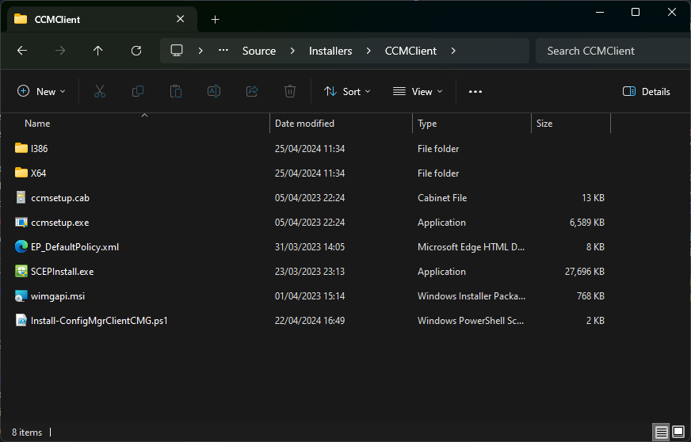
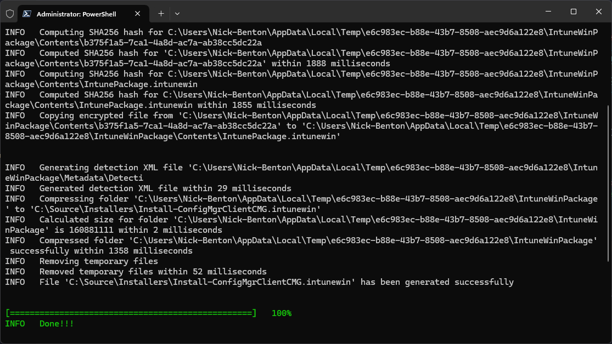
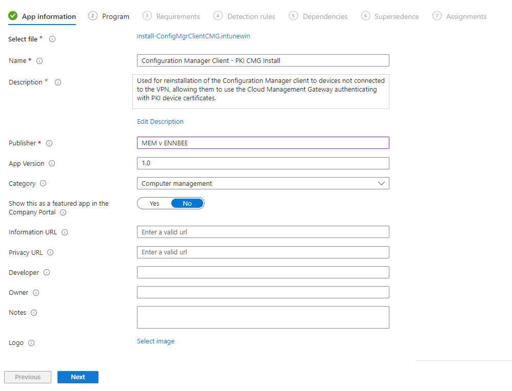
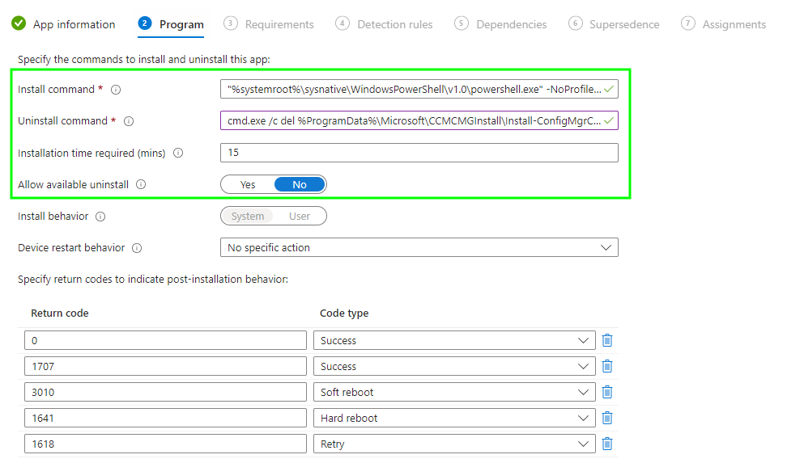
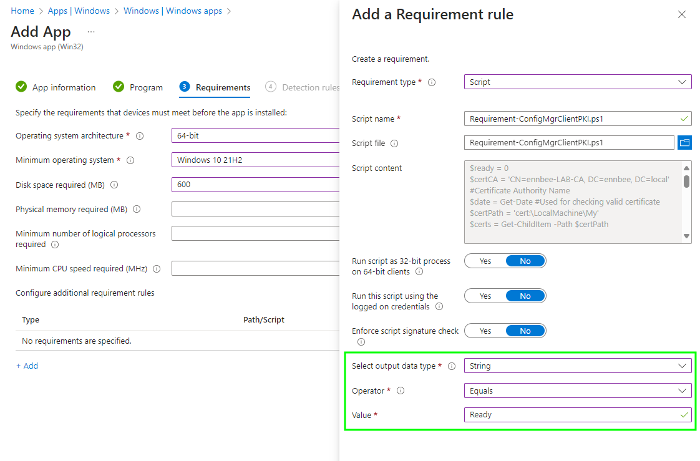
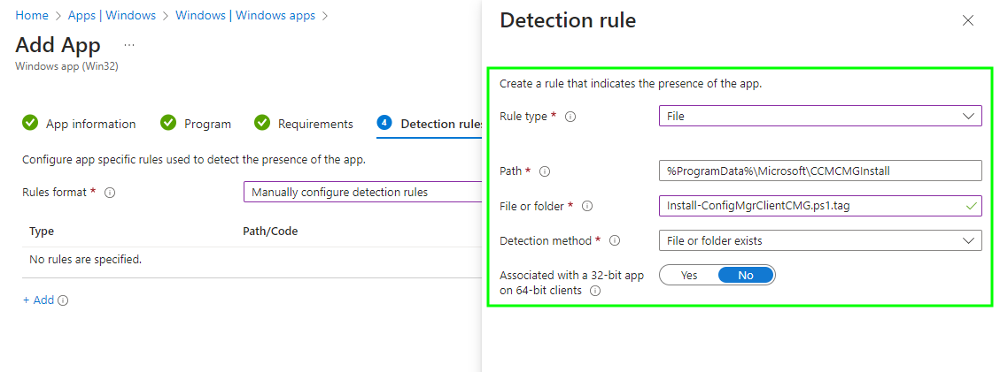
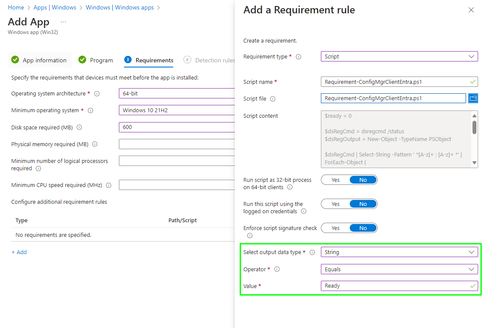
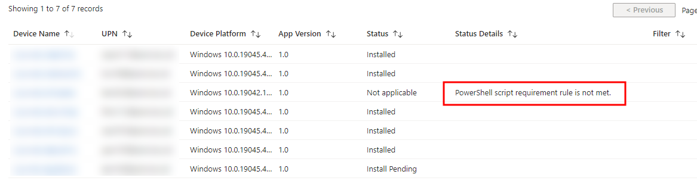
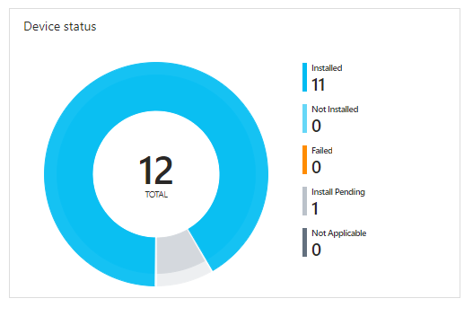
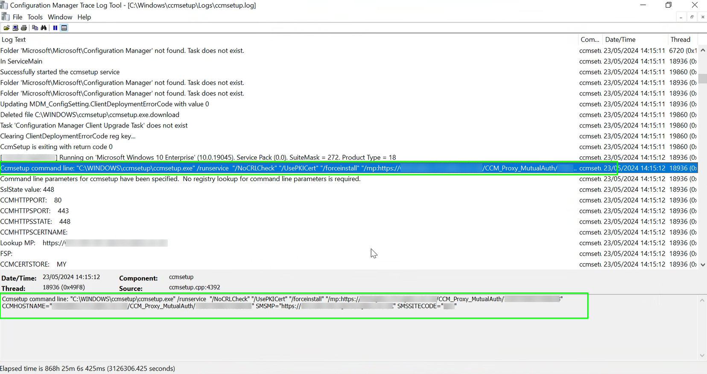

# Installing the Configuration Manager Client on Orphaned Internet Devices


You've just implemented a Cloud Management Gateway to help your hybrid joined Windows devices communicate to Configuration Manager over the internet, but what if they're orphaned and unable to communicate to Configuration Manager to get the new Client Settings?

This one might be little niche if I'm honest, but there *is* a scenario where you've implemented a [Cloud Management Gateway](https://learn.microsoft.com/en-us/mem/configmgr/core/clients/manage/cmg/overview) (CMG) as part of your Configuration Manager topology, your hybrid joined Windows devices are [co-managed](https://learn.microsoft.com/en-us/mem/configmgr/comanage/overview), but they no longer communicate back to the on-premises Configuration Manager Management Point for some reason, and you need to tell these remote devices that they can now use the Cloud Management Gateway.

The reason could be that you have a user initiated VPN that no-one actually uses, you're lacking a device tunnel for communication back to on-premises services, or you just have no VPN whatsoever, and these devices have just aged out of Configuration Manager never to be seen again.

How on earth are we going to sort these rogue orphaned devices out, and get them back speaking with Configuration Manager and a Cloud Management Gateway?

## Client Communication

Usually after implementing a Cloud Management Gateway, you just wait for your devices to check back in to the Management Point during a location request, and when they're classified as **Currently Internet** they'll happily communicate with the CMG, as long as they meet the [client authentication](https://learn.microsoft.com/en-us/mem/configmgr/core/clients/manage/cmg/configure-authentication) requirements obviously.

This won't work for devices that don't currently talk to Configuration Manager, nor if they've disappeared from the console and discovery. So how do we deal with this?

### Just Install the Client

Strangely, Microsoft actually recommended just re-installing the ConfigMgr Client on these devices, which isn't a bad shout, so that's at least the start of the process; with the devices hybrid joined and co-managed for at least the [Client Apps](https://learn.microsoft.com/en-us/mem/configmgr/comanage/workloads#client-apps) workload, we can just package up the latest ConfigMgr client from the Primary Site server and punt it to the device estate.

*"Oh, but what about using native tooling, isn't there a way to get Microsoft Intune to do this for you?"*, I hear you cry. Well [yes](https://techcommunity.microsoft.com/t5/microsoft-intune-blog/co-management-settings-windows-autopilot-with-co-management/ba-p/3638500), but also [no](https://learn.microsoft.com/en-us/mem/configmgr/comanage/autopilot-enrollment#limitations).

> Microsoft Entra hybrid joined devices - If the device is targeted with co-management settings policy, in Microsoft Entra hybrid join scenario, the autopilot provisioning times out during ESP phase.

and...

> Clients that authenticate with PKI certificates. You can't provision the certificate on the device before the Configuration Manager client installs and needs to authenticate to the CMG. Microsoft Entra ID is recommended for client authentication. For more information, see Plan for CMG client authentication: Microsoft Entra ID.

The co-management authority setting in Microsoft Intune is great, for your **Entra only** Autopilot devices, and as covered , but just doesn't work for the hybrid joined world, so a Win32 app it is, but what else do we need to consider?

## Client Authentication

Before we even look at packaging up the Configuration Manager client, we need to think about how these now essentially Internet-based devices are going to authenticate and communicate to the Cloud Management Gateway.

As these aren't fresh out the box devices, we shouldn't need to treat them as such, so we can discard the need of using a [site token](https://learn.microsoft.com/en-us/mem/configmgr/core/clients/deploy/deploy-clients-cmg-token) as part of the installation, as these devices will already be hybrid joined, or have a device certificate to allow existing authentication.

With this we can just look at how we make sure the devices are meeting the client authentication pre-requisites for the following two client authentication methods.

### PKI Authentication

I'm going to take a stab in the dark and suggest that these orphaned devices, if using PKI authentication, already have a certificate and the full chain of trust required to allow for [PKI authentication](https://learn.microsoft.com/en-us/mem/configmgr/core/clients/manage/cmg/configure-authentication#pki-certificate), but we should be sure of this and not just assume.

So as part of our soon to be packaged Win32 app, we need to utilise a PowerShell script to check that a certificate from your Internal Certification Authority exists with the correct extensions, and it's valid using [App Requirements](https://learn.microsoft.com/en-us/mem/intune/apps/apps-win32-add#step-3-requirements) in Microsoft Intune.

Throwing together a quick script and updating the `$certCA` with the distinguished name of your Issuing Certification Authority, we can loop through all certificates issued to the device, making sure that the certificate has come from your internal CA, then check if the date is valid.



If the script finds at least one certificate, as really the Configuration Manager client isn't that fussy about which certificate it uses, just that there is one, the script will return a `Ready` output back to Microsoft Intune, which we can then use as a positive identifier that the app installation can start.

### Entra Authentication

If you decided that you couldn't be bothered with PKI authentication (I mean who can really?), then the other option would have been to leverage the [Microsoft Entra ID](https://learn.microsoft.com/en-us/mem/configmgr/core/clients/manage/cmg/configure-authentication#microsoft-entra-id) join state of the device, and here we're making more broad assumptions that you're meeting all other [pre-requisites](https://learn.microsoft.com/en-us/mem/configmgr/core/clients/deploy/deploy-clients-cmg-azure) for this authentication method.

The one we care about is the join state, as really this is the only one we can query from the client itself, so more PowerShell and using the ever trusty [dsregcmd](https://learn.microsoft.com/en-us/entra/identity/devices/troubleshoot-device-dsregcmd) to get the join state of the device.



With a bit of a hack, we can take the output of `dsregcmd /status` and throw it into a new `PSObject`, which gives us an sample output of the below:

```PowerShell
AzureAdJoined             : YES
EnterpriseJoined          : NO
DomainJoined              : YES
Virtual Desktop           : NOT SET
Device Name               : XXXXXX
Thumbprint                : XXXXXX
DeviceCertificateValidity : [ 2023-10-31 13:36:52.000 UTC -- 2033-10-31 14:06:52.000 UTC ]
KeyProvider               : Microsoft Platform Crypto Provider
TpmProtected              : YES
DeviceAuthStatus          : SUCCESS
TenantName                : MEM v ENNBEE
```

With the area we care about being the `AzureAdJoined` state, which can be referenced with `$dsRegOutput.AzureAdJoined` in the PowerShell script. Sticking with the `Ready` output here as well, we now have something we can confirm as part of the requirements for the application installation.

## Client Installation Settings

As we're using Microsoft Intune to push out a packaged version of the client, we can't rely on a standard [detection rule](https://learn.microsoft.com/en-us/mem/intune/apps/apps-win32-add#step-4-detection-rules) such as file , msi, or registry, as there is no guarantee that the version of the client already installed, isn't the same as the one we're trying to deploy.

To get around this little hurdle, along with a couple of others along the way including the installation parameter for the ConfigMgr client, we need to create a PowerShell script to carry out the installation for us, taking into consideration the two main authentications methods of PKI and Entra authentication, as well as the requirements for the [command line installation](https://learn.microsoft.com/en-us/mem/configmgr/core/clients/deploy/about-client-installation-properties).

### Command Line Installation

For both authentication types, we need the following command line options and switches:

- `CCMHOSTNAME` - The You'll find the Cloud Management Gateway hostname in the ConfigMgr console under the Cloud Services settings.
- `SMSSITECODE` - Is pretty obviously your ConfigMgr site code.
- `SMSMP` - Required to specify the internal management point when the client is set to intranet connectivity.
- `/mp` - The management point address for the Cloud Management Gateway, it's the one with the 'https://' prefix.
- `/forceinstall` will uninstall the existing client first, and is useful if the installed version of the client is the same as the version being deployed.

With the PKI authentication we need some additional switches:

- `/NoCRLCheck` - Useful if the internal PKI environment hasn't a public certificate revocation list (CRL), no needed if you're using a public certificate on the Cloud Management Gateway.
- `/UsePKICert` - Tells the installation to use a PKI certificate for authentication to the Cloud Management Gateway.

Finally for Entra authentication we need some details from the Enterprise App used for this authentication method when setting up [Azure Services](https://learn.microsoft.com/en-us/mem/configmgr/core/servers/deploy/configure/azure-services-wizard) in ConfigMgr:

- `AADTENANTID` - Can be found in your Entra ID tenant.
- `AADCLIENTAPPID` - Is the Client ID of the Enterprise App and can be found in Entra ID.
- `AADRESOURCEURI` - Is the internal URL used for the service sometimes it's in the format 'https://localhost' can be found in Enterprise App in Entra ID.

So with all these switches now available, time to put them to good use and create a PowerShell script, that can be used for both authentication methods.

### Installation Script

As I don't like to repeat myself, we can create one PowerShell script for both authentication types, using a switch parameter to control which of the command line settings are used for the installation, and passing though the details of the below mandatory parameters for both installation types:

- `ccmSiteCode` - ConfigMgr Site Code, so something like `"ENB"`.
- `ccmMP` - The URL of the internal ConfigMgr Management Point such as `"https://configmgrmp.ennbee.local"`.
- `cmgAddress` - The address of the Cloud Management Gateway (without the 'https://' bit, as we're building that for the required parameter), so `"CONFIGMGRCMG.CLOUDAPP.NET/CCM_Proxy_MutualAuth/72186325152220500"`

For the parameters required for the PKI authentication:

- `PKI` - A switch parameter that used to create the command line arguments for PKI authentication over Entra authentication.

For the Entra authentication method we need to pass through the non-mandatory parameters:

- `tenantId` - This is the UUID for your tenant, so something similar to `"daf4a1c2-3a0c-401b-966f-0b855d3abd1a"`
- `clientAppId` - The client App object ID from Entra, so for me it's `"7506ee10-f7ec-415a-b415-cd3d58790d97"`
- `clientAppURL` - The client App URI configured in the Enterprise App, like `"https://localhost"`

I've left these as non-mandatory and without any flight checks, as you're not going to, a) see the output of the script, and b) I trust you to just use the script correctly.

So we now have an installation script in all its glory, ready to be packaged along with the ConfigMgr client installation files so we can punt it into Microsoft Intune.




To allow us to detect whether the installation of the app has happened, and to avoid using native detection methods, I've included the creation of a **.tag** file in the script, which we can look for as part of the detection.


To give you an example of the what the commands look like for PKI authentication it should look something like the below:

```PowerShell
.\Install-ConfigMgrClientCMG.ps1 -PKI -ccmSiteCode "ENB" -ccmMP "https://configmgrmp.ennbee.local" -cmgAddress "CONFIGMGRCMG.CLOUDAPP.NET/CCM_Proxy_MutualAuth/72186325152220500"
```

And for Entra authentication it'll look like this, making sure to pass through the additional parameters for `$tenantId`, `$clientAppId` , and `$clientAppURL`:

```PowerShell
.\Install-ConfigMgrClientCMG.ps1 -ccmSiteCode "ENB" -ccmMP "https://configmgrmp.ennbee.local" -cmgAddress "CONFIGMGRCMG.CLOUDAPP.NET/CCM_Proxy_MutualAuth/72186325152220500" -tenantId "daf4a1c2-3a0c-401b-966f-0b855d3abd1a" -clientAppId "7506ee10-f7ec-415a-b415-cd3d58790d97" -clientAppURL "https://localhost"
```

Script done, time to package it up and punt it out to clients.

## Application Packaging

Packaging up the Configuration Manager client for deployment from Microsoft Intune has been documented countless times, so just do a quick ~Bing~ Google [search](https://letmegooglethat.com/?q=SCCM+Client+Intune), but I'll cover the high level steps so you don't have to flit about the internet:

1. Grab a copy of the latest client installation files from your Configuration Manager Primary Site server and plonk them somewhere on your Windows device:
   - They'll be in `\\localhost\SMS_[SITECODE]\cd.latest\SMSSETUP\CLIENT` where `[SITECODE]` is your site code.
2. Go and get the latest version of the [Microsoft-Win32-Content-Prep-Tool](https://github.com/microsoft/Microsoft-Win32-Content-Prep-Tool)
   - Extract this somewhere sensible on your computer.
3. Download the Client installation script from my [GitHub repo](https://github.com/ennnbeee/oddsandendpoints-scripts/blob/main/Intune/Apps/ConfigMgrCMG/Install-ConfigMgrClientCMG.ps1).
   - Place this in the same location as the Configuration Manager client files, where `ccmsetup.exe` exists in fact.

You should now have a folder with the client install content and PowerShell script looking like this:



Time to package the files.

### Using the IntuneWinAppUtil

Now we have all the required files, navigate in an elevated Terminal window to where you extracted the Microsoft-Win32-Content-Prep-Tool, running a command similar to the below, specifying the source folder (`-c`) as where you copied the Configuration Manager client installation files, the setup file (`-s`)  as the PowerShell script, and the output (`-o`)  where you want the new intunewin file to be created:

```PowerShell
.\IntuneWinAppUtil.exe -c "C:\Source\Installers\CCMClient" -s Install-ConfigMgrClientCMG.ps1 -o "C:\Source\Installers" -q
```

This will hopefully give us an output similar to the below:



And a new file **Install-ConfigMgrClientCMG.intunewin** in **C:\Source\Installers** ready to be uploaded to Microsoft Intune.

## Client Deployment

The rest of the deployment process happens over in Microsoft Intune so throw yourself over to Windows Apps blade, as we'll need to create two new Win32 apps for each of our authentication methods, uploading the same **.intunewin** file for both apps.

Both applications will have similar App Information, so feel free to amend the wording in this section.




I haven't bothered configuring an app logo, as Microsoft don't 👀.


### PKI Authentication Application

When configuring the PKI authentication application, our installation command and requirements need to reflect this authentication type, so for our install command we need something like the below:

```PowerShell
"%systemroot%\sysnative\WindowsPowerShell\v1.0\powershell.exe" -NoProfile -ExecutionPolicy Bypass -File Install-ConfigMgrClientCMG.ps1 -PKI -ccmSiteCode "ENB" -ccmMP "https://configmgrmp.ennbee.local" -cmgAddress "CONFIGMGRCMG.CLOUDAPP.NET/CCM_Proxy_MutualAuth/72186325152220500"
```

The uninstall command is just removing the **.tag** file we create during the installation script:

```cmd
cmd.exe /c del %ProgramData%\Microsoft\CCMCMGInstall\Install-ConfigMgrClientCMG.ps1.tag
```




Make sure you update the installation time and the installation context otherwise you'll be in for a bad time.


As we've taken the time to write a custom requirement rule, we need to add this to the standard requirements section, uploading the [script](https://github.com/ennnbeee/oddsandendpoints-scripts/blob/main/Intune/Apps/ConfigMgrCMG/Requirement-ConfigMgrClientPKI.ps1) for PKI authentication we created and modified previously, and updating the output data type to `String` and expected value of `Ready` accordingly.



Moving on to the next page in the process, we need to create our Detection rule using the **.tag** file that gets created during the installation. So go and add a new detection rule using the File option, with the path to the file being **%ProgramData%\Microsoft\CCMCMGInstall** and checking if the **Install-ConfigMgrClientCMG.ps1.tag** file exists:



We can skip to the end of the process, as we have no further settings to configure, and I'd suggest assigning this on a small Proof-of-Concept group as part of testing, prior to just launching it to your entire device estate.

PKI authentication done, what about the Entra authentication?

### Entra Authentication Application

This process is going to look very familiar, but there some key differences, but the start is the same so go create a new Windows app (Win32) in Microsoft Intune, complete the App information page with the information needed after uploading the **.intunewin** file again.

For the Program page, we need to amend our install command to the below passing in the required parameters we covered earlier:

```PowerShell
"%systemroot%\sysnative\WindowsPowerShell\v1.0\powershell.exe" -NoProfile -ExecutionPolicy Bypass -File Install-ConfigMgrClientCMG.ps1 -ccmSiteCode "ENB" -ccmMP "https://configmgrmp.ennbee.local" -cmgAddress "CONFIGMGRCMG.CLOUDAPP.NET/CCM_Proxy_MutualAuth/72186325152220500" -tenantId "daf4a1c2-3a0c-401b-966f-0b855d3abd1a" -clientAppId "7506ee10-f7ec-415a-b415-cd3d58790d97" -clientAppURL "https://localhost"
```

The uninstall command remains the same however:

```cmd
cmd.exe /c del %ProgramData%\Microsoft\CCMCMGInstall\Install-ConfigMgrClientCMG.ps1.tag
```


As with the PKI authentication configuration we need to add our Entra requirement [script](https://github.com/ennnbeee/oddsandendpoints-scripts/blob/main/Intune/Apps/ConfigMgrCMG/Requirement-ConfigMgrClientEntra.ps1), updating the output data type to `String` and value of `Ready`.



Same as with PKI authentication we need to create our Detection rule using the very same `.tag` file.


Click Click Next OK-ing our way to the end, we now have both applications ready to be deployed to our orphaned Configuration Manager client devices.

## Client Installation

If you really want to double-down on getting this issue resolved, you can deploy both apps with the differing installation commands and requirements to the same Entra ID group, then regardless of whether they've got a valid certificate or they're Entra joined, they'll give the Configuration Manager client installation a good go.

As the detection method is the same for both apps, you're not going to impact devices that have already run one or the other app.

### Microsoft Intune Reporting

Giving Microsoft Intune a little while to catch up with the deployments, we should start seeing devices report back their installation status, and show any devices that are not meeting the requirements:




With the same assignment group being used across both apps, we need to keep an eye out for devices that are failing *both* requirements checks.


As well as devices that are actually reporting as installing the application:



This isn't the end of the story though, as Microsoft Intune is just telling us whether the client setup files are now on the targeted devices after meeting either the Entra Join or Client Certificate requirements.

### Client Installation Logs

Now we've assigned our new app to a group of devices that are no longer communicating with Configuration Manager, we can go and jump on a device targeted by the app, and keep an eye on the [ccmsetup.log](https://learn.microsoft.com/en-us/mem/configmgr/core/plan-design/hierarchy/log-files#BKMK_ClientInstallLog) in **C:\Windows\ccmsetup**.

What we're looking for here, is the start of the installation passing through the parameters we configured in the PowerShell script we created:



You can now trail this log to make sure that the device is authenticating to the Cloud Management Gateway, and await for a final exit code of either **0**, successful install or **7**, pending restart, with both denote that the client has successfully installed, and communicated to Configuration Manager.

## Summary

This one might not have been the most conventional approach to Configuration Manager client installation, but the situation, as strange as it is, forced our hand to think of a non-standard way to push out the Configuration Manager client to these orphaned Windows devices to allow them to successfully phone home to the Configuration Manager Management Points using the Cloud Management Gateway without physically getting our hands on them.

At least with this method, and not just blindly pushing out the client without the requirements and installation arguments, means that devices are only going to start chatting to the Cloud Management Gateway when they can actually authenticate to it, regardless of which authentication method you're using in your environment.

The status of your clients can be monitored in Configuration Manager [Cloud management dashboard](https://learn.microsoft.com/en-us/mem/configmgr/core/clients/manage/cmg/monitor-clients-cloud-management-gateway#cloud-management-dashboard), as the app we pushed will start the ccmsetup process, authenticate to the Cloud Management Gateway, allowing them to check back in with Configuration Manager.

