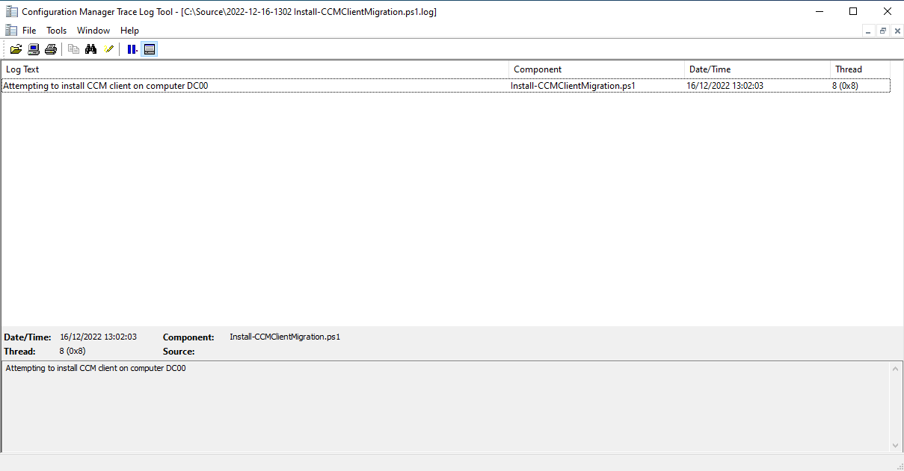

# Reinstalling the Configuration Manager Client on Migrated Devices


Have you ever had the pleasure of migrating Configuration Manager clients from one domain to another, or maybe between Configuration Manager environments? Tired of manually reinstalling the client from the Console? Wanting a quick and easy way to keep on top of migrated devices? You're in luck.

## Problem Time

With the migration of clients between Configuration Manager environments, or between domains that Configuration Manager manages devices on, you'll inevitably be in the situation where you need to reinstall the client on these devices to ensure that communication still occurs between the client and the Management Point.

The problem here, is that the underlying computer object, and associated machine account has changed, and from a Configuration Manager perspective will be treated, as it should, as a newly discovered client. You can remedy this by forcing the un-installation and an installation of the client from within the console, but this really isn't practical for continued migration of clients. So we need a solution, and quickly.

## PowerShell to the Rescue

As always it's PowerShell that will save us, a couple of useful in-built Configuration Manager commands, and a stolen/borrowed [Configuration Manager Logging Function](https://janikvonrotz.ch/2017/10/26/powershell-logging-in-cmtrace-format/).

This one will be breezy.

### Computers without a Client

We could do this in a couple of ways, create a collection in Configuration Manager of all machines without the Client installed and use this collection to push the installation:

```SQL
select SMS_R_SYSTEM.ResourceID,SMS_R_SYSTEM.ResourceType,SMS_R_SYSTEM.Name,SMS_R_SYSTEM.SMSUniqueIdentifier,SMS_R_SYSTEM.ResourceDomainORWorkgroup,SMS_R_SYSTEM.Client from SMS_R_System where SMS_R_System.Client is null
```

Or capture all non-default devices without the client using [`Get-CMdevice`](https://learn.microsoft.com/en-us/powershell/module/configurationmanager/get-cmdevice?view=sccm-ps)  and target them directly:

```PowerShell
Get-CMdevice | Where-Object { ($_.IsClient -eq '') -and ($_.SMSID -notlike '*Unknown Computer*' ) -and ($_.SMSID -notlike '*Provisioning Device*') }
```

We're going with the latter as I'd like to know which machines are being targeted.

To use the `Get-CMdevice` command, we need to import and connect to the Configuration Manager instance using the below when on the Primary Site Server:

```Powershell
# Load Configuration Manager PowerShell Module
Import-Module ($Env:SMS_ADMIN_UI_PATH.Substring(0, $Env:SMS_ADMIN_UI_PATH.Length - 5) + '\ConfigurationManager.psd1')

# Get SiteCode
$SiteCode = Get-PSDrive -PSProvider CMSITE
Set-Location $SiteCode":"
```

### Logging Functions

No we're connected we can use the command to capture all the devices we want to target, but we could do with a way to log wtf is going on as part of the re-installation, and in a format that [CMTrace](https://learn.microsoft.com/en-us/mem/configmgr/core/support/cmtrace) will be happy to read.

```PowerShell
Function Write-log {

    [CmdletBinding()]
    Param(
        [parameter(Mandatory = $true)]
        [String]$Path,

        [parameter(Mandatory = $true)]
        [String]$Message,

        [parameter(Mandatory = $true)]
        [String]$Component,

        [Parameter(Mandatory = $true)]
        [ValidateSet('Info', 'Warning', 'Error')]
        [String]$Type
    )

    switch ($Type) {
        'Info' { [int]$Type = 1 }
        'Warning' { [int]$Type = 2 }
        'Error' { [int]$Type = 3 }
    }

    # Create a log entry
    $Content = "<![LOG[$Message]LOG]!>" + `
        "<time=`"$(Get-Date -Format 'HH:mm:ss.ffffff')`" " + `
        "date=`"$(Get-Date -Format 'M-d-yyyy')`" " + `
        "component=`"$Component`" " + `
        "context=`"$([System.Security.Principal.WindowsIdentity]::GetCurrent().Name)`" " + `
        "type=`"$Type`" " + `
        "thread=`"$([Threading.Thread]::CurrentThread.ManagedThreadId)`" " + `
        "file=`"`">"

    # Write the line to the log file
    Add-Content -Path $Path -Value $Content
}
```

If you'd like more detail head over to [janikvonrotz.ch](https://janikvonrotz.ch/2017/10/26/powershell-logging-in-cmtrace-format/) who wrote this function.

With the function in place, we just need to define the `$LogFilePath` variable and we're good to capture whatever horrible errors we're to encounter as part of the script.

```PowerShell
$LogFilePath = Join-Path $PSScriptRoot "$(Get-Date -Format yyyy-MM-dd-HHmm) $($MyInvocation.MyCommand.Name).log"
```

And a way to punt the information or errors or warnings to the log file when we encounter then, something like:

```PowerShell
Write-Error ($_ | Out-String)
Write-Log -Path $LogFilePath -Message ($_ | Out-String) -Component $MyInvocation.MyCommand.Name -Type Error
```

Below is an example of the output of the log file:



Who would have thought I would bother putting in logging, it's like I wrote this for an actual customer or something.

### Client Installation

With the bare-bone stuff in place, we will be using the [`Install-CMClient`](https://learn.microsoft.com/en-us/powershell/module/configurationmanager/install-cmclient?view=sccm-ps) command to force the removal of the old client (`-ForceReinstall`) and force the installation of the new client (`-AlwaysInstallClient`), aggressive, I like it.

I've chosen to use the `-DeviceId` as the device identifier, over `-DeviceName` or `-Name` as because we're in a situation where there could be duplicate machine names in the case of a client domain migration, so we need something unique.

Putting this together, we've now got the installation part of the script done, leaning on the existing `$SiteCode` variable to pass into this part of the script:

```PowerShell
Install-CMClient -DeviceId $UnmanagedDevice.ResourceID -AlwaysInstallClient $true -ForceReinstall $true -SiteCode $SiteCode.Name
```

As mentioned previously, if you were using a device collection to capture your devices without the Configuration Manager client, you could use the `-CollectionId` parameter instead of `-DeviceId` in the above script snippet.

## Installation Time

With everything now in place, we can do the following:

- Capture the devices we want that don't have the client installed, excluding the built-in Configuration Manager devices and Servers
- Loop through each device and install the Client
- Write to the log file when something good or bad happens

This way, we can let Configuration Manager do all our heavy lifting, without manual intervention, or trying to run something from the client side to re-install the Configuration Manager Client.

The full script in all it's glory can as always be found in [GitHub](https://github.com/ennnbeee/oddsandendpoints-scripts/blob/main/ConfigMgr/Apps/ForceCCMClientInstall/Install-CCMClientAlways.ps1)



If you need to keep this running on an on-going basis as part of a phased migration, I'd recommend hooking this into a Scheduled Task running from the Primary Site server, or if you're feeling fancy, a [Status Filter Rule](https://learn.microsoft.com/en-us/mem/configmgr/core/servers/manage/use-status-system#manage-status-filter-rules) to have the script triggered on an event captured by a one of the million Configuration Manager logs files for its components.

## Summary

Like I said, this one was a quick way to resolve an ongoing issue, but one that you may end up encountering if migrating clients between Configuration Manager sites, Domains, or even moving clients from a Workgroup to a Domain.

As always, remember to test the script in your environment, utilise the `-WhatIf` parameter, and update the `$UnmanagedDevices` variable based on your own environment requirements.

