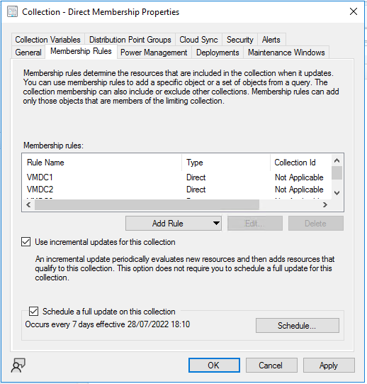
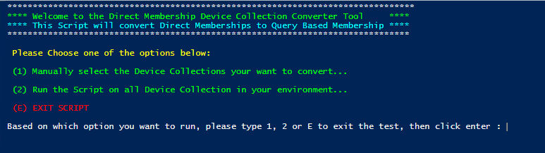
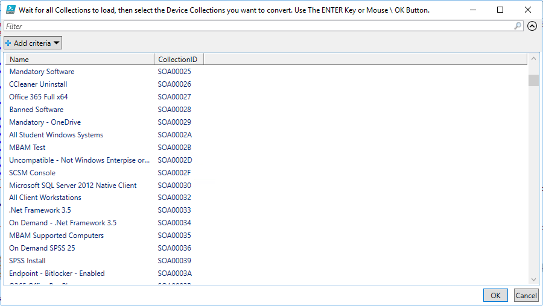
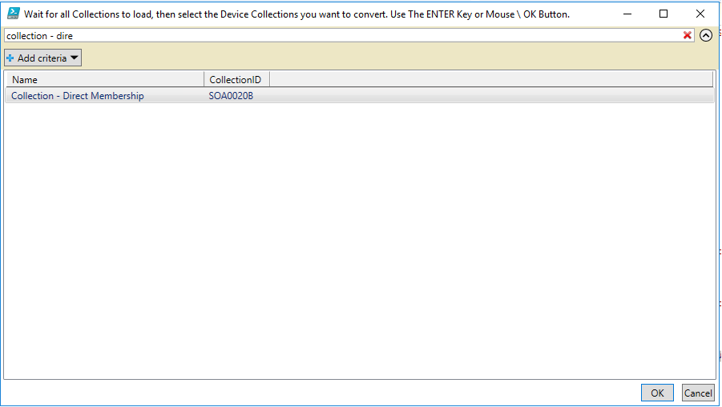
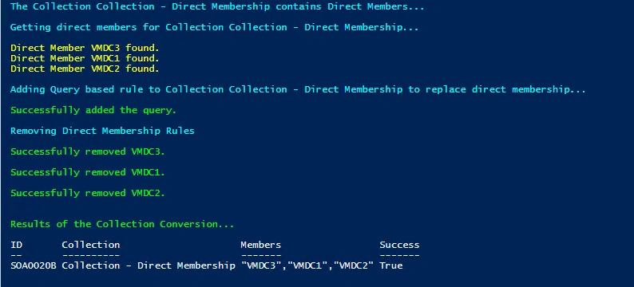
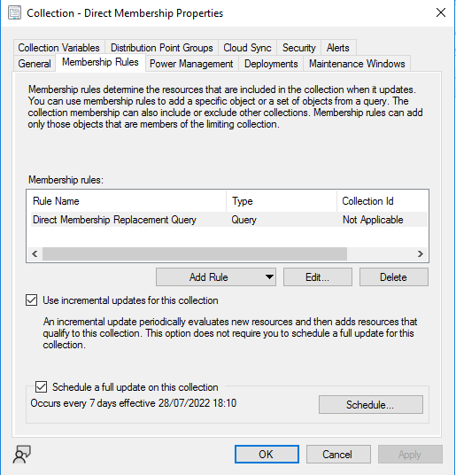
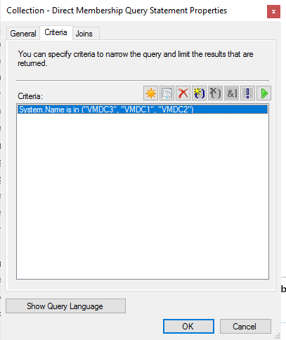

# Converting Configuration Manager Direct Membership Collections


You may be using [Direct Membership Rules](https://docs.microsoft.com/en-us/mem/configmgr/core/clients/manage/collections/create-collections#direct-rule) in your Microsoft Configuration Manager environment, but should you really for critical production collections?

No is the answer, there I said it. Mainly because they require actual effort and overhead to maintain, and secondly because there have been times where these memberships just plain disappear, for many different reasons, but primarily if the ConfigMgr Client is reinstalled on the device.

So what do we do? Aggressive PowerShell scripts obviously.

## The Approach

We'll need to connect to the Configuration Manager PowerShell module, which is easy enough from the Primary Site server, then carry out the following actions:

- Get the Device Collections with Direct Members
- Capture the Direct Members
- Create a new Query Membership Rule with the members
- Remove the existing Direct Members
- Logging?

So let's get at it...

## Connecting via PowerShell

From the Configuration Manager server we can leverage the PowerShell Module, import it and then connect to the PSDrive where we get to run all the Configuration Manager commands

```PowerShell
Import-module ($Env:SMS_ADMIN_UI_PATH.Substring(0, $Env:SMS_ADMIN_UI_PATH.Length - 5) + '\ConfigurationManager.psd1')
$SiteCode = Get-PSDrive -PSProvider CMSITE
Set-location $SiteCode":"
```

### Getting the Collections

I thought I'd be kind and give a couple of options to the Collection gathering, attack all of the Device Collections or, which is probably more sensible, bring up a list of collections to work with.

We're doing this through a selection option at the start of the script and using [Get-CMDeviceCollection](https://docs.microsoft.com/en-us/powershell/module/configurationmanager/get-cmdevicecollection?view=sccm-ps):

```PowerShell
if ($Choice_Number -eq '1') {
    Write-Host "Getting Device Collections with Direct Membership Rules..." -ForegroundColor Yellow
    $Collections = @(Get-CMDeviceCollection | Where-Object { $_.CollectionRules -like '*SMS_CollectionRuleDirect*' } | Select-Object Name, CollectionID, CollectionRules | Out-GridView -PassThru -Title 'Wait for all Collections to load, then select the Device Collections you want to convert. Use The ENTER Key or Mouse \ OK Button.')
}
if ($Choice_Number -eq '2') {
    Write-Host "Getting Device Collections with Direct Membership Rules..." -ForegroundColor Yellow
    $Collections = Get-CMDeviceCollection | Where-Object { $_.CollectionRules -like '*SMS_CollectionRuleDirect*' } | Select-Object Name, CollectionID, CollectionRules
}
```

We need to now identify whether these collection have Direct Members, so for each collection we can look at the `CollectionRules` attribute, and see if it contains `SMS_CollectionRuleDirect`:

```PowerShell
foreach ($Collection in $Collections) {
    if ($Collection.CollectionRules -like "*SMS_CollectionRuleDirect*") {
    }
}
```

Now we know this collection has Direct Members, let's get them using [Get-CMDeviceCollectionDirectMembershipRule](https://docs.microsoft.com/en-us/powershell/module/configurationmanager/get-cmdevicecollectiondirectmembershiprule?view=sccm-ps):

```PowerShell
$DirectMembers = Get-CMDeviceCollectionDirectMembershipRule -CollectionName $Collection.Name
```

Cool, easy part done.

### Building the Query

An easy replacement for the Direct Membership Rule is to use a List of Values Query based on System Name, so we're going to use that, we're going to use this as our basis for the new query once we've captured the Direct Members in a suitable format.

#### CCM Client Computer Name

```SQL
select SMS_R_SYSTEM.ResourceID,SMS_R_SYSTEM.ResourceType,SMS_R_SYSTEM.Name,SMS_R_SYSTEM.SMSUniqueIdentifier,SMS_R_SYSTEM.ResourceDomainORWorkgroup,SMS_R_SYSTEM.Client from SMS_R_System inner join SMS_G_System_SYSTEM on SMS_G_System_SYSTEM.ResourceId = SMS_R_System.ResourceId where SMS_G_System_SYSTEM.Name in ("COMPUTER1", "COMPUTER2")
```

#### AD Client Computer Name

```SQL
select SMS_R_System.ResourceId, SMS_R_System.ResourceType, SMS_R_System.Name, SMS_R_System.SMSUniqueIdentifier, SMS_R_System.ResourceDomainORWorkgroup, SMS_R_System.Client from  SMS_R_System where SMS_R_System.Name in ("COMPUTER1", "COMPUTER2")
```

We also need to get the names of the Direct Members, throw them into an Array as part of the `foreach` loop, then squish the Array to a String and combine the template query and the members:

```PowerShell
$RuleName = "Direct Membership Replacement Query"
$QueryPart = "select SMS_R_System.ResourceId, SMS_R_System.ResourceType, SMS_R_System.Name, SMS_R_System.SMSUniqueIdentifier, SMS_R_System.ResourceDomainORWorkgroup, SMS_R_System.Client from  SMS_R_System where SMS_R_System.Name in ("

if ($Collection.CollectionRules -like "*SMS_CollectionRuleDirect*") {
    $DirectMembers = Get-CMDeviceCollectionDirectMembershipRule -CollectionName $Collection.Name
    $MembersArray = @()
    foreach ($DirectMember in $DirectMembers) {
        $MembersArray += $DirectMember.RuleName
    }
    $Members = '"{0}"' -f ($MembersArray -join '","')
    $QueryExpression = $QueryPart + $Members + ")"
}
```

This gives us the complete query string which we can use later on to create the Query Membership Rule.

### Updating the Rules

Using [Add-CMDeviceCollectionQueryMembershipRule](https://docs.microsoft.com/en-us/powershell/module/configurationmanager/add-cmdevicecollectionquerymembershiprule?view=sccm-ps) we can create the new rule in the Collection using the variables we created earlier:

```PowerShell
Add-CMDeviceCollectionQueryMembershipRule -CollectionName $Collection.Name -QueryExpression $QueryExpression -RuleName $RuleName
```

And after successfully creating the rule we can use [Remove-CMDeviceCollectionDirectMembershipRule](https://docs.microsoft.com/en-us/powershell/module/configurationmanager/remove-cmdevicecollectiondirectmembershiprule?view=sccm-ps) to loop through the existing Direct Members and remove them:

```PowerShell
foreach ($DirectMember in $DirectMembers) {
    Try {
        Remove-CMDeviceCollectionDirectMembershipRule -CollectionName $Collection.Name -ResourceID $DirectMember.ResourceID -Force
        }
    Catch {

    }
}
```

## Running the Script

Now we have all the bits we needed in place (*cough logging cough*), we can launch the [script](https://github.com/ennnbeee/oddsandendpoints-scripts/blob/main/ConfigMgr/Collections/DirectToQuery/Set-CollectionDirectToQueryMembership.ps1) and use the option to select a Collection first as a test before we run it across the entire environment.



Let's run it on a test collection we know has direct members:



Run the script from an Elevated PowerShell prompt on your Primary Site Server:

```PowerShell
Set-CollectionDirectToQueryMembership.ps1
```

### Oh the Choices

Doing so will prompt you with options, oooo exciting, here we'll select **Option 1**:



Doing so will open a grid view of the collections in your Configuration Manager environment, this may take a while to load, and you should wait for them to load before selecting and confirming your Collections:



Search for the Collection you want to update and select **OK**:



### Converting the Rules

Now the magic happens, including a nice little output table of the results of the conversion:



### The Results Speak for Themselves

Now the script has completed, we can go and check on the results on the Device Collection itself, look no Direct Members any more:



With the new Query in place:



## Summary

With this small but powerful script, you can remove all Direct Membership rules and use the more sustainable (and less likely to cause you problems), Query Rule on either Collections you know have Direct Members, or if you're feeling brave, your entire set of Device Collections.

This saves you having to manually create the Rules, or even the collections, which would mean re-deploying configuration, updates, applications etc. to a new Collection.

What a time saver.

