# Creating and Assigning App Categories the Smart Way


Everyone likes managing clients apps in Microsoft Intune, the grind of packing Windows apps, the chore of selecting Managed Google Play apps, the joy of assigning Apple VPP app licenses in Apple Business Manager...all *good* fun.

What about assigning [App Categories](https://docs.microsoft.com/en-us/mem/intune/apps/apps-add#create-and-edit-categories-for-apps), do you want to be manually updating hundreds of Apps with categories? Let's make one laborious task, less laborious, with a hacky PowerShell script.

## App Categories

Microsoft Intune comes with a number of in-built App Categories, that you can assign to a subset of Applications, to make it easier for users to find the apps they need using the Company Portal.

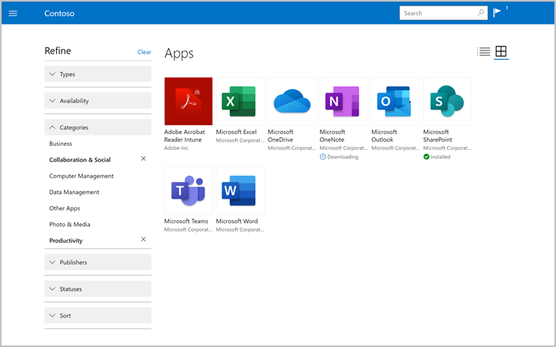

As these are designed for use in the Company Portal, not all Apps can have categories assigned to them, mainly Managed Google Play apps, everything else we'll have a crack at.

The original list of categories is a little limited, and might not fit your application estate.
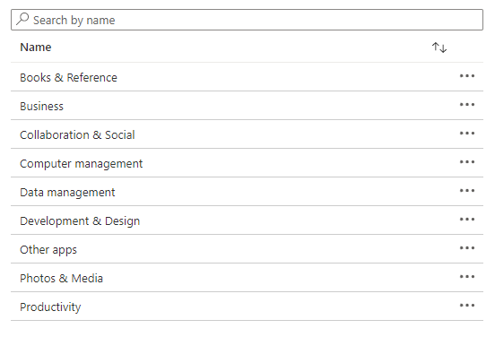

So we should do something about this.

### Creating App Categories

You could just create new app categories using Microsoft Intune, but I'm not sure that's as exciting as you think it is, so we'll do this the sensible way and script it. To do this, we will need a way to get the existing App Categories (so we don't create duplicates) and of course a way to create new ones.

~~As always, it's time for some authentication to [Graph API](https://docs.microsoft.com/en-us/graph/use-the-api) and using the trusted Authentication function we've used time and time before.~~


Connect to Graph using the latest module and `Connect-MgGraph -Scopes 'DeviceManagementConfiguration.ReadWrite.All'`.


### Getting App Categories

We'll be using the [GET /deviceAppManagement/mobileAppCategories](https://docs.microsoft.com/en-us/graph/api/resources/intune-apps-mobileappcategory?view=graph-rest-1.0) part of Graph for most of this, and the `List` option to get all existing categories using the function below.

```PowerShell
Function Get-AppCategory() {

    [cmdletbinding()]

    $graphApiVersion = "Beta"
    $Resource = "deviceAppManagement/mobileAppCategories"

    try {
        $uri = "https://graph.microsoft.com/$graphApiVersion/$($Resource)"
            (Invoke-MgGraphRequest -Uri $uri-Method Get).Value
    }
    catch {
        Write-Error $Error[0].ErrorDetails.Message
        break
    }
}
```

### Adding App Categories

Sticking with `mobileAppCategories` section of Graph and using the [POST /deviceAppManagement/mobileAppCategories](https://docs.microsoft.com/en-us/graph/api/resources/intune-apps-mobileappcategory?view=graph-rest-1.0) to create new App Categories, we can push new App Categories to Microsoft Intune and all we need is the below function and a name of the category.

```PowerShell
Function Add-AppCategory() {

    [cmdletbinding()]
    param
    (
        $Name
    )

    $graphApiVersion = "Beta"
    $Resource = "deviceAppManagement/mobileAppCategories"

    try {
        if ($Name -eq "" -or $null -eq $Name) {
            write-host "No name specified, please specify valid Name for the App Category..." -f Red
            break
        }
        else {
            $Output = New-Object -TypeName psobject
            $Output | Add-Member -MemberType NoteProperty -Name "@odata.type" -Value "#microsoft.graph.mobileAppCategory"
            $Output | Add-Member -MemberType NoteProperty "displayName" -Value $Name

            $JSON = $Output | ConvertTo-Json -Depth 3

            Test-JSON -JSON $JSON

            $uri = "https://graph.microsoft.com/$graphApiVersion/$($Resource)"
            Invoke-MgGraphRequest -Uri $uri-Method Post -Body $JSON -ContentType "application/json"
        }
    }
    catch {
        Write-Error $Error[0].ErrorDetails.Message
        break
    }
}
```

## Updating Mobile Apps

So we have a way to create new App Categories in Microsoft Intune, so we're a third of the way there, we now need a way to get Mobile Apps, get the App Categories assigned to the Mobile Apps, and then add new App Categories. This all seemed more straightforward when I first started this.

### Getting Mobile Apps

Oh we do love Graph here don't we...more use of Graph and in particular [GET /deviceAppManagement/mobileApps](https://docs.microsoft.com/en-us/graph/api/resources/intune-apps-mobileapp?view=graph-rest-1.0), we'll use this to get existing Mobile Apps, be warned though, this resource type will pull back all apps, whether Client Apps or Mobile Application Managed Apps, so we'll need to use some filtering further down the line.

```PowerShell
Function Get-MobileApps() {
    [cmdletbinding()]
    $graphApiVersion = 'Beta'
    $Resource = 'deviceAppManagement/mobileApps'
    try {
        $uri = "https://graph.microsoft.com/$graphApiVersion/$($Resource)"
            (Invoke-MgGraphRequest -Uri $uri-Method Get).Value
    }
    catch {
        Write-Error $Error[0].ErrorDetails.Message
        break
    }
}
```

### Getting Mobile App assigned App Categories

We will also need to get the App Categories assigned to each Mobile App, as I thought best we have an option to remove some categories as well as add them.

```PowerShell
Function Get-MobileAppsCategory() {
    [cmdletbinding()]
    param
    (
        $Id
    )
    $graphApiVersion = 'Beta'
    $Resource = "deviceAppManagement/mobileApps/$Id/categories"
    try {
        if ($Id -eq '' -or $null -eq $Id) {
            Write-Host 'No Id specified, please specify valid Id for the Mobile App...' -f Red
            break
        }
        else {
            $uri = "https://graph.microsoft.com/$graphApiVersion/$($Resource)"
            (Invoke-MgGraphRequest -Uri $uri-Method Get).Value
        }
    }
    catch {
        Write-Error $Error[0].ErrorDetails.Message
        break
    }
}
```

### App Categories for Mobile Apps

Not to hammer the point home, but you could go through each Mobile App and assign the new categories, and if you truly hate yourself, feel free to do this manually. However, we should continue on this scripting path and finish the job we started.

### Assigning App Categories

More functions to play with, this time one to assign App Categories to a Mobile App, nothing special here but we'll need to pass through the `$Id` of the Mobile App and the `$CategoryId` of the Category.

One little weird one here, need to through in a `$ref` at the end of the uri for the call to Graph, shout out to the [Intune Support Team on YouTube](https://www.youtube.com/watch?v=Wnp9qgwcgb8) for this bit of information.

```PowerShell {hl_lines=9}
Function Add-MobileAppCategory() {
    [cmdletbinding()]
    param
    (
        $Id,
        $CategoryId
    )
    $graphApiVersion = 'Beta'
    $Resource = "deviceAppManagement/mobileApps/$Id/categories/`$ref"
    try {
        if ($Id -eq '' -or $null -eq $Id) {
            Write-Host 'No Mobile App ID specified, please specify valid Id for the Mobile App ID...' -f Red
            break
        }
        elseif ($CategoryId -eq '' -or $null -eq $CategoryId) {
            Write-Host 'No App Category ID specified, please specify valid ID for the App Category...' -f Red
            break
        }
        else {
            $value = "https://graph.microsoft.com/$graphApiVersion/deviceAppManagement/mobileAppCategories/$CategoryId"
            $Output = New-Object -TypeName psobject
            $Output | Add-Member -MemberType NoteProperty -Name '@odata.id' -Value $value
            $JSON = $Output | ConvertTo-Json -Depth 3
            Test-JSON -JSON $JSON
            $uri = "https://graph.microsoft.com/$graphApiVersion/$($Resource)"
            Invoke-MgGraphRequest -Uri $uri-Method Post -Body $JSON -ContentType 'application/json'
        }
    }
    catch {
        Write-Error $Error[0].ErrorDetails.Message
        break
    }
}
```

### Removing Assigned App Categories

Last function for today, one to remove the App Category from a Mobile App...we'll use this one later on.

```PowerShell
Function Remove-MobileAppCategory() {
    [cmdletbinding()]
    param
    (
        $Id,
        $CategoryId
    )
    $graphApiVersion = 'Beta'
    $Resource = "deviceAppManagement/mobileApps/$Id/categories/$CategoryId/`$ref"
    try {
        if ($Id -eq '' -or $null -eq $Id) {
            Write-Host 'No Mobile App ID specified, please specify valid Id for the Mobile App ID...' -f Red
            break
        }
        elseif ($CategoryId -eq '' -or $null -eq $CategoryId) {
            Write-Host 'No App Category ID specified, please specify valid ID for the App Category...' -f Red
            break
        }
        else {
            $uri = "https://graph.microsoft.com/$graphApiVersion/$($Resource)"
            Invoke-MgGraphRequest -Uri $uri-Method Delete
        }
    }
    catch {
        Write-Error $Error[0].ErrorDetails.Message
        break
    }
}
```

## Repeatable Actions

The likelihood is that creation of App Categories is going to be a one-off task, but the assignment and removal of the categories might be a regular occurrence in your Microsoft Intune environment, so I thought we'd deal with four differing use cases:

- Creation of new App Categories: Upload a CSV file with the new categories in
- Creation of new App Categories and Assign the App Categories: still a CSV upload but follows on with assignment options
- Assign App Categories: plain assignment of categories to Mobile Apps
- Removal of Assign App Categories: Ronseal

### Options Everywhere

So we'll use a simple prompt and choice option in the script to set the `$setting` variable, and use this to denote what actions we take.

```PowerShell {hl_lines=[27, 30, 33, 36]}
Write-Host '********************************************************************************'
Write-Host '****    Welcome to the Microsoft Intune App Category and Assignment Tool    ****' -ForegroundColor Green
Write-Host '****    This Script will add new app categories and assign them             ****' -ForegroundColor Cyan
Write-Host '********************************************************************************'
Write-Host
Write-Host ' Please Choose one of the options below: ' -ForegroundColor Yellow
Write-Host
Write-Host ' (1) Upload a CSV of new App Categories...' -ForegroundColor Green
Write-Host
Write-Host ' (2) Upload a CSV of new App Categories and assign App Categories to Apps...' -ForegroundColor Green
Write-Host
Write-Host ' (3) Assign App Categories to Apps...' -ForegroundColor Green
Write-Host
Write-Host ' (4) Remove Assigned App Categories from Apps...' -ForegroundColor Green
Write-Host
Write-Host ' (E) EXIT SCRIPT ' -ForegroundColor Red
Write-Host
$Choice_Number = ''
$Choice_Number = Read-Host -Prompt 'Based on which option you want to run, please type 1, 2 or E to exit the script, then hit enter '
while ( !($Choice_Number -eq '1' -or $Choice_Number -eq '2' -or $Choice_Number -eq '3' -or $Choice_Number -eq '4' -or $Choice_Number -eq 'E')) {
    $Choice_Number = Read-Host -Prompt 'Invalid Option, Based on which option you want to run, please type 1, 2, 3, 4 or E to exit the test, then click enter '
}
if ($Choice_Number -eq 'E') {
    Break
}
if ($Choice_Number -eq '1') {
    $Setting = 'Upload'
}
if ($Choice_Number -eq '2') {
    $Setting = 'Upload/Assign'
}
if ($Choice_Number -eq '3') {
    $Setting = 'Assign'
}
if ($Choice_Number -eq '4') {
    $Setting = 'Remove'
}
```

### Handling the Options

Because we now have the variable to play with, we can use some wonderful if statements to deal with the options depending on what has been selected when running the script:

- Upload
- Assign
- Remove

The below goes into more detail on how each option is handled by the script.

### Upload

This section will prompt for a CSV file containing new App Categories, make sure you've got a heading of 'Name' in this file, otherwise things will be painful for you.

```csv
Name
Web Browsers
Media Players
Data Management
```

Once uploaded the script will check for existing App Categories of the same name, safely ignore any it finds, and create new ones.

```PowerShell
if ($Setting -like '*Upload*') {
    $CSVPath = Read-Host 'Please provide the path to the CSV file containing a list of App Categories e.g. C:\temp\appcategories.csv'
    if (!(Test-Path "$CSVPath")) {
        Write-Host "Import Path for CSV file doesn't exist" -ForegroundColor Red
        Write-Host "Script can't continue" -ForegroundColor Red
        Write-Host
        break
    }
    else {
        $AppCategories = Import-Csv -Path $CSVPath
    }
    $CurrentAppCategories = (Get-AppCategory).displayName
    foreach ($AppCategory in $AppCategories) {
        if ($AppCategory.Name -in $CurrentAppCategories) {
            Write-Host 'App Category '$AppCategory.Name' already exists...' -ForegroundColor Yellow
            Write-Host
        }
        else {
            Write-Host 'App Category will be created...' -ForegroundColor Yellow
            Write-Host
            try {
                Add-AppCategory -Name $AppCategory.Name | Out-Null
                Write-Host 'App Category '$AppCategory.Name' created...' -ForegroundColor Green
                Write-Host
            }
            catch {
                Write-Host 'App Category '$AppCategory.Name' not created...' -ForegroundColor Red
                Write-Host
            }
        }
    }
}
```

### Assign

Whether you have uploaded new App Categories, or just want to use the existing ones, now is the time to assign them to the Mobile Apps, so we need a way for you to select not only the Mobile Apps but also the App Categories you want to assign to them. We've done this wis a simple `Out-Gridview` and a variable.

```PowerShell
if ($Setting -like '*Assign*') {
    Write-Host 'When prompted, wait for all Mobile Apps to load, then select the App or Apps you want to assign a Category. Use The ENTER Key or Mouse \ OK Button.' -ForegroundColor Yellow
    Write-Host
    Start-Sleep -Seconds $sleep
    $MobileApps = @(Get-MobileApps | Where-Object { (!($_.'@odata.type').Contains('managed')) -and (!($_.'@odata.type').Contains('android')) } | Select-Object '@odata.type', displayName, publisher, id | Out-GridView -PassThru -Title 'Select Mobile Apps...')
    Write-Host 'Wait for all App Categories to load, then select the Category or Categories you want to assign to an Application. Use The ENTER Key or Mouse \ OK Button.' -ForegroundColor Yellow
    Write-Host
    Start-Sleep -Seconds $sleep
    $AddAppCategories = @(Get-AppCategory | Select-Object displayName, id | Out-GridView -PassThru -Title 'Select Apps Categories...')
    Write-Host 'Starting assignment of Categories to Mobile Apps' -ForegroundColor Yellow
    Write-Host
    Write-Warning 'Please confirm you are happy to continue assigning categories to applications' -WarningAction Inquire
    foreach ($MobileApp in $MobileApps) {
        $AssignedAppCategories = Get-MobileAppsCategory -Id $MobileApp.id
        foreach ($AddAppCategory in $AddAppCategories) {
            if ($AddAppCategory.displayName -in $AssignedAppCategories.displayName) {
                Write-Host ''$AddAppCategory.displayName' category already assigned to '$MobileApp.displayName'' -ForegroundColor Yellow
                Write-Host
            }
            else {
                Write-Host 'Adding '$AddAppCategory.displayName' category to '$MobileApp.displayName'...' -ForegroundColor Yellow
                try {
                    Add-MobileAppCategory -Id $MobileApp.id -CategoryId $AddAppCategory.id
                    Write-Host 'Added '$AddAppCategory.displayName' category to '$MobileApp.displayName'...' -ForegroundColor Green
                    Write-Host
                }
                catch {
                    Write-Host 'Unable to add '$AddAppCategory.displayName' category to '$MobileApp.displayName'...' -ForegroundColor Red
                    Write-Host
                }
            }
        }
    }
}
```

### Remove

This one is a bit blunt if I'm honest, it prompts you to select the Mobile App/s you want to remove App Categories from, and then removes all of them, bit brutal, but can you be bothered selecting 'OK' for each App Category you want removing? Didn't think so.

```PowerShell
if ($setting -eq 'Remove') {
    Write-Host 'When prompted, wait for all Mobile Apps to load, then select the App or Apps you want to remove categories from. Use The ENTER Key or Mouse \ OK Button.' -ForegroundColor Yellow
    Write-Host
    Start-Sleep -Seconds $sleep
    $MobileApps = @(Get-MobileApps | Where-Object { (!($_.'@odata.type').Contains('managed')) -and (!($_.'@odata.type').Contains('android')) } | Select-Object '@odata.type', displayName, publisher, id | Out-GridView -PassThru -Title 'Select Mobile Apps...')
    foreach ($MobileApp in $MobileApps) {
        $AssignedAppCategories = Get-MobileAppsCategory -Id $MobileApp.id
        If (!$AssignedAppCategories) {
            Write-Host 'App '$MobileApp.displayName' has no assigned App Categories...' -ForegroundColor Yellow
            Write-Host
        }
        Else {
            Write-Host 'The following App Categories for App '$MobileApp.displayName' will be removed...' -ForegroundColor Yellow
            $AssignedAppCategories.displayName
            Write-Host
            Start-Sleep -Seconds $sleep
            foreach ($AssignedAppCategory in $AssignedAppCategories) {
                Try {
                    Remove-MobileAppCategory -Id $MobileApp.id -CategoryId $AssignedAppCategory.id
                    Write-Host 'App Category '$AssignedAppCategory.displayName' removed from App '$MobileApp.displayName'' -ForegroundColor Green
                    Write-Host
                }
                Catch {
                    Write-Host 'Unable to remove App Category '$AssignedAppCategory.displayName' from App '$MobileApp.displayName'' -ForegroundColor Red
                    Write-Host
                }
            }
        }
    }
}
```

## Running the Script

As we've gone through all of this just to assign some App Categories, I guess now would be the time to provide a [link to the script](https://github.com/ennnbeee/oddsandendpoints-scripts/blob/main/Intune/Apps/AppCategories/Set-AppCategories.ps1), and show you what it does for each of the options.

### Creating New App Categories

Running the script and selecting **Option 1**:
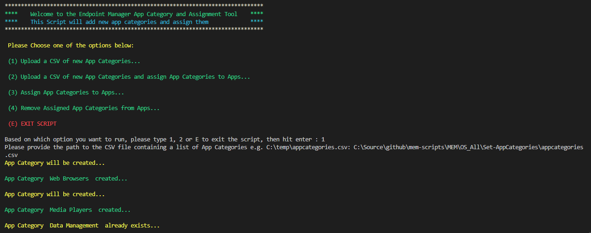

The new App Categories available:
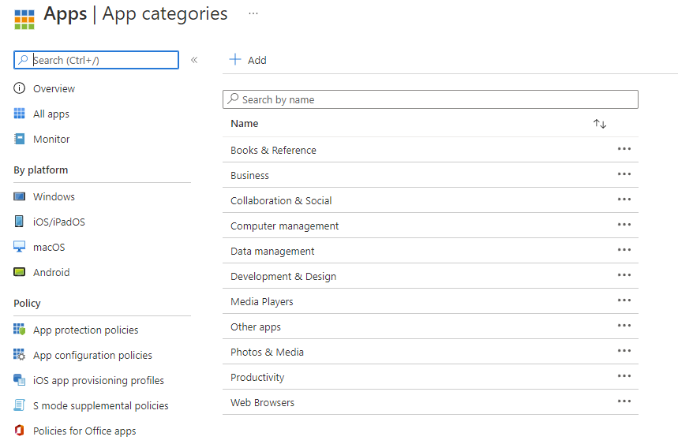

### Assigning the App Categories

Running the script and selecting **Option 3**:
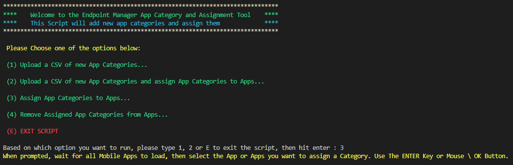

Selecting the Mobile Apps:
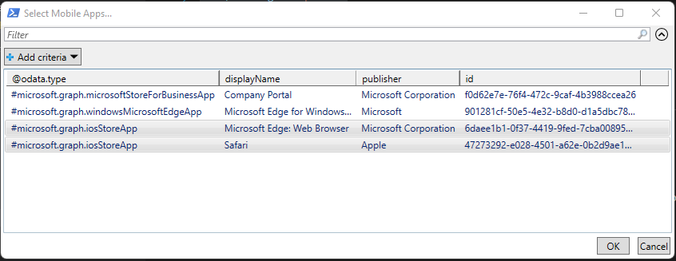

Selecting the App Categories:
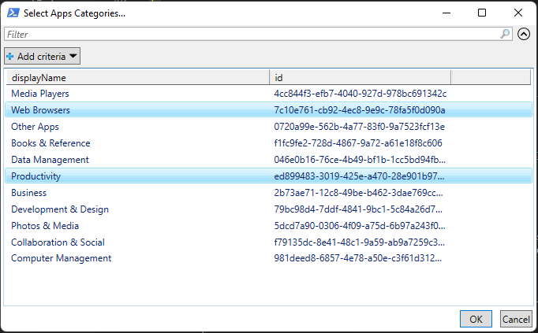

Confirming the assignment of the categories:
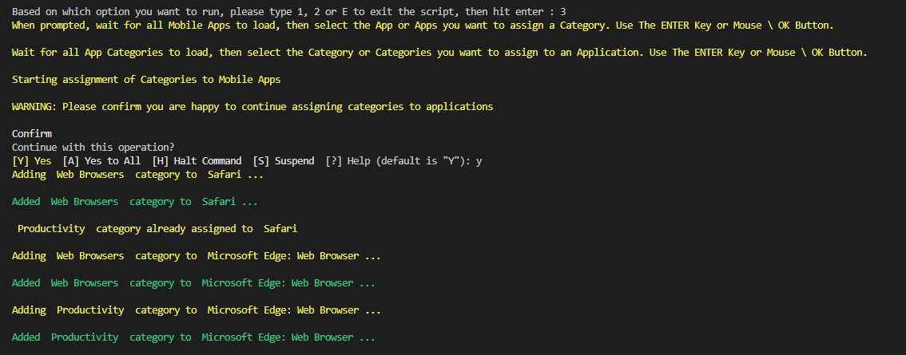

The new App Categories on the Edge Mobile App:
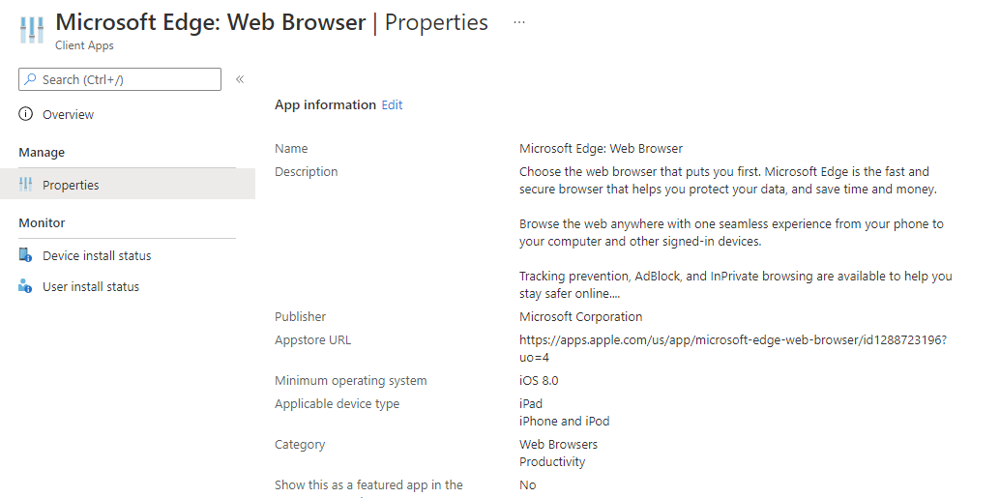

### Removing the Assigned App Categories

Running the script and selecting **Option 4**:
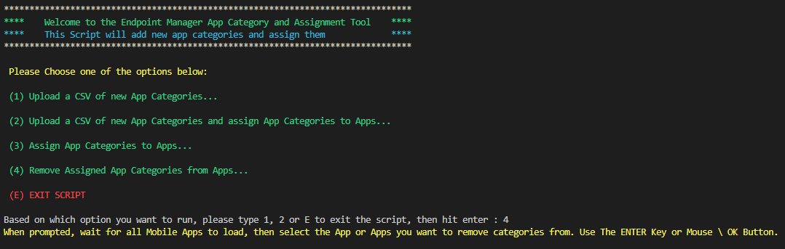

Selecting the Mobile Apps:
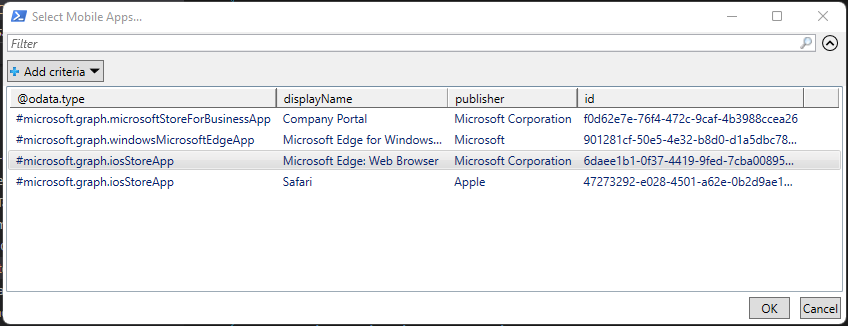

App Categories being removed:
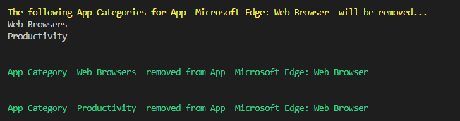

No more App Categories on the Edge Mobile App:
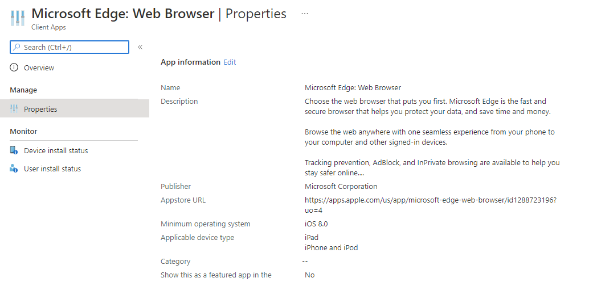

## Summary

I'm impressed that you've gotten to the bottom of this page, as there's way too many functions and screenshots to make the pay off worthwhile, however, what we do have here is a script that can be used regularly to update App Categories, assign them to Mobile Apps, and if you ever have a truly awful day, remove the categories from the apps.

All this to make an end-users life a bit easier in the Company Portal. I think I need to re-evaluate the time I spend writing scripts for user experience benefits.

