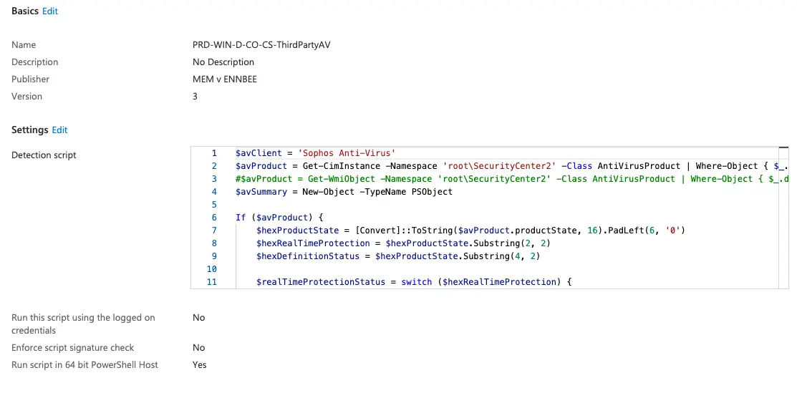
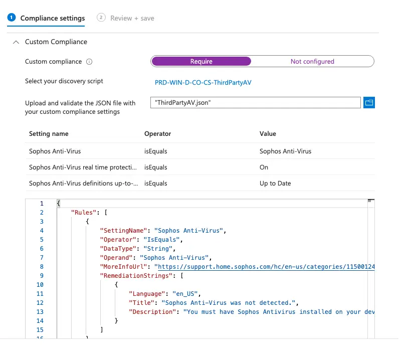
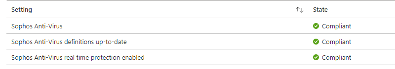
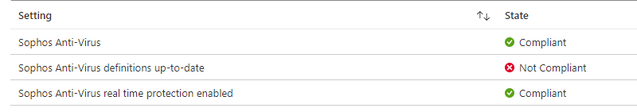
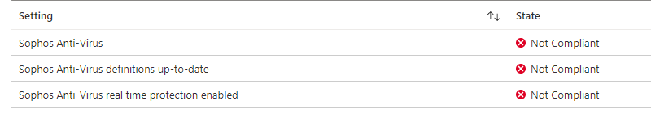

# Detailed Compliance for Non-Microsoft Antivirus Solutions


So what happens when you're not using Windows Defender on your Windows 10 and later Microsoft Intune enrolled devices, and you're not happy with the basic compliance checks for Third-Party Antivirus products?

Microsoft have come to the rescue with their [Custom Compliance Settings](https://docs.microsoft.com/en-us/mem/intune/protect/compliance-use-custom-settings), so let's utilise this detect and check policy, and leverage it to detect and report on Non-Microsoft Antivirus products, their real time protection status, as well as whether the definitions are up to date.

## Custom Compliance Policies

As Custom Compliance isn't that new a feature of Microsoft Intune, I'm not going to deep dive into the process, a number of other people have done that already:

- [Peter van der Woude](https://www.petervanderwoude.nl/post/working-with-custom-compliance-settings/)
- [Call4Cloud](https://call4cloud.nl/2021/11/the-last-days-of-custom-compliance/)
- [Device Advice](https://deviceadvice.io/2021/12/01/deploy-a-custom-compliance-policy-in-mem/)

We're going to focus on how to use it to achieve our goal, detecting additional information about third-party Antivirus solutions.

### PowerShell and WMI

We need a way to get information about the expected active Antivirus product, in this instance 'Sophos Antivirus', installed on device; to do this we can use the WMI Class `AntiVirusProduct` within the `root\SecurityCenter2` namespace using either:

```PowerShell
Get-WmiObject -Namespace "root\SecurityCenter2" -Class AntiVirusProduct
```

Or

```PowerShell
Get-CimInstance -Namespace "root\SecurityCenter2" -Class AntiVirusProduct
```

This will pull back details about the Antivirus software registered by Windows, as you can see from the below, it will pull back *all*  products registered, including Windows Defender.

```txt {hl_lines=[11,28]}
__GENUS                  : 2
__CLASS                  : AntiVirusProduct
__SUPERCLASS             :
__DYNASTY                : AntiVirusProduct
__RELPATH                : AntiVirusProduct.instanceGuid="{8E0623B8-CF1C-DFFE-CEA3-AA41BDA4B8EE}"
__PROPERTY_COUNT         : 6
__DERIVATION             : {}
__SERVER                 : LT01540
__NAMESPACE              : ROOT\SecurityCenter2
__PATH                   : \\COMPUTERNAME\ROOT\SecurityCenter2:AntiVirusProduct.instanceGuid="{8E0623B8-CF1C-DFFE-CEA3-AA41BDA4B8EE}"
displayName              : Sophos Anti-Virus
instanceGuid             : {8E0623B8-CF1C-DFFE-CEA3-AA41BDA4B8EE}
pathToSignedProductExe   : C:\Program Files (x86)\Sophos\Sophos Anti-Virus\WSCClient.exe
pathToSignedReportingExe : C:\Program Files (x86)\Sophos\Sophos Anti-Virus\WSCClient.exe
productState             : 331776
timestamp                : Tue, 16 Nov 2021 17:29:40 GMT

__GENUS                  : 2
__CLASS                  : AntiVirusProduct
__SUPERCLASS             :
__DYNASTY                : AntiVirusProduct
__RELPATH                : AntiVirusProduct.instanceGuid="{D68DDC3A-831F-4fae-9E44-DA132C1ACF46}"
__PROPERTY_COUNT         : 6
__DERIVATION             : {}
__SERVER                 :
__NAMESPACE              : ROOT\SecurityCenter2
__PATH                   : \\\ROOT\SecurityCenter2:AntiVirusProduct.instanceGuid="{D68DDC3A-831F-4fae-9E44-DA132C1ACF46}"
displayName              : Windows Defender
instanceGuid             : {D68DDC3A-831F-4fae-9E44-DA132C1ACF46}
pathToSignedProductExe   : windowsdefender://
pathToSignedReportingExe : %ProgramFiles%\Windows Defender\MsMpeng.exe
productState             : 393472
timestamp                : Thu, 16 Dec 2021 10:49:39 GMT
```

So we will need a way to filter only to the expected active Antivirus software installed.

### Antivirus Product State

With the information available about the Antivirus products, we need to be able to identify whether Real Time Protection is running, as well as whether the Definitions are up to date. I'd say luckily, but I'd be lying, we have the `productState` information to work with.

```txt {hl_lines=[1]}
productState             : 393472
```

This hex value does translate into something we can use to identify the definition and protection status checks, and thanks to [Marc Schneider](https://github.com/appgate/sdp-win-security-center/blob/master/avinspect.ps1) we can actually understand this number and how to use it as part of a Custom Compliance policy.

The six-digit value for 'productState' can be broken down into three pairs of two-digits, with each actually meaning something once converted to a hex string:

- 1st Pair: Product Type
- 2nd Pair: Real Time Protection Status
- 3rd Pair: Definition Status


The 2nd and 3rd pair may report differently depending on your Antivirus product, as detailed in [this post](https://social.msdn.microsoft.com/Forums/en-US/6501b87e-dda4-4838-93c3-244daa355d7c/wmisecuritycenter2-productstate?forum=vblanguage), so you will have to check this on a device with up-to-date definitions as well as real time protection enabled to be sure.


The values for each of these pairs for Sophos Antivirus can be seen below:

| Item | Value | Description |
| :- | :- | :- |
| Real Time Protection Status | `00` | Off |
|  | `01` | Expired |
|  | `10` | On |
|  | `11` | Snoozed |
| Definition Status | `00` | Up to Date |
|  | `10` | Out of Date |

So we now have a way to identify and confirm that both Real Time protection is enabled, and Definitions are in place for the Antivirus product of choosing.

### Detection Script Creation

With a couple of variables, some hex conversion, switches, and a little bit of logic, we can get the information we need and throw it into the JSON format required by [Microsoft](https://docs.microsoft.com/en-us/mem/intune/protect/compliance-custom-script) to allow the Custom Compliance script to work as expected.

We've used the `$AVClient` variable, which will allow re-use of the script depending on which product is installed across your device estate.

We also have to be able to capture and present back when the script doesn't detect the specified `$AVClient` variable, otherwise we'll get some grim looking compliance errors on those devices.


These commands and scripts have now been updated to use `Get-CimInstance` due to Microsoft [deprecating WMIC](https://techcommunity.microsoft.com/blog/windows-itpro-blog/wmi-command-line-wmic-utility-deprecation-next-steps/4039242) commands.




Running this script on a machine with the Antivirus product installed would be a good idea to test that the scripts works, and is outputting the correct information in the required format for Intune to translate.

The uncompressed output from the script should look a little bit like the below:

```JSON
{
    "Sophos Anti-Virus": "Sophos Anti-Virus",
    "Sophos Anti-Virus real time protection enabled": "On",
    "Sophos Anti-Virus definitions up-to-date": "Up to Date"
}
```

With the compressed version looking like this:

```JSON
{"Sophos Anti-Virus":"Sophos Anti-Virus","Sophos Anti-Virus real time protection enabled":"On","Sophos Anti-Virus definitions up-to-date":"Up to Date"}
```

### JSON Checks

As we've seen in the JSON check requirements from [Microsoft](https://docs.microsoft.com/en-us/mem/intune/protect/compliance-custom-json), we now need to build out a JSON file using the template as a starter, making sure that our JSON output from the script can be translated into something the Custom Compliance Policy can use.

Below is the updated JSON content we can use for the check, I've kept this quite light touch if I'm honest, and not specific to the Antivirus product, again so this can be re-used without changing a million things.

You will need to change the `Operand` for the first Rule to match the Antivirus product name you have installed, and if you want to, feel free to update the following fields to your taste:

- `MoreInfoUrl`
- `Title`
- `Description`


Updated to include improved presentation to the end user of the issues as displayed in the Company Portal.




## Deploying Custom Compliance

We've now got both a PowerShell script and JSON file, so the last steps are to throw these into Microsoft Intune.

First off we need to add the PowerShell script in the [Compliance Scripts](https://endpoint.microsoft.com/#view/Microsoft_Intune_DeviceSettings/DevicesComplianceMenu/~/customComplianceScripts) section.



Following this, we can now create our Custom Compliance policy for Windows; select the previously created PowerShell script, and we'll need to upload the JSON file created earlier.



Once we've got this in place, we can now assign the Compliance Policy.

### Checking Compliance State

With the Custom Compliance policy deployed, and waiting a little while for devices to start reporting back, we can check on the status of the devices it has been assigned to.

We have some good devices:



Some not so good:



Some truly problematic:



With this Compliance Policy now in place, we not only get a view of the device estate, but can integrate Compliance into [Conditional Access Policies](https://docs.microsoft.com/en-us/mem/intune/protect/create-conditional-access-intune), so it's not a bad situation to be in at all.

## Summary

Custom Compliance does seem like a bit of an effort, and it currently has minimal operators for the JSON check, an inability to add more than one PowerShell script to a single policy, an eight hour wait for the Compliance state to update after remediation, and a [few other limitations](https://docs.microsoft.com/en-us/mem/intune/protect/compliance-use-custom-settings#troubleshooting), but for those organisations that aren't fully in bed with Microsoft when it comes down to endpoint protection products, it does offer a way to extend compliance to these solutions.

