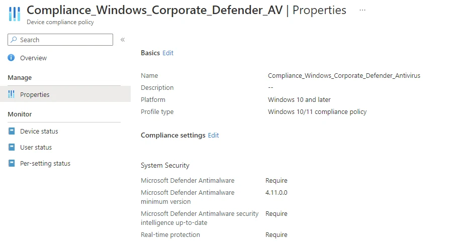
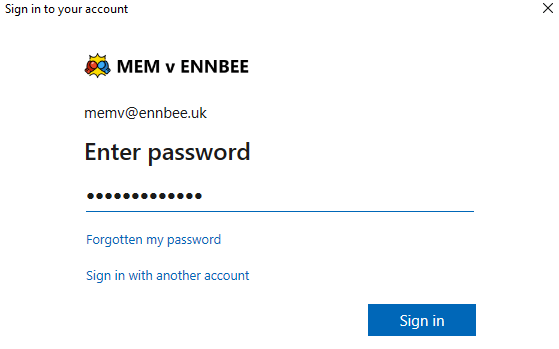
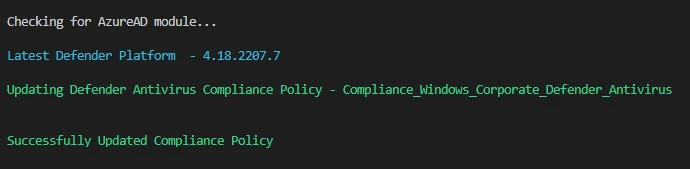
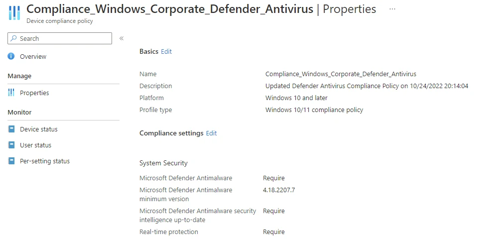

# Updating Defender Antivirus Compliance Settings


So one of those rainy days is here, finally, and as I mentioned in a  many months ago, I said I'd look at ways to update other update based compliance policies periodically.

That time is now, and although we're not focussing on other Operating Systems, we're going to have a look at updating a Microsoft Defender compliance policy with the latest platform update version.

Exciting I know.

## Compliance Policy Updates

To reiterate from the previous post, and to hammer the point home, you **should** be updating these types of policies on a regular basis. When you update a Compliance Policy, it will trigger the devices the policy is assigned to, to re-evaluate the conditions and follow the actions for non-compliance if necessary.

For the Defender settings, the one we're wanting to update is [Microsoft Defender Antimalware minimum version](https://learn.microsoft.com/en-us/mem/intune/protect/compliance-policy-create-windows#defender), which if left blank will accept any version of the service, but we should be requiring an up to date version here, you know, for security.

### Existing Functions

As we have looked at this topic previously, we're going to re-use some of the existing functions in this script that we created previously:

- 
- 
- 

We will also need to create a new one, to retrieve the latest Microsoft Defender Update using the [Microsoft Feed Picker](https://support.microsoft.com/en-us/rss-feed-picker) for Microsoft Defender Updates.

## Getting Latest Platform Update Version

So the [feed](https://support.microsoft.com/en-us/feed/atom/5d4715e7-a9c9-378e-3f83-fd410db4ef0a) we'll be using, doesn't actually contain the platform update version, unlike the Windows Operating System feeds which put the information we needed on a plate, this time we need to work a little.

We can at least use our previous attempts at capturing the RSS data, but this time, instead of grabbing the data from the feed itself and working with it, we need to grab the link that exists in the feed, grab the data from that page in order to get the version information we need to update the Compliance Policy.

We can capture the link we need and associate with the variable `$DefenderUpdateUri`, and using a bit of magic, we can scrape the data from this link, and capture only the information we need, in this instance it's the 'New version' section of the page:

```PowerShell
$uri = 'https://support.microsoft.com/en-us/feed/atom/5d4715e7-a9c9-378e-3f83-fd410db4ef0a'
[xml]$Updates = (Invoke-WebRequest -Uri $uri -UseBasicParsing -ContentType 'application/xml').Content -replace '[^\x09\x0A\x0D\x20-\xD7FF\xE000-\xFFFD\x10000-x10FFFF]', ''
$DefenderUpdateUri = @()
foreach ($Update in $Updates.feed.entry) {
    if ($Update.title.'#text' -like '*platform*') {
        $DefenderUpdateUri += $Update.link.href
    }
}

$DefenderPlatformUpdate = Invoke-WebRequest -Uri $($DefenderUpdateUri[0])
$DefenderPlatformVersion = (($DefenderPlatformUpdate.Content).tostring() -split "[`r`n]" | Select-String 'New version:') -replace '[^0-9.]'
```


Yes I know this is rough af, yes I know I am relying on the data existing on the page, yes I know that splitting out raw content into separate lines, selecting string data containing the information I want and stripping away everything but the numbers and periods is absolutely awful, this was a quick script OK, I'll give myself a dead leg as penance.


### A New Function is Born

So with this absolute atrocity of a method of getting the platform update version, we should wrap it all nicely into a function so we can call it in the script.

```PowerShell
Function Get-LatestDefenderPlatformUpdate() {

    try {
        $uri = 'https://support.microsoft.com/en-us/feed/atom/5d4715e7-a9c9-378e-3f83-fd410db4ef0a'
        [xml]$Updates = (Invoke-WebRequest -Uri $uri -UseBasicParsing -ContentType 'application/xml').Content -replace '[^\x09\x0A\x0D\x20-\xD7FF\xE000-\xFFFD\x10000-x10FFFF]', ''
        $DefenderUpdateUri = @()
        foreach ($Update in $Updates.feed.entry) {
            if ($Update.title.'#text' -like '*platform*') {
                $DefenderUpdateUri += $Update.link.href
            }
        }

        $DefenderPlatformUpdate = Invoke-WebRequest -Uri $($DefenderUpdateUri[0])
        $DefenderPlatformVersion = (($DefenderPlatformUpdate.Content).tostring() -split "[`r`n]" | Select-String 'New version:') -replace '[^0-9.]'
        Write-Host
        Write-Host "Latest Defender Platform  - $DefenderPlatformVersion" -ForegroundColor Cyan
        $DefenderPlatformVersion
    }
    catch {
        Write-Error $Error[0].ErrorDetails.Message
        break
    }
}
```

## Updating Compliance Policies

So with all the functions we need, we can attack the script that will actually update the Compliance Policy. As we've done something similar previously, I don't need to use my brain too much to hack around with the existing [script](https://github.com/ennnbeee/oddsandendpoints-scripts/blob/main/Intune/Compliance/WindowsOSCompliance/Set-WindowsOSCompliance.ps1), but there are some key areas to focus on...

### Getting the Defender Policy

We need to make sure we're grabbing the Defender policies for Windows devices so a little bit of a filter here. We're using the `@odata.type` and the `defenderEnabled` data here.

```PowerShell
$DefenderCompliancePolicies = Get-DeviceCompliancePolicy | Where-Object { ($_.'@odata.type').contains('windows10CompliancePolicy') -and ($_.defenderEnabled) -ne '' }
```

### Building the JSON Content

We need to build the JSON content to update the Compliance Policy with, based on the existing data and the new Microsoft Defender Platform version. We also can use a bit of logic to see if the current version in the Compliance Policy is less than the new one, so we're not needlessly updating the policy.

```PowerShell
$Date = Get-Date
$Description = "Updated Defender Antivirus Compliance Policy on $Date"
$DefenderPlatformVersion = Get-LatestDefenderPlatformUpdate

$Update = New-Object -TypeName psobject
$Update | Add-Member -MemberType NoteProperty -Name '@odata.type' -Value '#microsoft.graph.windows10CompliancePolicy'
$Update | Add-Member -MemberType NoteProperty -Name 'description' -Value $Description

foreach ($DefenderCompliancePolicy in $DefenderCompliancePolicies) {
    if ($DefenderCompliancePolicy.defenderVersion -lt $DefenderPlatformVersion) {
        Write-Host
        Write-Host "Updating Defender Antivirus Compliance Policy - $($DefenderCompliancePolicy.displayname)" -ForegroundColor Green

        $Update | Add-Member -MemberType NoteProperty -Name 'defenderVersion' -Value $DefenderPlatformVersion

        # Creating JSON object to pass to Graph
        $JSON = $Update | ConvertTo-Json -Depth 3

        # Updating the compliance policy
        Update-DeviceCompliancePolicy -Id $DefenderCompliancePolicy.id -JSON $JSON
    }
    else {
        Write-host "Defender Antivirus Compliance Policy - $($DefenderCompliancePolicy.displayname) already up to date" -ForegroundColor Cyan
    }
}
```

### Running the Script

First off let's look at the existing out-of-date Defender Compliance Policy, yup, that's an old version of the platform:



We should run the script, and make use of the hour it took to write it:

```PowerShell
.\Set-DefenderCompliance.ps1
```

Running the script will prompt you to provide a username and connect to Graph, please do what it says and login:



Then it does it's job:



Checking the policy to see if it updated:



And it did, I'm as surprised as you are tbh.

## Summary

The whole [script](https://github.com/ennnbeee/oddsandendpoints-scripts/blob/main/Intune/Compliance/DefenderCompliance/Set-DefenderCompliance.ps1) is pretty shoddy even for the minimal effort it took, but it is functional (as of today), that's the main thing.

The things you do when customers ask you about automating the recommendations you present to them eh?

