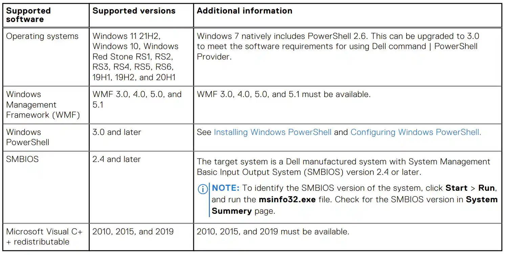
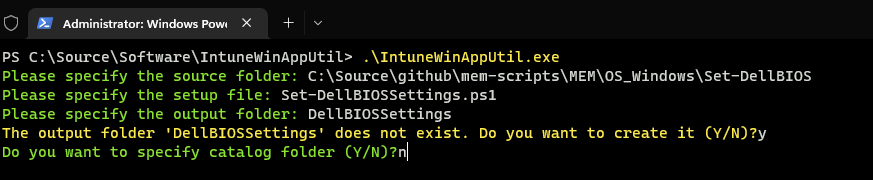
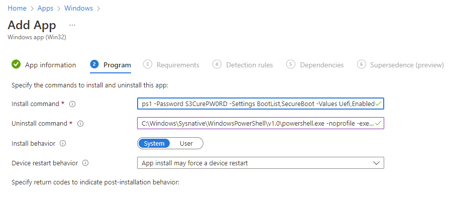
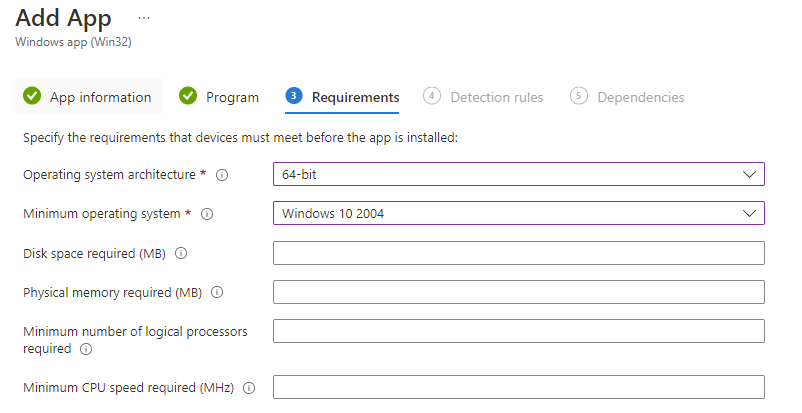
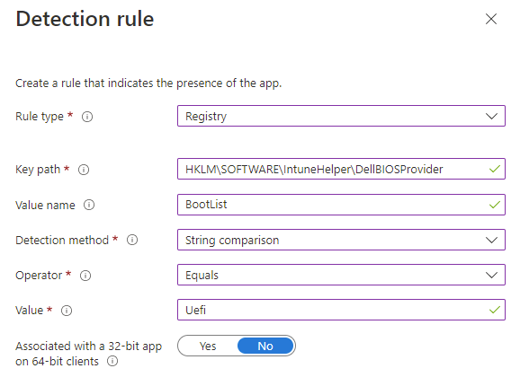
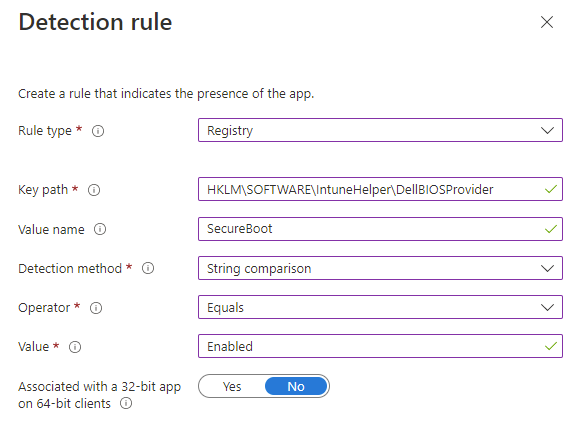
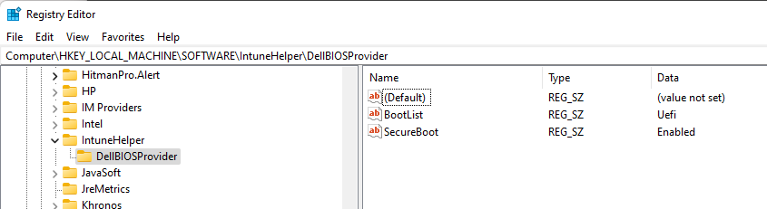

# Configuring Dell BIOS Settings with Microsoft Intune


What if you've only got Microsoft Intune to configure your Dell BIOS settings and not the glory that is Configuration Manager? How much do you like PowerShell, Win32 Apps and passwords in plain text?

Well you're in luck, I've thrown together something that can help you out based on a need to ensure that Secure Boot is configured for Dell laptops when it was discovered via the [Windows health attestation report](https://docs.microsoft.com/en-us/windows-server/security/device-health-attestation) that around 80% of the Windows devices had it turned off.

(Don't worry, I checked that the devices had [GPT partitions](https://www.dell.com/support/kbdoc/en-uk/000133480/uefi-and-secure-boot-faqs) before I just launched a PowerShell script at them.)

## Dell PowerShell Provider

There are several posts kicking around the internet about using Microsoft Intune to not only change or set Dell BIOS passwords, but also using CSV files to configure BIOS settings using the [Dell Command | PowerShell Provider](https://www.dell.com/support/kbdoc/en-uk/000177240/dell-command-powershell-provider), the below are the ones I've found and borrowed from:

- [systanddeploy.com](https://www.systanddeploy.com/2019/10/set-dell-bios-settings-through-intune.html)
- [ccmexec.com](https://ccmexec.com/2019/09/configuring-dell-bios-settings-using-intune-win32app-and-powershell/)
- [configjon.com](https://www.configjon.com/working-with-the-dell-command-powershell-provider/)

These posts detail ways to use the Dell PowerShell Provider to set the BIOS configurations and an Admin BIOS Password on Dell devices, so I'm only going to focus on how I've taken this, run with it, and made it a little easier to handle in Microsoft Intune.

### Setting up the Module

As we're going to be packaging up the PowerShell script as a Win32App, we'll need to ensure that not only is the script available, but also the PowerShell module (and some rogue .dll files too for some reason).

From an elevated PowerShell window run the below command to save the PowerShell module to a new folder:

```PowerShell
Save-Module -Name DellBIOSProvider -Path C:\Temp\Set-DellBIOS\
```

The version at the time of writing of this module is 2.6.0, which has a reliance on some of the .dll files installed from the Visual C++ Re-distributables:



You can just copy the below required files from a machine with the Visual C++ Redistributables already installed and paste them in the `DellBiosProvider\2.6.0` folder we created saving the PowerShell module, this sounds better than packaging and pushing out more software:

- msvcp100.dll
- msvcr100.dll
- msvcp140.dll
- vcruntime140.dll
- vcruntime140_1.dll

### Installing the Module

This is the bit where we use some of that there logic to check if the module is already installed on a machine, and if so, to bin it off and use the version packaged in the Win32App, then import the module.

```PowerShell
$ScriptPath = (Get-Location).Path

if (Test-Path -Path "$env:ProgramFiles\WindowsPowerShell\Modules\DellBIOSProvider") {
    Write-Output "DellBIOSProvider folder already exists @ $env:ProgramFiles\WindowsPowerShell\Modules\DellBIOSProvider."
    Write-Output "Deleting the folder..."
    Remove-Item -Path "$env:ProgramFiles\WindowsPowerShell\Modules\DellBIOSProvider" -Recurse -Force
}

Write-Output "Copying DellBIOSProvider module to: $env:ProgramFiles\WindowsPowerShell\Modules\DellBIOSProvider"
Copy-Item -Path "$ScriptPath\DellBIOSProvider\" -Destination "$env:ProgramFiles\WindowsPowerShell\Modules\" -Recurse -Force

try {
    Import-Module "DellBIOSProvider" -Force -Verbose -ErrorAction Stop
    Write-Output "Importing the Dell BIOS Provider module"
}
catch {
    Write-Output "Error importing module: $_"
    exit 1
}
```

## Configuring the BIOS

With the module installed, we'd better take a look on a test device what the BIOS settings and values actually are, so after importing the module run the below command to get all the BIOS setting details:

```PowerShell
Get-ChildItem -path DellSmbios:\ | ForEach-Object {
    Get-ChildItem -path @("DellSmbios:\" + $_.Category)  | select-object attribute, currentvalue, possiblevalues, PSChildName
} Format-List
```

This will dump all the existing BIOS settings, and importantly their supported values, such as:

```PowerShell
Attribute      : BootList
CurrentValue   : LEGACY
PossibleValues : {Legacy, Uefi}
PSChildName    : BootSequence

Attribute      : SecureBoot
CurrentValue   : Disabled
PossibleValues : {Disabled, Enabled}
PSChildName    : SecureBoot
```

So now we know what Setting and their support Values are...

### BIOS Settings

Other scripts use a CSV file that contain the BIOS settings you wish to configure, but this is a little clunky as you'd need to update and package the Win32App each time, so let's use PowerShell array variables to get these settings:

```PowerShell
[Parameter(Mandatory=$true,Position=2)][string[]]$Settings=@(),
[Parameter(Mandatory=$true,Position=3)][string[]]$Values=@()

```

Now that we have these parameters, we can pass through both the setting and the value to the script:

```PowerShell
./Set-BIOSSettings.ps1 -Settings BootList,SecureBoot -Values Uefi,Enabled
```

With these arrays in place, we need to squish them together into a new array in order to query them later in the script:

```PowerShell
[int]$max = $Settings.count
$NewBIOSSettings = for ($i = 0; $i -lt $max; $i++) {
    [PSCustomObject]@{
        Setting = $Settings[$i]
        Value = $Values[$i]
    }
}
```

We end up with a `$NewBIOSSettings` array variable containing the settings and their values:

```PowerShell
Setting    Value
-------    -----
BootList   Uefi
SecureBoot Enabled
```

### Making the Changes

Now we have the settings and values, as well as the PowerShell module, we can loop through each setting and apply it to the device. We've got a couple of options here, whether the device has a BIOS Admin Password set or otherwise.

```PowerShell
$AdminPassSet = (Get-Item -Path DellSmbios:\Security\IsAdminPasswordSet).CurrentValue
$BIOSSettings = get-childitem -path DellSmbios:\ | ForEach-Object {
    get-childitem -path @("DellSmbios:\" + $_.Category)  | select-object attribute, currentvalue, possiblevalues, PSChildName
}

foreach ($NewBIOSSetting in $NewBIOSSettings) {
    $NewItemSetting = $NewBIOSSetting.Setting
    $NewItemValue = $NewBIOSSetting.Value

    Write-Output "Changing: $NewItemSetting > $NewItemValue"

    foreach ($BIOSSetting in $BIOSSettings | Where-Object { $_.attribute -eq $NewItemSetting }) {
        $SettingAttribute = $BIOSSetting.attribute
        $SettingCategory = $BIOSSetting.PSChildName

        If (($AdminPassSet -eq $true)) {
            Try {
                Set-Item -Path Dellsmbios:\$SettingCategory\$SettingAttribute -Value $NewItemValue -Password $Password
                Write-Output "New value for $SettingAttribute is $NewItemValue"
                New-ItemProperty -Path "$DetectionRegPath" -Name "$SettingAttribute" -Value "$NewItemValue"  -Force | Out-Null
            }
            Catch {
                Write-Output "Cannot change setting $SettingAttribute (Return code $_)"
            }
        }
        Else {
            Try {
                Set-Item -Path Dellsmbios:\$SettingCategory\$SettingAttribute -Value $NewItemValue
                Write-Output "New value for $SettingAttribute is $NewItemValue"
                New-ItemProperty -Path "$DetectionRegPath" -Name "$SettingAttribute" -Value "$NewItemValue"  -Force | Out-Null
            }
            Catch {
                Write-Output"Cannot change setting $Attribute (Return code $_)"
            }
        }
    }
}
```

## App Deployment

### Detection Methods

We could do with a method to detect whether they have been set successfully. We can use the detection method functionality of the Win32App, and in particular the registry detection method, so using the script we can set registry values using PowerShell and query them from Microsoft Intune.

We will create a new Registry Key, and then for each BIOS setting we configure, can create new registry values with the name of the setting and the value they have been configured to, i.e. 'SecureBoot' and 'Enabled'.

```PowerShell
$DetectionRegPath = "HKLM:\SOFTWARE\IntuneHelper\DellBIOSProvider"

New-ItemProperty -Path "$DetectionRegPath" -Name "$SettingAttribute" -Value "$NewItemValue" -Force | Out-Null
```

### App Packaging

Now that we have the whole script, which you can [download](https://github.com/ennnbeee/oddsandendpoints-scripts/blob/main/Intune/Apps/DellBIOS/Set-DellBIOSSettings.ps1) along with the PowerShell Module and dll files (if you cba to do it yourself), we need to wrap this content up using the [Microsoft Win32 Content Prep Tool](https://docs.microsoft.com/en-us/mem/intune/apps/apps-win32-prepare).

Download the [tool](https://github.com/Microsoft/Microsoft-Win32-Content-Prep-Tool) and dump it somewhere useful on your machine, launch a Command Prompt and in four simple steps you'll have a Win32App ready for Microsoft Intune:

From the path of where the tool exists, run the tool specifying the:

- Source Folder
- PowerShell script (including extension)
- Output folder
- Whether you want to create a catalog (you don't)



Now that you've got the Application, time to upload it to Microsoft Intune and configure some settings.

### App Installation

Navigate to the [Windows Apps](https://endpoint.microsoft.com/#blade/Microsoft_Intune_DeviceSettings/AppsWindowsMenu/windowsApps) section of Microsoft Intune and time to create a new app, making sure you select 'Windows app (Win32)' as the App type.

After uploading the `.intunewin` file make sure to use `sysnative` in the path of the install command, we also need to pass through the variables for the `Settings` and `Values` as well as `Password` for the BIOS Admin password:

```PowerShell
C:\Windows\Sysnative\WindowsPowerShell\v1.0\powershell.exe -noprofile -executionpolicy Bypass -file .\Set-DellBIOSSettings.ps1 -Password S3CurePW0RD -Settings BootList,SecureBoot -Values Uefi,Enabled
```

Now I know what you're saying, "Eurrggh password is in plain text, bad, not secure, naughty", well you're not wrong, but then you really should be using Role-Based Access Control to protect your Microsoft Intune environment, and allowing only privileged users to access it, so maybe it's you that's got the issue this time.

*Also, I didn't write an uninstall script, so just use the same command line for this, unless you fancy writing something yourself.*



### App Requirements

Make sure you select the correct architecture for your deployment, this time it's x64 as well as the Minimum Operating System based on the Dell BIOS Provider requirements or your own device estate settings.



### App Detection Methods

As we've taken all that time to create something to use for a detection method in the PowerShell script itself, we should probably reference it here.

Now these detections are going to be based on what Settings and Values you're configuring, for this instance it's `BootList` and `SecureBoot`, so let's query them using the below settings:

- BootList
  - Key path: `HKLM\SOFTWARE\IntuneHelper\DellBIOSProvider`
  - Value name: `BootList`
  - Detection method: `String comparison`
  - Operator: `Equals`
  - Value: `Uefi`



- SecureBoot
  - Key path: `HKLM\SOFTWARE\IntuneHelper\DellBIOSProvider`
  - Value name: `SecureBoot`
  - Detection method: `String comparison`
  - Operator: `Equals`
  - Value: `Enabled`



Complete the wizard as no other settings are required and deploy this App to a **test** device group.

### App Monitoring

We were kind enough to add some basic logging using the Transcript function of PowerShell into the script, so on your test device, go have a look at the log located in `C:\Windows\Temp` called `Set-DellBIOSSettings.log` and check to see if it's run correctly

### Log File


It did.

### Registry Items

Let's check the registry and make sure it's added in the correct values:



Yup.

### PowerShell

We can run the same command as we did at the start of this journey to confirm that our settings have applied:

```PowerShell
Get-ChildItem -path DellSmbios:\ | ForEach-Object {
    Get-ChildItem -path @("DellSmbios:\" + $_.Category)  | select-object attribute, currentvalue, possiblevalues, PSChildName
} Format-List

Attribute      : BootList
CurrentValue   : UEFI BOOT
PossibleValues : {Legacy, Uefi}
PSChildName    : BootSequence

Attribute      : SecureBoot
CurrentValue   : Enabled
PossibleValues : {Disabled, Enabled}
PSChildName    : SecureBoot
```

They did.

## Summary

With some confidence, you can now push out this App with your preferred settings to a wider device group, and the benefit is that the App itself is reusable; you just need to specify which settings are to be configured in the Installation command line, and how to detect them in the Detection Method.

There may be cleaner ways of doing this, probably using [Proactive remediations](https://docs.microsoft.com/en-us/mem/analytics/proactive-remediations), but then again, that requires Windows 10/11 Enterprise licensing, and we all haven't got enterprise level money.

