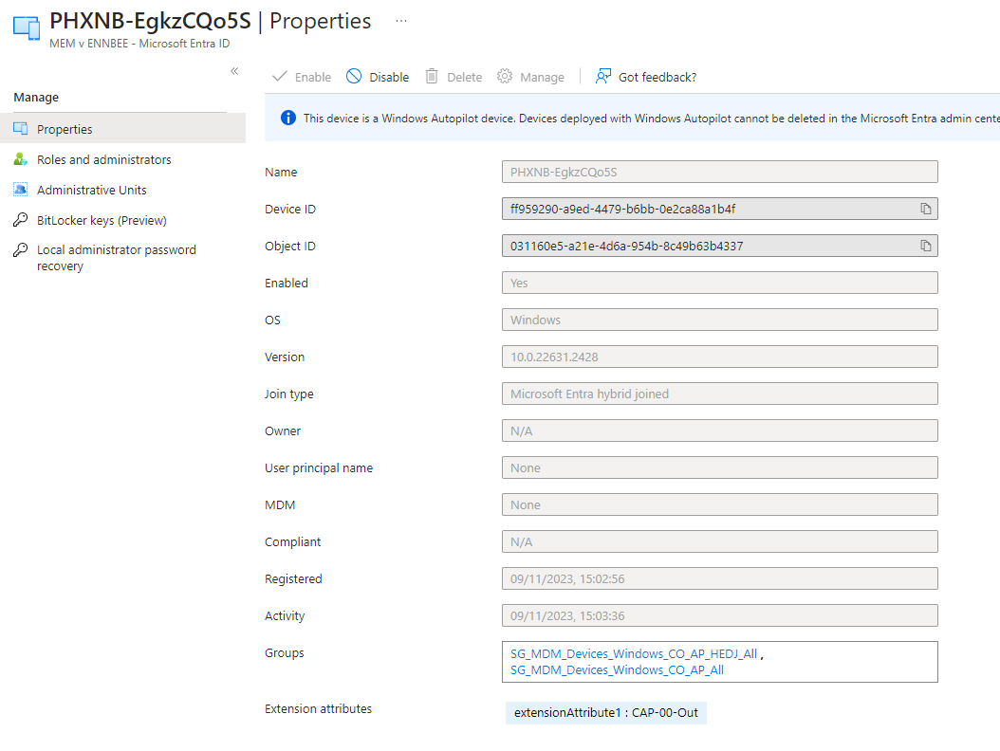

# Using Entra ID Device Attributes for Conditional Access Exceptions


Imagine you've spent time getting your Windows devices enrolled into Intune, they're all getting [Device Compliance](https://learn.microsoft.com/en-us/mem/intune/protect/device-compliance-get-started) policies, and you've finally pulled the trigger on your shiny new [Conditional Access Policy](https://learn.microsoft.com/en-us/mem/intune/protect/conditional-access) that require device compliance for all your users across Windows devices, and low and behold, you've broken access to Microsoft 365 authenticated services from your Remote Desktop service environment, or even VDI environments.

So what next? Use the [trusted location exemption](https://learn.microsoft.com/en-us/entra/identity/conditional-access/location-condition) in your policy for the virtual environment? What happens if the public facing address range is the same as your workstation environments or that you'd rather not blow a massive hole in security by allowing an entire IP address range free access to Microsoft 365 authenticated services? That's not very [Zero Trust](https://www.microsoft.com/en-gb/security/business/zero-trust#:~:text=What%20is%20Zero%20Trust%3F,originates%20from%20an%20open%20network.) of you is it.

## Filtering Devices

Luckily within the the Conditional Access Policy configuration, there is a way to [filter devices](https://learn.microsoft.com/en-us/entra/identity/conditional-access/concept-condition-filters-for-devices) based on the device object registered with Entra ID, there are some useful native [device attributes](https://learn.microsoft.com/en-us/entra/identity/conditional-access/concept-condition-filters-for-devices#supported-operators-and-device-properties-for-filters) that can be used as long as your devices have registered in Entra ID (think Hybrid Entra Joined for this VDI environment).

What happens when you can't find a suitable attribute to use that excludes your virtual environment, but still includes your end user computer workstations? The answer here are the attributes `extensionAttribute1-15`, which are attributes attached only to the Entra ID device object, and not synchronised, and require specific permissions to set using Graph. These seem like a good way to go.

### Getting Attributes

For us to understand how these attributes can be updated or added, we'd probably best take a look at how we see the attributes in the first place. Let's start with a device in Entra ID, we can see from the below where these attributes should be:


Currently this device has no attributes assigned, shock. We'll need the `Object ID` in a second, so may as well grab it now.

What about using Graph? We can pull back these attributes by querying the device itself, using a `GET` to `https://graph.microsoft.com/beta/devices/{objectId}/`, so for this device the call is `https://graph.microsoft.com/beta/devices/492a52d0-ec1a-40ed-8ea5-79f27aa0f8bf/`.


Yup still no attributes.

### Adding Attributes

Now that we can see where these attributes reside on the device object in Entra ID, if we're going to be using them as a filtering option in our Conditional Access Policy, we should probably have a look at how we update them.

Pretty straight forward, as it's the device object we're updating, we can create, remove, or replace these attributes using a `PATCH` to the same Graph endpoint `https://graph.microsoft.com/beta/devices/492a52d0-ec1a-40ed-8ea5-79f27aa0f8bf/` using the JSON format in the [documentation](https://learn.microsoft.com/en-us/graph/extensibility-overview?tabs=http#add-or-update-data-in-extension-attributes) and like the example below.

```JSON
{
  "extensionAttributes": {
      "extensionAttribute1": "I'm an Attribute",
      "extensionAttribute2": "I'm also an Attribute"
  }
}
```

Punting the above to the device using [Graph Explorer](https://developer.microsoft.com/en-us/graph/graph-explorer), we get the expected response of `{}` which is always pleasant, and querying the device object again with a `GET`, we can now see the attributes updated.


We're onto something here.

### Updating or Removing Attributes

We need to be careful with our `PATCH` calls to the device object, as they will update the attributes, this means removal and update of existing attributes, you can see using the below example that we can change `extensionAttribute1` and just plain remove `extensionAttribute2`.

```JSON
{
  "extensionAttributes": {
      "extensionAttribute1": "CAP-00-Out",
      "extensionAttribute2": ""
  }
}
```

Now the device object is an attribute crisis.


I've given the attribute a sensible value of `CAP-00-Out` as we can utilise the range of operators available in the Conditional Access Policy device filter for the attributes.

### Filter for Devices

So now we have a way to essentially tag devices we want to exclude from a Conditional Access Policy, we should look at how we create a device filter, and also explore the fact we can build a naming convention with these "tags" and utilise the operators available.

You have to be careful with [filtering](https://learn.microsoft.com/en-gb/entra/identity/conditional-access/concept-condition-filters-for-devices) within Conditional Access Policies, as there is some level of logic over not only [supported](https://learn.microsoft.com/en-gb/entra/identity/conditional-access/concept-condition-filters-for-devices#supported-operators-and-device-properties-for-filters) operators, but also the attributes that use the operators, and how they are evaluated.

For our scenario, we're going to use `extensionAttributes` which as of today, support the following operators `Equals, NotEquals, StartsWith, NotStartsWith, EndsWith, NotEndsWith, Contains, NotContains, In, NotIn`

So building a quick query in the policy, we can exclude devices where `extensionAttribute1` equals `CAP-00-Out`.


Or if we want to be clever and capture devices where where `extensionAttribute1` ends in `Out` regardless of the other content.


So there is value in coming up with  across all areas of Entra ID and Microsoft Intune, who knew?

### Filtering in Action

Having created a Conditional Access Policy in [Report-only](https://learn.microsoft.com/en-us/entra/identity/conditional-access/concept-conditional-access-report-only) mode to `Require device to be marked as compliant` or `Require Microsoft Entra hybrid joined device` on `Windows` device platforms, with the filter to exclude devices matching `device.extensionAttribute1 -eq "CAP-00-Out"`, we can see in the sign in logs for the user in scope of the policy, when accessing Microsoft 365 authenticated resources, that they are not subject to the policy.


Which for our situation is exactly the outcome we're after. Now time to make this less of a manual process.

## PowerShell and Graph

I'll assume you're familiar with authenticating to Graph, and this time instead of the trusty [MSAL.PS](https://github.com/AzureAD/MSAL.PS) module I'm using Microsoft the [native commands](https://learn.microsoft.com/en-us/powershell/microsoftgraph/authentication-commands?view=graph-powershell-1.0), ikr, shocking. Now that we're connected to Graph with the required scope options using `Connect-MgGraph -Scopes 'Device.ReadWrite.All'`, we need to be able to pull back all the devices we want to assign an attribute to.

### Getting Devices

Who knew that when working in non-development tenants that you'd have to consider pagination, so yeah, I had to throw something together to pull back all Entra ID device objects using the very same Graph endpoint we used earlier to look at a single device `https://graph.microsoft.com/beta/devices/` and the [`Invoke-MgGraphRequest`](https://learn.microsoft.com/en-us/powershell/module/microsoft.graph.authentication/invoke-mggraphrequest?view=graph-powershell-1.0) command.

```PowerShell
Function Get-DeviceAAD() {

    $graphApiVersion = 'beta'
    $Resource = 'devices'

    try {
        $uri = "https://graph.microsoft.com/$graphApiVersion/$Resource"
        $GraphResults = Invoke-MgGraphRequest -Method GET -Uri $uri

        $Results = @()
        $Results += $GraphResults.value

        $Pages = $GraphResults.'@odata.nextLink'
        while ($null -ne $Pages) {

            $Additional = Invoke-MgGraphRequest -Method GET -Uri $Pages

            if ($Pages) {
                $Pages = $Additional.'@odata.nextLink'
            }
            $Results += $Additional.value
        }
        $Results
    }
    catch {
        Write-Error $Error[0].ErrorDetails.Message
        break
    }
}
```

For the pagination, we're capturing the results of the web request into an array variable `$Results`, and looping through the `@odata.nextLink` data with a subsequent Graph calls, adding each result back into the same array variable until there are no more results. Simple right?

Running this will allow us to pull back all Entra ID device objects, and with the below we can present them in a table using [`Out-GridView`](https://learn.microsoft.com/en-us/powershell/module/microsoft.powershell.utility/out-gridview?view=powershell-7.4).

```PowerShell
$Devices = @(Get-DeviceAAD | Select-Object displayName, operatingSystem, manufacturer, model, id, deviceId  | Out-GridView -PassThru -Title 'Select Devices to update extension attributes...')
```

Allowing the selection of the devices that need their extension attributes updating, and importantly the `id` of the device object used to update the attribute.


### Extension Attribute JSON

The JSON content we can build from another `Out-GridView` prompt, with some logic so that you only select a single extension Attribute to update, and we can pass that selection using `$Attribute` and a simple `Read-Host` to prompt for the value of the attribute itself, added to the `$attributeValue` variable into the JSON format needed to update the extension attributes.

```PowerShell
$extensionAttributes = @()
for ($i = 1; $i -le 15; $i++) {
    $extensionAttributes += 'extensionAttribute' + $i
}

$Attribute = @($extensionAttributes | Out-GridView -PassThru -Title 'Select only one attribute you wish to update...')

while ($Attribute.count -gt 1) {
    Write-Host 'Only select one attribute to update...' -ForegroundColor Yellow
    $Attribute = @($extensionAttributes | Out-GridView -PassThru -Title 'Select only one attribute you wish to update...')
}
```

With the data required now captured, we can build the JSON that can be passed to the device object Graph endpoint to update the required data.

```PowerShell
$JSON = @"
    {
        "extensionAttributes": {
            "$Attribute": "$attributeValue"
        }
    }
"@
```

Running these PowerShell sections in isolation we get a JSON output similar to the below:

```JSON
{
    "extensionAttributes": {
        "extensionAttribute1": "CAP-00-Out"
    }
}
```

Giving us the required data and attribute value to update the device object, now we just need a function to do this.

### Updating Attributes Function

With the device or devices now at our disposable, including the `Id` we used earlier in Graph Explorer, we could do with a function to update the device with the new extension attribute value, handing over the JSON content we created that is required to update the object.

```PowerShell
Function Add-DeviceAttribute() {

    [cmdletbinding()]

    param
    (
        [parameter(Mandatory = $true)]
        $JSON,

        [parameter(Mandatory = $true)]
        $deviceID
    )

    $graphApiVersion = 'Beta'
    $Resource = "devices/$deviceID"

    try {
        Test-Json -Json $JSON
        $uri = "https://graph.microsoft.com/$graphApiVersion/$($Resource)"
        Invoke-MgGraphRequest -Uri $uri -Method Patch -Body $JSON -ContentType 'application/json'
    }
    catch {
        Write-Error $Error[0].ErrorDetails.Message
        break
    }
}
```

Now we can run the below passing in the device object id and the JSON content to update the device attributes.

```PowerShell
foreach ($device in $devices){
    Add-DeviceAttribute -deviceID $device.id -JSON $JSON
}
```

## Bulk Updating Device Attributes

Now we have all the component parts, we can build the [full script](https://github.com/ennnbeee/oddsandendpoints-scripts/blob/main/Intune/Devices/DeviceExtensionAttributes/Invoke-DeviceExtensionAttributes.ps1) giving us an option with `Mode` and options `Update` and `Remove` to choose whether we want to update attributes, or remove them.

### Removing Attributes

We should probably run this a couple of times to show what the script can do, we'll start with removing the data in an attribute using the below.

```PowerShell
./Invoke-DeviceExtensionAttributes.ps1 -tenantId 'e3bdd962-ac3d-4bd1-9b3c-39eebfee352b' -Mode Remove
```

Taking our existing device `PHXNB-695630804` we used and manually added attributes to, we can clear our original data in `extensionAttribute1`.

Selecting the device when prompted.


Selecting the attribute we want to clear.


Confirming we want to continue.


Now we can check the device in Entra ID and confirm that the attribute has now been cleared.


Now that we've got a blank canvas, let's update some device objects with a new extension attribute value.

### Updating Attributes

We can now run the script again, but with the `Update` option, and start tagging multiple devices at once.

```PowerShell
./Invoke-DeviceExtensionAttributes.ps1 -tenantId 'e3bdd962-ac3d-4bd1-9b3c-39eebfee352b' -Mode Update
```

This time we're asked to enter in the value of the attribute, here entering `CAP-00-Out`


Selecting a handful of devices when prompted.


Selecting the attribute we want to update.


This warning section now shows how many devices, the attribute extension to be updated and the new value.


Confirming we want to continue, the devices have now been updated with the `CAP-00-Out` in `extensionAttribute1`.


Checking a device in Entra ID gives us exactly the result we want.



Take my word for it that the other five devices have updated too 😅.

## Summary

This may seem like a simple [script](https://github.com/ennnbeee/oddsandendpoints-scripts/blob/main/Intune/Devices/DeviceExtensionAttributes/Invoke-DeviceExtensionAttributes.ps1), and honestly it is, but the application of the script, to allow for tagging of extension attributes by privileged accounts only, on Entra ID device objects, that are not overwritten by directory sync for hybrid joined Windows devices, changes to device operating system version etc. for all device objects,  gives us two major bits of functionality:

- Conditional Access Policy inclusion or exclusion
- Dynamic Security Groups

Our use case was for exclusion of Conditional Access Policies, but with the dynamic security group option, the possibilities for tagging device objects in this way and grouping them becomes almost endless, want to group devices for specific configuration in Microsoft Intune? Yup. Want to group devices for specific application deployments in Microsoft Intune? Also yup. Want to exclude groups of devices from Microsoft Intune profiles for some reason where existing Entra ID attributes or Device Filters don't cut it, this one too.

What we have created here is at least a method for the assignment of these tags, what you can do is take this and apply it to your own requirements, hopefully making the management of devices a little more straight forward.

