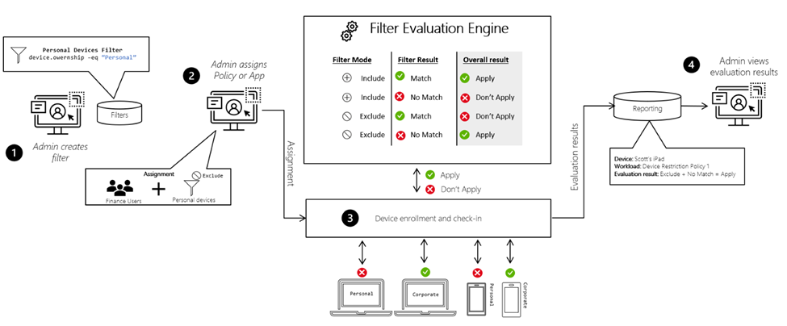
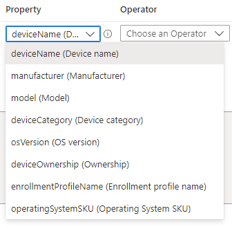
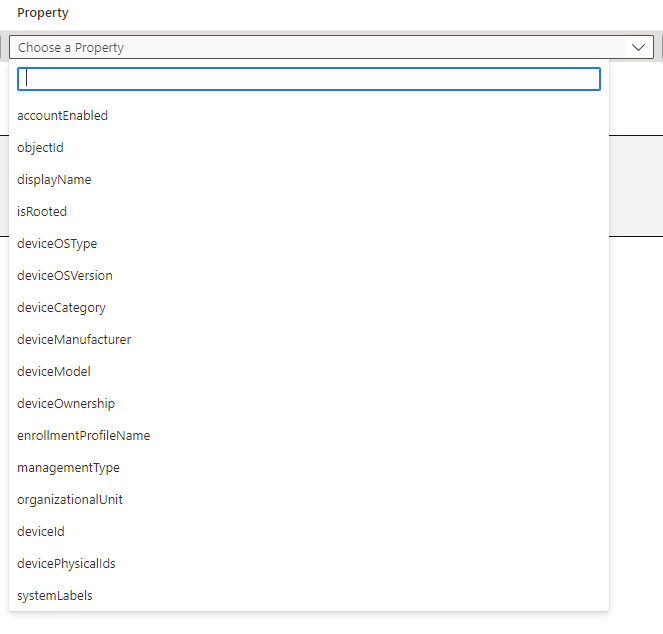
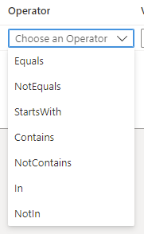
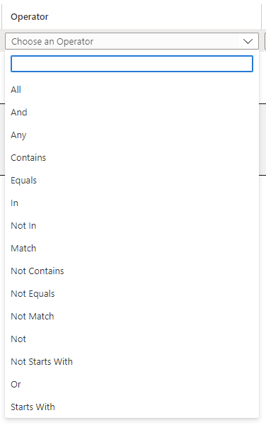

# Dynamic Groups vs Device Filters

Now if you've ever spoken to me about Microsoft Intune and using Dynamic Groups for management of users and devices, I probably would have talked your ears off about the attribute usage, which attributes are suitable, and that moving away from assigned groups to dynamic is the only way forward for Modern Device Management.

What if I told you, that there's something on par with these holy grail groups, and maybe, just *maybe*, even better.

## My Beloved Dynamic Groups

Before we jump into [Device Filters](https://docs.microsoft.com/en-us/mem/intune/fundamentals/filters), let us talk about [Dynamic Groups](https://docs.microsoft.com/en-us/azure/active-directory/enterprise-users/groups-create-rule) a little...

Firstly, I would highly recommend the use of these groups, especially for grouping devices, whether this be based on enrolment type, ownership, operating system type or version...and if you've got something or someone managing your user attributes, that you use them for user groups.

### The Limitations

This sadly, is how quickly these groups update; Microsoft probably realised that people were using these groups in relation to device management, and also realised that the enumeration of the groups was using precious Compute infrastructure, for free, smh.

So Microsoft reduced how often these groups fully updated to once every 24 hours.

Now this is no good when we want to target settings and restrictions, or even just application deployment to these dynamically populated groups, we end up with delaying installations, configuration settings or even connectivity. Not a fan.

## Bring on the Filters

So where Microsoft take away with one hand, they give with the other, and this is the new world of Device Filters.

At a high level, what makes filters so much better for use in Microsoft Intune comes down a couple of things:

- The filter evaluation is done when the device enrols and/or checks in with the Intune service; this means the speed of evaluation is significantly faster than dynamic groups.
- Filters are entirely reusable meaning we can now create one filter and use it for many areas within Microsoft Intune.

Before a policy is applied to a device, filters dynamically evaluate applicability:

1. You create a filter for any platform based on some device properties.

2. You assign a policy or app to the group. In the assignment, you add the filter in either include or exclude mode. For example, you "include" personal devices, or you "exclude" personal devices from the policy.

3. The filter is evaluated when the device enrols or at any other time a policy evaluates.

4. You see the filter results based on the evaluation. For example, the app or policies applies, or it doesn't apply.

### Inconsistent Assignments

So we've talked about the limitations with Dynamic Groups, but we do need to talk about the limitations with Device Filters...
Not all areas of Microsoft Intune [support the use of Filters](https://docs.microsoft.com/en-us/mem/intune/fundamentals/filters-supported-workloads) (as of today, though this will hopefully change), meaning that you can't provide a consistent application method of assignments.

For example, Autopilot profiles don't support filters, and nor do Endpoint Security Profiles, nor PowerShell scripts, nor MAM policies:

However, a lot of crucial areas do, including Compliance, Configuration and Windows Update for Business profiles:

*Groups looking good here.*

### Fewer Properties

Device Filters have fewer [attribute properties](https://docs.microsoft.com/en-us/mem/intune/fundamentals/filters-device-properties#device-properties) to work with compared with Dynamic Groups, so any advanced filtering like with  will still need to be done using Dynamic Groups.

**Device Filters**

**Dynamic Groups**

*Win for the Groups.*

### Fewer Operators

Device Filters do not support advanced logic with the operators such as 'Match', so turbo advanced filtering such as in  need to be handled with groups still.

**Device Filters**

**Dynamic Groups**

*Another win there, **3-0** to the Groups.*

## Summary

Even with these Device Filter limitations (and the 3-0 loss), the benefits of reusability and speed in which they are processed still shine through over Dynamic Groups in many areas of Microsoft Intune, and I strongly recommend moving to using the 'All Devices' and 'All Users' in-built assignments in conjunction with Device Filters, just to make your life that little bit easier when managing devices.

You've come this far, so why not give creating them a shot and [create a filter](https://docs.microsoft.com/en-us/mem/intune/fundamentals/filters) or two?

