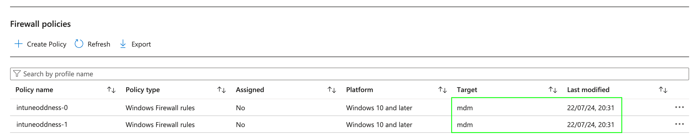
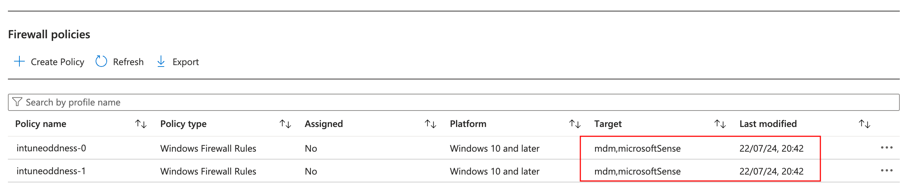
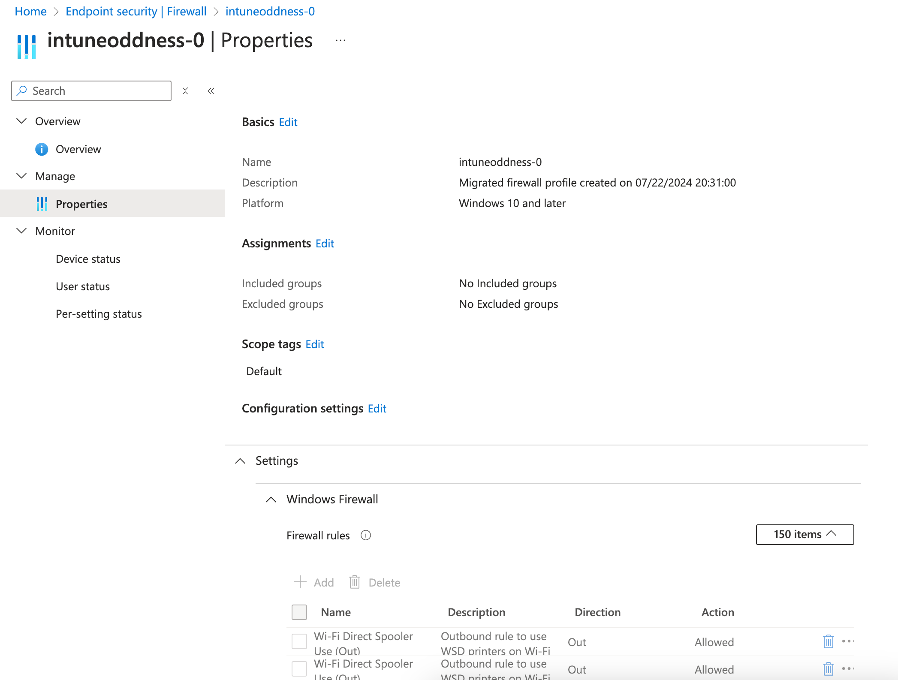
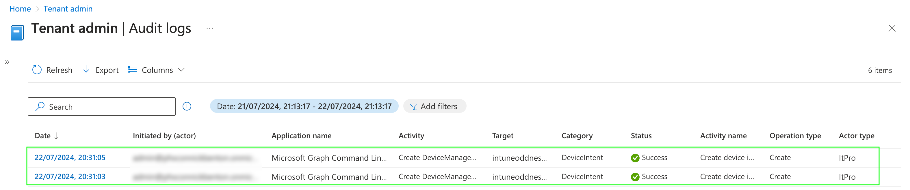
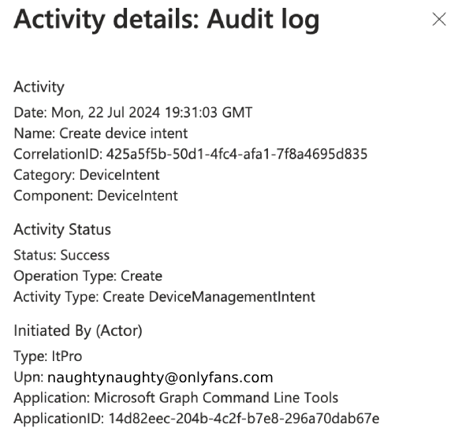
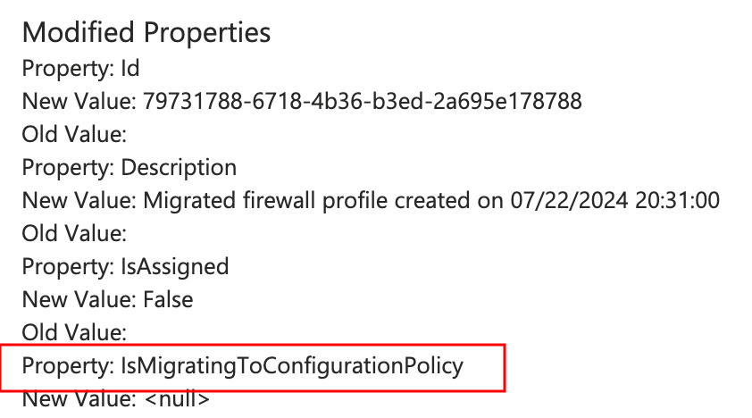
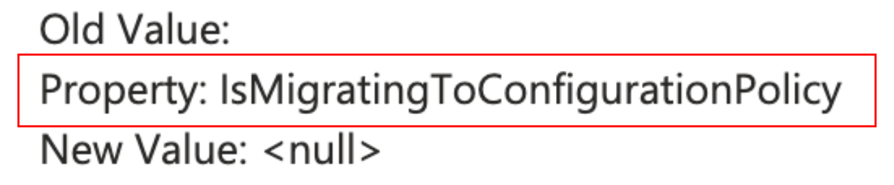
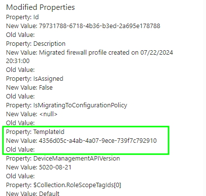
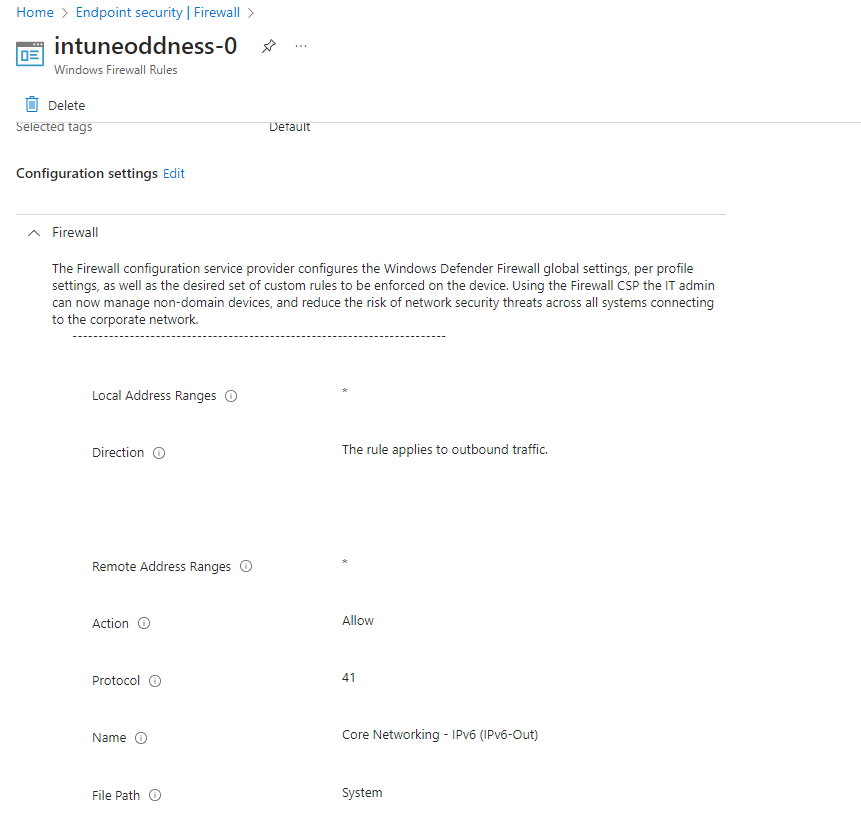

# Microsoft Intune and the Curious Case of the Converting Firewall Rule Policy


What do you do when someone reaches out on [GitHub](https://github.com/ennnbeee/oddsandendpoints-scripts/issues/1) about one of your scripts no longer working as expected?

Well it's obvious that you just assume that they're doing something wrong...



...what if they're not wrong though?

What if the script you created to convert the old style of Firewall Rule policies created using the now defunct [migration tool](https://learn.microsoft.com/en-us/mem/intune/protect/endpoint-security-firewall-rule-tool) doesn't work because the rules it created are now [Settings Catalog](https://learn.microsoft.com/en-us/mem/intune/protect/endpoint-security-firewall-policy) policies, ruining not just a good PowerShell script, but a blog post whilst it's at it?



Well you write a blog post about it...duh.



## The Tool

First off, let's look at the [Migration Tool](https://learn.microsoft.com/en-us/mem/intune/protect/endpoint-security-firewall-rule-tool) which I'm pretty sure we've all used in our time allowing the automatic creation of Firewall Rule policies, taking existing Group Policy applied rules from a target device and punting them straight into Microsoft Intune.

Oh it's gone.



Well Microsoft you are correct, the old version of the tool *did* create the old **mdm** Endpoint Security Profiles, and it *did* use the old authentication method, but it also *did* work.

If you're ~~sensible~~ nice enough to follow me on LinkedIn you might have spotted that as a favour to a stranger (not the first time mind you), I updated the migration tool to support the new authentication method, and a couple of other bits as well.



## The Script

I'm not using this post to break down exactly *how* I ~~fixed~~ updated the [PowerShell script](https://github.com/ennnbeee/oddsandendpoints-scripts/tree/main/Intune/EndpointSecurity/FirewallRuleMigration) in the short term, but in summary I...

- Removed the reliance on the Microsoft GitHub repo to download content.
- Changed authentication to use the [Microsoft.Graph](https://learn.microsoft.com/en-us/powershell/microsoftgraph/get-started?view=graph-powershell-1.0) PowerShell module.
- Changed the web requests to use [Invoke-MgGraphRequest](https://learn.microsoft.com/en-us/powershell/module/microsoft.graph.authentication/invoke-mggraphrequest?view=graph-powershell-1.0) for calls to Graph.
- Forced the PowerShell script to create Endpoint Security templates for firewall rule policies instead of Configuration Profiles.
- Changed the Authentication to Graph to use [device authentication](https://learn.microsoft.com/en-us/powershell/microsoftgraph/authentication-commands?view=graph-powershell-1.0#delegated-access) as I'm a dirty macOS user.
- Disabled sending any telemetry data on success and failure of rule creation to Microsoft, as they have too much data on me already.
- Fixed an issue when checking for profile name matching when there are no existing firewall rule policies in Microsoft Intune.



To use the script itself, you:

- Download the [FirewallRuleMigration.zip](https://github.com/ennnbeee/oddsandendpoints-scripts/blob/main/Intune/EndpointSecurity/FirewallRuleMigration/FirewallRuleMigration.zip) file and extract on your Windows device.
- Open PowerShell as Administrator.
- Navigate to the extracted folder, your PowerShell prompt should be in the **FirewallRuleMigration** folder.
- Run `Set-ExecutionPolicy Bypass` accepting all prompts like a good little child.
- Run `./Export-FirewallRules.ps1` with the corresponding switches (`includeDisabledRules`, `includeLocalRules`) if required.
- Authenticate to Graph using a Global Admin account, twice*.
- Enter a new profile name for the Firewall rules policy when prompted.
- Wait for rules to be uploaded to Microsoft Intune.

> *The script will disconnect all existing Graph sessions, and connect twice; once to allow for consent to be provided, the following to allow the script to run following the consent request.

So with this new script in hand, you can still migrate your Group Policy applied Firewall rules to Microsoft Intune, nice eh?

## Firewall Rules 2: The Conversioning

What I did not expect when running the PowerShell script, and after it created the Firewall Rule policies in Microsoft Intune, were them to just *change*.

What I expected, is that I'd have to use my old script to actually convert them from the old versions...



...and not just wait ten minutes for them to transition to new rules.



So wtf is happening?

No clue.



## Are Microsoft Magicians?

Yes.

## The Truthening

The original Firewall Rule policies created by my wonderful PowerShell script are still using the legacy templates in Microsoft Intune:



And to prove I didn't spend my evening somehow manually creating 150 firewall rules in a way you can no longer create them, you can see the [audit log](https://learn.microsoft.com/en-us/mem/intune/fundamentals/monitor-audit-logs) showing that the policies were created at the timestamp:



But oh what have we found here with our super secret snooping skills?

Clicking on one of the items that were created by the PowerShell script, we get a bit more detail:



But what's this at the bottom of the entry:







Yeah this means nothing.

The audit log is showing that a new legacy Firewall Rule policy is being created, how do we know? Well it's still using the old Endpoint Security templateId value of **4356d05c-a4ab-4a07-9ece-739f7c792910**.



Running a quick [Graph Explorer](https://developer.microsoft.com/en-us/graph/graph-explorer) **GET** request to:

```txt
https://graph.microsoft.com/beta/deviceManagement/templates?`$filter=(isof(%27microsoft.graph.securityBaselineTemplate%27))
```

and you'll see all the Endpoint Security Templates, and specifically this one:

```JSON
{
    "@odata.type": "#microsoft.graph.securityBaselineTemplate",
    "id": "4356d05c-a4ab-4a07-9ece-739f7c792910",
    "displayName": "Windows Firewall rules",
    "description": "Windows Firewall allows administrators to define granular Firewall rules. Define firewall rules with specific ports, protocols, applications and networks, to allow or block network traffic.",
    "versionInfo": "2006",
    "isDeprecated": false,
    "intentCount": 2,
    "templateType": "securityTemplate",
    "platformType": "windows10AndLater",
    "templateSubtype": "firewall",
    "publishedDateTime": "2020-03-11T00:00:00Z"
}
```

Either way Microsoft is doing some wizardry behind the scenes not available to see with the naked eye.



So go check your own Firewall Rule policies, I bet they'll be the new Settings Catalog ones. I'll wait (hint, I won't).



Or if you like, use the [PowerShell script](https://github.com/ennnbeee/oddsandendpoints-scripts/tree/main/Intune/EndpointSecurity/FirewallRuleMigration) to create some new old ones, then just wait a little bit and see them evolve into Settings Catalog policies.

Who's that ~~Pokémon~~ Firewall Rule policy?



It's a Settings Catalog policy for Firewall Rules!



## Summary

Honestly, not sure what you want from me here; there might have been a communication about this in the [What's new in Intune](https://learn.microsoft.com/en-us/mem/intune/fundamentals/whats-new), maybe a blog post, maybe not.

Either way you've got a new version of the [Migration Tool script](https://github.com/ennnbeee/oddsandendpoints-scripts/tree/main/Intune/EndpointSecurity/FirewallRuleMigration), a bit of background on how it works, and a dive into the world of things that just happen without us knowing in Microsoft Intune land.

Off you jog now.

