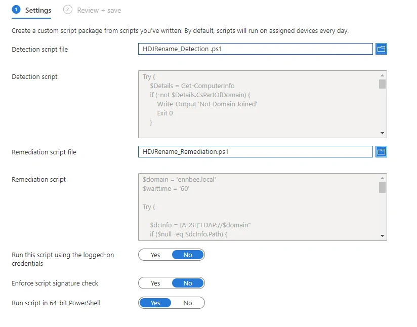
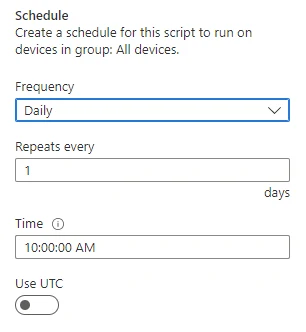

# Proactively Renaming Hybrid Azure AD Joined Devices


Nothing has really changed in the Hybrid Join Autopilot space when it comes to device names, and we're still stuck with useless naming conventions for these devices; sometimes a prefix and random characters just isn't a good enough identification method for Windows devices.

So now that it's 2023 it was time to look at this problem once again, mainly because my 
 broke device certificates and an Always On VPN connection that relied on them as part of the Autopilot process.

## Name Problems

The trouble with the old method, a PowerShell script disguised as a [Win32 App](https://learn.microsoft.com/en-us/mem/intune/apps/apps-win32-app-management), is that it will happily rename and reboot the device during the Autopilot OOBE process, is that the device will already have a device certificate with it's old jumbled name, and it needs this for both the VPN connection and some level of trust to the domain.

What I was seeing is that the computer renamed, but it lost it's trust and connection to the domain once the Autopilot process had finished. Not ideal when deploying device remotely.

### Certificate Template

We can update the certificate deployment template in Intune to take into consideration the new name of the device, especially as we're using an attribute as part of the device rename that Intune knows about, the serial number.

As the Simple Certificate Enrolment Protocol (SCEP) profile [supports various device or user attributes](https://learn.microsoft.com/en-gb/mem/intune/protect/certificates-profile-scep) we can add these into either Subject Name or Subject Alternative Name of the issued certificate, as well as any prefix we want to add such as `L-`:

```txt
CN=L-{{SerialNumber}}
DNS={{FullyQualifiedDomainName}}
DNS={{DeviceName}}
DNS=L-{{SerialNumber}}.ennbee.local
```

This sorts out our certificate issue, as the device will have one that has all possible device names, the initial one assigned by the Domain Join profile, and the new one after the device has been renamed. This doesn't solve our Domain trust issue though.

## Proactive Remediation

We could do with a way to both check that the device name matches our expected naming convention of `L-%SERIAL%` for laptops, and `D-%SERIAL%` for desktops, **and** fixes the issue for us.

This is where [Proactive Remediation](https://learn.microsoft.com/en-us/mem/analytics/proactive-remediations) scripts come to save us, and as I got M365 licenses for Christmas we can make use of them due to this being a [licensing requirement](https://learn.microsoft.com/en-us/mem/analytics/proactive-remediations#licensing).

Now that we have new tools at our disposal, and modify permissions for 'SELF' already in place in the destination Organisational Unit allowing the computer object to rename itself, we can hack about with the old script that was doing the computer rename as part of the Autopilot process, and using Proactive Remediation scripts, we can check that the existing device name matches the expected device name.

### Detection Script

First off we need a something to check that the device is Domain Joined *(Lines 1-6)*, what the new Computer name is expected to be based on whether a desktop or laptop *(Lines 8-21)*, and what the existing Computer name is *(Lines 23-26)*. As we already have a starter for ten, this wasn't too much of a hassle to throw together quickly.



With Proactive Remediation scripts, we need to pass back the results of this check, and any checks, with [Exit Codes](https://learn.microsoft.com/en-us/mem/analytics/proactive-remediations#bkmk_requirements) and some kind of descriptive text.

### Remediation Script

With the information about the device name in place with the detection, now we need something to fix our issues, or if you want to use bigger words, remediate them.

We only want this script to run when the device can actually talk to a Domain, otherwise we're in for a bad time of mistrust again. So updating the `$domain` variable with the name of the domain, we can confirm that we can talk to a Domain Controller, otherwise we exit the script with an error.

```PowerShell
$domain = 'ennbee.local'
$dcInfo = [ADSI]"LDAP://$domain"
if ($null -eq $dcInfo.Path) {
    Write-Error "No connectivity to $domain"
}
```

We can reuse the part of the detection script for the creation of the new computer name, using whether a device has a battery or not to determine whether the device is a laptop or desktop, removing any spaces from the serial, and making sure the new device name is 15 characters or less:

```PowerShell
$Serial = Get-WmiObject Win32_bios | Select-Object -ExpandProperty SerialNumber
If (Get-WmiObject -Class win32_battery) {
    $newName = 'L-' + $Serial
}
Else {
    $newName = 'D-' + $Serial
}

$newName = $newName.Replace(' ', '') #Removes spaces
if ($newName.Length -ge 15) {
    $newName = $newName.substring(0, 15)
}
```

Last bit to manage is renaming the device using `Rename-Computer` and sending a shutdown command with our specified restart time, user notification and friendly message:

```PowerShell
$waittime = '60'
Rename-Computer -NewName $newName
$waitinseconds = (New-TimeSpan -Minutes $waittime).TotalSeconds
Write-Host "Initiating a restart in $waittime minutes"
& shutdown.exe /g /t $waitinseconds /f /c 'Restarting the computer in 60 minutes due to a computer name change. Please save your work.'
Write-Output "Computer renamed from $($Details.CsName) to $newName"

```

This gives the user some notice that the restart is going to happen:


All components now in place, we have the full script wrapped in the needed Try/Catch operators, otherwise the good practice PowerShell Police will get you:



### Deployment in Intune

Throwing ourselves into the safe space that is Intune, go and find the [Proactive Remediation](https://endpoint.microsoft.com/#view/Microsoft_Intune_Enrollment/UXAnalyticsMenu/~/proactiveRemediations) section, I'll give you a hint, it's under Reports > Endpoint Analytics.

Create a new Script Package, selecting and uploading both the detection and remediation scripts as you go, you can get these from [GitHub](https://github.com/ennnbeee/oddsandendpoints-scripts/tree/main/Intune/Remediation/HDJDeviceRename). Make sure you select 'Run script in 64-bit PowerShell' as I couldn't be bothered scripting a check if PowerShell was running in the 64-bit context.



Go ahead and assign this to a test group of devices, or if you're brave or don't care about testing, all devices with a , giving the assignment a schedule; I've gone with daily repeating every day, but amend this to your environment requirements:



Now we have to sit back and wait for devices to receive the script package, execute it, and where applicable remediate.

When the devices do check in, you will be able to see the results in Intune under the Device Status, make sure you've added both the 'Pre-remediation detection output' and 'Post-remediation detection output':


I didn't get a screenshot in time for detection picking up errors, only the success, but you get the gist.

## Summary

With this method now successfully renaming the device from the Windows Desktop, the certificate in place to cater to the new computer name, we don't end up losing domain trust or connectivity as part of the Autopilot Hybrid Join deployment, and the user is the only one impacted, not the Service Desk.

I wouldn't go as far to say this was a difficult problem, but with how flexible and powerful Proactive Remediation Scripts are, with the limitation only being your ability to write PowerShell (and obviously the correct licensing), I'd recommend using these more and more in place of wrapping PowerShell scripts as a Win32App and having to battle with creating 'tag' files as a detection method.

