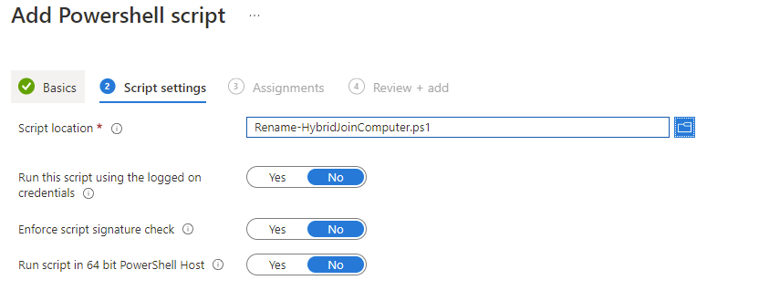

# Renaming Windows Autopilot Hybrid Joined Devices


You've probably hit the limitation with Windows Autopilot Hybrid Azure AD Join deployments and the device name templates being less than flexible, restricting to only a prefix and, well, that's it.

You've also probably been asked whether you can configure the device name to match an asset tag or another unique bit of information, well this script, adapted from an existing one by [Michael Niehaus](https://oofhours.com/2020/05/19/renaming-autopilot-deployed-hybrid-azure-ad-join-devices/) can help.

## Configuration

The below sections detail the steps carried out to modify the script to work without the need for an Azure web application, and can be deployed locally to rename devices.

### Adding the Variables

The post linked above details the steps required to ensure that the computer object itself has the ability to initiate the rename, and the below script has been changed to use existing device information, such as serial, instead of a web service:

- On-premises domain variable
- Computer name prefix variable
- Wait time before restart

This means that it can be deployed to existing environments without the need to deploy, or pay for, an Azure Web App.

The first section details the parameters that can used and updated.

```powershell
#Sets the variables for the customer
$domain = "onprem.local" #local domain
$ComputerPrefix = "PRE-" #Prefix
$waittime = "60" #sets the restart wait time in minutes
```

### Getting the Device Name

This next section pulls back the serial number and ensures that the computer name is less than 15 characters.

```powershell
#Get serial and removes commas
$Serial = Get-WmiObject Win32_bios | Select-Object -ExpandProperty SerialNumber
$newName = $ComputerPrefix + $Serial
$newName = $newName.Replace(" ","") #Removes spaces

#shortens name
if ($newName.Length -ge 15) {
    $newName = $newName.substring(0, 15)
}
```

### The Waiting Game

Using `New-TimeSpan` we can convert the `$waittime` variable into whatever time format we need, and as we're using the shutdown command, we need seconds:

```powershell
$waitinseconds = (New-TimeSpan -Minutes $waittime).Seconds
Write-Host "Initiating a restart in $waitime minutes"
& shutdown.exe /g /t $waitinseconds /f /c "Restarting the computer in $wait minutes due to a computer name change. Please save your work."
```

### The Whole Thing

The full script can be found [here](https://github.com/ennnbeee/oddsandendpoints-scripts/blob/main/Intune/PlatformScripts/PowerShell/HDJDeviceRename/Invoke-ComputerRename-HDJ.ps1), I would **strongly** advise testing this prior to pushing it out via Microsoft Intune.

## Deployment

Save the above script and create a new PowerShell script deployment in [Microsoft Intune](https://endpoint.microsoft.com/#blade/Microsoft_Intune_DeviceSettings/DevicesWindowsMenu/powershell) using the following configuration settings, then deploy to a test group of devices:



 Bingo! another battle won.

