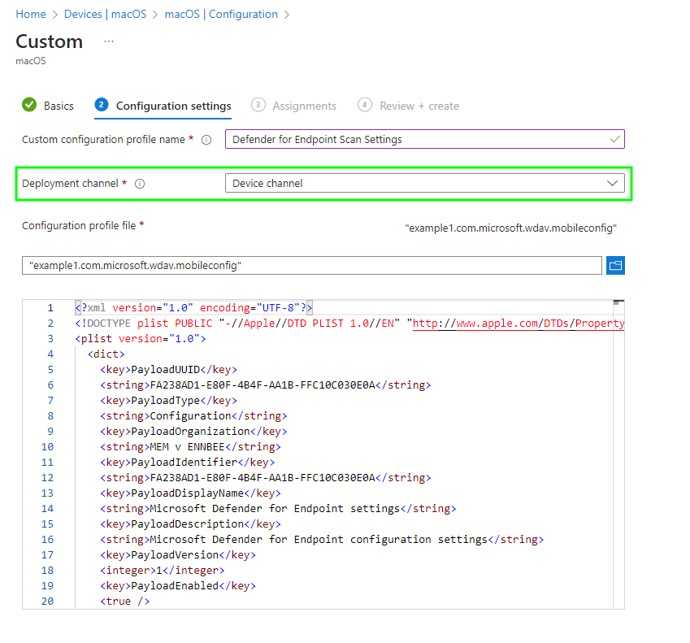
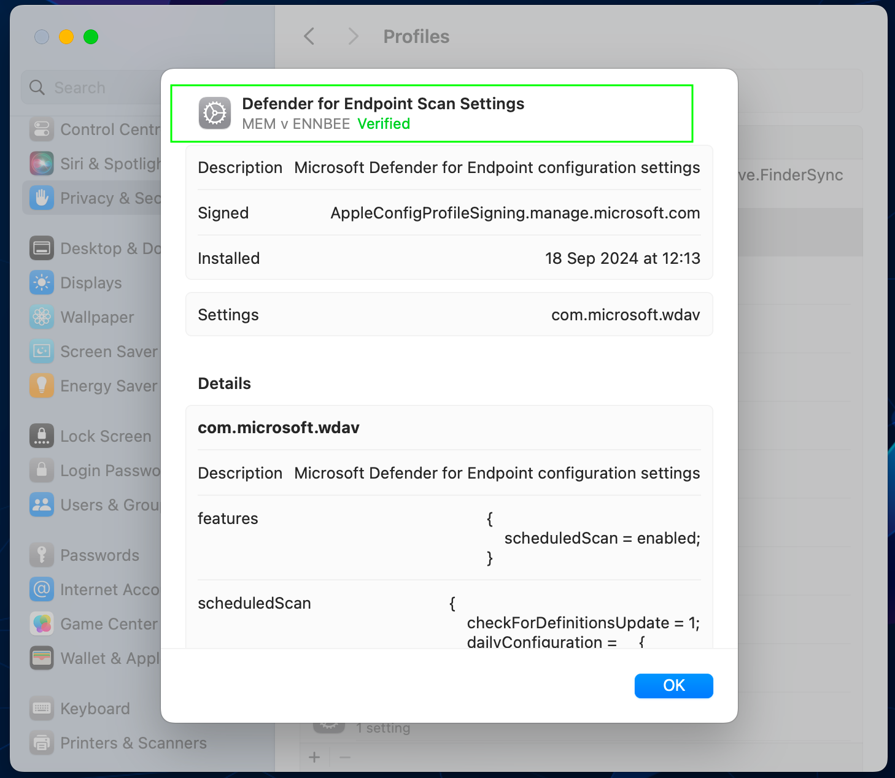
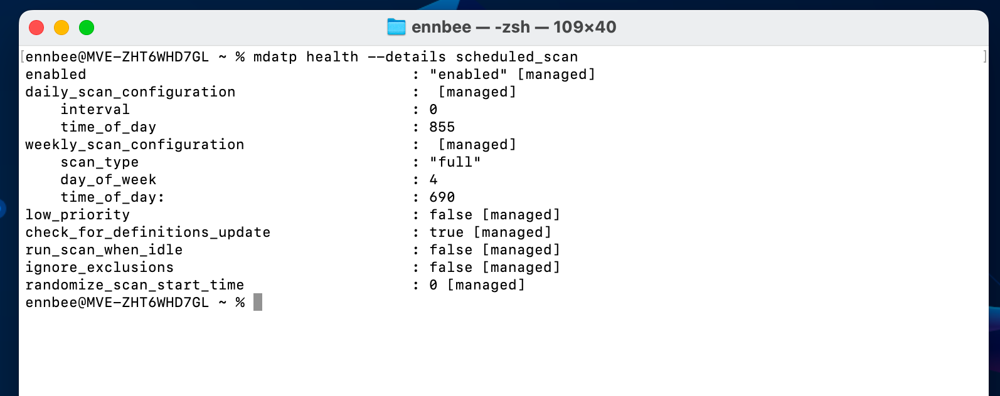

# Scheduling Defender for macOS Antivirus Scans in Intune


Assuming that you've decided to not only dip a toe into Microsoft products for managing your macOS device estate, but you've gone ~balls deep~ two-footed instead, you're probably [onboarding](https://learn.microsoft.com/en-us/defender-endpoint/mac-install-with-intune) your macOS devices into [Defender for Endpoint](https://learn.microsoft.com/en-us/defender-endpoint/microsoft-defender-endpoint-mac), and deploying the [Defender app](https://learn.microsoft.com/en-us/mem/intune/apps/apps-advanced-threat-protection-macos), to take full advantage of that M365 licensing that smiling sales person told you to get for your users.

Have you configured scheduled Defender antivirus scans? Have you thought about that? (*Inb4, "but macOS devices don't get viruses"*)

Well yeah probably, and you've probably seen the [Microsoft Learn](https://learn.microsoft.com/en-us/defender-endpoint/mac-schedule-scan) article explaining how to deploy a scheduled scan configuration using [Custom Settings](https://learn.microsoft.com/en-us/mem/intune/configuration/custom-settings-macos), surely there must be an easier way to create the associated config file, without doing maths?

## Scheduling Scans

As I get to work with an array of customers, each with their own *special* requirements, and I cba repeating effort, I thought I'd just use PowerShell to create the required config files to be used in Microsoft Intune, or even [Jamf](https://learn.microsoft.com/en-us/mem/intune/fundamentals/what-is-intune) to configure the Defender scan settings.

Before we get to the good bit, we need to talk about the settings we actually can configure in a profile.

### Defender Scan Options

A straight copy/paste from the [Microsoft Learn](https://learn.microsoft.com/en-us/defender-endpoint/mac-schedule-scan#schedule-a-scan-with-microsoft-defender-for-endpoint-on-macos) article, we can see the below options that can be configured:

| Parameter | Accepted values | Information |
| :- | :- | :- |
| scheduledScan | `enabled` or `disabled` | We're going to set this as enabled by default, otherwise what's the point? |
| scanType | `quick` or `full` | Again we're going to want at least one full scan. |
| ignoreExclusions | `true` or `false` | Probably don't want to ignore the [exclusions](https://learn.microsoft.com/en-us/defender-endpoint/mac-exclusions), they're exclusions for a reason. |
| lowPriorityScheduledScan | `true` or `false` | Yeah maybe we make this true by default, it's not like people complain about Defender being resource hungry 😅. |
| dayOfWeek | Integer range between `0` and `8` | `0` is everyday, `8` is never, the rest start Sunday through to Saturday. |
| timeOfDay | The number of minutes after midnight | Here's that maths I was talking about, we'll sort this. |
| interval | Integer range between `0` and `24` | `0` is no interval, the other represents hours, with `24` being once a day.  |
| randomizeScanStartTime | Integer range between `0` and `23` | How many hours between the scheduled start time and this many hours after a scan will randomly start between.  |

And some sneaky additional options from the [Defender macOS Schema](https://github.com/microsoft/mdatp-xplat/blob/master/macos/schema/schema.json) documentation that we can also play around with:

| Parameter | Accepted values | Information |
| :- | :- | :- |
| checkForDefinitionsUpdate | `true` or `false` | Check for new updates before running a scheduled scan. Yes please. |
| runScanWhenIdle | `true` or `false` | Will delay a scheduled weekly full scan until the device is doing nothing. |

Now with the Defender antivirus settings we can actually configure, we can look to leverage these as parameters in a script to build the required configuration files.

### Example Profiles

Before we start ~pissing about~ playing with unnecessary PowerShell scripts to create something we can manually create in minutes, we should look at the format of the config profiles used, and Microsoft kindly gives us an example to work from.

Configuring the scheduled scans with the settings below:

- an hourly quick scan
- a daily quick scan configuration is set to run at 14:45 *(885 minutes after midnight)*
- a weekly full scan will run on Wednesdays at 14:40 *(880 minutes after midnight)*

```XML {hl_lines=["55-70"], open=true}
<?xml version="1.0" encoding="UTF-8"?>
<!DOCTYPE plist PUBLIC "-//Apple//DTD PLIST 1.0//EN" "http://www.apple.com/DTDs/PropertyList-1.0.dtd">
<plist version="1.0">
    <dict>
        <key>PayloadUUID</key>
        <string>C4E6A782-0C8D-44AB-A025-EB893987A295</string>
        <key>PayloadType</key>
        <string>Configuration</string>
        <key>PayloadOrganization</key>
        <string>Microsoft</string>
        <key>PayloadIdentifier</key>
        <string>C4E6A782-0C8D-44AB-A025-EB893987A295</string>
        <key>PayloadDisplayName</key>
        <string>Microsoft Defender for Endpoint settings</string>
        <key>PayloadDescription</key>
        <string>Microsoft Defender for Endpoint configuration settings</string>
        <key>PayloadVersion</key>
        <integer>1</integer>
        <key>PayloadEnabled</key>
        <true/>
        <key>PayloadRemovalDisallowed</key>
        <true/>
        <key>PayloadScope</key>
        <string>System</string>
        <key>PayloadContent</key>
        <array>
            <dict>
                <key>PayloadUUID</key>
                <string>99DBC2BC-3B3A-46A2-A413-C8F9BB9A7295</string>
                <key>PayloadType</key>
                <string>com.microsoft.wdav</string>
                <key>PayloadOrganization</key>
                <string>Microsoft</string>
                <key>PayloadIdentifier</key>
                <string>99DBC2BC-3B3A-46A2-A413-C8F9BB9A7295</string>
                <key>PayloadDisplayName</key>
                <string>Microsoft Defender for Endpoint configuration settings</string>
                <key>PayloadDescription</key>
                <string/>
                <key>PayloadVersion</key>
                <integer>1</integer>
                <key>PayloadEnabled</key>
                <true/>
                <key>features</key>
                <dict>
                    <key>scheduledScan</key>
                    <string>enabled</string>
                </dict>
                <key>scheduledScan</key>
                <dict>
                    <key>ignoreExclusions</key>
                    <true/>
                    <key>lowPriorityScheduledScan</key>
                    <true/>
                    <key>dailyConfiguration</key>
                    <dict>
                        <key>timeOfDay</key>
                        <integer>885</integer>
                        <key>interval</key>
                        <string>1</string>
                    </dict>
                    <key>weeklyConfiguration</key>
                    <dict>
                        <key>dayOfWeek</key>
                        <integer>4</integer>
                        <key>timeOfDay</key>
                        <integer>880</integer>
                        <key>scanType</key>
                        <string>full</string>
                    </dict>
                </dict>
            </dict>
        </array>
    </dict>
</plist>
```

Saving this as **com.microsoft.wdav.mobileconfig** will allow us to add it to Intune as a Custom profile.


This one, unlike the Microsoft provided [first example](https://learn.microsoft.com/en-us/defender-endpoint/mac-schedule-scan#for-intune) in the article actually works in Intune 🫠.


Microsoft also provide a corresponding Jamf or Third-Party MDM profile as well, with the same scan settings as above.

```XML {hl_lines=["16-31"], open=true}
<?xml version="1.0" encoding="UTF-8"?>
<!DOCTYPE plist PUBLIC "-//Apple//DTD PLIST 1.0//EN" "http://www.apple.com/DTDs/PropertyList-1.0.dtd">
<plist version="1.0">
    <dict>
        <key>features</key>
        <dict>
            <key>scheduledScan</key>
            <string>enabled</string>
        </dict>
        <key>scheduledScan</key>
        <dict>
            <key>ignoreExclusions</key>
            <true/>
            <key>lowPriorityScheduledScan</key>
            <true/>
            <key>dailyConfiguration</key>
            <dict>
                <key>timeOfDay</key>
                <integer>885</integer>
                <key>interval</key>
                <string>1</string>
            </dict>
            <key>weeklyConfiguration</key>
            <dict>
                <key>dayOfWeek</key>
                <integer>4</integer>
                <key>timeOfDay</key>
                <integer>880</integer>
                <key>scanType</key>
                <string>full</string>
            </dict>
        </dict>
    </dict>
</plist>
```

This example instead saved as **com.microsoft.wdav.plist** for use in the Third-Party MDM tools, and I'd test them if my Jamf trial hadn't expired.


Note the different format of the examples and the file type Microsoft suggest you save this as depending on whether it's for Intune or other MDM solutions.


## Using PowerShell

So we now have some understanding of the format required across both profile types, as well as the options we can configure in the profile to allow for macOS devices to not go without a Defender scan now that they have the functionality, and of course the [Defender app](https://learn.microsoft.com/en-us/defender-endpoint/mac-install-with-intune).

I'm not going to bore you with how I built the PowerShell script, as those types of blog posts get no traction 😂, and you all just want the quick win and end result.

So we'll go to the highlights of the [script](https://github.com/ennnbeee/oddsandendpoints-scripts/blob/main/Intune/Configuration/macOS/DefenderScheduleScan/New-macOSDefenderScanProfile.ps1):

- Allows for the selection of **plist** or **mobileconfig** as an output of the script for use in Third-Party MDM solutions 🤢, or our beloved 🥰 Microsoft Intune
- Allows for configuration of a **weekly full or quick** Defender Scan, the day and **time of the scan**
- Allows for configuration of a **daily quick** Defender Scan, and the **time of the scan**
- Allows for configuration of **regular quick scans**
- Works out the maths for time of day scans
- Allows for configuration of **additional scan scheduling options**, as well as setting recommended defaults
- Formats the XML
- Creates the config file in the required format in the same folder as the PowerShell script

So with that done, now to look at our options for running the script.

### Example 1

To create the config file to configure Defender with the following settings:

- Weekly full scan running on a Wednesday at 11:30
- Daily quick scan running at 14:15
- No regular daily scan
- Check for updates before scan is enabled

#### Example 1 - Intune

```PowerShell
.\New-macOSDefenderScanProfile.ps1 -mdm Intune -organisation 'MEM v ENNBEE' -weeklyScan $true -weeklyScanType full -weeklyScanDay wed -weeklyScanHour 11 -weeklyScanMinute 30 -dailyScan $true -dailyScanHour 14 -dailyScanMinute 15 -regularScanInterval 0 -checkForDefinitionsUpdate $true
```

 *example1.com.microsoft.wdav.mobileconfig*



#### Example 1 - Third-Party MDM

```PowerShell
.\New-macOSDefenderScanProfile.ps1 -mdm ThirdParty -weeklyScan $true -weeklyScanType full -weeklyScanDay wed -weeklyScanHour 11 -weeklyScanMinute 30 -dailyScan $true -dailyScanHour 14 -dailyScanMinute 15 -regularScanInterval 0 -checkForDefinitionsUpdate $true
```

 *example1.com.microsoft.wdav.plist*



### Example 2

To create the config file to configure Defender with the following settings:

- No weekly full scan
- Daily quick scan running at 11:20
- Regular scan every 12 hours
- Check for updates before scan is enabled
- Low priority scheduled scan is enabled
- Allow scan start time to be randomised within a 2 hour window

#### Example 2 - Intune

```PowerShell
.\New-macOSDefenderScanProfile.ps1 -mdm Intune -organisation 'MEM v ENNBEE' -weeklyScan $false -dailyScan $true -dailyScanHour 11 -dailyScanMinute 20 -regularScanInterval 12 -checkForDefinitionsUpdate $true -lowPriorityScheduledScan $true -randomizeScanStartTime 2
```

 *example2.com.microsoft.wdav.mobileconfig*



#### Example 2 - Third-Party MDM

```PowerShell
.\New-macOSDefenderScanProfile.ps1 -mdm ThirdParty -weeklyScan $false -dailyScan $true -dailyScanHour 11 -dailyScanMinute 20 -regularScanInterval 12 -checkForDefinitionsUpdate $true -lowPriorityScheduledScan $true -randomizeScanStartTime 2
```

 *example2.com.microsoft.wdav.plist*



### Example 3

To create the config file to configure Defender with the following settings:

- Weekly quick scan running every day at 09:15
- No daily quick scan
- No regular scan
- Check for updates before scan is enabled
- Low priority scheduled scan is disabled
- Wait for device to be idle before scanning
- Ignore any configured exclusions

#### Example 3 - Intune

```PowerShell
.\New-macOSDefenderScanProfile.ps1 -mdm Intune -organisation 'MEM v ENNBEE' -weeklyScan $true -weeklyScanType quick -weeklyScanDay all -weeklyScanHour 9 -weeklyScanMinute 15 -dailyScan $false -regularScanInterval 0 -checkForDefinitionsUpdate $true -lowPriorityScheduledScan $false -runScanWhenIdle $true -ignoreExclusions $true
```

 *example3.com.microsoft.wdav.mobileconfig*



#### Example 3 - Third-Party MDM

```PowerShell
.\New-macOSDefenderScanProfile.ps1 -mdm ThirdParty -weeklyScan $true -weeklyScanType quick -weeklyScanDay all -weeklyScanHour 9 -weeklyScanMinute 15 -dailyScan $false -regularScanInterval 0 -checkForDefinitionsUpdate $true -lowPriorityScheduledScan $false -runScanWhenIdle $true -ignoreExclusions $true
```

 *example3.com.microsoft.wdav.plist*



Hopefully by this point you get the idea 🙃.

## Microsoft Intune Settings

So now we can create a new Custom profile in Microsoft Intune, add the generated mobileconfig file, and deploy the profile containing the Defender scheduled scan settings to your macOS devices.

### Custom Profile

We'll use the mobileconfig file we created in [Example 1](/posts/macos-defender-scan-settings/#example-1) for Intune, which will configure the scheduled scan settings to the below:

- Weekly full scan running on a Wednesday at 11:30
- Daily quick scan running at 14:15
- No regular daily scan
- Check for updates before scan is enabled

So go create a new [Custom Profile](https://learn.microsoft.com/en-us/mem/intune/configuration/custom-settings-macos) in Microsoft Intune, and upload the mobileconfig file we created:



Make sure you're selecting **Device channel**, then go assign this to your macOS devices, and wait some length of time for Intune to report a deployment success.

### Validation

Once your devices have checked in to Intune, there should be a new profile on the device with the Defender scan schedule settings:



To double down and be super-serious about ensuring that the settings match the configured parameters, they can be checked against the profile using the below command in a Terminal on a macOS device, to see if those scan settings have applied:

```shell
mdatp health --details scheduled_scan
```

Which should give us something like this:



Doing a bit of [quick maths](https://www.youtube.com/watch?v=3M_5oYU-IsU) and comparing to the parameters:

| Configuration | Setting | Value |
| :- | :- | :- |
| Weekly full scan running on a Wednesday  | `weekly_scan_configuration > day_of_week` | `4` |
| Weekly full scan running on a Wednesday at 11:30 | `weekly_scan_configuration > time_of_day` | `690` |
| Daily quick scan running at 14:15 | `daily_scan_configuration > time_of_day` | `855` |
| No regular daily scan | `daily_scan_configuration > interval` | `0` |
| Check for updates before scan is enabled | `check_for_definitions_update` | `true` |

The other settings such as `low_priority`, `run_scan_when_idle`, `ignore_exclusions`, and `randomize_scan_start_time` in the profile were set with default values within the PowerShell script; these can be adjusted based on your needs by configuring the parameters when running the script.


To give you break down of the maths I was talking about, our weekly full scan running on a Wednesday at 11:30 equates to **(11 x 60) + 30 = 690**, and the daily scan running at 14:15 **(14 x 60) + 15 = 855**, giving us the number of minutes after midnight (local client time) a scheduled scan is set to run.


## Summary

Honestly I'm hoping that these settings just appear in [Settings Catalog](https://learn.microsoft.com/en-us/mem/intune/configuration/settings-catalog) sometime soon, instead of having to use a [script](https://github.com/ennnbeee/oddsandendpoints-scripts/blob/main/Intune/Configuration/macOS/DefenderScheduleScan/New-macOSDefenderScanProfile.ps1) which probably didn't need creating in the first place, but here we are.

At least we now have a way to generate the scheduled scan profile, and ensure that it will apply correctly, without the need for either a macOS device to create one on, or one to test to even see if the profile is valid.

