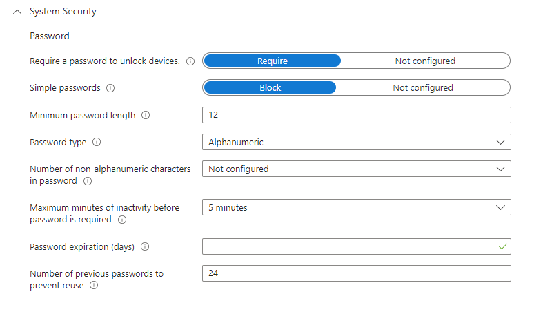
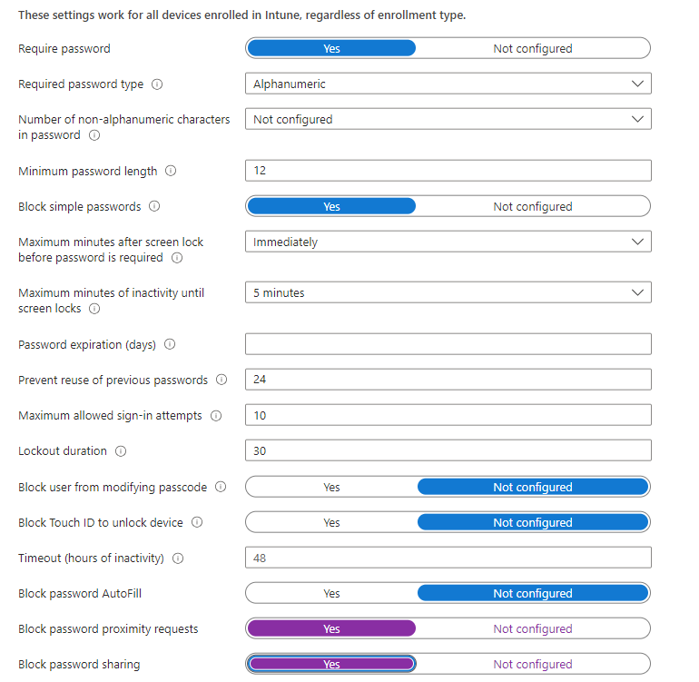
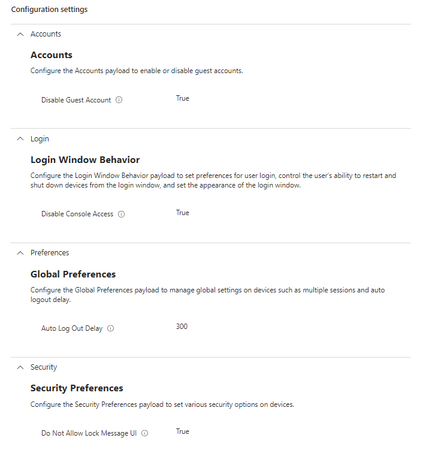
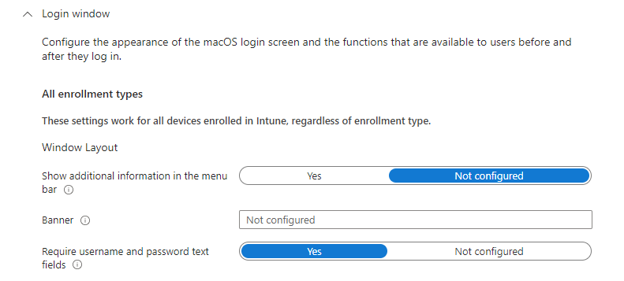
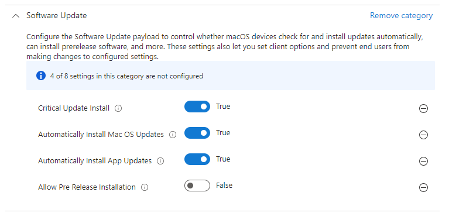
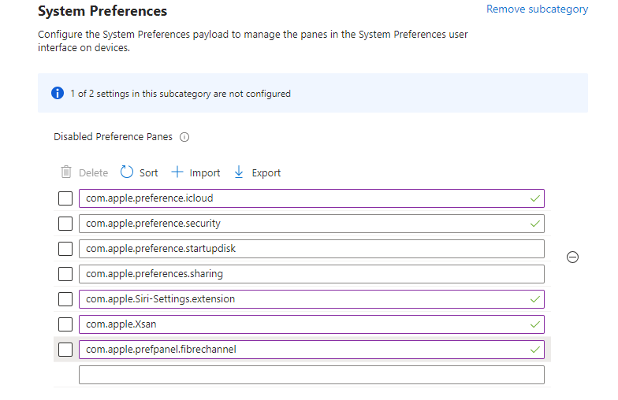
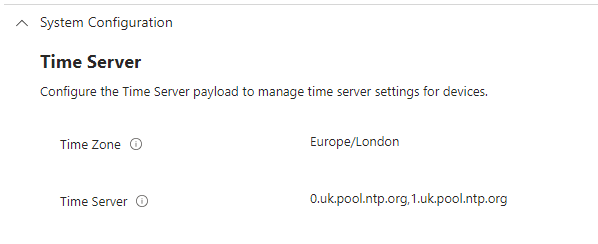

# Revisiting macOS National Cyber Security Centre Security Settings

We looked at some of the ways to secure macOS devices in Microsoft Intune, aligned with the [NCSC platform guidance](https://www.ncsc.gov.uk/collection/device-security-guidance/platform-guides/macos) in , but this was when macOS device management in Intune was, at best, in beta.

General hardening has been covered previously by [Hubert Maslowski](https://hmaslowski.com/home/f/macos-security-hardening-with-microsoft-intune) in their post that covers device compliance and configuration settings, but we're looking at ensuring that the macOS devices meet the National Cyber Security Centre settings, including [Cyber Essentials](https://www.ncsc.gov.uk/files/Cyber-Essentials-Requirements-for-Infrastructure-v3-1-January-2023.pdf) requirements.

Now with the additional macOS settings, and new macOS versions, I thought we should look at how we can now secure these enrolled devices aligned to these known good practice settings.

## NCSC Guidelines

Handily, NCSC provide a [list of their recommendations](https://github.com/ukncsc/Device-Security-Guidance-Configuration-Packs/blob/main/Apple/macOS/NCSC_macOS_configurations.md) for macOS device security, and unlike our previous attempt at hardening, we don't need to rely on mobileconfig custom settings to deliver these hardening requirements.

The settings from the platform guidance we'll cover in this post are as detailed in the sections below. We're not going to cover all the restrictions, the implications, and the expected behaviour, as the company I work for charges customers for this and I already provide too much 'value add' as part of consultancy as it is.

### Device Password Settings

Password complexity in the NCSC guidance is a little open ended, however when you dig through their other guidance, we can see that the new requirements for passwords on macOS devices have the restrictions of the below:

- 12 Characters or more
- Allow the use of lower case, upper case, numbers
- Block the use of special characters
- Block the use of simple passwords that have repeating, ascending, or descending characters
- Password does not expire
- Remember previous 24 passwords
- Minimum activity before a password is required set to five minutes

The NCSC guidance does cover screen saver settings, and password sharing settings, so we can include those as well when configuring password settings.

>- Require password after sleep or screen saver begins within five seconds
>- Disable password sharing
>- Disable proximity based password sharing requests

With the above, we can easily create a device compliance policy...


When a compliance policy contains password restrictions, this will force the end user to change their password at next logon, and result in any attempt at elevation to fail with existing credentials until the password has been updated.


...and a device restrictions profile to meet these requirements.


As there isn't a five second option for when a password is required, with the minimum being one minute, we've set this to be immediately.


### Login Restrictions

There are a number of recommendations when it comes to the login window, with most of these impacting the end-user experience, but obviously for good security based reasons. We can group the restrictions into one Settings Catalog profile and one Device Restriction profile, who knows why Microsoft didn't just make them all available within Settings Catalogs.

Using a Settings Catalog profile we can cover the following restrictions.

> - Disable Guest User
> - Disable console logon
> - Log out users after three minutes of inactivity*
> - Block user setting a lock message


*We can't do three minutes so five will have to do, Microsoft Intune supports between five minutes and 24 hours.


For the Device Restriction Profile we can cover the restriction below.

>- Show only Name and Password Text fields

### Software Updates

Ah yes, software updates, basically we need to ensure that updates are installed within a 14-day window from the release of the update, that the updates can be installed by the end user, and that only production updates can be installed.

>- Automatically install macOS updates
>- Allow non-admin users to install software updates
>- Do not defer macOS Updates
>- Allow installation of macOS beta releases

With these requirements we can create the Settings Catalog profile below to adhere to the restrictions.


The Microsoft documentation talks about these settings in the [Additional settings section](https://learn.microsoft.com/en-us/mem/intune/protect/software-updates-macos#configure-additional-macos-software-update-settings-using-the-settings-catalog), there appears to be a caveat to that whole document that these update settings will only apply to Supervised macOS devices.


### Restrict Items in System Preferences

Limiting access to areas in the System areas used to be accomplished by a custom profile, but now we can use a Settings Catalog profile, oh how Intune has changed. The excerpt from the NCSC guide is as follows.

>- Disable iCloud Profiles
>- Disable Security & Privacy
>- Disable Startup Disk
>- Disable Sharing (enables remote management)
>- Disable Siri
>- Disable Xsan (If not in use)
>- Disable FibreChannel (if not in use).

We can now use a Settings Catalog profile to hide these system preference panes, using the [Apple Developer Reference](https://developer.apple.com/documentation/devicemanagement/systempreferences) as a reference for each of these system preferences, allowing us to restrict the following areas:

| System Preference | Value |
| :- | :- |
| iCloud Profiles | `com.apple.preferences.icloud` |
| Security and Privacy | `com.apple.preference.security` |
| Startup Disk | `com.apple.preference.startupdisk` |
| Sharing | `com.apple.preferences.sharing` |
| Siri | `com.apple.Siri-Settings.extension` |
| Xsan | `com.apple.Xsan` |
| FibreChannel | `com.apple.prefpanel.fibrechannel` |

With this we can create a new profile using the `Disabled Preference Panes` option.

This will then disable these panes on the device for the end user, stopping them adding iCloud accounts, configuring sharing settings include remote control, along with other NCSC deemed risky areas on the macOS device.

### Time Server Configuration

This one is nice and easy, and a lot easier to handle now in Intune, without the need to create a new mobileconfig file, we can just throw both the time zone and time servers into the same Settings Catalog profile as per the requirement below.

>- Specify time server by device location

Ensure that you are selecting location specific time servers, in this instance we're in the UK so using the UK servers from the [NTP Pool Project](https://www.pool.ntp.org/zone/uk), you may want to configure your own servers, but remember these devices may not always be on your local corporate network.

## Summary

Even if you're not aligning to NCSC or Cyber Essentials guidance for your macOS devices, this post will be useful as a good practice security configuration, as well as the fact that Microsoft is investing into the management of operating systems that aren't Windows in Microsoft Intune.

There have been many developments with macOS device management with new changes coming for these devices already listed in the [In Development](https://learn.microsoft.com/en-us/mem/intune/fundamentals/in-development) page, hopefully one day we'll get ~~Azure Active Directory~~ Microsoft Entra ID joined macOS devices...we can but hope.

