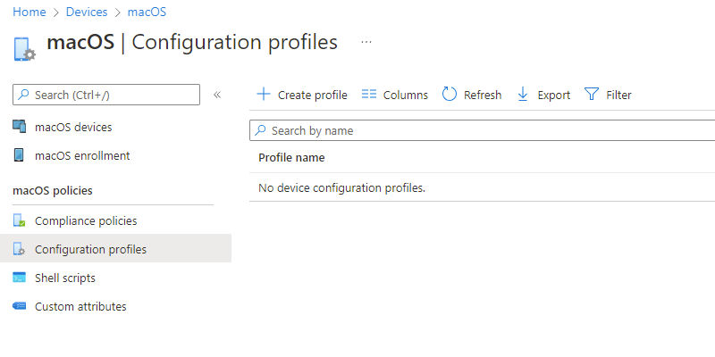
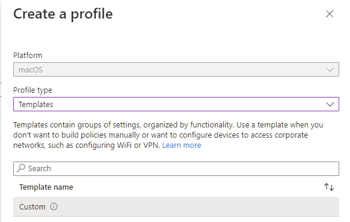
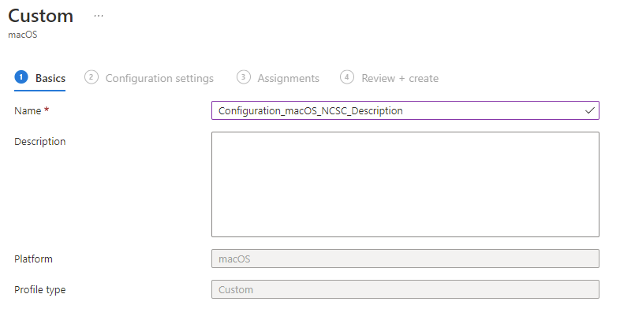
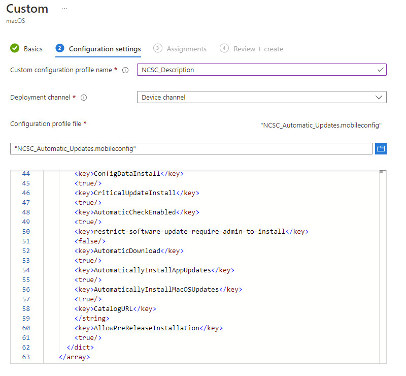

# macOS National Cyber Security Centre Security Settings in Intune

If you've ever had to implement baseline security settings, whether this be Centre for Internet Security (CIS), Cyber Security Essentials (CSE), or National Cyber Security Centre (NCSC), you'll probably have encountered some level of pain when it comes to non-Microsoft devices, as the guidance, is, well, *complicated*.

NCSC do provide documented [guides](https://www.ncsc.gov.uk/collection/device-security-guidance/platform-guides/macos) for macOS along with a [GitHub repo](https://github.com/ukncsc/Device-Security-Guidance-Configuration-Packs/tree/main/Apple/macOS) containing a script and a list of recommended security settings, but what do these look like in Microsoft Intune? And what if you need to make changes? What about if you have exceptions?

## Custom Configuration Template

I'm not going to detail all of these NCSC settings in this post, otherwise I'll do myself out of a job, but I can help with the security settings don't exist natively within the [macOS Device Restriction template](https://docs.microsoft.com/en-us/mem/intune/configuration/device-restrictions-macos).

All the below security settings utilise the **Custom configuration template** for macOS...straight from the horses mouth:
> *"The custom configuration template allows IT admins to assign settings that aren't built into Intune yet. For macOS devices, you can import a .mobileconfig file that you created using Profile Manager or a different tool."*

Sounds perfect right? Details on how to create these profiles are below, but for now, let's look at the NCSC settings and their associated mobileconfig files.

### Automatic Updates

Now the NCSC guidelines advise that Operating System and Software updates should be applied automatically, with no deferral of when they are available or installed.

From the NCSC documentation:

| Setting | Value | Comments |
| :- | :- | :- |
| Defer macOS Updates | `No` | n/a |
| Defer app Updates | `No` | n/a |

This one is pretty definite in what it wants.

Sadly, there isn't an option in Microsoft Intune to enforce this setting, but we can achieve this using a custom profile and generated mobileconfig file.



### Fast User Switching and Automatic Logon

Apparently Fast User Switching is a bad thing, as is automatically logging in, so they want this disabled too.

From the NCSC documentation:

| Setting | Value | Comments |
| :- | :- | :- |
| Enable Fast User Switching | `No` | n/a |
| Disable automatic login | `Yes` | n/a |

I wish they would stick with either 'Enable' or 'Disable', the mixture is headache inducing. However, mobileconfig file to the rescue.



### Hiding System Preferences

This one makes more sense, as you don't want users meddling with certain System Preferences such as, iCloud, Sharing, Startup Disk and Security.

From the NCSC documentation:

| Setting | Value | Comments |
| :- | :- | :- |
| Restrict items in System Preferences | `Yes (disable selected items)` | iCloud Profiles Security & Privacy Startup Disk Sharing (enables remote management) Siri Xsan - If not in use FibreChannel - if not in use |

Now you *could* flat out disable them, but remember, NCSC is a guideline, so we're just going to hide them instead...



### Time Servers

Not so sure on this one, must be down to ensuring that the system time is correct for validation of certificates...maybe.

From the NCSC documentation:

| Setting | Value | Comments |
| :- | :- | :- |
| Time Server | `Specify time server by device location` | Organisations should refer to their MDM documentation for instructions on setting this up |

See what I mean about it being complicated, thanks NCSC.

Anyway, here's the mobileconfig file setting the time servers to be `time.euro.apple.com` if you're in Europe obviously.



### Creating Custom Configuration Profiles

Now that we have the required mobileconfig files, and that you've saved them with that file extension (it's basically glorified XML to be honest), we can look at creating these Custom Configuration Profiles:

Browse to the [macOS Configuration page](https://endpoint.microsoft.com/#blade/Microsoft_Intune_DeviceSettings/DevicesMacOsMenu/configProfiles) and select **Create profile**:

Under **Profile type** select **Templates**, then select **Custom** and then select **Create**:

Give the Custom profile a suitable name and select **Next**:

Give the Custom configuration profile name a suitable name, ensure the Deployment channel is 'Device channel' and upload the mobileconfig file:

Select **Next** and assign the profile to the required Device Group. Repeat for all the mobileconfig files created.

## Summary

This was a bit of a whirlwind tour of Custom Configuration Profiles for macOS, and there is a huge amount that can be controlled, managed, and dictated using them. If you have a macOS device, you can use Apple Configuration 2 to create these files, if you don't, then have fun with the [Apple Developer Device Management Guide](https://developer.apple.com/documentation/devicemanagement), like I did...

