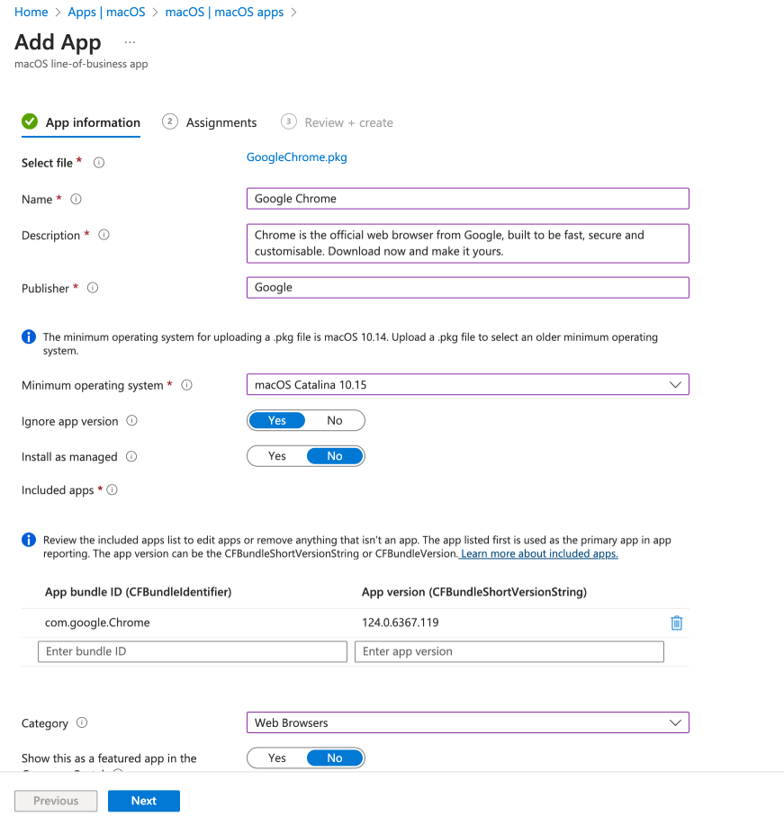
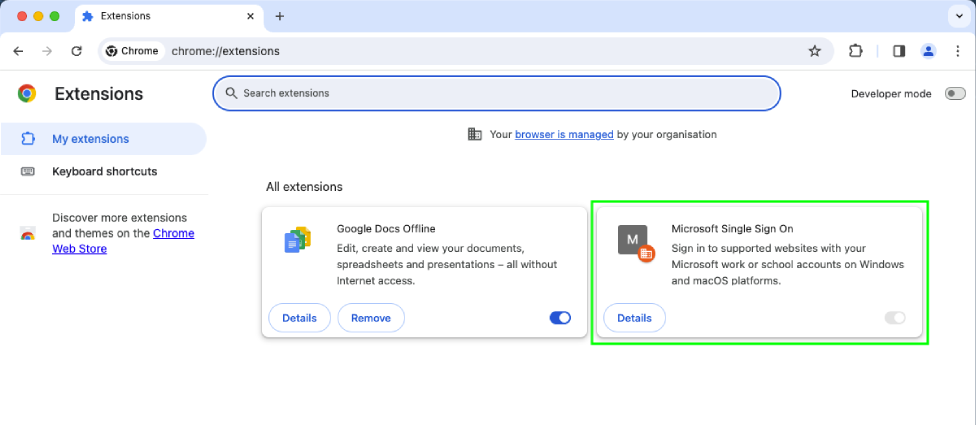

# Configuring Google Chrome on macOS for Platform Single Sign-On

So it's finally here, after all the [coming soon](https://techcommunity.microsoft.com/t5/microsoft-entra-blog/coming-soon-platform-sso-for-macos/ba-p/3902280) announcements, and the promise that we can use Entra ID authentication methods on macOS devices, we now have [Platform SSO](https://learn.microsoft.com/en-us/mem/intune/configuration/platform-sso-macos) at our disposal in Microsoft Intune, well at least in [Public Preview](https://learn.microsoft.com/en-us/mem/intune/fundamentals/public-preview).

I'm not going to deep dive into configuring Platform SSO as I'll assume you've either already had a go yourself, or found [someone else](https://www.intuneirl.com/implementing-platform-sso-for-macos-a-deep-dive-into-configuration-troubleshooting/) who has, as honestly it's now a massive selling point of moving macOS devices into Microsoft Intune away from other MDM solutions.

Now we can use Entra ID account for SSO on the macOS device itself, what about our good friend the web browser, and in particular Google Chrome?

## Browser Support

If like me you've been patiently waiting for Platform SSO to appear, you've probably already looked at the [pre-requisites](https://learn.microsoft.com/en-us/mem/intune/configuration/platform-sso-macos#prerequisites) for configuration, so let's just assume you've done these already, or you're a least aware of them, and if you haven't sorted them, crack on and sort yourself out.

The bit we're interested in is the supported browsers, and *shock*, both Microsoft Edge and Safari are supported out the box already (ish). Google Chrome however needs a little more convincing, as it does on Windows, to work with Single Sign On configurations.

> Platform SSO requires you install and enable the Windows Accounts extension. You can add the app to Intune, and assign it to the devices that use Google Chrome.

That last line is interesting though Microsoft, as deploying Google Chrome extensions isn't as easy as **click** **click** **next** **OK**.

Luckily though, Microsoft have provided links to [setting up Google Chrome on macOS](https://support.google.com/chrome/a/answer/7550274) and how to configure the [forced installation of extensions](https://chromeenterprise.google/policies/?policy=ExtensionInstallForcelist) which we'll be utilising to make Google Chrome and Platform SSO play nicely.

Configuring this extension will not only improve the users sign-in experience, but allow for the use of [Conditional Access Policies](https://learn.microsoft.com/en-us/entra/identity/conditional-access/concept-conditional-access-conditions#supported-browsers) when using Google Chrome:

> macOS devices using the Enterprise SSO plugin require the Microsoft Single Sign On extension to support SSO and device-based Conditional Access in Google Chrome.

## Platform SSO Configuration

Yes, I did say I wasn't going to dig into the Platform SSO configuration, but without actually configuring it we're not going to be able to utilise the authentication method into Google Chrome, so if you cba following the [Microsoft Learn article](https://learn.microsoft.com/en-us/mem/intune/configuration/platform-sso-macos#step-2---create-the-platform-sso-policy-in-intune) have a look at the below, and the exported [JSON](https://github.com/ennnbeee/oddsandendpoints-scripts/blob/main/Intune/Configuration/macOS/PlatformSSO/SSOPlatformSettings.json) which you can [import](https://learn.microsoft.com/en-us/mem/intune/configuration/settings-catalog?tabs=sc-search-filter%2Csc-reporting#import-and-export-a-profile) into your own Microsoft Intune tenant if you're ~~lazy~~ productive with your time.

| Category | Setting | Value |
| :- | :- | :- |
| Authentication | Authentication Method (Deprecated) | `UserSecureEnclaveKey` |
| Authentication | Screen Locked Behavior | `Do Not Handle` |
| Authentication | Registration Token | `{{DEVICEREGISTRATION}}` |
| Authentication | Team Identifier | `UBF8T346G9` |
| Authentication | Extension Identifier | `com.microsoft.CompanyPortalMac.ssoextension` |
| Authentication | Type | `Redirect` |
| Authentication | URLs | `https://login.microsoftonline.com` `https://login.microsoft.com` `https://sts.windows.net` `https://login-us.microsoftonline.com` `https://login.microsoftonline.us` |
| Authentication > Platform SSO | Account Display Name | `MEM v ENNBEE Account` |
| Authentication > Platform SSO | Authentication Method | `UserSecureEnclaveKey` |
| Authentication > Platform SSO | Enable Authorization | `Enabled` |
| Authentication > Platform SSO | Enable Create User At Login | `Enabled` |
| Authentication > Platform SSO | Login Frequency | `64800` |
| Authentication > Platform SSO | New User Authorization Mode | `Standard` |
| Authentication > Platform SSO | Use Shared Device Keys | `Enabled` |
| Authentication > Platform SSO | User Authorization Mode | `Standard` |

This settings catalog profile is configured to use `UserSecureEnclaveKey` for [Passwordless authentication](https://learn.microsoft.com/en-us/entra/identity/authentication/concept-authentication-passwordless#platform-credential-for-macos), but feel free to amend any other settings in the [Microsoft Learn article](https://learn.microsoft.com/en-us/mem/intune/configuration/platform-sso-macos#step-2---create-the-platform-sso-policy-in-intune) as you see fit.

Assigning this to a group of test devices, yes I do actually test things, you should get the glorious device registration and [sign-in experience](https://aka.ms/IntuneForMac) with Entra ID credentials we've all been after.


If you encounter issues with the Entra Join and registration, have a look at the [troubleshooting guide](https://learn.microsoft.com/en-us/entra/identity/devices/troubleshoot-macos-platform-single-sign-on-extension?tabs=macOS14#insufficient-permissions) for Platform SSO, specifically the Entra Join permissions.


## Google Chrome Deployment

With the Platform SSO configuration setup and deployed, we can now focus our attention on how we manage Google Chrome on macOS devices, including delivering the app, as well as configuring it to support the required [Microsoft Single Sign On extension](https://chromewebstore.google.com/detail/microsoft-single-sign-on/ppnbnpeolgkicgegkbkbjmhlideopiji).

I shouldn't be teaching you all to suck eggs, but for completions sake, we should probably go through deploying Google Chrome to your Microsoft Intune enrolled macOS devices, and we've got a couple of ways to do this, depending on whether you want to force install this on your end user devices, or allow the app to be installed by the user.

### Required App Deployment

If you just want to get the latest version of Google Chrome out there to all assigned devices, then the easiest approach is to use a [Shell Script](https://learn.microsoft.com/en-us/mem/intune/apps/macos-shell-scripts) and in particular the one in the [shell-intune-samples](https://github.com/microsoft/shell-intune-samples/tree/master/macOS/Apps/Google%20Chrome) GitHub repository, which will run on a device, got get the latest Google Chrome version download, and install it.

| Setting | Value |
| :- | :- |
| Upload Script | [`installGoogleChrome.zsh`](https://github.com/microsoft/shell-intune-samples/blob/master/macOS/Apps/Google%20Chrome/installGoogleChrome.zsh) |
| Run script as signed-in user | `No` |
| Hide script notifications on devices | `Not configured` |
| Script frequency | `Not configured` |
| Max number of times to retry if script fails | `3 times` |

After your assigned group of test devices check in to Microsoft Intune and the script runs successfully, your devices should download and install Google Chrome.


If you want to see progress or errors with the script, the script log file is located in `/Library/Logs/Microsoft/IntuneScripts/GoogleChrome` on the targetted macOS device.


### Available App Deployment

If you want to make the app available to your end users via the Company Portal, and who doesn't love self-service, then go ahead and download the [pkg installer](https://chromeenterprise.google/browser/download/#mac-tab).

As we're looking to make the app available our only option in Microsoft Intune is to upload the file using the `Line-of-business app`, as [pkg apps](https://learn.microsoft.com/en-us/mem/intune/apps/macos-unmanaged-pkg) although great for pre and post deployment scripts, don't give the option for making apps available in the Company Portal.

| Setting | Value |
| :- | :- |
| Select file | [`GoogleChrome.pkg`](https://chromeenterprise.google/browser/download/#mac-tab) |
| Name | `Google Chrome` |
| Description | `Chrome is the official web browser from Google, built to be fast, secure and customisable. Download now and make it yours` |
| Publisher | `Google` |
| Minimum operating system| `Catalina 10.15` |
| Ignore app version | `Yes` |
| Install as managed | `No` |
| Included apps | `com.google.Chrome 124.0.6367.119` |
| Publisher | `Google` |

Deploying this app to a group of users, will allow your end users to select the option to install Google Chrome on their macOS device from the Company Portal:

Two of many potential methods to install Google Chrome now sorted, onto what we're here for in the single sign on configuration.

## Google Chrome Configuration

Google being quite a large enterprise, realise that you might want to actually configure Google Chrome on your devices, and give you examples of [property list](https://support.apple.com/en-gb/guide/terminal/apda49a1bb2-577e-4721-8f25-ffc0836f6997/) files for configuring the app on macOS devices as part of their [Chrome Browser bundle](https://support.google.com/chrome/a/answer/9020077?hl=en&ref_topic=7650028&sjid=4114433957087609356-EU), but we're looking for specific settings today, around the requirement to force install a specific  of extension to support Platform SSO.

### Custom Configuration Profiles

Using the [examples](https://support.google.com/chrome/a/answer/7517624?hl=en#zippy=%2Cpin-app-or-extension-updates%2Cset-installation-policies-automatically-install-force-install-allow-or-block) provided by Google, we have a basis to create our custom **mobileconfig** file, which when complete, can be uploaded to Microsoft Intune and deployed to our macOS devices.

As we're focusing solely on the forced installation of the [Microsoft Single Sign On extension](https://chromewebstore.google.com/detail/microsoft-single-sign-on/ppnbnpeolgkicgegkbkbjmhlideopiji), we can strip out everything else from the example, and can update the configuration file to install the extension we want.

We need to update the settings under the key **installation_mode** setting the string value to **force_installed**, this in conjunction with the ID of the extension we want to force install **ppnbnpeolgkicgegkbkbjmhlideopiji** (which we can get from the extension URL itself), allows us to configure a custom profile for Google Chrome to ensure that the extension that unlocks all the Platform SSO goodness is deployed to devices with Google Chrome installed.



The other settings in the [profile](https://github.com/ennnbeee/oddsandendpoints-scripts/blob/main/Intune/Configuration/macOS/PlatformSSO/GoogleChromepSSO.mobileconfig) ensure that the profile is installed in the system context and cannot be removed by an end user.


The `PayloadUUID` keys should be unique to your environment, so go ahead and [generate](https://www.uuidgenerator.net/) new ones for your own profile.


### Custom Template

Now armed with our saved **mobileconfig** profile, we can create a new macOS Configuration Profile, using the **Template** profile type, and selecting **Custom**, giving the profile a name ~~by smashing your hand on the keyboard~~ aligned to your naming convention, we can then complete the remaining sections of the profile uploading the **mobileconfig** profile we saved previously:

| Setting | Value |
| :- | :- |
| Custom configuration profile name | `Google Chrome Platform SSO Profile` |
| Deployment channel | `Device channel` |
| Configuration profile file | [`GoogleChromepSSO.mobileconfig`](https://github.com/ennnbeee/oddsandendpoints-scripts/blob/main/Intune/Configuration/macOS/PlatformSSO/GoogleChromepSSO.mobileconfig) |

Give the configuration profile a suitable name, I've gone with **Google Chrome Platform SSO Profile**, as really you're only going to see this on the device itself under the Profile section of System Preferences.


As the custom profile sets the `PayloadScope` as `System` our Deployment channel should be set to **Device channel**.


We should probably assign this profile to our test devices, so go ahead and do that, and after a while we should get some greens:

Checking on the assigned macOS 14 test device itself under **System Preferences > Privacy & Security > Profiles** we can see the profile has installed correctly:

One last thing to look at, and that's the extensions in Google Chrome itself:

It is, and the user is unable to disable or remove it, as why would we want them to?

So what does SSO look like on Google Chrome with Secure Enclave key authentication? Well it's the same process as with Microsoft Edge and Safari:

- A user opens the browser and accesses a Microsoft Entra authenticated service such as **outlook.office.com**.
- If there is a valid token for the user, the user is not prompted to sign-in to the service, otherwise re-authentication with TouchID is required before access.
- Subsequent login prompts to Microsoft Entra authenticated services like **teams.microsoft.com** are now automatically passed through using SSO.

All that to make browser sign-ins a little easier and to allow for the use of [Conditional Access Policies](https://learn.microsoft.com/en-us/entra/identity/conditional-access/concept-conditional-access-conditions#supported-browsers) 😅.


If you encounter issues with Google Chrome SSO, please refer to the [Microsoft Learn](https://learn.microsoft.com/en-us/entra/identity/devices/troubleshoot-macos-platform-single-sign-on-extension?tabs=macOS14#troubleshoot-google-chrome-sso-issues) documentation.


## Summary

Platform SSO on macOS in Microsoft Intune is a big thing, it's likely the last hurdle or excuse people were using to stay away from using a Microsoft product to manage an Apple device.

If you're already in bed with Microsoft and associated services, then something as trivial as where your precious Apple devices are managed shouldn't be stopping you from jumping two footed straight into enrolling your macOS devices into Microsoft Intune, especially now that you can use Entra ID authentication across them.

On top of this, we can now configure the most used browsers on a macOS device to leverage and make use of Platform SSO, to stop users from being bogged down with sign-in prompts that their colleagues on low-spec Windows laptops don't have to deal with.

It's a win win in my books.

