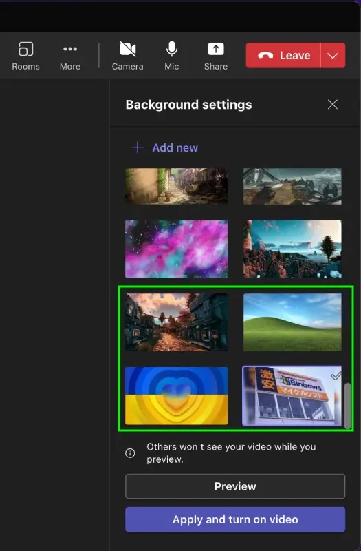

# Deploying Teams Backgrounds to macOS Devices


What happens when a stranger on the Internet asks you to look at something they've got a problem with? Well clearly you jump at the chance and hope that it's not a body part this time. So here we are, looking at how to deploy [Microsoft Teams Backgrounds](https://www.microsoft.com/en-us/microsoft-teams/virtual-meeting-backgrounds) to macOS devices using Intune, for organisations without the licensing to allow for corporate branding using [Microsoft Teams Premium Experience](https://techcommunity.microsoft.com/t5/microsoft-mechanics-blog/microsoft-teams-premium-experiences-and-how-to-set-it-up/ba-p/3697553).

## Teams Meeting Backgrounds

So after a quick search, to add new backgrounds for Teams we need to dump files in **~/Library/Application Support/Microsoft/Teams/Backgrounds**, this directory will exist under the logged in User context, so we're going to need a way to both create an 'Uploads' directory and dump the background files in there.

### Checking for the Teams App

Before we start throwing files in a directory, we should probably check to see if Teams is actually installed, luckily having spent many evenings peering over the macOS Shell Scripts hosted in [Intune Shell Scripts](https://github.com/microsoft/shell-intune-samples), we can use the [Dock Customisation](https://github.com/microsoft/shell-intune-samples/tree/master/macOS/Config/Dock) script, as there's a section in there that waits for the detection of apps before allowing the script to continue.

So we'll pinch that section and update it so it's only checking for the **Microsoft Teams.app**

```Bash {hl_lines=["1","5"]}
teamsapp="/Applications/Microsoft Teams.app"

while [[ $ready -ne 1 ]]; do
  missingappcount=0
  if [[ -a "$teamsapp" ]]; then
    echo "$(date) |  $teamsapp is installed"
  else
    let missingappcount=$missingappcount+1
  fi
  echo "$(date) |  [$missingappcount] application missing"

    if [[ $missingappcount -eq 0 ]]; then
    ready=1
    echo "$(date) |  Teams App found, lets prep the dock"
  else
    echo "$(date) |  Waiting for 10 seconds"
    sleep 10
  fi
done
```

This will sit and wait for Teams to be detected, so make sure you've either already deployed Teams to your devices and/or have a 'Required' install intent for either Microsoft Teams or Microsoft Office, in Intune.

### Getting the Logged in User

Like the [Dock Customisation](https://github.com/microsoft/shell-intune-samples/tree/master/macOS/Config/Dock) script, we can run the script from Intune as the signed-in user, and  as we're dealing with data in the User context, this makes the most sense. We can capture the signed-in user using the built-in `$HOME` variable, and creating a new `teamsUpload` variable to use later.

```Bash
teamsUpload="$HOME/Library/Application Support/Microsoft/Teams/Backgrounds/Uploads"
```

### Checking the Background Directory

Right, that was easier than I thought, we should look at how to check if the directory exists, and if not create it.

```Bash
if [[ -d ${teamsUpload} ]]
then
    echo "$(date) | Teams Background Upload dir [$teamsUpload] already exists"
else
    echo "$(date) | Creating [$teamsUpload]"
    mkdir -p "$teamsUpload"
fi
```

Now onto how we get files in the directory, without just copy and pasting.


You may have noticed by now that I'm not explaining in much depth how the Shell commands work, well that's because I'm still on a steep learning curve myself. Bear with me here, it ain't PowerShell is it.


## Deploying Files with Shell Scripts

I already know there's a working method to deploy a [Desktop Background](https://github.com/microsoft/shell-intune-samples/tree/master/macOS/Config/Wallpaper) to a macOS device enrolled in Microsoft Intune. So we'll do what any right minded Consultant would do, and ~~steal~~ modify the script to our needs.

### Script Variables

The original script used a single variable `wallpaperurl` to capture the desktop wallpaper URL, which is nice and all, and obviously fits the Desktop Background purpose, but we'd like to give our users options of Teams Backgrounds, so we'll use an [array](https://www.freecodecamp.org/news/bash-array-how-to-declare-an-array-of-strings-in-a-bash-script/) to hold our list of URLs to the background files (see I am learning).

```Bash {hl_lines=["6-7"]}
backgroundurls=("https://memv.ennbee.uk/bgr.png" "https://memv.ennbee.uk/wp-lt.png" "https://memv.ennbee.uk/wp.png")
```

For any additional URLs, you can add a new line to the array.


This lack of a `$` when configuring new variables is unsettling me if I'm honest, but we move.


### Downloading with Curl

Pretty simple really, even I can use [curl](https://curl.se/docs/manpage.html) to download the background files to the directory location `-L`, passing in the URL and a filename as part of the output `-o` option. We've added the `-s' so as to not clog the log file with the raw download data.

```Bash
curl -s -L -o $teamsUpload/$backgroundfile $backgroundurl
```

We now need to loop through each of the items in the `backgroundurls` array, and we also need to give each a filename for `backgroundfile` that isn't duplicated, otherwise we'll end up downloading and overwriting the same file for each URL in the array.

### Incremental Filenames

We can quickly create new file names as part of the `for` loop needed for the items in the array, by [incrementing a variable](https://linuxize.com/post/bash-increment-decrement-variable/), and appending that variable to the `backgroundfile` variable.

```Bash {hl_lines=["4"]}
i=0
for backgroundurl in "${backgroundurls[@]}"; do
  ((i=i+1))
  backgroundfile="TeamsBackground$i.png"
...
done
```

This will make sure that each downloaded background file gets a new filename, this won't cater for multiple initiations of the script, but remember, I'm still new at this.

## Teams Background Script

The [full script](https://github.com/ennnbeee/oddsandendpoints-scripts/blob/main/Intune/PlatformScripts/Shell/TeamsBackgrounds/downloadTeamsBackground.sh) looks pretty much like the below, which is just a squishing together of the bits we've already covered in this post.



Time to add this into Intune and reap the rewards.

### Intune Shell Scripts

As with everything Microsoft, there are some requirements and limitations with using [Shell Scripts for macOS](https://learn.microsoft.com/en-us/mem/intune/apps/macos-shell-scripts) so have a read before you blindly start trying to push out scripts to your device estate. After you've read these requirements, create a new Shell Script with the below settings.

| Setting | Value |
| :- | :- |
| Shell script | `downloadTeamsBackground.sh` |
| File contents| `Uploaded Script` |
| Run script as signed-in user | `Yes` |
| Hide script notifications on devices | `Not Configured` |
| Script frequency | `Not Configured` |
| Max number of times to retry if script fails | `3 times` |

Looking a little like the below.


Now we've added the Shell Script, this can be deployed to the 'All Users', 'All Devices' groups (Don't do this as we don't have Device Filters to use) or Groups of your choosing.

## Checking Microsoft Teams

With the Script deployed from Intune and assigned to a group of devices, we can check on the devices themselves to make sure that the script has run successfully using the log file, checking that the new backgrounds have downloaded to the correct directory, and that these backgrounds appear in Microsoft Teams.

### Script Logging

As per the configured variable in the script, we can find the log **$HOME/Library/Logs/Microsoft/Intune/Scripts/SetTeamsBackground/SetTeamsBackground.log**, opening it we can check on the status of the downloads.


Everything looks solid we should check the download directory.

### Background Directory

As we can see three files in the Uploads directory, all named appropriately.


### Teams Background Effects

Last check is in a Microsoft Teams meeting.



All good here as well, we can relax and have a coffee.


If Microsoft Teams was open when the backgrounds were deployed, it will need a restart to pick up the new backgrounds. I did think about force quitting the app, but didn't think users would appreciate that.


## Summary

This was a pretty straight forward method to deploy backgrounds to Microsoft Teams using [Intune Shell Scripts](https://learn.microsoft.com/en-us/mem/intune/apps/macos-shell-scripts), and not a bad start to my journey into advanced management of macOS devices (despite actually being a macOS user). I'd recommend familiarising yourself with the [Intune Shell Samples](https://github.com/microsoft/shell-intune-samples), as this is where started when hacking about with Shell scripts for macOS devices.

Or you could just pay for [Microsoft Teams Premium](https://www.microsoft.com/en-us/microsoft-teams/premium), but where's the fun in that?

