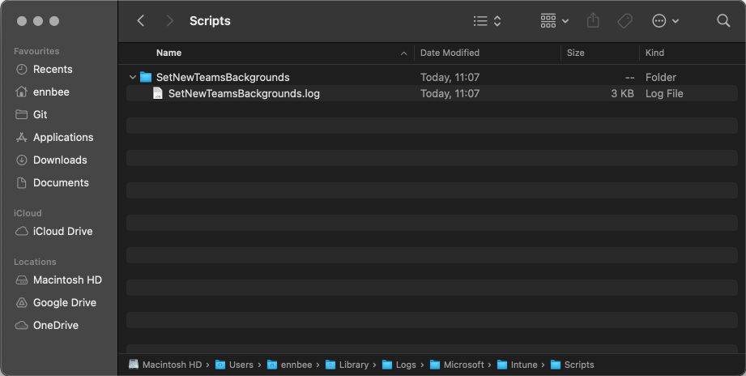
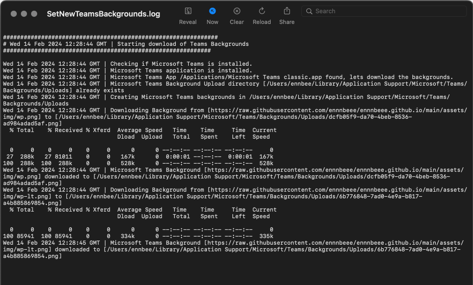
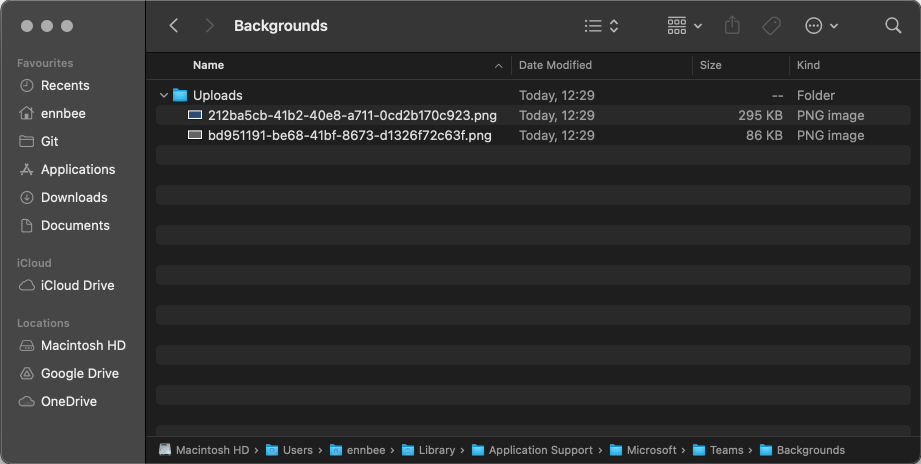
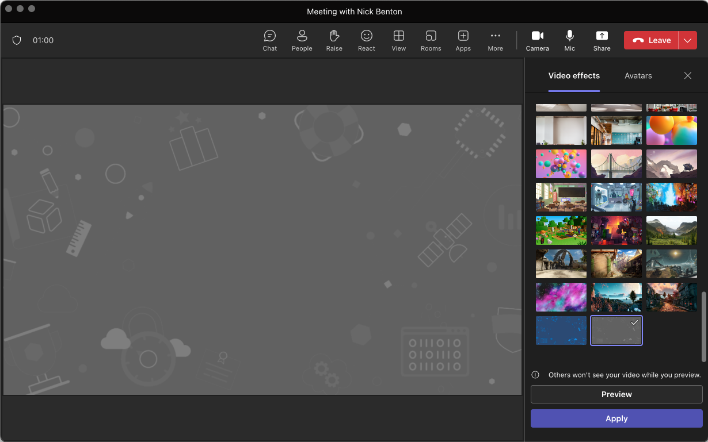
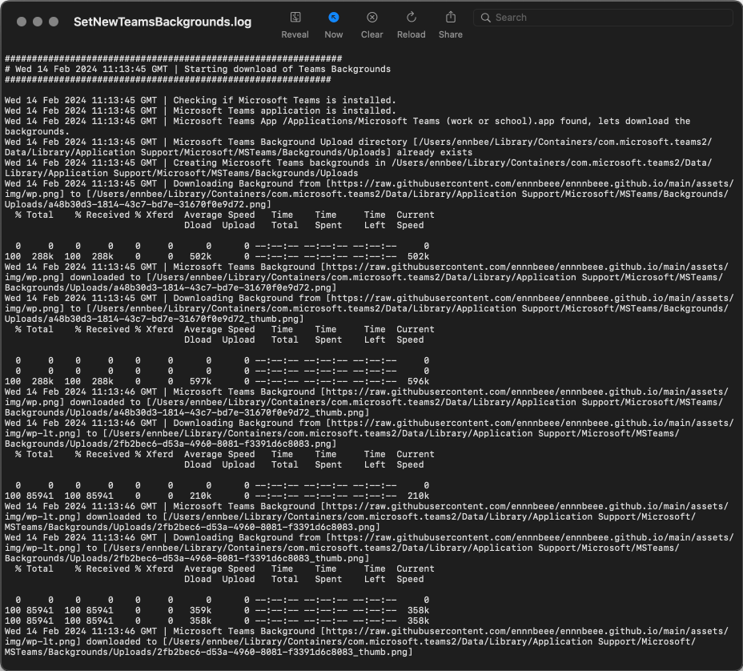
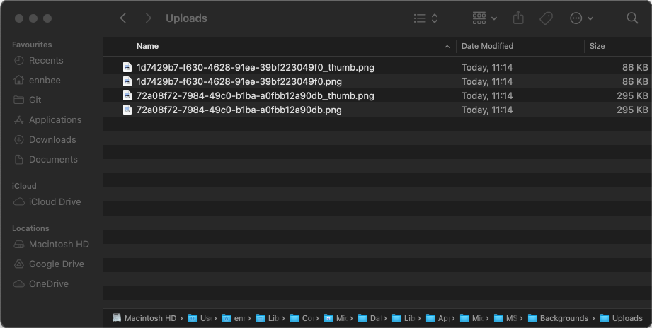
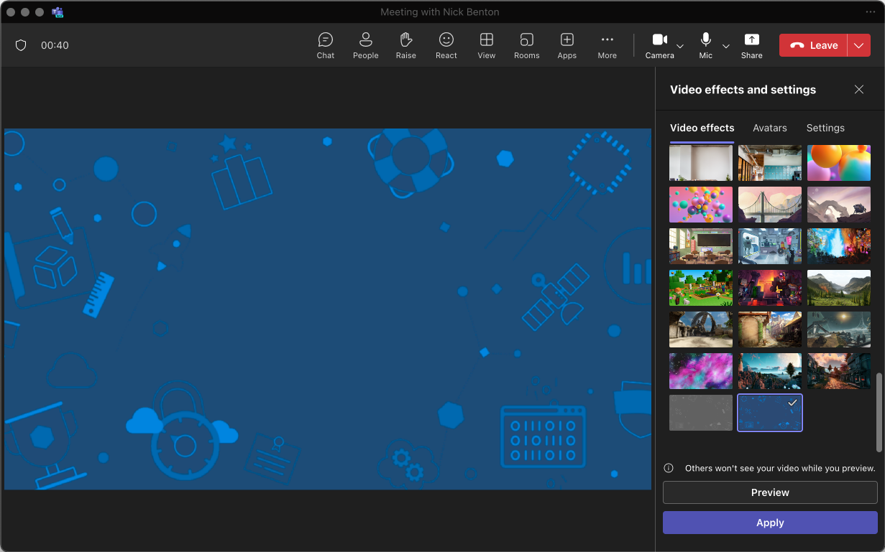

# Custom Backgrounds for macOS New and Classic Microsoft Teams Apps


This isn't the first time we've looked at deploying  for Microsoft Teams on macOS, but it's been a while since we answered an internet strangers question, and hopefully my scripting has come on a little way since then (spoiler: it hasn't).

Now that the 'New' Microsoft Teams app is the de facto version available to download from Microsoft replacing the 'Classic' one, we should at least look at how it handles uploaded backgrounds and if required update our existing script to support not only the 'Classic' version, but the 'New' version too.

## Application Differences

Before we go digging into the existing script to work out what has broken with the new version of app, we should check to see what, if any differences there are across both version for the purpose of our script.

### Uploaded Background Locations

Digging around the internet, and on a macOS device with both apps installed, we can see that uploaded backgrounds from the client itself are stored in the below locations:

- Classic App - `$HOME/Library/Application Support/Microsoft/Teams/Backgrounds/Uploads`
- New App - `$HOME/Library/Containers/com.microsoft.teams2/Data/Library/Application Support/Microsoft/MSTeams/Backgrounds/Uploads`

So this is similar to the change in uploaded background location for the Windows version that [Florian Salzmann](https://mvp.microsoft.com/en-us/PublicProfile/5005162) found in their [post](https://scloud.work/new-teams-virtual-background-with-intune/) about updating backgrounds for the new Windows Teams client.

### Application Name

Another thing to note, is how we were detecting whether the Teams app was installed, referencing the app name, which has also changed, only slightly though but it is still a change:

- Classic App - `Microsoft Teams classic.app`
- New App - `Microsoft Teams (work or school).app`

Great, so we need to take into account the file path change, and the app name change. Anything else Microsoft?

### Background File Names

Yes, obviously. When testing the upload of a background in the 'New' app, I noticed that the background files are renamed to a [UUID](https://en.wikipedia.org/wiki/Universally_unique_identifier) and created a thumbnail file of the same background, so something similar to the below.

`898ffbba-4997-4911-b2ab-b5d8ef4998d2.png` and `898ffbba-4997-4911-b2ab-b5d8ef4998d2_thumb.png`

OK, so we'll need a way to generate a UUID whilst we're at it. The 'Classic' app doesn't care what the files are called, which might be useful.

## Background Deployment Script

Let's start at least with the  and amend or update it to take into consideration the following:

- Detection of whether a Teams app is installed.
- Detection of which of the 'Classic' or 'New' apps is installed.
- Managing which directory is used for the uploaded backgrounds.
- Managing the use of a UUID for the background files for the 'New' app.

Not a lot to consider, and with our new found exposure to Shell scripts, we should be more than capable :neutral_face:.

### Variables and Logs

As the uploaded backgrounds will reside within the context of the user signed in to the macOS device, we need to ensure that the script, when running from Microsoft Intune is also running under the user context.

This means that the log file stored in path set by the `logAndMetaDir` variable, must be accessible to the user, hence the choice and use of the built-in variable `$HOME`.

You should update the `backGroundUrls` array variable with the URLs for the backgrounds you want to use in Microsoft Teams, otherwise everything will look like I branded it.

```Bash
backGroundUrls=("https://raw.githubusercontent.com/ennnbeee/ennnbeee.github.io/main/bgr.png"
  "https://raw.githubusercontent.com/ennnbeee/ennnbeee.github.io/main/img/featured.png")

scriptName="SetNewTeamsBackgrounds"
logAndMetaDir="$HOME/Library/Logs/Microsoft/IntuneScripts/$scriptName" # Running under the user context
log="$logAndMetaDir/$scriptName.log"

if [ -d $logAndMetaDir ]; then
    echo "# $(date) | Log directory already exists - $logAndMetaDir"
else
    echo "# $(date) | Creating log directory - $logAndMetaDir"
    mkdir -p "$logAndMetaDir"
fi
```

We're covering off the logic to create the log file directory whilst we're at it, so we can at least write the output of the script to a file `log` in this location.

### Checking versions of the Teams App

Having spent a lot of time browsing the [shell-intune-samples](https://github.com/microsoft/shell-intune-samples) GitHub repo, and testing a number of these scripts, the [Dock](https://github.com/microsoft/shell-intune-samples/tree/master/macOS/Config/Dock) script caught my eye, as it was updated to detect which version of Teams is installed when attempting to add it to a Dock configuration.

So I've taken the existing function, and updated it for our purpose, to not only set the `teamsApp` variable of the app, but also the `teamsUpload` variable for the path to the uploaded background folders.

```Bash
function checkAndSetInstalledMSTeamsPath () {
    if [[ -a "/Applications/Microsoft Teams.app" ]];then
      teamsApp="/Applications/Microsoft Teams.app"
      teamsUpload="$HOME/Library/Application Support/Microsoft/Teams/Backgrounds/Uploads"
    elif [[ -a "/Applications/Microsoft Teams classic.app" ]];then
      teamsApp="/Applications/Microsoft Teams classic.app"
      teamsUpload="$HOME/Library/Application Support/Microsoft/Teams/Backgrounds/Uploads"
    elif [[ -a "/Applications/Microsoft Teams (work or school).app" ]]; then
      teamsApp="/Applications/Microsoft Teams (work or school).app"
      teamsUpload="$HOME/Library/Containers/com.microsoft.teams2/Data/Library/Application Support/Microsoft/MSTeams/Backgrounds/Uploads"
    elif [[ -a "/Applications/Microsoft Teams (work preview).app" ]]; then
      teamsApp="/Applications/Microsoft Teams (work preview).app"
      teamsUpload="$HOME/Library/Containers/com.microsoft.teams2/Data/Library/Application Support/Microsoft/MSTeams/Backgrounds/Uploads"
    fi
}
```

We can now call this function to populate the two defined variables, and also detect whether the variable is empty to detect whether Teams is actually installed or not.

### Detecting if Teams is Installed

We've configured two variables here, `ready` and `teamsMissing`, this allows us to continue the running of the script until Teams is actually detected, and in the event that it is installed, will allow the script to continue.

```Bash
ready=0
while [[ $ready -ne 1 ]];do
  teamsMissing=0
  checkAndSetInstalledMSTeamsPath
  if [[ -z "$teamsApp" ]]; then
    let teamsMissing=$teamsMissing+1
    echo "$(date) | Microsoft Teams application is missing."
  else
    echo "$(date) | Microsoft Teams application is installed."
  fi

  if [[ $teamsMissing -eq 0 ]]; then
    ready=1
    echo "$(date) | Microsoft Teams App $teamsApp found, lets download the backgrounds."
  else
    echo "$(date) | Waiting for 10 seconds before trying again."
    sleep 10
  fi
done
```

Ensure that you are deploying one of the app versions to your macOS devices using Microsoft Intune, before deploying the script, otherwise it's going to sit there and run in the background.

### Creating the Uploads Directory

Now that we're on the move the download of the files to the correct background upload directory, we should detect whether the directory exists, and if not create it.

```Bash
if [[ -d ${teamsUpload} ]]
then
    echo "$(date) | Microsoft Teams Background Upload directory [$teamsUpload] already exists"
else
    echo "$(date) | Creating directory [$teamsUpload]"
    mkdir -p "$teamsUpload"
fi
```

For the 'Classic' app, unless you have actually uploaded a background through the client yourself, this directory doesn't exist.

### Downloading the Backgrounds

As mentioned, the 'New' app needs the files stored with UUID filenames, and the 'Classic' app doesn't care, as this is the case, we can just use a UUID file name for both scenarios.

Generating a UUID on macOS we can use `uuidgen`, and we've converted the output of this command to lowercase, assigning two new variables `backgroundFile` and `backgroundThumb` to use the `uuid` variable in their file name.

So looping through each `backGroundUrl` in the `backGroundUrls` array, we can go and download the file to the relevant directory, saved with the UUID file name.

```Bash {hl_lines=["2"]}
for backGroundUrl in "${backGroundUrls[@]}"; do
  uuid=$(uuidgen | tr "[:upper:]" "[:lower:]")
  backgroundFile=$uuid.png
  backgroundThumb=${uuid}_thumb.png

  curl -L -o "$teamsUpload/$backgroundFile" $backGroundUrl

  if [[ $teamsUpload = *Containers* ]];then
    curl -L -o "$teamsUpload/$backgroundThumb" $backGroundUrl
  fi
done
```

We've added in logic to detect whether the `teamsUpload` path variable is for the 'New' app, and if it is, to download the background file but save it with the require `_thumb` in the filename.

## Deploying the Script

With the [script](https://github.com/ennnbeee/oddsandendpoints-scripts/blob/main/Intune/PlatformScripts/Shell/TeamsBackgrounds/downloadNewTeamsBackgrounds.sh) to hand, we can now use [Microsoft Intune Shell Scripts](https://learn.microsoft.com/en-us/mem/intune/apps/macos-shell-scripts) to deploy the script to our device estate with the below settings, having uploaded the downloaded file.

| Setting | Value | Description |
| :- | :- | :- |
| Run script as signed-in user | `Yes` | The background upload directory is a user directory. |
| Hide script notifications on devices | `Yes` | Don't tell users things are happening. |
| Script frequency | `Not Configured` | We don't want the script to run multiple times. |
| Max number of times to retry if script fails | `3 times` | If Teams isn't installed and the device is restarted, we need a way to re-run the script. |

Assign this to a test group of macOS devices that has one of the Microsoft Teams apps installed, otherwise you'll be waiting a long time to see the results.

### Shell Script Results

Once a device has checked in to Microsoft Intune, and a user is signed in to the device, the script should run, storing the log file in the location defined in the variable.

So for this device it's `Users/ennbee/Library/Logs/Microsoft/IntuneScripts/SetNewTeamsBackgrounds`



We can now check our test devices, one running the 'Classic' app, and one the 'New' app to see what has actually happened.

### 'Classic' Teams Results

Opening the log file, we can see the results of the script running on a device with the 'Classic' app.



With the files downloaded to the `Users/ennbee/Library/Application Support/Microsoft/Teams/Backgrounds/Uploads` directory.

Having a look in the directory location, we can see that two new files exist, both with UUID based filenames.



Opening 'Classic' Teams, we can now see and use these uploaded backgrounds.



### 'New' Teams Results

It's a similar story with the 'New' apps, with the log showing successful download of the backgrounds to `Users/ennbee/Library/Containers/com.microsoft.teams2/Data/Library/Application Support/Microsoft/MSTeams/Backgrounds/Uploads`.



This time we also have the creation of the thumbnail files in the same directory.



When opening the 'New' Teams app (notice the icon in the top left), we have the uploaded backgrounds available as well.




If the Teams app is already open when the script runs to download the new backgrounds, they won't be available until the app is closed and re-opened.


## Summary

It's been a while since I've had to put together a new Shell script for macOS, but with Microsoft investing more functionality for macOS devices in Microsoft Intune, and with recent updates to the [shell-intune-samples](https://github.com/microsoft/shell-intune-samples) GitHub repo, now is a great time to look at how to better manage your macOS device estate using the new tooling and capabilities.

Being a personal macOS user, but a professional Windows 11 user, it's a pretty exciting time that Microsoft Intune is providing more and more support for macOS devices at an enterprise level.

However until there is native ability to deploy backgrounds (for free) to your macOS Teams clients, you'll have to rely on people like me spending their ~~spare~~ time writing hacky looking Shell scripts 😅.

