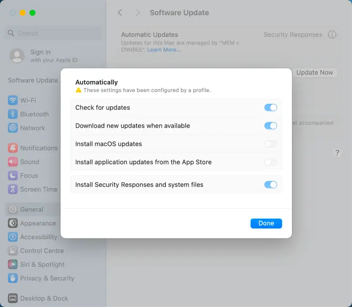
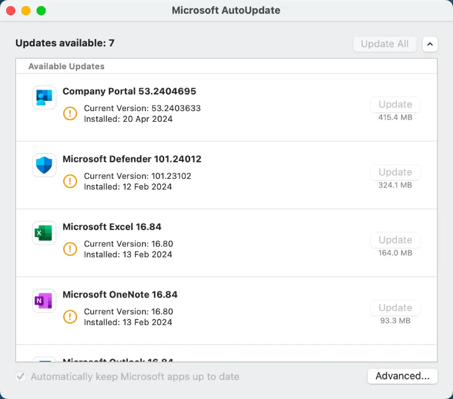

# Software Update Deployment Rings for Managed macOS Devices

So you've pulled the trigger on managing macOS devices in Microsoft Intune, and with this year being the year of macOS for Microsoft (this seems like an oxymoron), you should probably look at how to handle software updates.

I've been waiting a little while to put this post together, as unlike the monthly release of Windows Updates, macOS updates come few and far between, with the recent release of Sonoma 14.4 on March 7th 2024, giving me an actual update to test any phased update configurations. Though maybe I should have got this post out sooner looking at the reception that the update has gotten since its release.

Either way, as Microsoft Intune is now a safe space for macOS device management, instead of the mild headache it used to be, we can now look at how we control the update of software on these devices, so macOS users don't escape the same fate placed upon your normal everyday Windows user.

## Update Configuration Precedence

I wish this was as straight forward as Windows Update Rings, but it isn't, and with the recent changes to macOS device management in Microsoft Intune, we now have [three different ways](https://learn.microsoft.com/en-us/mem/solutions/end-to-end-guides/macos-endpoints-get-started#software-updates) to control updates on these devices.

I'm not sure we needed all three, but there is a clear documented hierarchy for the settings, along with which versions of macOS support each. In summary though, the precedence of update configuration profiles looks like this:

1. Managed software updates - **Settings catalog > Declarative Device Management > Software Update**
2. Update policies - **Devices > Update policies for macOS**
3. Software updates - **Settings catalog > System Updates > Software Update**

I'm going to avoid numbers 1 and 2, and although this goes against my love of all things latest and greatest, and leans on the user to install updates, it does give us the functionality of phased updates we require, and without reliance on specific versions of the operating system.

## Deployment Approach

As with our previous look at update deployment across , we're going to split our macOS device estate into key deployment groups, this time we're back with four, I'll explain why later.

Sticking with the Pilot, Pre-production, and production deployment approach, we end up with something like the below:

- **Pilot** - This should be a stratified sample of either users or devices, ~5% of your device estate.
- **Pre-Production** -  The early adopters deployment, ~15% of your device estate.
- **Initial Production** - The first production deployment, ~30% of your device estate.
- **Final Production** - The final production deployment, the remaining ~50% of the device estate.

These groups can be used not just for macOS software updates, but also with some additional configuration, Microsoft Updates as well. What a world we live in.

### Deployment Groups

As we like to please Microsoft, we're going to use what are referred to as [efficient groups](https://techcommunity.microsoft.com/t5/intune-customer-success/support-tip-improving-the-efficiency-of-dynamic-group-processing/ba-p/4049394), stopping the use operators like `match`, in the hope that they reinstate Microsoft Developer Intune subscriptions for free.

| Group | Type | Membership |
| :- | :- | :- |
| Pilot Group | Assigned | `TBC` |
| Pre-Production Group  | Dynamic Device | `(device.deviceManagementAppId -ne null) and (device.deviceOSType -eq "MacMDM") and (device.deviceOwnership -eq "Company") and ((device.deviceId -startsWith "0") or (device.deviceId -startsWith "1") or (device.deviceId -startsWith "a"))` |
| Initial Production Group  | Dynamic Device | `(device.deviceManagementAppId -ne null) and (device.deviceOSType -eq "MacMDM") and (device.deviceOwnership -eq "Company") and ((device.deviceId -startsWith "2") or (device.deviceId -startsWith "3") or (device.deviceId -startsWith "4") or (device.deviceId -startsWith "b") or (device.deviceId -startsWith "c"))` |
| Final Production Group  | Dynamic Device | `(device.deviceManagementAppId -ne null) and (device.deviceOSType -eq "MacMDM") and (device.deviceOwnership -eq "Company") and ((device.deviceId -startsWith "5") or (device.deviceId -startsWith "6") or (device.deviceId -startsWith "7") or (device.deviceId -startsWith "8") or (device.deviceId -startsWith "9") or (device.deviceId -startsWith "d") or (device.deviceId -startsWith "e") or (device.deviceId -startsWith "f"))` |

These groups will naturally split your macOS device estate across the three pre-production and production dynamic groups, allowing for suitable phasing of the delivery of updates.

With the Pilot group, you should add devices into this group that you want to get updates the earliest, so actual pilot devices here please, not your own or your work besties.

### Deployment Assignments

To ensure that we aren't getting conflict with policy assignment, we need to ensure a device is receiving more than one update policy, whether this is a Software Update or otherwise 😉.

As we've got the Dynamic Groups ring-fencing devices based on `device.deviceId`, the only conflict we may encounter is with the assigned group.

To alleviate that conflict, we need to ensure that all our update ring assignments are excluding this group:

| Update Ring | Included Groups | Excluded Groups |
| :- | :- | :- | :- |
| Pilot | Pilot Group | - |
| Pre-Production | Pre-Production Group | Pilot Group |
| Initial Production | Initial Production Group | Pilot Group |
| Final Production | Final Production Group | Pilot Group |

This approach can be used across all update assignment settings covered in the rest of this post.

## Software Update Configuration

Before we start looking at the option to [delay or defer](https://learn.microsoft.com/en-us/mem/intune/protect/software-updates-macos#delay-visibility-of-updates) software updates, we need to create a baseline configuration that sets devices update preference settings, to allow for this phased approach of update delivery.

So with a quick Settings Catalog profile created with the below settings, and assigned to your devices, we can ensure that the devices will get the updates they need, but when we tell them:

| Category | Setting | Value |
| :- | :- | :- |
| Software Update | Config Data Install | `True` |
| Software Update | Automatic Check Enabled | `True` |
| Software Update | Allow Pre Release Installation | `False` |
| Software Update | Critical Update Install | `True` |
| Software Update | Restrict Software Update Require Admin To Install | `False` |
| Software Update | Automatic Download | `True` |

You'll notice that for `Critical Update Install` and `Config Data Install` we're allowing these to just happen, you should, as they're important. What we want to control is when devices get OS updates, not leaving gaping security flaws in devices.

### Phased Software Updates

The phasing of Software update is a little bit of a pain, but it can be achieved using the below settings, creating one Settings Catalog profile for each deployment group. Now you don't get the same pause and uninstall functionality as you would with Windows Update Rings, but at least you're not pushing out updates all at once to devices.

| Update Ring | Automatically Install App Updates | Automatically Install Mac OS Updates | Force Delayed App Software Updates | Force Delayed Software Updates | Enforced Software Update Delay | Enforced Software Update Non OS Deferred Install Delay | Enforced Software Update Minor OS Deferred Install Delay |
| :- | :- | :- | :- | :- | :- | :- | :- |
| Pilot | `True` | `True` | `False` | `False` | `-` | `-` | `-` |
| Pre-Production | `False` | `False` | `True` | `True` | `5` | `5` | `5` |
| Initial Production | `False` | `False` | `True` | `True` | `9` | `9` | `9` |
| Final Production | `False` | `False` | `True` | `True` | `12` | `12` | `12` |

These phased deployment of updates across the groups, will ensure that there is enough time between each phase to identify any issues (*cough* like with Sonoma 14.4 *cough*), allowing for some level of testing of updates prior to a full deployment across your whole macOS device estate.


When assigning these profiles to the created deployment groups, ensure that you are excluding the `Pilot` group from the pre-production and production profiles.


### Software Update Results

Seeing the Settings Catalog profiles in action, with a first look at the configuration being applied:

Looks good, and matches what we've configured in our baseline software update profile.

Checking on the status of the updates, we've actually got Sonoma 14.4 available on this device, regardless of the deployment group it's a member of, as 7+12=19 (quick maths) which is less than the date of this post:

Luckily we'll be ready with our configured deferral settings for the next macOS software update release, and I hope it goes a little better than this release.

## Microsoft AutoUpdate Settings

Bringing additional functionality to our update deployments, and to allow for the management of visibility and installation of any update covered under the Microsoft AutoUpdate (MAU) application, we need to to implement some more baseline settings to configure Microsoft AutoUpdate.

So go create yourself another  Settings Catalog profile, and throw the below settings into it:

| Category | Setting | Value |
| :- | :- | :- |
| Microsoft AutoUpdate (MAU) | Disable Office Insider membership | `True` |
| Microsoft AutoUpdate (MAU) | Enable AutoUpdate | `True` |
| Microsoft AutoUpdate (MAU) | Number of minutes for the final countdown timer | `60` |
| Microsoft AutoUpdate (MAU) | Register app on launch | `True` |
| Microsoft AutoUpdate (MAU) | Update channel | `Current Channel` |
| Microsoft AutoUpdate (MAU) | Update check frequency (mins) | `240` |

Feel free to amened the `Number of minutes for the final countdown timer` and `Update check frequency (mins)` if you like your user base more than I do.


Updated the `Enable AutoUpdate` settings based on feedback from [Somesh Pathak (MVP)](https://www.linkedin.com/in/somesh-pathak-mvp-mct/)


### Phased Microsoft Updates

To phase the delivery of Microsoft Application updates across the four deployment groups, you will need to create four separate Settings Catalog profiles with the below settings, with restrictions configured to stop users checking for updates and relying on the deferral and deadline settings where applicable.

| Update Ring | Enable check for updates | Deferred updates | Days before forced updates |
| :- | :- | :- | :- |
| Pilot | `True` | `-` | `-` |
| Pre-Production | `False` | `Defer 3 days` | `2` |
| Initial Production | `False` | `Defer 7 days` | `2` |
| Final Production | `False` | `Defer 7 days` | `5` |

You can now see why I stuck with four deployment groups, as we love working within the National Cyber Security Centre guidelines to ensure that updates are installed in that wonderful 14-day window, and the Microsoft AutoUpdate configuration only allows set values for `Deferred updates`.


When assigning these profiles to the created deployment groups, ensure that you are excluding the `Pilot` group from the pre-production and production profiles.


### Microsoft Update Results

Checking in on a device that is set to defer and delay the installation of Microsoft Updates, we can see that the profile has applied correctly:

With no ability for the end user to install the updates on their own, and the correct configuration applied to the device we're off to a good start.

Let's look at the updates themselves:

Perfect, the Microsoft AutoUpdate application has detected that there are actually updates, but will adhere to the deferral and deadline settings, ensuring that the application updates do get installed, but when we want them to, not at the whim of the end user.

## Summary

With each deployment group now configured to get update deferrals and installation deadlines for Software, Operating System, and Microsoft Applications aligned to the same day, we have the ability to unify the deployment approach of updates to Microsoft Intune managed macOS devices.

This may not give us all the functionality we want just yet, still relying on users to carry out installations, but until there is another flexible approach to enforced software updates that doesn't rely on check-in or day of the week, or [scripts and property lists](https://www.intuneirl.com/cool-clicks-swift-kicks-the-mac-admins-guide-to-seamless-reboots/), or community tools like [nudge](https://github.com/macadmins/nudge), this will have to do.

We are at least, one step closer to getting some level of feature parity between device management for Windows devices and macOS devices in Microsoft Intune, and with more on the horizon, it's a good time to be a hybrid macOS and Windows device consultant.



