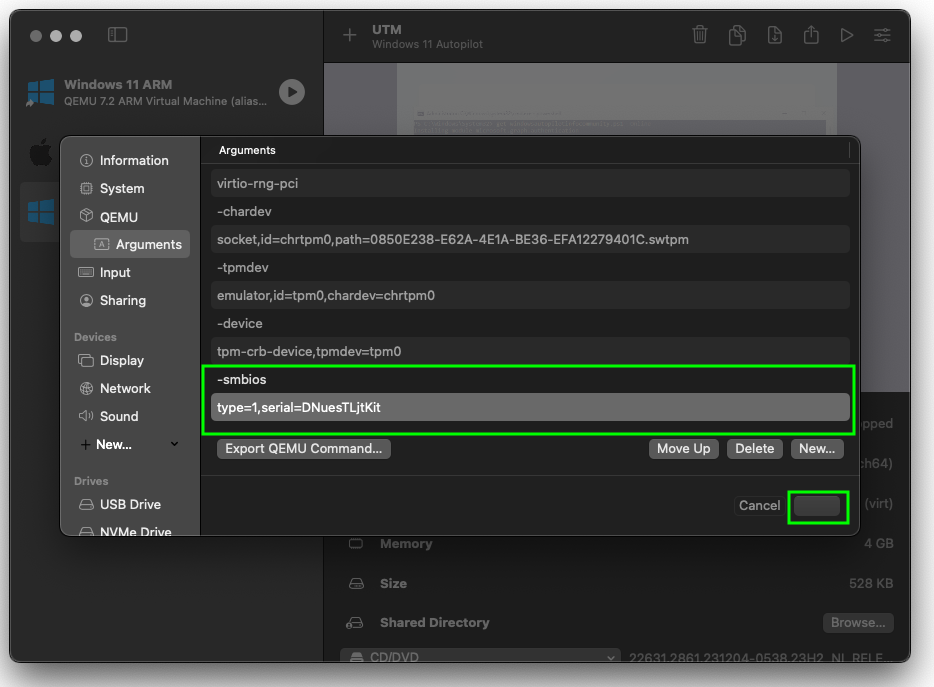

# Creating Windows Autopilot Virtual Machines on macOS


I don't usually write "how-to" guides, let alone write topics that aren't deeply embedded with Microsoft Intune or PowerShell, but I recently hit an issue when trying to setup a [Windows Autopilot](https://learn.microsoft.com/en-us/autopilot/windows-autopilot) ARM based virtual machine using [UTM](https://mac.getutm.app/) on my Apple Silicon (humble brag) based macOS device.

With the recent announcement of the [next generation of Windows Autopilot](https://techcommunity.microsoft.com/t5/microsoft-intune-blog/windows-deployment-with-the-next-generation-of-windows-autopilot/ba-p/4148169) and [Windows Autopilot device preparation](https://learn.microsoft.com/en-us/autopilot/device-preparation/overview) now being official, I imagine there are now more and more people that are using macOS devices but need to test Windows Autopilot in a Virtual Machine, and thought, ~~here's an easy on trend blog post~~, that I should share the solution to the issue I encountered.

As always though, before you go and jump to how I [fixed](#adding-a-serial-number) the problem, you should probably read the entire post to get a full picture of the scenario.

## Windows Virtualisation

As I spent all my pocket money on a MacBook Air M1, I've got none left to pay for virtualisation apps, so I use [UTM](https://mac.getutm.app/); I mean, it's also a lot better to use than others out there, and supports virtualising many operating systems natively without emulation, including Windows 11 ARM versions.

So if you're not using UTM, go and download it from the [website](https://mac.getutm.app/), or install it using [Homebrew](https://brew.sh/) if you're that way inclined:

```shell
brew install utm
```

Before we go and setup a new Virtual Machine, we need to get the Windows 11 installation media, otherwise we're not going to make any progress.

### Windows Installation Images

To make life a lot easier when downloading the supported iso files for Windows 11 ARM, I'd suggest installing [CrystalFetch](https://github.com/TuringSoftware/CrystalFetch). This gives a user interface to downloading the Windows installation image, without having to build them yourself.

You can download CrystalFetch either from the [App Store](https://apps.apple.com/us/app/crystalfetch-iso-downloader/id6454431289?mt=12), or again install it with Homebrew:

```shell
brew install crystalfetch
```

Once you've installed CrystalFetch, launch it and kick off the download of the version of Windows 11 you want:



I had success with the **en-gb** variant of the Windows 11 ARM iso, the **en-us** just didn't want to complete the download and build.


Now that we have our installation media downloaded, we can go setup a new Virtual Machine in UTM.

### Virtual Machine Setup

Opening UTM, you'll need to select **Create a New Virtual Machine**, then following along with the video below to configure it:



Now that we have our Virtual Machine configured, time to power it on and install Windows.


Check me out recording videos instead of screen-shotting everything a thousand times...for those interested I use [Kap](https://getkap.co/).


### Windows 11 Installation

After starting the machine, smush the keyboard when prompted to boot from the iso that we attached during the setup, we should have all at least installed Windows 11 once before, but watch the video if you need a refresh.



We're not bothering with a product key, as *a)* I cba typing one out, and *b)* we can just use Microsoft Intune or Subscription Activation to sort out keys and the license later on.


Make sure that you do actually have a way to apply a license otherwise big bad Microsoft will be knocking at your door asking you to pony up some cash.


## Windows Autopilot Preparation

With our newly built Windows 11 ARM Virtual Machine now available and booted, for the original Autopilot deployment configuration we still need to capture the [hardware hash](https://learn.microsoft.com/en-us/autopilot/add-devices) from the device and upload this to Microsoft Intune.

I'm a great fan of the work [Michael Niehaus](https://oofhours.com/) has done to improve the Windows Autopilot process overall, so we're using a PowerShell script based on his [initial version](https://www.powershellgallery.com/packages/Get-WindowsAutopilotInfo) to get the hardware hash.

### Hardware Hash ID

We can start this capture process by running the below commands after launching a **CMD prompt** using **Shift+F10** on the keyboard:

Run `powershell` from the CMD prompt, then run the below commands to install and launch the required script, accepting all prompts

```PowerShell
Set-ExecutionPolicy Bypass
Install-Script Get-WindowsAutopilotInfoCommunity
Get-WindowsAutopilotInfoCommunity.ps1 -Online
```

The last line will capture the hardware hash, allow you to authenticate to Microsoft Entra, and upload the hardware hash to Microsoft Intune.


If you want a break down of the script, check out this [post](https://oofhours.com/2023/12/27/use-the-new-community-modules-for-autopilot/).


You can see the overall process in the video below:



Now after we've authenticated to Microsoft Entra, there appears to be an issue...PowerShell [you've got red on you](https://www.youtube.com/watch?v=T1GYsCMCLpo).


We don't need to be a genius here to see that the error given relates to a lack of `serialNumber` on the virtual machine itself, which is required to build the hardware hash value that we need to add the device to Microsoft Intune as an Autopilot device.

So what gives?

### Adding a Serial Number

Well sadly our Virtual Machine is missing a serial number, it can't pull a rogue one through from the macOS host like it would using Hyper-V on a Windows host, and UTM isn't giving it one. So I guess we need to sort this out ourselves.

As UTM is built upon [QEMU](https://www.qemu.org/) we have the ability to pass through QEMU parameters to the Virtual Machine, one of which gives us the option to configure a serial number. Wonderful.

Go ahead and gracefully shutdown your Windows Virtual Machine, and **right click** and select **edit** in UTM:


Then navigate to **QEMU > Arguments**:


Selecting **New** we can add in the following line:

```txt
-smbios
```

Followed by selecting **New** again, to add in the below where `XXXXXXXX` is the value of a serial number:

```txt
type=1,serial=XXXXXXXX
```


I use [this site](https://www.randomcodegenerator.com/en/generate-serial-numbers) to generate a random one.


So for example:

```txt
type=1,serial=DNuesTLjtKit
```

Which should look like the below in the parameters:



Select **Save**, which on the screenshot is the button next to **Cancel** but for whatever reason in dark mode you can't see the text.

## Windows Autopilot Deployment

Now we've added in the required serial number, go ahead and power on the Virtual Machine and we'll try the capture again.

As we've already installed the required modules and set the PowerShell execution policy, we just need to launch the CMD prompt again using **Shift+F10**, running the below commands:

- Run `powershell` from the CMD prompt.
- Run `Get-WindowsAutopilotInfoCommunity.ps1 -Online`


There are other [parameters](https://oofhours.com/2023/12/27/use-the-new-community-modules-for-autopilot/) you can use with this script, but we'll keep it simple for now.


If you've done all this in good time, your original authentication token will still be valid, if not you will be prompted to authenticate to Entra again, either way the script should happily run and capture the hardware hash:




I didn't record audio with the video so just hum some royalty free music to yourself.


We can see now that as the device has a serial number, the PowerShell script can successfully capture the hardware hash and upload this to Microsoft Intune:


We can check the progress of the upload in Microsoft Intune, so navigate to **Devices > Enrollment** and under the **Windows Autopilot** heading select **Devices**, and we should now see our newly uploaded device:


We could have assigned a **Group Tag** as part of the PowerShell script using:

```PowerShell
Get-WindowsAutopilotInfoCommunity.ps1 -Online -GroupTag Entra
```

But I didn't, so assigning that Group Tag now will allow for a Deployment Profile to be assigned:


We can now restart our Windows 11 device, and low and behold it's ready to start the Windows Autopilot deployment process:


Or if you really want to watch the more of the process:



Right, that's it, a new Windows 11 ARM Autopilot device enrolled in your Microsoft Intune tenant and ready for you to do whatever you want with it.

## Summary

This might have seemed like a long winded post for something as simple as adding in two parameters to the Virtual Machine in UTM, and you're right, it was.

But now that you know how to add a serial number to a Windows 11 Virtual Machine on macOS, you can always utilise this with some of the [optional steps](https://learn.microsoft.com/en-us/autopilot/device-preparation/tutorial/user-driven/entra-join-corporate-identifier) for [Windows Autopilot device preparation](https://learn.microsoft.com/en-us/autopilot/device-preparation/overview), using [Corporate Device Identifiers](https://learn.microsoft.com/en-us/mem/intune/enrollment/corporate-identifiers-add) allowing for uploading of Windows device identifiers (serial number, manufacturer, model) ensuring that only trusted devices go through Windows Autopilot device preparation, (once it's no longer a [known issue](https://learn.microsoft.com/en-us/autopilot/device-preparation/known-issues#corporate-identifiers-isnt-working-in-initial-release-of-windows-autopilot-device-preparation) 😞).

At least now you can test your Windows settings on an new Window 11 Autopilot device from the comfort of your precious macOS device, just like I do 😅.


If you want an overview Windows Autopilot device preparation and the corporate device identifier process, I recommend this [article](https://joostgelijsteen.com/autopilot-device-preparation/) from [Joost Gelijsteen](https://www.linkedin.com/in/jgelijsteen/).


