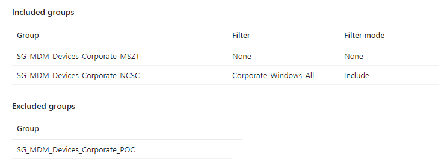

# Managing Settings Catalog Profile Assignments in Microsoft Intune


Fresh off the back of a trawl of a Modern Endpoint Management LinkedIn group, someone wanted the ability to assign existing Settings Catalog profiles in Microsoft Intune to additional Groups...this sounded like a quick win if you fancy manually doing it, but no one wants that, and as I had experience of dealing with the logic when , I thought I'd give it a go.


The functions, authentication, and script have now been updated to support the use of the Graph PowerShell SDK.


## Assignment Overview

Assigning [Settings Catalog profiles](https://learn.microsoft.com/en-us/mem/intune/configuration/settings-catalog) for Windows, macOS, and iOS/iPadOS devices isn't anything new, though Settings Catalogs were a bit of a revelation when they first appeared in Microsoft Intune allowing you to build profiles from scratch with a searchable interface, and with the ability to assign them to groups and use [Device Filters](https://learn.microsoft.com/en-us/mem/intune/fundamentals/filters), I jumped at the chance to use them in place of custom profiles where applicable.

What about the assignment though, what does that look like?

### Assignment Restrictions

Settings Catalog assignment isn't too dissimilar from assigning any other profile type, though as you'll discover through subsequent posts, each has it's own nuance when it comes to how you assign the profiles. So let's list what we can do when it comes to assignment, and what we can't do, as this will shape how we build out a PowerShell function to allow us to assign profiles in bulk.

#### Assignment Wins

These assignments, if already familiar with Microsoft Intune, shouldn't come as any surprise:

- **Included Groups**: Assigning to All Devices, All Users, and Groups of Devices or Users
- **Included Groups**: Assigning to All Devices with an Include Device Filter, All Users with an Include Device Filter, and Groups of Devices or Users with an Include Device Filter
- **Included Groups**: Assigning to All Devices with an Exclude Device Filter, All Users with an Exclude Device Filter, and Groups of Devices or Users with an Exclude Device Filter
- **Excluded Groups**: Assigning to Groups of Devices or Users


Remember that when excluding groups, you cannot mix user and device groups across include and exclude.


So this is pretty useful and should, especially with Device Filters, be all you need for assignment. What about the things we can't do?

#### Assignment No-nos

The list below is the current list of things you cannot do with the assignments for Settings Catalogs, and takes into consideration whether there are existing assignments on the profile:

- **Included Groups**: Assigning to All Devices and a Group of Devices or Users
- **Included Groups**: Assigning to All Users and a Group of Devices or Users
- **Included Groups**: Assigning to a Group that already has an assignment
- **Included Groups**: Assigning to All Devices that already has an assignment
- **Included Groups**: Assigning to All Users that already has an assignment
- **Included Groups**: Assigning to Groups of Devices or Users if All Devices already has an assignment
- **Included Groups**: Assigning to Groups of Devices or Users if All Users already has an assignment
- **Excluded Groups**: Assigning to Groups of Devices or Users with any Device Filter
- **Excluded Groups**: Assigning to All Devices or All Users
- **Excluded Groups**: Assigning to a Group that already has an assignment

There are many restrictions when it comes to adding additional assignments, the above are the important ones, as we don't want to be creating ourselves issues with assignments later on. Though this is going to give me a headache writing PowerShell to deal with this logic.

### Getting Settings Catalog Information

We've now got a good grip on the methods for assignment, but to start this all off, we need a way to get both the the Settings Catalog profile itself, a method to capture all existing assignments, and importantly, how to add assignments to the profile.

#### Getting Settings Catalogs

I already had the PowerShell function below at my disposal, so after connecting to Graph API using `Connect-MgGraph` and the Graph PowerShell SDK module, we can use the [`deviceManagementConfigurationPolicy`](https://learn.microsoft.com/en-us/graph/api/intune-deviceconfigv2-devicemanagementconfigurationpolicy-get?view=graph-rest-beta) endpoint in the below function to pull back either all Settings Catalogs, or specific ones using either the Id or Name.

```PowerShell
Function Get-DeviceSettingsCatalog() {

    [cmdletbinding()]

    param (

        [Parameter(Mandatory = $false)]
        $Name,

        [Parameter(Mandatory = $false)]
        $Id

    )

    $graphApiVersion = 'beta'
    $Resource = "deviceManagement/configurationPolicies?`$filter=technologies has 'mdm'"

    try {
        if ($Id) {
            $uri = "https://graph.microsoft.com/$graphApiVersion/$Resource/$Id"
            Invoke-MgGraphRequest -Uri $uri -Method Get
        }
        elseif ($Name) {
            $uri = "https://graph.microsoft.com/$graphApiVersion/$($Resource)"
            (Invoke-MgGraphRequest -Uri $uri -Method Get).Value | Where-Object { ($_.Name).contains("$Name") }
        }
        Else {
            $uri = "https://graph.microsoft.com/$graphApiVersion/$($Resource)"
            (Invoke-MgGraphRequest -Uri $uri -Method Get).Value
        }
    }
    catch {
        $exs = $Error.ErrorDetails
        $ex = $exs[0]
        Write-Host "Response content:`n$ex"
        Write-Host "Request to $Uri failed with HTTP Status $($ex.Message)"
        Break
    }
}
```

Running this function will get us the information we need in the `Id` of the Setting Catalog profile.

```txt {hl_lines=["11"]}
createdDateTime      : 08/03/2023 13:39:14
creationSource       :
description          :
lastModifiedDateTime : 10/05/2023 08:40:16
name                 : Corporate_Configuration_Policy_Conflict
platforms            : windows10
priorityMetaData     :
roleScopeTagIds      : {0}
settingCount         : 1
technologies         : mdm
id                   : 0565e69e-7bba-455a-bfaa-4ca6680a02b5
templateReference    : @{templateId=; templateFamily=none; templateDisplayName=; templateDisplayVersion=}
```

With a way to get a Settings Catalog profile, we now need a way to pull back any and all assignments for a profile using the [`deviceManagementConfigurationPolicyAssignments`](https://learn.microsoft.com/en-us/graph/api/intune-deviceconfigv2-devicemanagementconfigurationpolicyassignment-list?view=graph-rest-beta) endpoint in Graph and the above `Id` of the profile.

#### Getting Settings Catalog Assignments

```PowerShell
Function Get-DeviceSettingsCatalogAssignment() {

    [cmdletbinding()]

    param
    (
        [parameter(Mandatory = $true)]
        $Id
    )

    $graphApiVersion = 'Beta'
    $Resource = "deviceManagement/configurationPolicies/$Id/assignments"

    try {
        $uri = "https://graph.microsoft.com/$graphApiVersion/$($Resource)"
        (Invoke-MgGraphRequest -Uri $uri -Method Get).value
    }
    catch {
        $exs = $Error.ErrorDetails
        $ex = $exs[0]
        Write-Host "Response content:`n$ex"
        Write-Host "Request to $Uri failed with HTTP Status $($ex.Message)"
        Break
    }
}
```

This is the set of assignments on an existing Settings Catalog profile that we can now query.



Passing through the `Id` we will get an output that looks like the below for the above assignments, with the `target` being the important part, as this contains the details of the types of assignments as well as the Ids of the groups the profile is assigned to.

```txt {hl_lines=["4-5","10-11","16-17"]}
id       : 0565e69e-7bba-455a-bfaa-4ca6680a02b5_b2358c32-aff8-4408-bf90-d6c4c4e73a90
source   : direct
sourceId : 0565e69e-7bba-455a-bfaa-4ca6680a02b5
target   : @{@odata.type=#microsoft.graph.groupAssignmentTarget; deviceAndAppManagementAssignmentFilterId=; deviceAndAppManagementAssignmentFilterType=none;
           groupId=b2358c32-aff8-4408-bf90-d6c4c4e73a90}

id       : 0565e69e-7bba-455a-bfaa-4ca6680a02b5_c4480982-3342-4dc5-9c58-b272a77b7ab1
source   : direct
sourceId : 0565e69e-7bba-455a-bfaa-4ca6680a02b5
target   : @{@odata.type=#microsoft.graph.groupAssignmentTarget; deviceAndAppManagementAssignmentFilterId=4feb8cf9-1529-41d6-80bb-498922c5e567;
           deviceAndAppManagementAssignmentFilterType=include; groupId=c4480982-3342-4dc5-9c58-b272a77b7ab1}

id       : 0565e69e-7bba-455a-bfaa-4ca6680a02b5_f9c1e630-771d-4c12-b366-8a3e4db0509a
source   : direct
sourceId : 0565e69e-7bba-455a-bfaa-4ca6680a02b5
target   : @{@odata.type=#microsoft.graph.exclusionGroupAssignmentTarget; deviceAndAppManagementAssignmentFilterId=; deviceAndAppManagementAssignmentFilterType=none;
           groupId=f9c1e630-771d-4c12-b366-8a3e4db0509a}
```

So we kinda have the bits we need to get existing assignments, what about adding a new assignment?

## Assigning Settings Catalogs

First thing to note about assignments in Microsoft Intune, is there is no `PATCH` option with Graph API for the assignment endpoints, what this means is there is no native way to update the assignments of a Settings Catalog profile, the default behaviour is to replace any and all existing assignments. After trying to deal with the restrictions around assignments, I can understand why there is no `PATCH` option, as it's a nightmare dealing with the logic.

We however, are not an API, so we can apply our squishy human brains and work something out to give us the ability to add new assignments, without ripping out the existing ones surely?

### Building New Assignments

So where do we start exactly? With the many different ways to assign a profile, or the twelfty different restrictions when adding new assignments to existing ones? Let's go with the relatively simple creation of new assignments first, as this seems a little more straightforward.

Luckily for us, Microsoft provide [documentation](https://learn.microsoft.com/en-us/graph/api/intune-deviceconfigv2-devicemanagementconfigurationpolicy-assign?view=graph-rest-beta) for the JSON format of the payload required to create a new assignment, and as we have our own function to get existing assignments, we can quite easily build out the required data in PowerShell based on each of the methods for assignment.

The table below details the data used for each assignment method, so this is useful reference for us when building our own assignment function.

| Target | Type | Name | Value |
| :- | :- | :- | :- |
| Group | Include | `@odata.type` | `#microsoft.graph.groupAssignmentTarget` |
|  |  | `groupId` | *Id of the Assignment Group* |
| Group | Exclude | `@odata.type` | `#microsoft.graph.exclusionGroupAssignmentTarget` |
|  |  | `groupId` | *Id of the Assignment Group* |
| All Users | Include | `@odata.type` | `#microsoft.graph.allLicensedUsersAssignmentTarget` |
| All Devices | Include | `@odata.type` | `#microsoft.graph.allDevicesAssignmentTarget` |
| Device Filter | Include | `deviceAndAppManagementAssignmentFilterType` | `Include` |
|  |  | `deviceAndAppManagementAssignmentFilterId` | *Id of the Device Filter* |
| Device Filter | Exclude | `deviceAndAppManagementAssignmentFilterType` | `Exclude` |
|  |  | `deviceAndAppManagementAssignmentFilterId` | *Id of the Device Filter* |

So we can take the above and using the below excerpt from an existing assignment function, build the required JSON data.

```PowerShell
$TargetGroup = New-Object -TypeName psobject

if ($GroupId) {
    if ($AssignmentType -eq 'Exclude') {
        $TargetGroup | Add-Member -MemberType NoteProperty -Name '@odata.type' -Value '#microsoft.graph.exclusionGroupAssignmentTarget'
    }
    elseif ($AssignmentType -eq 'Include') {
        $TargetGroup | Add-Member -MemberType NoteProperty -Name '@odata.type' -Value '#microsoft.graph.groupAssignmentTarget'
    }

    $TargetGroup | Add-Member -MemberType NoteProperty -Name 'groupId' -Value "$GroupId"
}
else {
    if ($All -eq 'Users') {
        $TargetGroup | Add-Member -MemberType NoteProperty -Name '@odata.type' -Value '#microsoft.graph.allLicensedUsersAssignmentTarget'
    }
    ElseIf ($All -eq 'Devices') {
        $TargetGroup | Add-Member -MemberType NoteProperty -Name '@odata.type' -Value '#microsoft.graph.allDevicesAssignmentTarget'
    }
}

if ($FilterType) {
    $TargetGroup | Add-Member -MemberType NoteProperty -Name 'deviceAndAppManagementAssignmentFilterId' -Value $FilterId
    $TargetGroup | Add-Member -MemberType NoteProperty -Name 'deviceAndAppManagementAssignmentFilterType' -Value $FilterType
}

$Target = New-Object -TypeName psobject
$Target | Add-Member -MemberType NoteProperty -Name 'target' -Value $TargetGroup
```

This will give us the correct format that can be submitted to Graph API to create a new assignment for example for All Users with a Device Filter.

```JSON {hl_lines=["5-7"]}
{
  "assignments": [
    {
      "target": {
        "@odata.type": "#microsoft.graph.allLicensedUsersAssignmentTarget",
        "deviceAndAppManagementAssignmentFilterId": "4feb8cf9-1529-41d6-80bb-498922c5e567",
        "deviceAndAppManagementAssignmentFilterType": "include"
      }
    }
  ]
}
```

Or including a Group with a Device Filter.

```JSON {hl_lines=["5-8"]}
{
  "assignments": [
    {
      "target": {
        "@odata.type": "#microsoft.graph.groupAssignmentTarget",
        "groupId": "f9c1e630-771d-4c12-b366-8a3e4db0509a",
        "deviceAndAppManagementAssignmentFilterId": "4feb8cf9-1529-41d6-80bb-498922c5e567",
        "deviceAndAppManagementAssignmentFilterType": "include"
      }
    }
  ]
}
```

That was the easy part, and we can take the above methods to create new assignments. So now onto the head scratcher.

### Capturing Existing Assignments

We have the `Get-DeviceSettingsCatalogAssignment` function at our disposal now, so we can query a Settings Catalog profile to get any existing assignments, which is going to be important when dealing with the logic of adding new ones, for now we just need to get the existing ones into a useable JSON format so we can punt it back to Graph API.

```PowerShell
#Gets existing Assignments
$Assignments = Get-DeviceSettingsCatalogAssignment -Id $Id

# Creates an array for the existing assignments
$TargetGroups = @()
foreach ($Assignment in $Assignments) {
    $TargetGroup = New-Object -TypeName psobject

    $TargetGroup | Add-Member -MemberType NoteProperty -Name '@odata.type' -Value $Assignment.target.'@odata.type'

    if ($Assignment.target.'@odata.type' -like '*groupAssignmentTarget*') {
        $TargetGroup | Add-Member -MemberType NoteProperty -Name 'groupId' -Value $Assignment.target.groupId
    }

    if ($Assignment.target.deviceAndAppManagementAssignmentFilterType -ne 'none') {
        $TargetGroup | Add-Member -MemberType NoteProperty -Name 'deviceAndAppManagementAssignmentFilterId' -Value $Assignment.target.deviceAndAppManagementAssignmentFilterId
        $TargetGroup | Add-Member -MemberType NoteProperty -Name 'deviceAndAppManagementAssignmentFilterType' -Value $Assignment.target.deviceAndAppManagementAssignmentFilterType
    }

    $Target = New-Object -TypeName psobject
    $Target | Add-Member -MemberType NoteProperty -Name 'target' -Value $TargetGroup
    $TargetGroups += $Target
}
```

This captures the existing assignments and adds them to the `$TargetGroups` array variable, which can then be added to for any new assignments we want to add, then converted to JSON and eventually posted to Graph API.

So for our example, the output of the above would look something like the below.

```JSON
{
  "assignments": [
    {
      "target": {
        "@odata.type": "#microsoft.graph.groupAssignmentTarget",
        "groupId": "b2358c32-aff8-4408-bf90-d6c4c4e73a90"
      }
    },
    {
      "target": {
        "@odata.type": "#microsoft.graph.groupAssignmentTarget",
        "groupId": "c4480982-3342-4dc5-9c58-b272a77b7ab1",
        "deviceAndAppManagementAssignmentFilterId": "4feb8cf9-1529-41d6-80bb-498922c5e567",
        "deviceAndAppManagementAssignmentFilterType": "include"
      }
    },
    {
      "target": {
        "@odata.type": "#microsoft.graph.exclusionGroupAssignmentTarget",
        "groupId": "f9c1e630-771d-4c12-b366-8a3e4db0509a"
      }
    }
  ]
}
```

We're onto something here, time to look at the logic around adding new assignments to existing ones, mmmm logic my favourite coffee fuelled exercise.

### Handling Existing Assignments

Now that we can capture existing assignment, we need to deal with the logic when trying to add new assignments to the Settings Catalog profile. This will not be fun.

Let's go through each of the  we've already covered in this post.

#### Include Assignments

- **Assigning to All Devices and a Group of Devices or Users**

We just need to check if the function parameter `$All` which equates to an option to assign to All Device or All Users exists, and whether there are any existing group targetted assignment on the Settings Catalog profile.

```PowerShell
ElseIf (($All -ne '') -and ($Assignments.target.'@odata.type' -contains '#microsoft.graph.groupAssignmentTarget')) {
    Write-Warning 'The policy is already assigned to a group(s), and cannot be assigned to All Devices or All Users groups'
    break
}
```

- **Assigning to All Users and a Group of Devices or Users**

This one is covered by the above logic, as we wrote the If statement to only look for the `$All` parameter which takes into consideration both the All Devices and All Users assignment targets.

- **Assigning to a Group that already has an assignment**

This one is pretty easy really, we just need to compare the GroupId of the new assignment, to any existing assignments targetting to groups, and if the Ids match, to stop the function from running.

```PowerShell
If (($GroupId -ne '') -and ($GroupId -in $Assignments.target.groupId)) {
    Write-Warning 'The policy is already assigned to the Group'
    break
}
```

- **Assigning to All Devices that already has an assignment**

Similar to the above, we're checking to see if the new All Devices assignment already existing, and if it does, stopping the progress of the assignment.

```PowerShell
If (($All -eq 'Devices') -and ($Assignments.target.'@odata.type' -contains '#microsoft.graph.allDevicesAssignmentTarget')) {
    Write-Warning 'The policy is already assigned to the All Devices group'
    break
}
```

- **Assigning to All Users that already has an assignment**

This was pretty much a copy and paste of the above, just swapping the devices parameters for the users one.

```PowerShell
If (($All -eq 'Users') -and ($Assignments.target.'@odata.type' -contains '#microsoft.graph.allLicensedUsersAssignmentTarget')) {
    Write-Warning 'The policy is already assigned to the All Users group'
    break
}
```

- **Assigning to Groups of Devices or Users if All Devices already has an assignment**

We need to identity whether a group assignment is being created, which is captured with the `$GroupId` function parameter, and whether either the All Devices or All Users assignment target exists, and if it does break the function from running.

```PowerShell
If (($GroupId -ne '') -and (($Assignments.target.'@odata.type' -contains '#microsoft.graph.allDevicesAssignmentTarget') -or ($Assignments.target.'@odata.type' -contains '#microsoft.graph.allLicensedUsersAssignmentTarget'))) {
    Write-Warning 'The policy is already assigned to All Devices or All Users groups, and cannot be assigned to a group'
    break
}
```

- **Assigning to Groups of Devices or Users if All Users already has an assignment**

This one is captured in the above logic, which is lucky as I was running out of steam by this point.

#### Exclude Assignments

- **Assigning to Groups of Devices or Users with any Device Filter**

Using the parameters of the function itself, we can stop this assignment type, with parameters configured for Group assignment in `$GroupID` and the Assignment Type parameter `$AssignmentType`, as well as the Filter ID parameter `$FilterId`. With this combination of parameters being true, we can throw an error and stop the function from running.

```PowerShell
If (($AssignmentType -eq 'Exclude') -and ($GroupId -ne '') -and ($FilterId -ne '')) {
    Write-Warning 'You cannot assign a group with a filter as an exclude assignment'
    break
}
```

- **Assigning to All Devices or All Users**

We can again handle this in the function itself, with parameters for an 'All Devices or Users' assignment and the 'Assignment Type', so if you select the `$All` assignment and the assignment type `$AssignmentType` equalling `Exclude`,  we can throw an error.

```PowerShell
If (($All -ne '') -and ($AssignmentType -eq 'Exclude')) {
    Write-Warning 'You cannot All Devices or All Users groups as an exclude assignment'
    break
}
```

- **Assigning to a Group that already has an assignment**

The logic for this is exactly the same as the Include assignment type, as whether there is an include or exclude assignment for the same group, the result is the same.

### The Assignment Function

We now have all the component parts, all is left to do is to throw them all at Visual Studio Code and pray that we've got something that works, configuring all the required logic and the function parameters to allow the assignment of new groups to Settings Catalog profiles.

I've given the option to not only add to existing assignments, but also to just flatten the existing ones and create new using the `$AssignmentAction` parameter.

```PowerShell
Function Add-DeviceSettingsCatalogAssignment() {

    [cmdletbinding()]

    param
    (
        [parameter(Mandatory = $true)]
        [string]$Id,

        [parameter(Mandatory = $false)]
        [string]$GroupId,

        [parameter(Mandatory = $true)]
        [ValidateSet('Include', 'Exclude')]
        [string]$AssignmentType,

        [parameter(Mandatory = $false)]
        [string]$FilterId,

        [parameter(Mandatory = $false)]
        [ValidateSet('Include', 'Exclude')]
        [string]$FilterType,

        [parameter(Mandatory = $false)]
        [ValidateSet('Users', 'Devices')]
        [string]$All,

        [parameter(Mandatory = $true)]
        [ValidateSet('Replace', 'Add')]
        $AssignmentAction
    )

    $graphApiVersion = 'Beta'
    $Resource = "deviceManagement/configurationPolicies/$Id/assign"

    try {
        # Stopping assignmnent of All Users or All Devices as an exclude assignment
        if (($All -ne '') -and ($AssignmentType -eq 'Exclude')) {
            Write-Warning 'You cannot All Devices or All Users groups as an exclude assignment'
            break
        }
        # Stopping assignment of group and All Devices/Users
        if (($All -ne '') -and ($GroupId -ne '')) {
            Write-Warning 'You cannot assign to All Devices or All Users, and groups'
            break
        }
        # Stopping assignment of group with filter as an exclude assignment
        if (($AssignmentType -eq 'Exclude') -and ($GroupId -ne '') -and ($FilterId -ne '')) {
            Write-Warning 'You cannot assign a group with a filter as an exclude assignment'
            break
        }

        # If Adding an assignment to existing assignments
        If ($AssignmentAction -eq 'Add') {
            # Checking if there are Assignments already configured
            $Assignments = Get-DeviceSettingsCatalogAssignment -Id $Id
            if ($Assignments.count -ge 1) {
                # Checking if the group is already assigned
                If (($GroupId -ne '') -and ($GroupId -in $Assignments.target.groupId)) {
                    Write-Warning 'The policy is already assigned to the Group'
                    break
                }
                # Checking if already assigned to All Devices
                ElseIf (($All -eq 'Devices') -and ($Assignments.target.'@odata.type' -contains '#microsoft.graph.allDevicesAssignmentTarget')) {
                    Write-Warning 'The policy is already assigned to the All Devices group'
                    break
                }
                # Checking if aleady assigned to All users
                ElseIf (($All -eq 'Users') -and ($Assignments.target.'@odata.type' -contains '#microsoft.graph.allLicensedUsersAssignmentTarget')) {
                    Write-Warning 'The policy is already assigned to the All Users group'
                    break
                }
                # Checking if already assigned to groups when assigning 'All' assignment
                ElseIf (($All -ne '') -and ($Assignments.target.'@odata.type' -contains '#microsoft.graph.groupAssignmentTarget')) {
                    Write-Warning 'The policy is already assigned to a group(s), and cannot be assigned to All Devices or All Users groups'
                    break
                }
                # Checking if already assigned to 'All' when assigning groups
                ElseIf (($GroupId -ne '') -and (($Assignments.target.'@odata.type' -contains '#microsoft.graph.allDevicesAssignmentTarget') -or ($Assignments.target.'@odata.type' -contains '#microsoft.graph.allLicensedUsersAssignmentTarget'))) {
                    Write-Warning 'The policy is already assigned to All Devices or All Users groups, and cannot be assigned to a group'
                    break
                }
                # If new assignment viable, captures existing assignments
                Else {
                    # Creates an array for the existing assignments
                    $TargetGroups = @()
                    foreach ($Assignment in $Assignments) {
                        $TargetGroup = New-Object -TypeName psobject

                        $TargetGroup | Add-Member -MemberType NoteProperty -Name '@odata.type' -Value $Assignment.target.'@odata.type'

                        if ($Assignment.target.'@odata.type' -like '*groupAssignmentTarget*') {
                            $TargetGroup | Add-Member -MemberType NoteProperty -Name 'groupId' -Value $Assignment.target.groupId
                        }

                        if ($Assignment.target.deviceAndAppManagementAssignmentFilterType -ne 'none') {
                            $TargetGroup | Add-Member -MemberType NoteProperty -Name 'deviceAndAppManagementAssignmentFilterId' -Value $Assignment.target.deviceAndAppManagementAssignmentFilterId
                            $TargetGroup | Add-Member -MemberType NoteProperty -Name 'deviceAndAppManagementAssignmentFilterType' -Value $Assignment.target.deviceAndAppManagementAssignmentFilterType
                        }

                        $Target = New-Object -TypeName psobject
                        $Target | Add-Member -MemberType NoteProperty -Name 'target' -Value $TargetGroup
                        $TargetGroups += $Target
                    }
                }
            }
        }

        # Creates the new assignment
        $TargetGroup = New-Object -TypeName psobject

        if ($GroupId) {
            if ($AssignmentType -eq 'Exclude') {
                $TargetGroup | Add-Member -MemberType NoteProperty -Name '@odata.type' -Value '#microsoft.graph.exclusionGroupAssignmentTarget'
            }
            elseif ($AssignmentType -eq 'Include') {
                $TargetGroup | Add-Member -MemberType NoteProperty -Name '@odata.type' -Value '#microsoft.graph.groupAssignmentTarget'
            }

            $TargetGroup | Add-Member -MemberType NoteProperty -Name 'groupId' -Value "$GroupId"
        }
        else {
            if ($All -eq 'Users') {
                $TargetGroup | Add-Member -MemberType NoteProperty -Name '@odata.type' -Value '#microsoft.graph.allLicensedUsersAssignmentTarget'
            }
            ElseIf ($All -eq 'Devices') {
                $TargetGroup | Add-Member -MemberType NoteProperty -Name '@odata.type' -Value '#microsoft.graph.allDevicesAssignmentTarget'
            }
        }

        if ($FilterType) {
            $TargetGroup | Add-Member -MemberType NoteProperty -Name 'deviceAndAppManagementAssignmentFilterId' -Value $FilterId
            $TargetGroup | Add-Member -MemberType NoteProperty -Name 'deviceAndAppManagementAssignmentFilterType' -Value $FilterType
        }

        $Target = New-Object -TypeName psobject
        $Target | Add-Member -MemberType NoteProperty -Name 'target' -Value $TargetGroup
        $TargetGroups += $Target

        # Creating JSON object to pass to Graph
        $Output = New-Object -TypeName psobject
        $Output | Add-Member -MemberType NoteProperty -Name 'assignments' -Value @($TargetGroups)
        $JSON = $Output | ConvertTo-Json -Depth 3

        # POST to Graph Service
        $uri = "https://graph.microsoft.com/$graphApiVersion/$($Resource)"
        Invoke-MgGraphRequest -Uri $uri -Method Post -Body $JSON -ContentType 'application/json'
    }
    catch {
        $exs = $Error.ErrorDetails
        $ex = $exs[0]
        Write-Host "Response content:`n$ex" -f Red
        Write-Host "Request to $Uri failed with HTTP Status $($ex.Message)"
        Break
    }
}
```

That's all there is to it, which is hilarious as I'm pretty sure I aged significantly when coming up with this function. Let's see how we can use this to create new assignments.

#### Using the Assignment Function

We need to start by getting the Id of an existing Settings Catalog profile, so we can reference this Id when creating new assignments, and if we're using Devices Filters or Groups, we need to get the Ids of those as well.

```PowerShell
$Policy = Get-DeviceSettingsCatalog | Where-Object { $_.Name -eq 'Corporate_Configuration_Policy_Conflict' }
$Group = Get-MDMGroup -GroupName 'SG_MDM_Devices_Corporate_POC'
$Filter = Get-DeviceFilter -Name 'Corporate_Windows_All'
```

Right, onto the fun parts. I've provided examples of each of the possible assignment methods below and in an example script which as always can be found on [GitHub](https://github.com/ennnbeee/oddsandendpoints-scripts/blob/main/Intune/Configuration/SettingsCatalogAssignment/Invoke-MgSettingsCatalogAssignment.ps1)

```PowerShell
# Adding an include Group assignment
Add-DeviceSettingsCatalogAssignment -Id $Policy.id -AssignmentAction Add -AssignmentType Include -GroupId $group.id

# Adding an include Group assignment with include filter
Add-DeviceSettingsCatalogAssignment -Id $Policy.id -AssignmentAction Add -AssignmentType Include -GroupId $group.id -FilterType Include -FilterID $Filter.id

# Adding an exclude Group assignment
Add-DeviceSettingsCatalogAssignment -Id $Policy.id -AssignmentAction Add -AssignmentType Exclude -GroupId $group.id

# Adding an Include All Devices assignment
Add-DeviceSettingsCatalogAssignment -Id $Policy.id -AssignmentAction Add -AssignmentType Include -All Devices

# Adding an Include All Devices assignment with filter
Add-DeviceSettingsCatalogAssignment -Id $Policy.id -AssignmentAction Add -AssignmentType Include -All Devices -FilterType Include -FilterID $Filter.id

# Replacing all assignment and adding an Include All Users assignment
Add-DeviceSettingsCatalogAssignment -Id $Policy.id -AssignmentAction Replace -AssignmentType Include -All Users

```

If all went to plan, we should now be able to successfully create Settings Catalog profile assignments as little and often as we'd like, with the ability to now get all of your Settings Catalog profiles, and for each of them create and add new assignments.

## Summary

This will end up being the first in a series of posts about managing assignments in Microsoft Intune, but luckily for me, Settings Catalog assignment is one of the more complicated ones (*he says already knowing the Application assignment is more complicated*) so the next one I look at should be a little less logic heavy, as well as the fact I should be able to reuse some of the Settings Catalog profile assignment function across many areas of Microsoft Intune.

