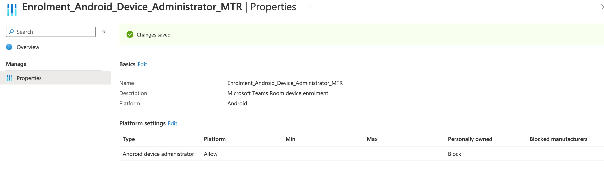
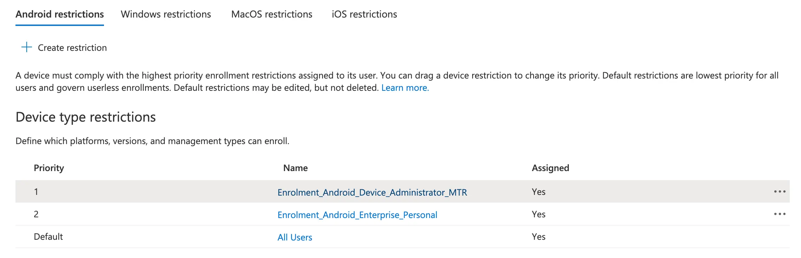
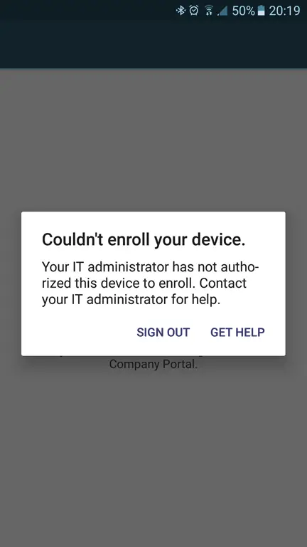
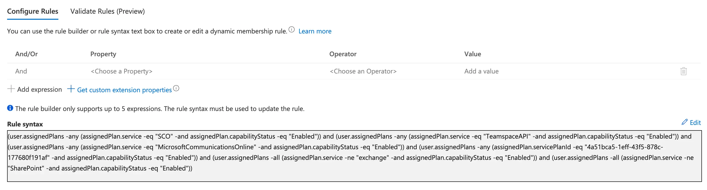
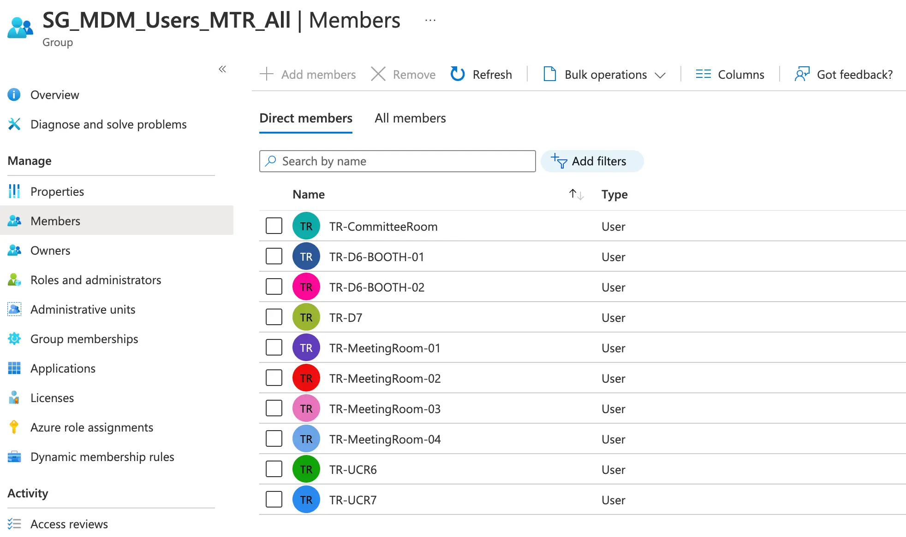
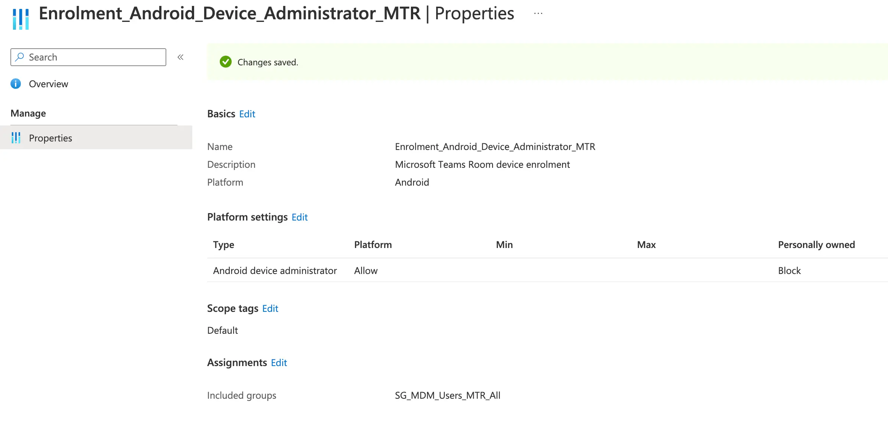

# Enrolling Microsoft Teams Room Systems in Intune


So it turns out that Android based MTR (Microsoft Teams Rooms) want to enrol into Microsoft Intune using what we generally term as a legacy enrolment method in [Android Device Administrator](https://learn.microsoft.com/en-us/mem/intune/enrollment/android-enroll-device-administrator), one in fact, that is recommended to be disabled for 'All Users' as it will take priority over [Android Enterprise Personal Device Work Profile](https://learn.microsoft.com/en-us/mem/intune/enrollment/android-dedicated-devices-fully-managed-enroll) enrolment for personal device or BYOD (Bring Your Own Device) scenarios.

This seems easy enough, create a new [Enrolment Restriction](https://learn.microsoft.com/en-us/mem/intune/enrollment/enrollment-restrictions-set#device-platform) and assign it to a group containing the Microsoft Teams Rooms resource accounts. Done. Post over.

What if you want to ensure that all these accounts, and any future accounts used for MTR get this allowance for enrolment?

## Device Enrolment

First off is creating an Enrolment Restriction profile that allows for Android Device Administrator enrolment, secondly is how we let Intune know that the devices are corporate owned, as they will be picked up as personal devices due to the enrolment method, and finally a way to capture all the MTR resource accounts together.

### Enrolment Restrictions

We can create a new Enrolment Restriction to allow for a group of users to enrol Android devices using the Device Administrator enrolment method, and we should block personal devices as well:



With the restriction now created, we need to make sure that this restriction has a higher priority than any other enrolment restriction applying to either All Users or any other group that may contains the MTR resource accounts:



Perfect.

### Corporate Device Identifiers

With the Android Device Administrator enrolment being user driven, and not a method for device enrolment that will automatically set the device as corporate owned, if we attempted to enrol these MTR devices into Intune now, we'd get an error about the platform not being supported due to us blocking personal devices in the restriction we created.



[Corporate Device Identifiers](https://learn.microsoft.com/en-us/mem/intune/enrollment/corporate-identifiers-add) to the rescue, kind of, basically this allows us to upload a unique identifier of a device so that when a device goes through an enrolment process, Intune knows it's a corporate owned device.

So if the devices are running [Android 10 and above](https://learn.microsoft.com/en-us/mem/intune/enrollment/corporate-identifiers-add#identify-corporate-owned-devices-with-imei-or-serial-number), we're straight out of luck and need to amend our restriction profile to allow personally owned device enrolment.

However, if the device has below Android 10, we can add either the device IMEI number (don't use this) or Serial number (do use this) in Intune to identify the device as corporate.

## Utilising Dynamic Groups

With the Device Platform Enrolment restriction in place, we could do with a group to assign this restriction to, if we're strict with our naming conventions of these resource accounts being used for the MTR, such as prefixing all account with 'MTR-', we could go with something simple and use `(user.userPrincipalName -startsWith "MTR-")` as part of our rule syntax.

Sadly though, I don't like nor trust human input when it comes to device management and Intune, so we need to find a different way that at least reduces the human error part, if not removes it entirely and ensure that all new MTR accounts are added to the restriction.

### Assigned Licenses

This is where we use some of the more advanced features of Dynamic User groups, in the [multi-value properties](https://learn.microsoft.com/en-us/azure/active-directory/enterprise-users/groups-dynamic-membership#multi-value-properties) and in particular the use of licenses assigned to users. For this, we need to understand which licenses the MTR resource accounts have assigned, and find the correlating [Service Plan Id](https://learn.microsoft.com/en-us/azure/active-directory/enterprise-users/licensing-service-plan-reference) for each service contained within the licenses.

The below table details the common services for both the 'Microsoft Teams Rooms Pro' and 'Microsoft Teams Rooms Pro without Audio Conferencing' licenses that allows for enrolment into Intune, the Services, and the Service Plan Ids:

| Friendly Name | Service Name | Service Plan Id |
| :- | :- | :- |
| Azure Active Directory Premium P1 | `AAD_PREMIUM` | `41781fb2-bc02-4b7c-bd55-b576c07bb09d` |
| Microsoft 365 Phone System | `MCOEV` | `4828c8ec-dc2e-4779-b502-87ac9ce28ab7` |
| Microsoft Intune | `INTUNE_A` | `c1ec4a95-1f05-45b3-a911-aa3fa01094f5` |
| Microsoft Teams | `TEAMS1` | `57ff2da0-773e-42df-b2af-ffb7a2317929` |
| Skype for Business Online (Plan 2) | `MCOSTANDARD` | `0feaeb32-d00e-4d66-bd5a-43b5b83db82c` |
| Whiteboard (Plan 3) | `WHITEBOARD_PLAN3` | `4a51bca5-1eff-43f5-878c-177680f191af` |

So with this we can attempt to construct a Dynamic User group based on these services that are assigned and enabled for the MTR accounts.

### Some Dirty Logic

So as it turns out, the above services are part of a hundred other license options, so we need a way to drill down and find only the MTR accounts with these licenses or services assigned.

I thought long and hard (about 5 minutes tbh) and came up with the below; basically making sure the above assigned licenses exist, but the user account doesn't have any Exchange Online or SharePoint Online license assigned and enabled, hopefully filtering out any other users or user types from the group.

We're actually using the Service Name captured from the `Get-AzureADUser -User 'MTR-Room1@ennbee.uk' | Select -ExpandProperty AssignedPlans` PowerShell command here, to cover off all plan types under the service, as there are so many Exchange Online plan types and I want to make this as clean as possible without having to list all the Exchange Online or SharePoint Online service plan Ids.

So here's the logic we're using to find only the MTR accounts using a Dynamic Group.

| Logic | Rule |
| :- | :- |
| User **is assigned** a Microsoft 365 Phone System license and is enabled | `(user.assignedPlans -any (assignedPlan.servicePlanId -eq "4828c8ec-dc2e-4779-b502-87ac9ce28ab7" -and assignedPlan.capabilityStatus -eq "Enabled"))` |
| User **is assigned any** Intune license and is enabled | `(user.assignedPlans -any (assignedPlan.service -eq "SCO" -and assignedPlan.capabilityStatus -eq "Enabled"))` |
| User **is assigned any** Teams license and is enabled | `(user.assignedPlans -any (assignedPlan.service -eq "TeamspaceAPI" -and assignedPlan.capabilityStatus -eq "Enabled"))` |
| User **is assigned any** Skype for Business license and is enabled | `(user.assignedPlans -any (assignedPlan.service -eq "MicrosoftCommunicationsOnline" -and assignedPlan.capabilityStatus -eq "Enabled"))` |
| User **is assigned** a WhiteBoard Plan 3 license and is enabled | `(user.assignedPlans -any (assignedPlan.servicePlanId -eq "4a51bca5-1eff-43f5-878c-177680f191af" -and assignedPlan.capabilityStatus -eq "Enabled"))` |
| User **is not assigned any** Exchange Online license that is enabled or deleted | `(user.assignedPlans -all (assignedPlan.service -ne "exchange" -and assignedPlan.capabilityStatus -eq "Enabled" -or assignedPlan.capabilityStatus -eq "Deleted"))` |
| User **is not assigned any** SharePoint Online license that is enabled or deleted | `(user.assignedPlans -all (assignedPlan.service -ne "SharePoint" -and assignedPlan.capabilityStatus -eq "Enabled" -or assignedPlan.capabilityStatus -eq "Deleted"))` |

## Allowing Microsoft Team Room Enrolment

After all this effort, we can finally create the a group in Azure AD using some of the above and combine it to create the needed Rule Syntax.

In the below example, the accounts didn't have a Microsoft 365 Phone System license so the `(user.assignedPlans -any (assignedPlan.servicePlanId -eq "4828c8ec-dc2e-4779-b502-87ac9ce28ab7" -and assignedPlan.capabilityStatus -eq "Enabled"))` part of the rule was removed:

```txt
(user.assignedPlans -any (assignedPlan.service -eq "SCO" -and assignedPlan.capabilityStatus -eq "Enabled")) and (user.assignedPlans -any (assignedPlan.service -eq "TeamspaceAPI" -and assignedPlan.capabilityStatus -eq "Enabled")) and (user.assignedPlans -any (assignedPlan.service -eq "MicrosoftCommunicationsOnline" -and assignedPlan.capabilityStatus -eq "Enabled")) and (user.assignedPlans -any (assignedPlan.servicePlanId -eq "4a51bca5-1eff-43f5-878c-177680f191af" -and assignedPlan.capabilityStatus -eq "Enabled")) and (user.assignedPlans -all (assignedPlan.service -ne "exchange" -and assignedPlan.capabilityStatus -eq "Enabled" -or assignedPlan.capabilityStatus -eq "Deleted")) and (user.assignedPlans -all (assignedPlan.service -ne "SharePoint" -and assignedPlan.capabilityStatus -eq "Enabled" -or assignedPlan.capabilityStatus -eq "Deleted"))
```

### The Dynamic Group

Once created we now have a group and a set of rules that you should validate in your own environment before putting into production use. You may also need to tweak the logic based on which services you have enabled as part of your MTR licensing assignment.

If all goes well, and you've managed to copy and paste successfully, you should have a group with rules like the below:



If you're really lucky, the group will only populate with the user accounts you are using for the Microsoft Team Room systems, including the Android devices.



### Updating the Enrolment Restriction

Now armed with the new group, we can use this as part of the restriction to allow these users to enrol Android devices using the Android Device Administrator method:



## Summary

You've seen here that with a bit of time and patience, you can leverage Dynamic Groups and some of the advanced rules to your advantage, even with an edge use case like allowing only Microsoft Teams Room system accounts the ability to enrol using Android Device Administrator.

This is one of many applications of Dynamic Groups throughout Microsoft Intune, and although I  them in favour of Device Filters, they are still a necessity when you need a level of  that the filters can't handle.

