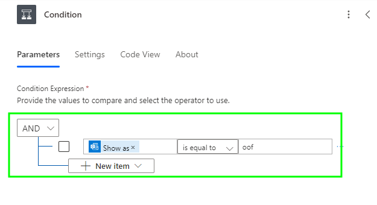

# Automatically Setting an Out of Office Message with Power Automate

When I started in my current role, I was asked to ensure that I set a specific [Out of Office](https://support.microsoft.com/en-gb/office/send-automatic-replies-out-of-office-from-outlook-9742f476-5348-4f9f-997f-5e208513bd67) message in Outlook, letting anyone either internally or externally know that I was working on a Customer engagement and to ~leave me alone~ contact someone else if they needed assistance.

Now I'm not one for handling repetitive tasks, or any task tbh, manually, so I opened up the trusty free friend that is Microsoft ~Flow~ [Power Automate](https://www.microsoft.com/en-gb/power-platform/products/power-automate) in my work/school account, and set about configuring a ~power automate~ flow, to set this automatic reply, automatically.

## Creating the Flow

We'll cut to the chase here, as this isn't Microsoft Intune, and although follows a similar *Click Click Next OK* setup, doesn't require as much thought.

### Setting a Calendar Event Trigger

To create a flow and associated [trigger](https://learn.microsoft.com/en-us/power-automate/triggers-introduction?tabs=classic-designer) go sign in to [Power Automate](https://make.powerautomate.com/), select **Create**, then select **Automated cloud flow**:

Give it a name, and enter in **When an upcoming event is starting soon (V3)** in the search field for the trigger for the flow to start, and select **Create**:

Once created, select the trigger, and if required allow the connection to your Exchange Online calendar, the select the **Calendar Id**, you can then update the settings for how often to check for events:

Now we have a trigger that will monitor your Exchange Online calendar for events starting soon. We need to give the Flow some conditions to work with.

### Setting an Out of Office Condition

As we only care about calendar events marked as Out of Office, we should add in a [Condition](https://learn.microsoft.com/en-us/power-automate/add-condition).

Select the little **+** sign under the trigger, and select **Add add an action** (we'll be doing this a few times, so get familiar with it):

Search for **Condition** and oddly enough, select **Condition** in the search results:

Within the value field select the Harry Potter looking lightning bolt , to use data from the trigger above, and search for **Show as** selecting it, and updating the condition to look like the below:

Which now means that when the trigger looks at events in the calendar, it has a decision to make when an event is marked as Out of Office.

### Setting a Private Status Condition

As I also like to take time off from work, I thought best we leverage the flow to not only set up an automatic reply when I'm working with a customer, but also when I am genuinely Out of the Office.

To make life easier for myself, I mark actual holidays in my calendar as **Private**, so we can use this additional flag on the calendar event and add another condition to the flow under the **True** section of the Condition we created previously.

Same as before, select the little **+** sign under the **True** option, and select **Add add an action** searching again for **Condition**, this time after selecting Harry Potter, search for **Sensitivity**:

Configure the logic to say that **Sensitivity** `is equal to` **private**, meaning that if the event discovered is both Out of Office and Private do *something*.

Now onto the *something*.

### Setting the Out of Office for Holidays

For our holiday automatic reply, we're working under the **True** section of the condition, select **Add an action** again, this time search for **Set up automatic replies (V2)**:

You will now be presented with a raft of options, select **Show all** to bring up all the setting we need to configure to set your Out of Office message, and using the Harry Potter option for each, add in the settings in the table:

| Item | Value |
| :- | :- |
| Status | `Scheduled` |
| External Audience | `All` |
| Start Time DateTime | `Start time` |
| Start Time TimeZone | `Time zone` |
| End Time DateTime | `End time` |
| End Time TimeZone | `Time zone` |

With the above settings looking like the below:

This will configure the Automatic Reply to start based on the start time of the event, and end when the event ends.

We're not done quite yet, as we need to add in a message to send to people inside the organisation, and outside.

Luckily the message supports HTML, so you make it look pretty, or you can just plonk in some basic information:

| Item | Value |
| :- | :- |
| Internal Reply Message | `I am currently sunning myself and have turned off my work emails, good luck have fun.` |
| External Reply Message | `I am currently out of the office and will not be able to respond to your email until my return.` |

Looking like the below in the flow:

That's our holiday message sorted, how about we finish this off and get the other message sorted for when we're actually doing some work but ~~cba answering emails~~ are unavailable.

### Setting the Out of Office for Engagements

With our customer engagement automatic reply, we're working under the **False** section of the same condition, but still adding a new action by selecting **Add an action** again, searching for **Set up automatic replies (V2)**.

Fill in the same settings as we did for the holiday message, but this time we should have a different reply message, as you know, we're still able to respond to emails, just not quickly:

Adding in a suitable but more professional message to both internal and external recipients:

That's it, you're done. The whole flow should look something like the below, and obviously you can rename things to make like easier.

Don't forget to **Save** your flow, and now it will happily work in the background setting Out of Office messages on your behalf.

## Summary

Not sure what to say here, this is well off topic from my usual content, but I was asked many times by people how I've set this up, so here it is.

Go play around in Power Automate, but don't come back to me if you're having issues, unless it's with something in Microsoft Intune

