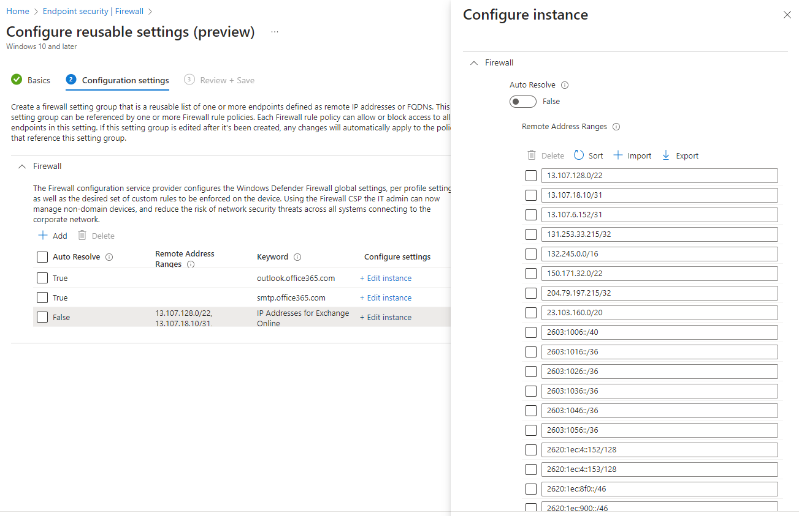

# Creating Reusable Groups of Firewall Settings for Microsoft Online Services


If you've been living under a rock, or you don't have to deal with firewall and proxy requirements for accessing Microsoft Online services, you probably won't be aware that Microsoft publish their URLs and IP addresses for their services using a [web service](https://learn.microsoft.com/en-us/microsoft-365/enterprise/microsoft-365-ip-web-service?view=o365-worldwide).

Sadly I don't live under a rock, and when I get the pleasure working with customers who are blocking all inbound and outbound traffic from Windows devices unless there is a matching firewall rule, getting these devices to talk to Microsoft Intune and other Microsoft services, can be a bit of a pain without the web service as a reference.

Now because I'm desperate to write PowerShell scripts there is no way I'm going to copy paste a million times between an actual queryable web service and Microsoft Intune to create the necessary firewall rules. Let's look at how we can leverage the web service to create some much needed firewall settings.

## Reusable Settings Groups

So here we are, back looking at ~~Defender~~ Windows firewall rules in Microsoft Intune again, and after moving legacy firewall rules to the  versions previously, to make use of [Reusable Settings Groups](https://learn.microsoft.com/en-us/mem/intune/protect/reusable-settings-groups), we're now heavily leaning into these reusable options, to ensure that all Windows 10 and later devices can communicate successfully to the Microsoft Online endpoints.

Before we look at how to deal with the data available in the Microsoft web service, we should look at how we can create these reusable settings groups in Microsoft Intune using Graph, and make use of the option to [auto resolve](https://techcommunity.microsoft.com/t5/intune-customer-success/announcing-enhanced-control-for-configuring-firewall-rules-with/ba-p/3664744) URLs, which should make life a little bit easier for the ever changing internet landscape.

### JSON Formatting

We at least have experience dealing with building the JSON structure required for , and it wasn't particularly straight forward, so after a hesitant dig with Developer Tools we can see that when you create a new reusable setting in Microsoft Intune, we're sending a `POST` call to the [`deviceManagement/reusablePolicySettings`](https://learn.microsoft.com/en-us/graph/api/intune-deviceconfigv2-devicemanagementreusablepolicysetting-create?view=graph-rest-beta) endpoint, with JSON similar to the below.

```JSON
{
  "displayName": "ReusableTest",
  "description": "My very first reusable group.",
  "settingDefinitionId": "vendor_msft_firewall_mdmstore_dynamickeywords_addresses_{id}",
  "settingInstance": {
    "@odata.type": "#microsoft.graph.deviceManagementConfigurationGroupSettingCollectionInstance",
    "settingDefinitionId": "vendor_msft_firewall_mdmstore_dynamickeywords_addresses_{id}",
    "groupSettingCollectionValue": [
      {
        "children": [
          {
            "@odata.type": "#microsoft.graph.deviceManagementConfigurationChoiceSettingInstance",
            "settingDefinitionId": "vendor_msft_firewall_mdmstore_dynamickeywords_addresses_{id}_autoresolve",
            "choiceSettingValue": {
              "@odata.type": "#microsoft.graph.deviceManagementConfigurationChoiceSettingValue",
              "value": "vendor_msft_firewall_mdmstore_dynamickeywords_addresses_{id}_autoresolve_true",
              "children": []
            }
          },
          {
            "@odata.type": "#microsoft.graph.deviceManagementConfigurationSimpleSettingInstance",
            "settingDefinitionId": "vendor_msft_firewall_mdmstore_dynamickeywords_addresses_{id}_keyword",
            "simpleSettingValue": {
              "@odata.type": "#microsoft.graph.deviceManagementConfigurationStringSettingValue",
              "value": "memv.ennbee.uk"
            }
          }
        ]
      },
      {
        "children": [
          {
            "@odata.type": "#microsoft.graph.deviceManagementConfigurationChoiceSettingInstance",
            "settingDefinitionId": "vendor_msft_firewall_mdmstore_dynamickeywords_addresses_{id}_autoresolve",
            "choiceSettingValue": {
              "@odata.type": "#microsoft.graph.deviceManagementConfigurationChoiceSettingValue",
              "value": "vendor_msft_firewall_mdmstore_dynamickeywords_addresses_{id}_autoresolve_false",
              "children": [
                {
                  "@odata.type": "#microsoft.graph.deviceManagementConfigurationSimpleSettingCollectionInstance",
                  "settingDefinitionId": "vendor_msft_firewall_mdmstore_dynamickeywords_addresses_{id}_addresses",
                  "simpleSettingCollectionValue": [
                    {
                      "value": "8.8.8.8",
                      "@odata.type": "#microsoft.graph.deviceManagementConfigurationStringSettingValue"
                    }
                  ]
                }
              ]
            }
          },
          {
            "@odata.type": "#microsoft.graph.deviceManagementConfigurationSimpleSettingInstance",
            "settingDefinitionId": "vendor_msft_firewall_mdmstore_dynamickeywords_addresses_{id}_keyword",
            "simpleSettingValue": {
              "@odata.type": "#microsoft.graph.deviceManagementConfigurationStringSettingValue",
              "value": "Google DNS"
            }
          }
        ]
      }
    ]
  },
  "@odata.type": "#microsoft.graph.deviceManagementReusablePolicySetting"
}
```

Comparing this with the created reusable group below, we can see that each `children` section of the JSON structure is looking after each of created items.


With a single `children` section for each auto resolve URL, and one section containing each of the IP addresses, and luckily for us, the structure of the JSON is the same whether it's the first setting in the list or the last, bar a trailing `,`.

Let's look at how we can use PowerShell to build out our JSON structure for a reusable settings group.

### Building the JSON Format

This one looks a lot less of a headache compared to building Settings Catalog JSON structures, with hopefully minimal logic needed to distinguish the first and subsequent settings, and very few variables to handle and pass in, to allow the creation of our very own reusable settings group containing all the URLs and IP addresses from the Microsoft web service.

We can break down the whole JSON structure into `$*JSON` variable sections that can be updated with subsequent variables when processing the captured data from the web service:

- `$startJSON` - Looking at the start of the JSON, this section won't change between reusable groups other than for `$displayName` and `$description`,which we can pass variables into for each.
- `$urlJSON` - For  groups that contain either multiple URLs, or URLs and IPs, we're going to have to build in some logic to deal with the trailing `,` for the initial URL, but for now let's ignore that and focus on just adding in the `$url` variable to this section of the JSON.
- `$ipStartJSON` - With IP addresses, they are all contained within a single section, similar to each URL, so we need to create the JSON structure for the start of the IP section.
- `$ipJSON` - This is where we can add our IP addresses, with one IP per section, being added to the JSON using the `$ip` variable. Similar to having multiple URLs, we'll need to loop through all IP addresses and ensure that each IP has the required JSON format.
- `$ipEndJSON` -  After we captured all the IP addresses, and the relevant JSON structure, we just need to tail off the full set of IP addresses with a closing structure like below. Apparently the IP address group needs an identity, which we can pass in using the variables `$ipName`.
- `$endJSON` - Finally to round off the full JSON structure, we need to complete the format with the required `@odata.type` value.

In a very straightforward way, we can build out a similar JSON structure compared to the one we initially captured using the Developer Tools, but using PowerShell, combing each of the `$*JSON` variables.

```PowerShell
$displayName = 'Test Reusable Group'
$description = ' My very second reusable group'
$url = '*.ennbee.uk'
$ip = '1.1.1.1'
$ipsName = 'OneOneOneOne DNS'

$startJSON = @"
{
    "displayName": "$displayName",
    "description": "$description",
    "settingDefinitionId": "vendor_msft_firewall_mdmstore_dynamickeywords_addresses_{id}",
    "settingInstance": {
        "@odata.type": "#microsoft.graph.deviceManagementConfigurationGroupSettingCollectionInstance",
        "settingDefinitionId": "vendor_msft_firewall_mdmstore_dynamickeywords_addresses_{id}",
        "groupSettingCollectionValue": [

"@

$urlJSON = @"
{
  "children": [
    {
      "@odata.type": "#microsoft.graph.deviceManagementConfigurationChoiceSettingInstance",
      "settingDefinitionId": "vendor_msft_firewall_mdmstore_dynamickeywords_addresses_{id}_autoresolve",
      "choiceSettingValue": {
        "@odata.type": "#microsoft.graph.deviceManagementConfigurationChoiceSettingValue",
        "value": "vendor_msft_firewall_mdmstore_dynamickeywords_addresses_{id}_autoresolve_true",
        "children": []
      }
    },
    {
      "@odata.type": "#microsoft.graph.deviceManagementConfigurationSimpleSettingInstance",
      "settingDefinitionId": "vendor_msft_firewall_mdmstore_dynamickeywords_addresses_{id}_keyword",
      "simpleSettingValue": {
        "@odata.type": "#microsoft.graph.deviceManagementConfigurationStringSettingValue",
        "value": "$url"
      }
    }
  ]
},

"@

$ipStartJSON = @'
{
    "children": [
        {
            "@odata.type": "#microsoft.graph.deviceManagementConfigurationChoiceSettingInstance",
            "settingDefinitionId": "vendor_msft_firewall_mdmstore_dynamickeywords_addresses_{id}_autoresolve",
            "choiceSettingValue": {
                "@odata.type": "#microsoft.graph.deviceManagementConfigurationChoiceSettingValue",
                "value": "vendor_msft_firewall_mdmstore_dynamickeywords_addresses_{id}_autoresolve_false",
                "children": [
                    {
                        "@odata.type": "#microsoft.graph.deviceManagementConfigurationSimpleSettingCollectionInstance",
                        "settingDefinitionId": "vendor_msft_firewall_mdmstore_dynamickeywords_addresses_{id}_addresses",
                        "simpleSettingCollectionValue": [

'@

$ipJSON = @"
{
    "value": "$ip",
    "@odata.type": "#microsoft.graph.deviceManagementConfigurationStringSettingValue"
}

"@

$ipEndJSON = @"
                            ]
                    }
                ]
            }
        },
        {
            "@odata.type": "#microsoft.graph.deviceManagementConfigurationSimpleSettingInstance",
            "settingDefinitionId": "vendor_msft_firewall_mdmstore_dynamickeywords_addresses_{id}_keyword",
            "simpleSettingValue": {
                "@odata.type": "#microsoft.graph.deviceManagementConfigurationStringSettingValue",
                "value": "$ipsName"
            }
        }
    ]
}

"@

$endJSON = @'
            ]
    },
    "@odata.type": "#microsoft.graph.deviceManagementReusablePolicySetting",
    "id": "73d46494-6e54-4fbc-9707-e69bfef7d538"
}
'@

$JSON = $startJSON + $urlJSON + $ipStartJSON + $ipJSON + $ipEndJSON + $endJSON
```


We don't have to worry about PowerShell messing around with the JSON formatting, as Graph is pretty accepting as long as what we're submitting is a valid JSON.


This gives us the valid JSON structure in the `$JSON` variable, which we can test using [Graph Explorer](https://developer.microsoft.com/en-us/graph/graph-explorer) to see if it will create our required reusable group setting.

```JSON
{
  "displayName": "Test Reusable Group",
  "description": " My very second reusable group",
  "settingDefinitionId": "vendor_msft_firewall_mdmstore_dynamickeywords_addresses_{id}",
  "settingInstance": {
    "@odata.type": "#microsoft.graph.deviceManagementConfigurationGroupSettingCollectionInstance",
    "settingDefinitionId": "vendor_msft_firewall_mdmstore_dynamickeywords_addresses_{id}",
    "groupSettingCollectionValue": [
      {
        "children": [
          {
            "@odata.type": "#microsoft.graph.deviceManagementConfigurationChoiceSettingInstance",
            "settingDefinitionId": "vendor_msft_firewall_mdmstore_dynamickeywords_addresses_{id}_autoresolve",
            "choiceSettingValue": {
              "@odata.type": "#microsoft.graph.deviceManagementConfigurationChoiceSettingValue",
              "value": "vendor_msft_firewall_mdmstore_dynamickeywords_addresses_{id}_autoresolve_true",
              "children": []
            }
          },
          {
            "@odata.type": "#microsoft.graph.deviceManagementConfigurationSimpleSettingInstance",
            "settingDefinitionId": "vendor_msft_firewall_mdmstore_dynamickeywords_addresses_{id}_keyword",
            "simpleSettingValue": {
              "@odata.type": "#microsoft.graph.deviceManagementConfigurationStringSettingValue",
              "value": "*.ennbee.uk"
            }
          }
        ]
      },
      {
        "children": [
          {
            "@odata.type": "#microsoft.graph.deviceManagementConfigurationChoiceSettingInstance",
            "settingDefinitionId": "vendor_msft_firewall_mdmstore_dynamickeywords_addresses_{id}_autoresolve",
            "choiceSettingValue": {
              "@odata.type": "#microsoft.graph.deviceManagementConfigurationChoiceSettingValue",
              "value": "vendor_msft_firewall_mdmstore_dynamickeywords_addresses_{id}_autoresolve_false",
              "children": [
                {
                  "@odata.type": "#microsoft.graph.deviceManagementConfigurationSimpleSettingCollectionInstance",
                  "settingDefinitionId": "vendor_msft_firewall_mdmstore_dynamickeywords_addresses_{id}_addresses",
                  "simpleSettingCollectionValue": [
                    {
                      "value": "1.1.1.1",
                      "@odata.type": "#microsoft.graph.deviceManagementConfigurationStringSettingValue"
                    }
                  ]
                }
              ]
            }
          },
          {
            "@odata.type": "#microsoft.graph.deviceManagementConfigurationSimpleSettingInstance",
            "settingDefinitionId": "vendor_msft_firewall_mdmstore_dynamickeywords_addresses_{id}_keyword",
            "simpleSettingValue": {
              "@odata.type": "#microsoft.graph.deviceManagementConfigurationStringSettingValue",
              "value": "OneOneOneOne DNS"
            }
          }
        ]
      }
    ]
  },
  "@odata.type": "#microsoft.graph.deviceManagementReusablePolicySetting",
  "id": "73d46494-6e54-4fbc-9707-e69bfef7d538"
}
```

Using Graph Explorer with a `POST` request to `https://graph.microsoft.com/beta/deviceManagement/reusablePolicySettings/` and the above JSON we get a happy looking `201` [response](https://learn.microsoft.com/en-us/graph/api/intune-deviceconfigv2-devicemanagementreusablepolicysetting-create?view=graph-rest-beta#response-1), and checking in Microsoft Intune, we now have a new reusable group at our disposal.


Though one new reusable group setting, with a single URL and IP address isn't really going to help us when there are quite a lot Microsoft Network Endpoints to deal with. So what now?

## Microsoft Network Endpoint Web Service

As we now have a way to create the reusable group settings, albeit basic, we should look at how we get the network endpoints for Microsoft services from the web service.

As Microsoft actually gives you [example commands](https://learn.microsoft.com/en-us/microsoft-365/enterprise/microsoft-365-ip-web-service?view=o365-worldwide#endpoints-web-method-examples) to query the web service and pull back the URLs and IP addresses for each service area, we can use this data and pass it into our newfound ability to create the required firewall settings.

### Capturing Network Endpoints

Using the examples as a start, we can query the web service with an `Invoke-MgGraphRequest`, and because I'm nice, we're going to allow the modification of the `uri` in the request based on user selected values from the options available in the [documentation](https://learn.microsoft.com/en-us/microsoft-365/enterprise/microsoft-365-ip-web-service?view=o365-worldwide#endpoints-web-method), along with a generated UUID for the request.

```PowerShell
...
[ValidateSet('Worldwide', 'China', 'USGovDoD', 'USGovGCCHigh')]
[String]$instance = 'Worldwide',

[String]$tenantName,

[ValidateSet('Common', 'MEM', 'Skype', 'Exchange', 'SharePoint')]
[String[]]$serviceAreas = @('Common', 'MEM', 'Skype', 'Exchange', 'SharePoint')

foreach (serviceArea in serviceAreas) {
  $webService = ("https://endpoints.office.com/endpoints/$instance`?`TenantName=$tenantName`&`ServiceAreas=$serviceArea`&`clientrequestid=" + ([GUID]::NewGuid()).Guid)

  $endpointSets = (Invoke-MgGraphRequest -Uri $webService) | Where-Object { $_.serviceArea -eq $serviceArea }
}
```

Because I love Microsoft Intune, we'll have a sneak peak at the output of `$endpointSets` for the `MEM` serviceArea, and guess what? We now have all the URLs, IP addresses, and required ports needed for successful communication for all clients.

```txt
id                     : 163
serviceArea            : MEM
serviceAreaDisplayName : Microsoft Endpoint Manager
urls                   : {*.manage.microsoft.com, manage.microsoft.com}
ips                    : {13.67.13.176/28, 13.67.15.128/27, 13.69.67.224/28, 13.69.231.128/28…}
tcpPorts               : 80,443
expressRoute           : False
category               : Allow
required               : True

id                     : 164
serviceArea            : MEM
serviceAreaDisplayName : Microsoft Endpoint Manager
urls                   : {*.delivery.mp.microsoft.com, *.prod.do.dsp.mp.microsoft.com, *.update.microsoft.com, *.windowsupdate.com…}
tcpPorts               : 443
expressRoute           : False
category               : Default
required               : True
```

Great, all done, time to move on as all your network endpoints obviously exist in this web service right Microsoft? [Nope.](https://learn.microsoft.com/en-us/microsoft-365/enterprise/additional-office365-ip-addresses-and-urls?view=o365-worldwide)

> Some network endpoints were previously published and haven't been included in the Microsoft 365 IP Address and URL Web Service. The web service publishes network endpoints that are required for Microsoft 365 connectivity across an enterprise perimeter network.

### Additional Network Endpoints

Not to worry, we can add any custom network endpoints and their associated URLs and IPs, and throw that at an array variable `$reusableSettings`, so for Microsoft Stream we've got something like the below.

```PowerShell
$reusableSettings = @()
$urlsStream = @(
    '*.cloudapp.net',
    '*.api.microsoftstream.com',
    '*.notification.api.microsoftstream.com',
    'amp.azure.net',
    'api.microsoftstream.com'
    'az416426.vo.msecnd.net',
    's0.assets-yammer.com',
    'vortex.data.microsoft.com',
    'web.microsoftstream.com'
)
$reusableSettings += [pscustomobject]@{displayName = 'Microsoft Stream URLs'; description = 'Network Endpoints for Microsoft Stream on TCP Ports(s) 80,443'; urls = $urlsStream; ips = $null; ipsName = $null }
```

I've got you covered for the other network endpoints mentioned in that [article](https://learn.microsoft.com/en-us/microsoft-365/enterprise/additional-office365-ip-addresses-and-urls?view=o365-worldwide) that don't exist in the web service, such as the Support and Recovery endpoints, the Windows Store, and anything else I could think of for Microsoft Intune,  Windows Autopilot, and Office 365 Apps.

Moving on swiftly.

## Processing the Network Endpoints

With our network endpoints in the web service, and those not in the web service captured, we can now process the endpoints into something we can reuse to create the setting in Microsoft Intune. We can group these in a couple of ways.

### Grouping by Service Area

This one is easy-ish, and we can group the URLs and IP addresses by service area, ignoring any particular port requirement. So if you're after a relatively open locked-down Windows Firewall, this one's for you, at the end of the day, we should trust Microsoft at least a little bit.

Short of handling the data we've captured and creating the variables we know we need to create the JSON content, ensuring that we're not duplicating either URLs or IPs (Microsoft Intune will complain about duplicates if you try and do this manually, so I assume Graph will throw a wobbly too), and the wonderful kicker that is a single reusable group not having more than 100 items, we can process the data into a the `$reusableSettings` array variable ready for processing later.

```PowerShell
$reusableSettings = @()
$urls = $endpointSets.urls | Sort-Object | Get-Unique
$ips = $endpointSets.ips | Sort-Object | Get-Unique
$name = $endpointSets.serviceAreaDisplayName | Sort-Object | Get-Unique
$displayName = $name + ' URLs and IPs'
$description = "All URL and IP Network Endpoints for $name"
$ipsName = "IP Addresses for $name"

# Plus one as IPs only count as a single setting
if (($urls.Count + 1) -le 100) {
    $reusableSettings += [pscustomobject]@{displayName = $displayName; description = $description; urls = $urls; ips = $ips; ipsName = $ipsName }
}
else {
    $displayName = $name + ' IPs'
    $description = "IP Network Endpoints for $name"
    $reusableSettings += [pscustomobject]@{displayName = $displayName; description = $description; urls = $null; ips = $ips; ipsName = $ipsName }

    $counter = [pscustomobject] @{ Value = 0 }
    $groupSize = 100
    $urlSubSets = $urls | Group-Object -Property { [math]::Floor($counter.Value++ / $groupSize) }

    foreach ($urlSubSet in $urlSubSets) {
        $displayName = $name + ' URLs ' + $urlSubSet.Name
        $description = "URL Network Endpoints for $name"
        $reusableSettings += [pscustomobject]@{displayName = $displayName; description = $description; urls = $urlSubSet.Group; ips = $null; ipsName = $null }
    }
}
```


I got around the 100 item limit, by punting IP addresses into one `pscustomobject`, and splitting the URLs into separate ones using a bit of quick maths, if the number of URLs in `urls.Count` plus the single IP address item is greater than 100.


Sticking with my love/hate affair with Microsoft Intune, we can look at the content stored in the `$reusableSettings` variable for `MEM`.

```TXT
displayName : Microsoft Endpoint Manager URLs and IPs
description : All URL and IP Network Endpoints for Microsoft Endpoint Manager
urls        : {*.delivery.mp.microsoft.com, *.dl.delivery.mp.microsoft.com, *.do.dsp.mp.microsoft.com, *.emdl.ws.microsoft.com…}
ips         : {104.46.162.96/27, 13.67.13.176/28, 13.67.15.128/27, 13.69.231.128/28…}
ipsName     : IP Addresses for Microsoft Endpoint Manager
```

Perfect, we now have all we need to create reusable groups based on service, though if you're fond of the more restrictive firewall rule keeping reading.

### Grouping by Ports

This is where it get's a little more interesting, as you'd think there would be some consistency with the format of the string of ports contained in the `tcpPorts` and `udpPorts` values coming from the web service, there is not, so we need a way to deal with values essentially being the same, so `80, 443` and `443, 80`, which, are, the, same. Please fix this Microsoft.

Either way, with a bit of string bashing and a dirty `.Foreach` loop, we can reformat the `tcpPorts` and `udpPorts` values, keeping them in the same `$endpointSets` variable, so we can unify URLs and IP addresses where the port requirements are exactly the same.

```PowerShell
$reusableSettings = @()
$endpointSets.ForEach({
  if ($_.tcpPorts) {
      $_.tcpPorts = $(($_.tcpPorts.Replace(' ', '').Split(',') | Sort-Object) -join ',')
  }
  if ($_.udpPorts) {
      $_.udpPorts = $(($_.udpPorts.Replace(' ', '').Split(',') | Sort-Object) -join ',')
  }
})

$tcpSets = $endpointSets | Group-Object tcpPorts

foreach ($tcpSet in $tcpSets) {

    $urls = $tcpSet.Group.urls | Sort-Object | Get-Unique
    $ips = $tcpSet.Group.ips | Sort-Object | Get-Unique
    $tcpPorts = $tcpSet.Name
    $name = $tcpSet.Group.serviceAreaDisplayName | Sort-Object | Get-Unique
    $displayName = $name + ' URLs and IPs' + ' TCP ' + $tcpPorts
    $description = "All URL and IP Network Endpoints for $name on TCP Port(s) $($tcpSet.Name)"
    $ipsName = "IP Addresses for $name"
    $reusableSettings += [pscustomobject]@{displayName = $displayName; description = $description; urls = $urls; ips = $ips; ipsName = $ipsName }

}

$udpSets = $endpointSets | Where-Object { $null -ne $_.udpPorts } | Group-Object udpPorts

foreach ($udpSet in $udpSets) {

    $urls = $udpSet.Group.urls | Sort-Object | Get-Unique
    $ips = $udpSet.Group.ips | Sort-Object | Get-Unique
    $udpPorts = $udpSet.Name
    $name = $udpSet.Group.serviceAreaDisplayName | Sort-Object | Get-Unique
    $displayName = $name + ' URLs and IPs' + ' UDP ' + $udpPorts
    $description = "All URL and IP Network Endpoints for $name on UDP Port(s) $($udpSet.Name)"
    $ipsName = "IP Addresses for $name"

    $reusableSettings += [pscustomobject]@{displayName = $displayName; description = $description; urls = $urls; ips = $ips; ipsName = $ipsName }
}
```


There are some endpoints that have no TCP port or UDP port requirements, so instead of just releasing them into the wild, I've kept them in the TCP scope, as I thought they'd be more useful there.


So with that, we now have our URLs and IP addresses grouped by their port requirements into the `$reusableSettings` array variable, ready for processing; you know, for the more secure manager of Windows Firewalls.

```TXT
displayName : Microsoft Endpoint Manager URLs and IPs TCP 3544,443,7680,80
description : All URL and IP Network Endpoints for Microsoft Endpoint Manager on TCP Port(s) 3544,443,7680,80
urls        : {*.dl.delivery.mp.microsoft.com, *.do.dsp.mp.microsoft.com, *.emdl.ws.microsoft.com, emdl.ws.microsoft.com}
ips         :
ipsName     : IP Addresses for Microsoft Endpoint Manager

displayName : Microsoft Endpoint Manager URLs and IPs TCP 443
description : All URL and IP Network Endpoints for Microsoft Endpoint Manager on TCP Port(s) 443
urls        : {*.delivery.mp.microsoft.com, *.monitor.azure.com, *.notify.windows.com, *.prod.do.dsp.mp.microsoft.com…}
ips         :
ipsName     : IP Addresses for Microsoft Endpoint Manager

displayName : Microsoft Endpoint Manager URLs and IPs TCP 443,80
description : All URL and IP Network Endpoints for Microsoft Endpoint Manager on TCP Port(s) 443,80
urls        : {*.manage.microsoft.com, manage.microsoft.com}
ips         : {104.46.162.96/27, 13.67.13.176/28, 13.67.15.128/27, 13.69.231.128/28…}
ipsName     : IP Addresses for Microsoft Endpoint Manager

displayName : Microsoft Endpoint Manager URLs and IPs UDP 123
description : All URL and IP Network Endpoints for Microsoft Endpoint Manager on UDP Port(s) 123
urls        : {time.windows.com, www.msftconnecttest.com, www.msftncsi.com}
ips         :
ipsName     : IP Addresses for Microsoft Endpoint Manager
```

Don't worry, we're near the bit you actually care about, the script to do all this for you.

## Deploying Reusable Groups of Firewall Settings

I won't go into the ins and outs of the horrendous logic I used to create the correct JSON structure for multiple URLs, but you can dig through the script yourself if you are that way inclined. I will walk you through running the [script](https://github.com/ennnbeee/oddsandendpoints-scripts/blob/main/Intune/EndpointSecurity/ReusableFirewallGroups/Invoke-MgReusableFirewall.ps1), as this is the payoff to all of this.

You can run the script using the below as a reference, which will:

- Authenticate to Graph using the `Microsoft.Graph` PowerShell module (No more MSAL.PS module for me).
- Connect to the web service for your selected `instance` (If you don't select an `instance` it will default to `Worldwide`)
- Create reusable groups for Microsoft Online services (All services are selected by default unless you specify items in the `serviceAreas` parameter).
- Group the reusable groups by the service area or by ports (`groupBy` parameter).
- Pass through the `tenantName` parameter into any URL that supports it (think the SharePoint and OneDrive URLs).

### Deploying Service Area Based Settings

To add the reusable settings grouped by the `serviceArea` for all services in scope, use the below as an example:

```PowerShell
.\Invoke-MgReusableFirewall.ps1 -tenantId '45019fd4-a342-4d98-9126-1b6f94904ac7' -tenantName 'ennnbeee' -instance Worldwide -groupBy 'service'
```

All being well the script will go do it's thing and create the settings in Microsoft Intune for you:


It did, well done Microsoft Intune :clapping_hands:.

Digging into the `Microsoft Endpoint Manager URLS and IPs` setting, we can see that the URLs are and IP addresses are now contained within the reusable setting.


Take my word for it, or use the script, to see the other reusable settings.

### Deploying Port Based Settings

To add the reusable settings grouped by the `tcpPorts` and `udpPorts` for all services in scope, use the below as an example:

```PowerShell
.\Invoke-MgReusableFirewall.ps1 -tenantId '45019fd4-a342-4d98-9126-1b6f94904ac7' -tenantName 'ennnbeee' -instance Worldwide -groupBy 'ports'
```

And after the script works out what to do with all the values, we get the below in Microsoft Intune:


Now looking at the `Exchange Online URLs and IPs TCP 143,587,993,995` setting, again all required URLs and IP addresses have been added to the group.



Brilliant, no more copy/paste for me, or in fact, you.

## Summary

With the reusable firewall settings now in place in Microsoft Intune after being deployed using the [script](https://github.com/ennnbeee/oddsandendpoints-scripts/blob/main/Intune/EndpointSecurity/ReusableFirewallGroups/Invoke-MgReusableFirewall.ps1), you can use these groups in existing or new firewall rules policies that support [reusable settings](https://learn.microsoft.com/en-us/mem/intune/protect/endpoint-security-firewall-policy#add-reusable-settings-groups-to-profiles-for-firewall-rules), allowing you to either configure a blanket allow all for the service areas, or be more specific and allow only the port requirements for each service area based on data provided by Microsoft in their web service.

I would look at how to automatically create these firewall rule policies automatically, but I'm still scared of dealing with the logic behind creating them from last time, but at least you're not having to copy and paste URls and IP addresses for Microsoft Online services into Microsoft Intune any more.

