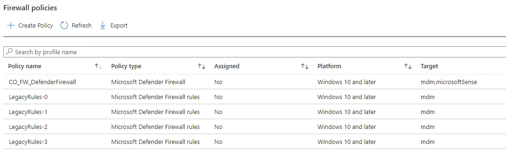
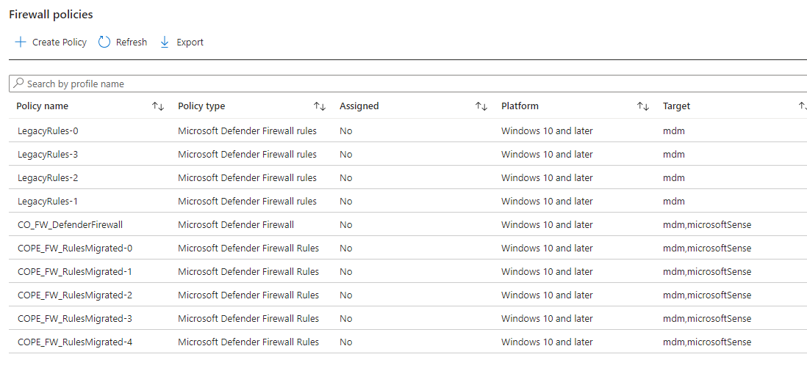
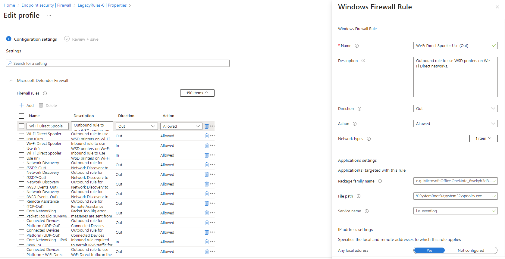
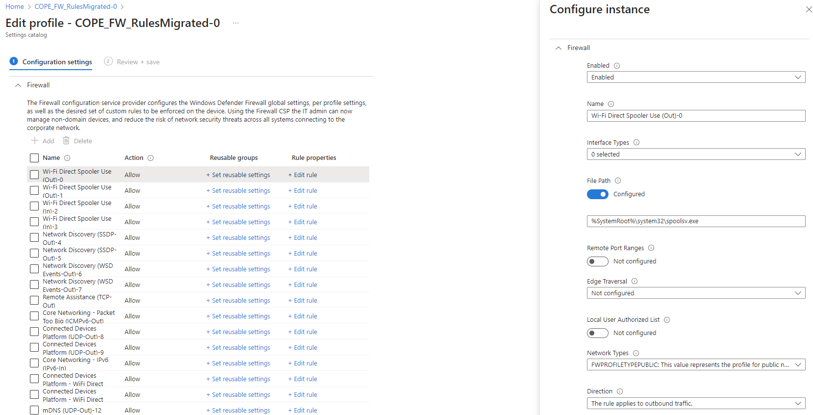

# Modernising Microsoft Intune Firewall Rule Policies


If you've ever experienced the joys of migrating Group Policy and in particular Windows Defender Firewall rules away from Group Policy to Microsoft Intune, you've probably encountered the [Rule Migration Tool](https://learn.microsoft.com/en-us/mem/intune/protect/endpoint-security-firewall-rule-tool), and for now this tool has worked well, beavering away grabbing firewall rules from a source Windows 10 or later device and punting them straight in Microsoft Intune. So what's the catch?

Well with the move to [Settings Catalog](https://learn.microsoft.com/en-us/mem/intune/configuration/settings-catalog) based policies all over the shop in Microsoft Intune, and the advent of [Reusable Settings](https://learn.microsoft.com/en-us/mem/intune/protect/reusable-settings-groups) for Defender Firewall Rules, these "legacy" Endpoint Security Defender Firewall Rule profiles don't support the new world, so how do we fix that?

It's obviously PowerShell and Graph, you should know this by now.


The functions, authentication, and script have now been updated to support the use of the Graph PowerShell SDK.


## Getting Firewall Rule Profiles

I haven't had time to update my fork of the [Rule Migration Tool](https://learn.microsoft.com/en-us/mem/intune/protect/endpoint-security-firewall-rule-tool) to support Settings Catalog policies just yet, so instead of focusing on capturing new rules, let's look at how we get the rules from existing Endpoint Security profiles. I've worked long enough on bodging together my own PowerShell functions that I can pull back existing profiles and the data, so let's do that first to see what we're working with, as we'll need to translate these existing rules into the new format.

Once we've authenticated to Graph using `Connect-MgGraph` and using the functions below to get the Endpoint Security profiles, Endpoint Security Templates and Endpoint Security Categories and finally each setting within the profile we can put all the existing rules into a variable that we can work with.

### Endpoint Security Profile

This function will get all Endpoint Security profiles, or a specific profile by either `Id` or `Name`. We'll need this to get the profiles that contains all the firewall rules we want to migrate.

```PowerShell
Function Get-DeviceEndpointSecProfile() {

    [cmdletbinding()]

    param (

        [Parameter(Mandatory = $false)]
        $name,

        [Parameter(Mandatory = $false)]
        $Id

    )

    $graphApiVersion = 'Beta'
    $Resource = 'deviceManagement/intents'

    try {
        if ($Id) {
            $uri = "https://graph.microsoft.com/$graphApiVersion/$Resource/$Id"
            Invoke-MgGraphRequest -Uri $uri -Method Get
        }
        elseif ($name) {
            $uri = "https://graph.microsoft.com/$graphApiVersion/$($Resource)"
            (Invoke-MgGraphRequest -Uri $uri -Method Get).Value | Where-Object { ($_.displayName).contains("$name") }
        }
        Else {
            $uri = "https://graph.microsoft.com/$graphApiVersion/$($Resource)"
            (Invoke-MgGraphRequest -Method Get -Uri $uri).value
        }
    }
    catch {
        Write-Error $Error[0].ErrorDetails.Message
        break
    }
}
```

### Endpoint Security Templates

As Endpoint Security profiles are a little more complicated that other profiles in Microsoft Intune, and rely on underpinning templates, we also have to get the template being used by the profile itself. We can pass the `templateId` captured from an Endpoint Security Profile using the above function into the `Id` parameter in the below function.

```PowerShell
Function Get-DeviceEndpointSecTemplate() {

    [cmdletbinding()]

    param (

        [Parameter(Mandatory = $false)]
        $name,

        [Parameter(Mandatory = $false)]
        $Id

    )

    $graphApiVersion = 'Beta'
    $Resource = "deviceManagement/templates?`$filter=(isof(%27microsoft.graph.securityBaselineTemplate%27))"

    try {
        if ($Id) {
            $uri = "https://graph.microsoft.com/$graphApiVersion/$Resource/$Id"
            Invoke-MgGraphRequest -Uri $uri -Method Get
        }
        elseif ($name) {
            $uri = "https://graph.microsoft.com/$graphApiVersion/$($Resource)"
            (Invoke-MgGraphRequest -Uri $uri -Method Get).Value | Where-Object { ($_.displayName).contains("$name") }
        }
        Else {
            $uri = "https://graph.microsoft.com/$graphApiVersion/$($Resource)"
            (Invoke-MgGraphRequest -Method Get -Uri $uri).value
        }
    }
    catch {
        Write-Error $Error[0].ErrorDetails.Message
        break
    }

}
```

### Endpoint Security Template Categories

Lastly, we now need to be able to get all the Endpoint Security categories that are assigned to the template allowing us to extract the actual content of the profile, and using the function above, we can get all the categories for the template by taking the `id` of the Endpoint Security Template, looping through each category in the template, and finally being able to extract the data we need.

All of this makes me glad that Settings Catalog profiles are being used more and more in Microsoft Intune.

```PowerShell
Function Get-DeviceEndpointSecCategorySetting() {

    <#
    .SYNOPSIS
    This function is used to get an Endpoint Security category setting from a specific policy using the Graph API REST interface
    .DESCRIPTION
    The function connects to the Graph API Interface and gets a policy category setting
    .EXAMPLE
    Get-EndpointSecurityCategorySetting -PolicyId $policyId -categoryId $categoryId
    Gets an Endpoint Security Categories from a specific template in Endpoint Manager
    .NOTES
    NAME: Get-EndpointSecurityCategory
    #>

    [cmdletbinding()]

    param
    (
        [Parameter(Mandatory = $true)]

        $Id,
        [Parameter(Mandatory = $true)]

        $categoryId
    )

    $graphApiVersion = 'Beta'
    $Resource = "deviceManagement/intents/$Id/categories/$categoryId/settings?`$expand=Microsoft.Graph.DeviceManagementComplexSettingInstance/Value"

    try {
        $uri = "https://graph.microsoft.com/$graphApiVersion/$($Resource)"
        (Invoke-MgGraphRequest -Method Get -Uri $uri).value
    }
    catch {
        Write-Error $Error[0].ErrorDetails.Message
        break
    }
}
```

### Capturing Firewall Rules

Using existing legacy Endpoint Security Firewall Rule profiles in a tenant, we just need to know their names so we can pass them into an array variable, so we can use the below profile names as examples.



Adding them into an array so we can loop through each one of them, and extract the needed data.

```PowerShell
$FirewallPolicies = @('LegacyRules-0', 'LegacyRules-1','LegacyRules-2', 'LegacyRules-3')
```

Using the Endpoint Security functions we can now process each of the profiles and rip out all the rules into a useable format using a new array variable `$FWRules`.

```PowerShell
$FWRules = @()
foreach ($FirewallPolicy in $FirewallPolicies) {
  $EndpointSecProfile = Get-DeviceEndpointSecProfile -Name $FirewallPolicy
  $EndpointSecTemplates = Get-DeviceEndpointSecTemplate
  $EndpointSecTemplate = $EndpointSecTemplates | Where-Object { $_.id -eq $EndpointSecProfile.templateId }
  $EndpointSecCategories = Get-DeviceEndpointSecTemplateCategory -Id $EndpointSecTemplate.id

  foreach ($EndpointSecCategory in $EndpointSecCategories) {
    $EndpointSecSettings = Get-DeviceEndpointSecCategorySetting -Id $EndpointSecProfile.id -categoryId $EndpointSecCategories.id
    $FWRules += $EndpointSecSettings.valueJson | ConvertFrom-Json
  }
}
```

With these we now have the `$FWRules` array of Firewall Rules captured from the existing profiles similar to the below.

```JSON
displayName               : NVIDIA SHIELD Streaming SSAS UDP Exception
description               : UDP exceptions for NVIDIA SHIELD Streaming SSAS (mDNS)
trafficDirection          : in
action                    : allowed
profileTypes              : {notConfigured}
packageFamilyName         :
filePath                  : C:\Program Files\NVIDIA Corporation\NvContainer\nvcontainer.exe
serviceName               :
protocol                  : 17
localPortRanges           : {5353}
remotePortRanges          : {}
interfaceTypes            : {notConfigured}
localUserAuthorizations   :
useAnyLocalAddressRange   : True
actualLocalAddressRanges  : {}
useAnyRemoteAddressRange  : True
actualRemoteAddressRanges : {}

displayName               : BlueStacks Service Hyper-V
description               :
trafficDirection          : in
action                    : allowed
profileTypes              : {notConfigured}
packageFamilyName         :
filePath                  :
serviceName               :
protocol                  : 6
localPortRanges           : {2860-2892}
remotePortRanges          : {}
interfaceTypes            : {notConfigured}
localUserAuthorizations   :
useAnyLocalAddressRange   : True
actualLocalAddressRanges  : {}
useAnyRemoteAddressRange  : False
actualRemoteAddressRanges : {172.31.224.0/255.255.240.0}
```

We now have the data we need to start building firewall rules in the new Setting Catalog format. Surely it get's easier, (hint: it doesn't).

## Creating Firewall Rules

We now have the information from the existing legacy profiles allowing us to create rules in the Settings Catalog policy format, so we should process each of the rules we've captured and pass the data into reusable variables in preparation for building the [JSON structure](https://learn.microsoft.com/en-us/graph/api/intune-deviceconfigv2-devicemanagementconfigurationpolicy-create?view=graph-rest-beta).

### Firewall Rule Grouping

One thing I didn't expect is that Settings Catalog policies, for Firewall rules at least, have a maximum number of rules, 100 in fact. Compared with the legacy profiles maximum of 150, we're going to have to split out the rules in `$FWRules` into 100 rule groups to allow us to add them to a single policy.

```PowerShell
$counter = [pscustomobject] @{ Value = 0 }
$groupSize = 100
$FWRuleGroups = $FWRules | Group-Object -Property { [math]::Floor($counter.Value++ / $groupSize) }
```

With the above, we can ensure that we are breaking the rules into 100 rule sections that we can then reference using the `$FWRuleGroups` variable when building the new policies.

```txt
Count Name Group
----- ---- -----
  100 0    {@{displayName=Wi-Fi Direct Spooler Use (Out); description=Outbound rule to use WSD printers on Wi-Fi Direct networks.; trafficDirection=out;
  100 1    {@{displayName=Network Discovery (SSDP-In); description=Inbound rule for Network Discovery to allow use of the Simple Service Discovery Protocol. [UDP
  100 2    {@{displayName=teams.exe; description=; trafficDirection=in; action=allowed; profileTypes=System.Object[]; packageFamilyName=;
  100 3    {@{displayName=Microsoft Sync Center; description=Microsoft Sync Center; trafficDirection=in; action=allowed; profileTypes=System.Object[];
   63 4    {@{displayName=Microsoft Office Outlook; description=; trafficDirection=in; action=allowed; profileTypes=System.Object[]; packageFamilyName=;
```

These groups can now be used to create separate Settings Catalog policies.

### Duplicate Rule Names

So for each of these rule groups in the `$FWRuleGroups` variable, we need to take each rule and extract the data, adding it to a variable that we can reference later, as well as one important different between the legacy and the new profiles...we can't have duplicate rule names. Yeah this one bit me in the arse pretty hard during testing, and I can tell you now I have thrown in a very quick fix for this using a counter in the form of the `$RuleNameCount` variable.

```PowerShell {hl_lines=[4,7]}
foreach ($FWRuleGroup in $FWRuleGroups) {

    $Rules = $FWRuleGroup.Group
    $RuleNameCount = 0
    foreach ($Rule in $Rules) {
        # Capturing existing rules with duplicate names, as Settings Catalog will not allow duplicates
        $DuplicateNames = $Rules.displayName | Group-Object | Where-Object { $_.count -gt 1 }

        $Name = $Rule.displayName
        if ($DuplicateNames.name -contains $Name) {
            $Name = $Name + '-' + $RuleNameCount++
        }
    }
}
```

This isn't the cleanest, but at least it gets us over the line with making sure every rule has a unique name. As you can see from the below, in just one of the groups we have a number of duplicates.

```txt
Count Name                      Group
----- ----                      -----
    2 App Installer             {App Installer, App Installer}
    7 Captive Portal Flow       {Captive Portal Flow, Captive Portal Flow, Captive Portal Flow, Captive Portal Flow…}
    2 Company Portal            {Company Portal, Company Portal}
    2 Dell SupportAssist for H… {Dell SupportAssist for Home PCs, Dell SupportAssist for Home PCs}
    2 Microsoft Edge            {Microsoft Edge, Microsoft Edge}
    3 Microsoft Edge (mDNS-In)  {Microsoft Edge (mDNS-In), Microsoft Edge (mDNS-In), Microsoft Edge (mDNS-In)}
    2 Microsoft Sticky Notes    {Microsoft Sticky Notes, Microsoft Sticky Notes}
    2 Microsoft Store           {Microsoft Store, Microsoft Store}
    2 Microsoft To Do           {Microsoft To Do, Microsoft To Do}
    4 VMware Remote MKS         {VMware Remote MKS, VMware Remote MKS, VMware Remote MKS, VMware Remote MKS}
   23 Windows Feature Experien… {Windows Feature Experience Pack, Windows Feature Experience Pack, Windows Feature Experience Pack, Windows Feature Experience Pack…}
```

### Rule Processing

On to how we capture the rest of the rule settings, and you may have noticed that not every rule will have every setting, for good reason, but we need to ensure that for each rule processed we're not taking through data from the previous rule, so we can update the code snippet above to capture the data into variables, but clear them out before we do so.

```PowerShell {hl_lines=[7]}
foreach ($FWRuleGroup in $FWRuleGroups) {

    $Rules = $FWRuleGroup.Group
    $RuleNameCount = 0
    foreach ($Rule in $Rules) {

        Clear-Variable -Name ('Name', 'Description', 'Direction', 'Action', 'FWProfiles', 'PackageFamilyName', 'FilePath', 'Service', 'Protocol', 'LocalPorts', 'RemotePorts', 'Interfaces', 'UseAnyLocalAddresses', 'LocalAddresses', 'UseAnyRemoteAddresses', 'RemoteAddresses') -ErrorAction Ignore

        # Capturing existing rules with duplicate names, as Settings Catalog will not allow duplicates
        $DuplicateNames = $Rules.displayName | Group-Object | Where-Object { $_.count -gt 1 }

        $Name = $Rule.displayName
        if ($DuplicateNames.name -contains $Name) {
            $Name = $Name + '-' + $RuleNameCount++
        }
        $Description = $Rule.description
        $Direction = $Rule.trafficDirection
        $Action = $Rule.action
        $FWProfiles = $Rule.profileTypes
        $PackageFamilyName = $Rule.packageFamilyName
        $FilePath = ($Rule.filePath).Replace('\', '\\')
        $Service = $Rule.serviceName
        $Protocol = $Rule.protocol
        $LocalPorts = $Rule.localPortRanges
        $RemotePorts = $Rule.remotePortRanges
        $Interfaces = $Rule.interfaceTypes
        $AuthUsers = $Rule.localUserAuthorizations
        $UseAnyLocalAddresses = $Rule.useAnyLocalAddressRange
        $LocalAddresses = $Rule.actualLocalAddressRanges
        $UseAnyRemoteAddresses = $Rule.useAnyRemoteAddressRange
        $RemoteAddresses = $Rule.actualRemoteAddressRanges
    }
}
```

We now have the information from the existing rules to create new ones. Now to the fun part of JSON formatting.

## Creating Settings Catalog Policies

Luckily we have  creating Settings Catalog policies, and have a good grasp of the JSON formatting required not just for the policy itself, but also for the settings contained within, with the first setting having differing JSON formatting structure and data compared with all subsequent settings. So I had at least an idea on how to build the JSON data to throw it at Microsoft Intune.

### Building the Policy

With the rules in neat little groups, and with all the  variables in place, we can loop through each of them to create individual Settings Catalog policies, we need to make sure that each policy has a unique name, so we can just take an existing `$PolicyName` variable and append the group name to it, as these are sequential numbers, giving us something like `COPE_FW_RulesMigrated-0, COPE_FW_RulesMigrated-1, COPE_FW_RulesMigrated-2, COPE_FW_RulesMigrated-3, COPE_FW_RulesMigrated-4` for the five groups we have in our example.

Each Settings Catalog Policy starts and ends with the same JSON data structure, so we can top and tail each policy with these new variables `$JSONPolicyStart` and `$JSONPolicyEnd`, passing in the `$NewPolicyName` and `$PolicyDescription`.

```PowerShell
foreach ($FWRuleGroup in $FWRuleGroups) {
    $NewPolicyName = $PolicyName + '-' + $FWRuleGroup.Name
    $PolicyDescription = 'Migrated Firewall Rules Policy'

    $JSONPolicyStart = @"
{
    "description": "$PolicyDescription",
    "name": "$NewPolicyName",
    "platforms": "windows10",
    "technologies@odata.type": "#microsoft.graph.deviceManagementConfigurationTechnologies",
    "technologies": "mdm,microsoftSense",
    "templateReference": {
            "@odata.type": "#microsoft.graph.deviceManagementConfigurationPolicyTemplateReference",
            "templateId": "19c8aa67-f286-4861-9aa0-f23541d31680_1",
            "templateFamily@odata.type": "#microsoft.graph.deviceManagementConfigurationTemplateFamily",
            "templateFamily": "endpointSecurityFirewall",
            "templateDisplayName": "Microsoft Defender Firewall Rules",
            "templateDisplayVersion": "Version 1"
        },
    "settings": [
        {
            "@odata.type": "#microsoft.graph.deviceManagementConfigurationSetting",
            "settingInstance": {
                "@odata.type": "#microsoft.graph.deviceManagementConfigurationGroupSettingCollectionInstance",
                "settingDefinitionId": "vendor_msft_firewall_mdmstore_firewallrules_{firewallrulename}",
                "settingInstanceTemplateReference": {
                    "@odata.type": "#microsoft.graph.deviceManagementConfigurationSettingInstanceTemplateReference",
                    "settingInstanceTemplateId": "76c7a8be-67d2-44bf-81a5-38c94926b1a1"
                },
                "groupSettingCollectionValue@odata.type": "#Collection(microsoft.graph.deviceManagementConfigurationGroupSettingValue)",
                "groupSettingCollectionValue": [

"@

    $JSONPolicyEnd = @'
                ]
            }
        }
    ]
}
'@

}
```

This was the easy part of the process, we now need to focus on the rules themselves.

### Building the Rules

As I've mentioned before, the initial rule in each policy has different JSON structure and data than the rest, so we can reuse our previous way of dealing this checking whether the rule is the first in the array.

```PowerShell
if ($Rule -eq $Rules[0]) {
...
}
else {
...
}
```

On top of this we need to build in logic to only add in JSON data when the rule requires it. Now there are a lot of potentials with each rule, but there are some consistencies across them all which we can look at now, the rest, well you can have a gander at the full script.

The start of each rule is the same, which is kind of Microsoft.

```PowerShell
$JSONRuleStart = @'
{
    "@odata.type": "#microsoft.graph.deviceManagementConfigurationGroupSettingValue",
    "settingValueTemplateReference": null,
    "children@odata.type": "#Collection(microsoft.graph.deviceManagementConfigurationSettingInstance)",
    "children": [
'@
```

But that's it for niceties, each of the options for every rule has different formatting, let's look at comparing just the JSON data for the name of the rule.

### JSON Differences

The first rule in the policy has additional content, mainly in the `settingValueTemplateId` sections across each object.

```PowerShell {hl_lines=[5,6,7,12,13,14,15]}
$JSONRuleName = @"
        {
            "@odata.type": "#microsoft.graph.deviceManagementConfigurationSimpleSettingInstance",
            "settingDefinitionId": "vendor_msft_firewall_mdmstore_firewallrules_{firewallrulename}_name",
            "settingInstanceTemplateReference": {
                "@odata.type": "#microsoft.graph.deviceManagementConfigurationSettingInstanceTemplateReference",
                "settingInstanceTemplateId": "116a696a-3270-493e-9938-c336cf05ea98"
            },
            "simpleSettingValue": {
                "@odata.type": "#microsoft.graph.deviceManagementConfigurationStringSettingValue",
                "value": "$Name",
                "settingValueTemplateReference": {
                    "@odata.type": "#microsoft.graph.deviceManagementConfigurationSettingValueTemplateReference",
                    "settingValueTemplateId": "12994a33-6185-4c3d-a0e8-69316f6293ea",
                    "useTemplateDefault": false
                }
            }
        },

"@
```

Compared with each subsequent Rule name, where the JSON doesn't need the `settingValueTemplateId` and other sections.

```PowerShell {hl_lines=[5,8]}
$JSONRuleName = @"
        {
            "@odata.type": "#microsoft.graph.deviceManagementConfigurationSimpleSettingInstance",
            "settingDefinitionId": "vendor_msft_firewall_mdmstore_firewallrules_{firewallrulename}_name",
            "settingInstanceTemplateReference": null,
            "simpleSettingValue": {
              "@odata.type": "#microsoft.graph.deviceManagementConfigurationStringSettingValue",
              "settingValueTemplateReference": null,
              "value": "$Name"
            }
        },

"@
```

You get the idea, now imagine spending half a day reviewing and comparing JSON for each of the potential options in the rule, I can't say it was an enjoyable time, but here we are.

Bringing the above together, we'll get something like the below.

```PowerShell
if ($Rule -eq $Rules[0]) {
    $JSONRuleName = @"
        {
            "@odata.type": "#microsoft.graph.deviceManagementConfigurationSimpleSettingInstance",
            "settingDefinitionId": "vendor_msft_firewall_mdmstore_firewallrules_{firewallrulename}_name",
            "settingInstanceTemplateReference": {
                "@odata.type": "#microsoft.graph.deviceManagementConfigurationSettingInstanceTemplateReference",
                "settingInstanceTemplateId": "116a696a-3270-493e-9938-c336cf05ea98"
            },
            "simpleSettingValue": {
                "@odata.type": "#microsoft.graph.deviceManagementConfigurationStringSettingValue",
                "value": "$Name",
                "settingValueTemplateReference": {
                    "@odata.type": "#microsoft.graph.deviceManagementConfigurationSettingValueTemplateReference",
                    "settingValueTemplateId": "12994a33-6185-4c3d-a0e8-69316f6293ea",
                    "useTemplateDefault": false
                }
            }
        },

"@
}
else {
    $JSONRuleName = @"
        {
            "@odata.type": "#microsoft.graph.deviceManagementConfigurationSimpleSettingInstance",
            "settingDefinitionId": "vendor_msft_firewall_mdmstore_firewallrules_{firewallrulename}_name",
            "settingInstanceTemplateReference": null,
            "simpleSettingValue": {
              "@odata.type": "#microsoft.graph.deviceManagementConfigurationStringSettingValue",
              "settingValueTemplateReference": null,
              "value": "$Name"
            }
        },

"@
}
```

### Completing the Policy

With the JSON data for all our rule(s) now in place, or at least hopefully, we need to combine all the `$JSONRule*` variables per rule into a new variable `$JSONRule`, and the add that rule to a new array variable `$JSONAllRules` that can be used to build the full Settings Catalog policy.

```PowerShell
$JSONAllRules = @()
...
$JSONRule = $JSONRuleStart + $JSONRuleName + $JSONRuleState + $JSONRuleDirection + $JSONRuleProtocol + $JSONRuleLocalAddressRange + $JSONRuleInterface + $JSONRulePackageFamily + $JSONRuleFilePath + $JSONRuleAuthUsers + $JSONRuleRemotePorts + $JSONRuleFWProfile + $JSONRuleService + $JSONRuleLocalPorts + $JSONRuleRemoteAddressRange + $JSONRuleAction + $JSONRuleDescription + $JSONRuleEnd
$JSONAllRules += $JSONRule
```

Now we have the start of the policy, the end of the policy, and the middle bit containing all the rules, we can combine them into one mega-JSON variable.

```PowerShell
$JSONPolicy = $JSONPolicyStart + $JSONAllRules + $JSONPolicyEnd
```

And using the function below, we can send this to Graph and create ourselves a new Settings Catalog policy.

```PowerShell
Function New-DeviceSettingsCatalog() {

    [cmdletbinding()]

    param
    (
        [parameter(Mandatory = $true)]
        $JSON
    )

    $graphApiVersion = 'Beta'
    $Resource = 'deviceManagement/configurationPolicies'

    try {
        Test-Json -Json $JSON
        $uri = "https://graph.microsoft.com/$graphApiVersion/$($Resource)"
        Invoke-MgGraphRequest -Uri $uri -Method Post -Body $JSON -ContentType 'application/json'
    }
    catch {
        Write-Error $Error[0].ErrorDetails.Message
        break
    }
}
```

Which looks something like this.

```PowerShell
New-DeviceSettingsCatalog -JSON $JSONPolicy
```

With, if all went well, the response below.

```txt
@odata.context       : https://graph.microsoft.com/beta/$metadata#deviceManagement/configurationPolicies/$entity
id                   : b9ae4e1f-7f78-4506-8520-aa7919f06a73
name                 : COPE_FW_RulesMigrated-4
description          : Migrated Firewall Rules Policy
platforms            : windows10
technologies         : mdm,microsoftSense
createdDateTime      : 14/09/2023 09:33:27
lastModifiedDateTime : 14/09/2023 09:33:27
settingCount         : 1
creationSource       :
roleScopeTagIds      : {0}
priorityMetaData     :
templateReference    : @{templateId=19c8aa67-f286-4861-9aa0-f23541d31680_1; templateFamily=endpointSecurityFirewall; templateDisplayName=Microsoft Defender Firewall Rules;
                       templateDisplayVersion=Version 1}
```

This looks pretty good if I do say so myself.

### Running the Script

The [full script](https://github.com/ennnbeee/oddsandendpoints-scripts/blob/main/Intune/EndpointSecurity/ConvertFirewallRules/Invoke-MgConvertFirewallRules.ps1) which let's be honest, is what you're after, can be run using the below command, passing in the required variables for `tenantId`, `policyName`, and `oldFirewallPolicies`

```PowerShell
./Invoke-MgConvertFirewallRules.ps1 -tenantId "yourtenantId" -policyName "COPE_FW_RulesMigrated" -oldFirewallPolicies "LegacyRules-0", "LegacyRules-1", "LegacyRules-2", "LegacyRules-3"
```

After authenticated to Graph, this will give us the below output having successfully created the new Settings Catalog policies.

```txt
Found Legacy Firewall Rule Profile LegacyRules-0
Found Legacy Firewall Rule Profile LegacyRules-1
Found Legacy Firewall Rule Profile LegacyRules-2
Found Legacy Firewall Rule Profile LegacyRules-3
Captured 463 rules from the provided legacy Endpoint Security Firewall Rules profiles.
Creating new Settings Catalog Policy COPE_FW_RulesMigrated-0

@odata.context       : https://graph.microsoft.com/beta/$metadata#deviceManagement/configurationPolicies/$entity
id                   : 14c02164-36ce-446f-9101-90c833ee441e
name                 : COPE_FW_RulesMigrated-0
description          : Migrated Firewall Rules Policy
platforms            : windows10
technologies         : mdm,microsoftSense
createdDateTime      : 14/09/2023 09:40:30
lastModifiedDateTime : 14/09/2023 09:40:30
settingCount         : 1
creationSource       :
roleScopeTagIds      : {0}
priorityMetaData     :
templateReference    : @{templateId=19c8aa67-f286-4861-9aa0-f23541d31680_1; templateFamily=endpointSecurityFirewall; templateDisplayName=Microsoft Defender Firewall Rules;
                       templateDisplayVersion=Version 1}

Successfully created new Settings Catalog Policy COPE_FW_RulesMigrated-0
Creating new Settings Catalog Policy COPE_FW_RulesMigrated-1
@odata.context       : https://graph.microsoft.com/beta/$metadata#deviceManagement/configurationPolicies/$entity
id                   : 213957bd-2bc1-4103-af59-25e406894213
name                 : COPE_FW_RulesMigrated-1
description          : Migrated Firewall Rules Policy
platforms            : windows10
technologies         : mdm,microsoftSense
createdDateTime      : 14/09/2023 09:40:31
lastModifiedDateTime : 14/09/2023 09:40:31
settingCount         : 1
creationSource       :
roleScopeTagIds      : {0}
priorityMetaData     :
templateReference    : @{templateId=19c8aa67-f286-4861-9aa0-f23541d31680_1; templateFamily=endpointSecurityFirewall; templateDisplayName=Microsoft Defender Firewall Rules;
                       templateDisplayVersion=Version 1}

Successfully created new Settings Catalog Policy COPE_FW_RulesMigrated-1
Creating new Settings Catalog Policy COPE_FW_RulesMigrated-2
@odata.context       : https://graph.microsoft.com/beta/$metadata#deviceManagement/configurationPolicies/$entity
id                   : 8eade932-9563-4cc5-b24e-9b478f98cebe
name                 : COPE_FW_RulesMigrated-2
description          : Migrated Firewall Rules Policy
platforms            : windows10
technologies         : mdm,microsoftSense
createdDateTime      : 14/09/2023 09:40:33
lastModifiedDateTime : 14/09/2023 09:40:33
settingCount         : 1
creationSource       :
roleScopeTagIds      : {0}
priorityMetaData     :
templateReference    : @{templateId=19c8aa67-f286-4861-9aa0-f23541d31680_1; templateFamily=endpointSecurityFirewall; templateDisplayName=Microsoft Defender Firewall Rules;
                       templateDisplayVersion=Version 1}

Successfully created new Settings Catalog Policy COPE_FW_RulesMigrated-2
Creating new Settings Catalog Policy COPE_FW_RulesMigrated-3
@odata.context       : https://graph.microsoft.com/beta/$metadata#deviceManagement/configurationPolicies/$entity
id                   : 9723ffd1-198e-4b96-8572-668e16c8dbda
name                 : COPE_FW_RulesMigrated-3
description          : Migrated Firewall Rules Policy
platforms            : windows10
technologies         : mdm,microsoftSense
createdDateTime      : 14/09/2023 09:40:34
lastModifiedDateTime : 14/09/2023 09:40:34
settingCount         : 1
creationSource       :
roleScopeTagIds      : {0}
priorityMetaData     :
templateReference    : @{templateId=19c8aa67-f286-4861-9aa0-f23541d31680_1; templateFamily=endpointSecurityFirewall; templateDisplayName=Microsoft Defender Firewall Rules;
                       templateDisplayVersion=Version 1}

Successfully created new Settings Catalog Policy COPE_FW_RulesMigrated-3
Creating new Settings Catalog Policy COPE_FW_RulesMigrated-4
@odata.context       : https://graph.microsoft.com/beta/$metadata#deviceManagement/configurationPolicies/$entity
id                   : a82b554f-34a9-4f1c-bc46-05e1d399e255
name                 : COPE_FW_RulesMigrated-4
description          : Migrated Firewall Rules Policy
platforms            : windows10
technologies         : mdm,microsoftSense
createdDateTime      : 14/09/2023 09:40:35
lastModifiedDateTime : 14/09/2023 09:40:35
settingCount         : 1
creationSource       :
roleScopeTagIds      : {0}
priorityMetaData     :
templateReference    : @{templateId=19c8aa67-f286-4861-9aa0-f23541d31680_1; templateFamily=endpointSecurityFirewall; templateDisplayName=Microsoft Defender Firewall Rules;
                       templateDisplayVersion=Version 1}

Successfully created new Settings Catalog Policy COPE_FW_RulesMigrated-4
```

I'd call that a win in my books.

### Comparing Profiles to Policies

Checking in Microsoft Intune we should have five new policies that contain the same rules as the legacy profiles. With the new rules having the supplied name prefix, and using the updated policies.


The clue is the 'Target' being `mdm,microsoftSense` not just `mdm`




Let's have a gander at comparing the rules between the profiles, with the old profile looking like the below with the rule detail.



And the new policy looking pretty damn good.



I think we're done.

## Summary

This, and the [script](https://github.com/ennnbeee/oddsandendpoints-scripts/blob/main/Intune/EndpointSecurity/ConvertFirewallRules/Invoke-MgConvertFirewallRules.ps1), as usual all came about from improving a Customers Microsoft Intune environment. The customer being very security focussed was blocking legitimately everything inbound and outbound unless there was a firewall rule; this included all Microsoft 365 endpoints.

With their existing rules in legacy profiles, they had to have rules with *all* the IP addresses for these [Microsoft endpoints](https://learn.microsoft.com/en-us/microsoft-365/enterprise/urls-and-ip-address-ranges?view=o365-worldwide), and keep these up-to-date across multiple profiles.

This obviously wasn't ideal, and with the advent of the [reusable settings](https://learn.microsoft.com/en-us/mem/intune/protect/reusable-settings-groups) and the auto discovery of addresses and domains for firewall rules in Settings Catalog policies, allowed for more confidence in the rules, a reduced maintenance overhead, and you know, new stuff is cool.

There is still a scenario I need to look at, and I mentioned that at the start, looking at the original Microsoft [Rule Migration Tool](https://learn.microsoft.com/en-us/mem/intune/protect/endpoint-security-firewall-rule-tool) and getting that to create Settings Catalog policies instead of the legacy format, but that is one for a very very rainy day.

