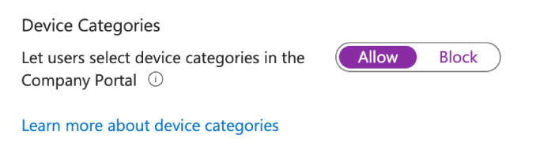

# Self-Service Software Update Deployments

We've looked at  the deployment of Windows Updates in a smart way with Dynamic Security Groups, we've looked at allowing VIP users to  of phased Windows update installation, we've even looked at how we deliver  operating system and software updates just like we do with Windows, what else is there to do now?

Allowing an end user to choose what day they get their updates? Am I OK? Probably not, but if you're wanting to empower your users to select when they get their updates, this might be an interesting read, especially when I explain how we're going to achieve this.

## Why Self-Service Updates?

I mean, why not? As much as updates are there to ensure devices are secure, or as secure as they can be when it comes to operating system vulnerabilities, it is the user that is actually impacted by the installation of updates and enforced device restarts. So why not give them some control over when updates are installing. So how are we going to give the users a choice...

Yeah, [Device Categories](https://learn.microsoft.com/en-us/mem/intune/enrollment/device-group-mapping). In for a penny in for a pound when it comes to bad choices eh?

## Device Categories?

Yes I know what you're thinking, relying on end users to select the correct device category in the Company Portal, and then using that attribute to group devices to apply update settings sounds like a bad idea, but hear me out, please.

### The Word of the Day is "Inaccurate"

First before I convince you that this isn't the worst thing in the world, we should see what the some of the issues are with Device Categories in their general use:

1. A user will just select whatever device category they want - *this leads to inaccurate assignment of device categories.*
2. A Windows user might not ever open the Company Portal - *this means a category is never selected and grouping or filtering based on categories becomes inaccurate.*
3. An Intune administrator user can rename a category - *if dynamic security groups or device filters rely on this category name, then these grouping become inaccurate.*

Now I'm not going to be able to solve all the issues here, especially as there isn't an RBAC setting specifically for Device Categories, but we should be able to deal with a couple of them at least.


If you are using Device Categories, I'm not coming for you here, but I would be very careful when using them for anything important.


### Configuring Device Categories

Before you excitedly go and create your new Device Categories, do me a solid and check that your users are actually able to select them from the Company Portal. Go check Tenant Customisation settings in Microsoft Intune, and turn on, if like me you'd in anger previously turned off the below option:

Now that you know how to just turn on or turn off Device Categories, if you're not convinced, turn them off and go find another post to read, otherwise keep reading.

### Days of the Week

If you're still here, and want to see how to let your users choose when they get their updates, we can look at creating the following Device Categories based on the the day of the week:

| Day of Update | Device Category |
| :- | :- |
| Sunday | `Update my device on a Sunday` |
| Monday | `Update my device on a Monday` |
| Tuesday | `Update my device on a Tuesday` |
| Wednesday | `Update my device on a Wednesday` |
| Thursday | `Update my device on a Thursday` |
| Friday | `Update my device on a Friday` |
| Saturday | `Update my device on a Saturday` |

You can of course name these Device Categories something more suitable to your environment, and limit the days of the week if you'd like, just remember that this is an end user selecting a category, so some fancy naming convention won't necessarily make as much sense to them as it does to you.

With the Device Categories now in place, we can take on the advice of Microsoft for a change:

> Create device categories to help organize devices and build dynamic device groups.

And go and create some [Dynamic Security Groups](https://learn.microsoft.com/en-us/entra/identity/users/groups-dynamic-membership) in Entra using them.

## Dynamic Device Groups

To support the ability for end users to get updates on the day they expect, we're going to go and create some new Dynamic Device Groups in Entra.

We can not only use these groups for include assignments for our update policies, but also exclude assignments, ensuring that even if an end user doesn't bother opening the Company Portal, that they'll still get some level of update, just maybe not when they want it.

### Device Category Groups

These are the obvious ones, as we've created our Device Categories now, we need corresponding groups in Entra that we can use to capture the devices based on the category selected. Obviously my group rule matches my category names, yours might be different.

| Day of Update | Group Name | Rule |
| :- | :- | :- |
| Sunday | SG_MDM_Devices_Updates_Sunday | `(device.deviceCategory -eq "Update my device on a Sunday")` |
| Monday | SG_MDM_Devices_Updates_Monday | `(device.deviceCategory -eq "Update my device on a Monday")` |
| Tuesday | SG_MDM_Devices_Updates_Tuesday | `(device.deviceCategory -eq "Update my device on a Tuesday")` |
| Wednesday | SG_MDM_Devices_Updates_Wednesday | `(device.deviceCategory -eq "Update my device on a Wednesday")` |
| Thursday | SG_MDM_Devices_Updates_Thursday | `(device.deviceCategory -eq "Update my device on a Thursday")` |
| Friday | SG_MDM_Devices_Updates_Friday | `(device.deviceCategory -eq "Update my device on a Friday")` |
| Saturday | SG_MDM_Devices_Updates_Saturday | `(device.deviceCategory -eq "Update my device on a Saturday")` |


You may have noticed that I'm not using any other attributes in these groups, as we're going to use them across all operating system types, and where we can we'll use [Device Filters](https://learn.microsoft.com/en-us/mem/intune/fundamentals/filters) to apply to more granular devices, based on something like device ownership.


If you want to be more specific here, and create a set of groups per operating system or per ownership type, go for it, it's your environment after all, just remember that these Device Categories do not care about ownership, operating system, or otherwise.

### Spreading the Update Load

So what if we still want some phasing across supported update policies (it's Windows, *only* Windows), and you don't want all the users who selected the `Update my device on a Thursday` Device Category to get the update on the same Thursday?

Well with a couple of additional Dynamic Security Groups, we can have two update policies for the same day but a week apart, splitting devices roughly in half.

| Scope | Group Name | Rule |
| :- | :- | :- |
| Initial Production | SG_MDM_Devices_Updates_A | `(device.deviceManagementAppId -ne null) and ((device.deviceId -startsWith "1") or (device.deviceId -startsWith "3") or (device.deviceId -startsWith "5") or (device.deviceId -startsWith "7") or (device.deviceId -startsWith "9") or (device.deviceId -startsWith "a") or (device.deviceId -startsWith "c") or (device.deviceId -startsWith "e"))` |
| Final Production | SG_MDM_Devices_Updates_B | `(device.deviceManagementAppId -ne null) and ((device.deviceId -startsWith "0") or (device.deviceId -startsWith "2") or (device.deviceId -startsWith "4") or (device.deviceId -startsWith "6") or (device.deviceId -startsWith "8") or (device.deviceId -startsWith "b") or (device.deviceId -startsWith "d") or (device.deviceId -startsWith "f"))` |

We've seen these types of groups  so they shouldn't be too much of a surprise to you, but in short, we're splitting all the devices into ~50% groups using the UUID associated with each deviceId object in Entra.

We can then use these groups when creating our [Windows Update rings](https://learn.microsoft.com/en-us/mem/intune/protect/windows-10-update-rings) for our weekday specific updates.

## Software Update Profiles

In the case where we get users who do not select a Device Category for whatever reason, we can build out update profiles in our usual way, whether this be a  approach or otherwise, but we need to ensure that these policies only apply to devices without a selected update day.

To achieve this, we can just [exclude](https://learn.microsoft.com/en-us/mem/intune/configuration/device-profile-assign#exclude-groups-from-a-policy-assignment) our created Device Category dynamic security groups from our existing update policies.

So for any existing update profiles, make sure you are excluding, in this instance, the seven created groups, allowing devices to get updates regardless of whether a user has bothered to open the Company Portal or not.

Now on to the weekday specific policies.

### Windows Update Rings

This one requires a little more brain power than the other update policies, all to cope with the idea that you want to split devices across differing weeks, but on the same days.

As maths isn't my strong point, we're going to leverage the option to [install updates at a scheduled time](https://learn.microsoft.com/en-us/mem/intune/protect/windows-update-settings#:~:text=Auto%20install%20and%20restart%20at%20scheduled%20time%20%2D); this has it's downsides relating to whether a device is actually active during that time of day, but is easier to work out than using  that I've covered previously.

With the idea we need to create two update rings for each day to help spread the load, we can create one for Thursday on the first week of the month:

Assigning this to the Thursday based Dynamic Security Group, but excluding one of our Production groups we created to split devices across update rings.

Creating a second Update Ring for Thursday, but amending the week of the month and the assignment using the second week:

Keeping the same include assignment, but amending the exclude assignment to the *other* Production group.

Now you've got your head around that, go create 14 update rings 😅 with the below settings:

- **Quality update deferral period (days)** - `0 days`
- **Automatic update behaviour** - `Auto install and restart at a scheduled time`
- **Deadline for quality updates** - `0 days`
- **Automatic behaviour frequency:**

| Day of Update | Week | Assignment |
| :- | :- | :- |
| Sunday | `Second week of the month`  | Include: SG_MDM_Devices_Updates_Sunday Exclude: SG_MDM_Devices_Updates_B |
| Sunday | `Third week of the month`  | Include: SG_MDM_Devices_Updates_Sunday Exclude: SG_MDM_Devices_Updates_A |
| Monday | `Second week of the month`  | Include: SG_MDM_Devices_Updates_Monday Exclude: SG_MDM_Devices_Updates_B |
| Monday | `Third week of the month`  | Include: SG_MDM_Devices_Updates_Monday Exclude: SG_MDM_Devices_Updates_A |
| Tuesday | `Second week of the month`  | Include: SG_MDM_Devices_Updates_Tuesday Exclude: SG_MDM_Devices_Updates_B |
| Tuesday | `Third week of the month`  | Include: SG_MDM_Devices_Updates_Tuesday Exclude: SG_MDM_Devices_Updates_A |
| Wednesday | `Second week of the month`  | Include: SG_MDM_Devices_Updates_Wednesday Exclude: SG_MDM_Devices_Updates_B |
| Wednesday | `Third week of the month`  | Include: SG_MDM_Devices_Updates_Wednesday Exclude: SG_MDM_Devices_Updates_A |
| Thursday | `Second week of the month`  | Include: SG_MDM_Devices_Updates_Thursday Exclude: SG_MDM_Devices_Updates_B |
| Thursday | `Third week of the month`  | Include: SG_MDM_Devices_Updates_Thursday Exclude: SG_MDM_Devices_Updates_A |
| Friday | `Second week of the month`  | Include: SG_MDM_Devices_Updates_Friday Exclude: SG_MDM_Devices_Updates_B |
| Friday | `Third week of the month`  | Include: SG_MDM_Devices_Updates_Friday Exclude: SG_MDM_Devices_Updates_A |
| Saturday | `Second week of the month`  | Include: SG_MDM_Devices_Updates_Saturday Exclude: SG_MDM_Devices_Updates_B |
| Saturday | `Third week of the month`  | Include: SG_MDM_Devices_Updates_Saturday Exclude: SG_MDM_Devices_Updates_A |

Your mileage may vary with which week of the month you're choosing (remembering that the days in the second week might not be after Patch Tuesday), and if you really want to spread things out across the whole month, you can create smaller Production groups and four update rings per day.

### iOS/iPadOS Update Policies

On to the easier ones, and for whatever reason, ones that we don't consider to warrant any kind of phasing. So go and create some [iOS/iPadOS Update Policies](https://learn.microsoft.com/en-us/mem/intune/protect/software-updates-ios) and configure each update policy with the below default settings, making changes only to the Time Window configuration for each day of the week:

- **Update to install** - `Install iOS/iPadOS Latest update`
- **Schedule type** - `Update during scheduled time`
- **Time zone** - `UTC±00` (select your own time zone)
- **Time window:**

| Day of Update | Time Window | Assignment |
| :- | :- | :- |
| Sunday | `Sunday 12AM - Monday 12AM` | SG_MDM_Devices_Updates_Sunday |
| Monday | `Monday 12AM - Tuesday 12AM` | SG_MDM_Devices_Updates_Monday |
| Tuesday | `Tuesday 12AM - Wednesday 12AM` | SG_MDM_Devices_Updates_Tuesday |
| Wednesday | `Wednesday 12AM - Thursday 12AM` | SG_MDM_Devices_Updates_Wednesday |
| Thursday | `Thursday 12AM - Friday 12AM` | SG_MDM_Devices_Updates_Thursday |
| Friday | `Friday 12AM - Saturday 12AM` | SG_MDM_Devices_Updates_Friday |
| Saturday | `Saturday 12AM - Sunday 12AM` | SG_MDM_Devices_Updates_Saturday |

You can see an example of how this has been configured below for delivering updates on a Monday:

You could, and I mean *could*, use the same logic behind the Windows update phasing, and split each day into twelve-hour sections, or more if you really hate yourself, and use the Production groups to split the delivery of updates in the morning and afternoon on the same day.

But you know, iOS updates don't break devices 🤨.

### macOS Update Policies

We're almost there, so time for the [macOS Update Policies](https://learn.microsoft.com/en-us/mem/intune/protect/software-updates-macos), we're sticking with this profile for now as gives us the behaviour we want, not one of the [other options](https://learn.microsoft.com/en-us/mem/solutions/end-to-end-guides/macos-endpoints-get-started#software-updates) for software updates , configuring each with the default settings below:

- **Critical updates** - `Install immediately`
- **Firmware updates** - `Install immediately`
- **Configuration file updates** - `Install immediately`
- **All other updates (OS, built-in apps)** - `Install immediately`
- **Schedule type** - `Update during scheduled time`
- **Time zone** - `UTC±00` (select your own time zone)
- **Time window:**

| Day of Update | Time Window | Assignment |
| :- | :- | :- |
| Sunday | `Sunday 12AM - Monday 12AM` | SG_MDM_Devices_Updates_Sunday |
| Monday | `Monday 12AM - Tuesday 12AM` | SG_MDM_Devices_Updates_Monday |
| Tuesday | `Tuesday 12AM - Wednesday 12AM` | SG_MDM_Devices_Updates_Tuesday |
| Wednesday | `Wednesday 12AM - Thursday 12AM` | SG_MDM_Devices_Updates_Wednesday |
| Thursday | `Thursday 12AM - Friday 12AM` | SG_MDM_Devices_Updates_Thursday |
| Friday | `Friday 12AM - Saturday 12AM` | SG_MDM_Devices_Updates_Friday |
| Saturday | `Saturday 12AM - Sunday 12AM` | SG_MDM_Devices_Updates_Saturday |

Again, you can split these down to more granular times, but why bother, macOS updates definitely don't break macOS devices 🤐.

### Android Update Policies

Yeah, sorry, not an option for Android Enterprise devices, as there isn't support for specific update install days. Let's just let the user think they have some control over their updates here, a little placebo never hurt anyone.

Just create a new Device Restriction profile and set **System update** under **General** to be `Automatic`, no need to even use the Dynamic Security Groups, just go ahead and assign this to all applicable devices.

## User Experience

Now that you've got all your Dynamic Security Groups sorted, each Software Update policy created and assigned, across each of the supported operating systems, all is left to do is wait for users to select a Device Category.

Really your users can't miss them, and with Android, iOS/iPadOS, and macOS enrolment pretty much forcing you to open the Company Portal, you should get some uptake.


If you fancy, you could create a new Device Category for *"I don't care about updates"*, and leverage that in either existing Dynamic Security Groups to leave the device in your standard Software Update deployment approaches.


## Summary

If you've followed along, (and I assume most people switched off when I suggested using Device Categories), you could have some over arching catch-all update policies that will apply updates when you want them to, across as many phases or stages as you see fit *and* user selected update policies, allowing the user some control, or the semblance of control in some instances, as to when their device is updated and/or restarted all from the selection of a Device Category.

Empowering.

I'm not going to say this is the best approach for update delivery, nor am I suggesting you drop your current software update deployment approach in favour of something entirely user-driven, but I am at least showing you what is possible, with functionality in Microsoft Intune that often gets overlooked, or misused for whatever reason.

