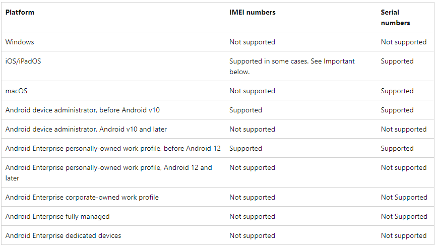
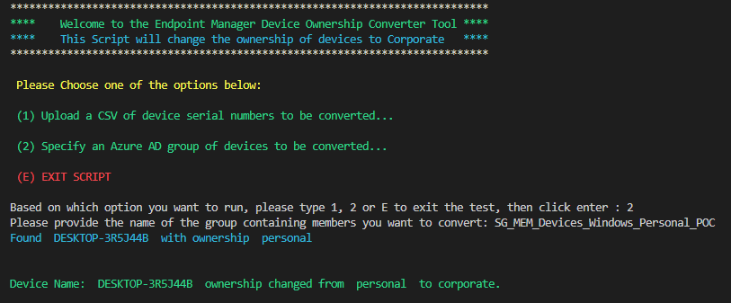
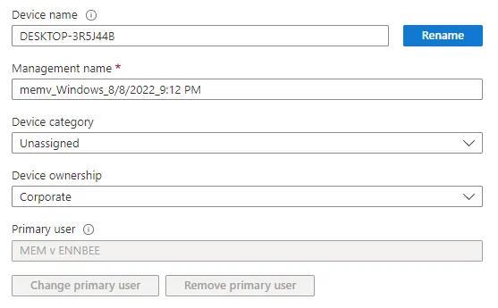

# Updating Enrolled Device Ownership Status


What happens if you've allowed Windows, iOS, Android, and macOS devices to enrol into Microsoft Microsoft Intune in all kinds of ways, and now you're in a situation where devices that should be marked as corporate are marked as personal or unknown?

This is more of a common situation than you think, with the need to get remote devices managed in a timely fashion, many organisations used User Driven enrolment methods, such as via the Company Portal, to enrol devices into Microsoft Intune, and without Corporate Device Identifiers, or for the case of Windows no support for them, these devices get enrolled as personal devices.

## Corporate Device Identifiers

[Corporate Device Identifiers](https://docs.microsoft.com/en-us/mem/intune/enrollment/corporate-identifiers-add) are useful for tagging devices as corporate for devices that have not yet enrolled into Microsoft Intune, but what about those that have, and what about the poor devices that just don't have a place in the [supported corporate device identifier](https://docs.microsoft.com/en-us/mem/intune/enrollment/corporate-identifiers-add#identify-corporate-owned-devices-with-imei-or-serial-number) world:



We need to find a way to update devices we know are corporate owned and change the ownership type, sadly there isn't a native way of doing this using [Bulk Device Actions](https://docs.microsoft.com/en-us/mem/intune/remote-actions/bulk-device-actions) in Microsoft Intune, so Graph API and PowerShell it is.

## Device Ownership Change

We're going to leverage Graph API to update devices that we know should be marked as corporate, to corporate ownership in Microsoft Intune. You could manually change this within each device properties page, but if you've got 100's of devices, this isn't a task I'd be willing to do.

We can attack this problem in a couple of ways, three if you count manually changing device ownership, but we'll stick with:

- Serial numbers of devices we know are corporate
- Groups of devices that we know are corporate

Now we have options, we'd better write something to make this change for these devices.

### Device Lists

First off is putting together the list of devices you know are corporate, now I'm hoping you have an Asset Register that contains all the serial numbers of your owned devices, so you could use this to create a CSV file, make sure the serial numbers are under the heading 'SerialNumber' as we'll need this later.

```txt
DeviceName,SerialNumber
ENB-564d71,VMware-564d710031a992c6-ca795244c03a8322
```

If you don't have these serials to hand, you could probably export all data from the [Microsoft Intune All Devices blade](https://endpoint.microsoft.com/#view/Microsoft_Intune_DeviceSettings/DevicesMenu/~/mDMDevicesPreview), and then filter the data to show devices with unknown or personal ownership and review them. Good luck.

For the group, let's make use of [Azure AD Dynamic Groups](https://docs.microsoft.com/en-us/azure/active-directory/enterprise-users/groups-dynamic-membership),and find a suitable way to use the query to capture the corporate devices. This could be display name, or device make and model, or device ownership not equals corporate, or a combination of all three, really you can be creative here to fit your environment.

```sql
(device.displayName -startsWith "ENB-")

(device.deviceManufacturer -eq "Dell Inc.") and (device.deviceModel -startsWith "XPS")

(device.deviceOSType -eq "Windows") and (device.deviceOwnership -ne "Company")

(device.deviceOSType -eq "Windows") and (device.deviceOwnership -ne "Company") and (device.deviceManufacturer -eq "Dell Inc.") and (device.deviceModel -startsWith "XPS") and (device.displayName -startsWith "ENB-")
```

### Managed Devices

With our list of devices, either CSV or Azure AD Group, we will need to use this data to get the Managed Device object in Microsoft Intune.

To do this we will need to authenticate to Graph, and as you've seen this one a lot on this blog already in  , I won't put the functions here, but we're using the PowerShell Authentication Function from the [Intune PowerShell Samples](https://github.com/microsoftgraph/powershell-intune-samples) GitHub repo to allow us to connect to Graph.

Once connected, we can now look at not only getting devices, but updating the device object, time for a function or two.

### Getting Managed Devices

First off let's use Graph to get all Managed Devices, we can use a `Where-Object` clause late to fine tune which device we're getting the details of later on.

```PowerShell
Function Get-ManagedDevices() {

    param
    (
        [switch]$IncludeEAS,
        [switch]$ExcludeMDM
    )

    $graphApiVersion = "beta"
    $Resource = "deviceManagement/managedDevices"

    try {
        $Count_Params = 0

        if ($IncludeEAS.IsPresent) { $Count_Params++ }
        if ($ExcludeMDM.IsPresent) { $Count_Params++ }
        if ($Count_Params -gt 1) {
            write-warning "Multiple parameters set, specify a single parameter -IncludeEAS, -ExcludeMDM or no parameter against the function"
            Write-Host
            break
        }
        elseif ($IncludeEAS) {
            $uri = "https://graph.microsoft.com/$graphApiVersion/$Resource"
        }
        elseif ($ExcludeMDM) {
            $uri = "https://graph.microsoft.com/$graphApiVersion/$Resource`?`$filter=managementAgent eq 'eas'"
        }
        else {
            $uri = "https://graph.microsoft.com/$graphApiVersion/$Resource`?`$filter=managementAgent eq 'mdm' and managementAgent eq 'easmdm'"
        }
        (Invoke-MgGraphRequest -Uri $uri -Method Get).Value
    }

    catch {
        Write-Error $Error[0].ErrorDetails.Message
        break
    }
}
```

### Set Managed Device Ownership

Using the 'patch' functionality in the Graph API, we can change an existing Managed Device object in Microsoft Intune, in this case, I was lazy and just wrote the function for device ownership, but the 'patch' option would allow you to change [many settings](https://docs.microsoft.com/en-us/graph/api/intune-devices-manageddevice-update?view=graph-rest-1.0).

This function only needs a couple of parameters, `id` and `ownertype`.

```PowerShell
Function Set-ManagedDeviceOwnership() {

    param
    (
        $id,
        $ownertype
    )

    $graphApiVersion = "Beta"
    $Resource = "deviceManagement/managedDevices"

    try {
        if ($id -eq "" -or $null -eq $id) {
            write-host "No Device id specified, please provide a device id..." -f Red
            break
        }

        if ($ownerType -eq "" -or $null -eq $ownerType) {
            write-host "No ownerType parameter specified, please provide an ownerType. Supported value personal or company..." -f Red
            Write-Host
            break
        }

        $Output = New-Object -TypeName psobject
        $Output | Add-Member -MemberType NoteProperty -Name 'ownerType' -Value $ownerType
        $JSON = $Output | ConvertTo-Json -Depth 3
        $uri = "https://graph.microsoft.com/$graphApiVersion/$Resource/$ID"
        Invoke-MgGraphRequest -Uri $uri -Method Patch -Body $Json -ContentType "application/json"
    }
    catch {
        Write-Error $Error[0].ErrorDetails.Message
        break
    }
}
```

### Importing the Devices

We have a way to get a Managed Device and change the ownership, let's put together a way to import devices via the two previously mentioned methods, so that we can fix whatever mistakes we got ourselves into.

So we've got either a list of devices or a group of devices we want to convert, we now need to get the Microsoft Intune device ID for each of these devices, we'll need to do this in two separate ways, one for serial number in the CSV file and one for the Azure AD device ID attribute for the members of the group.

### Serial Number

This is the easy one, we can use the `Get-ManagedDevice` function we created and use the `where-object` clause to find the exact device we want, this is the benefit of using serial numbers.

```PowerShell
If ($Device.SerialNumber) {
    try {
        $ManagedDevice = Get-ManagedDevices | Where-Object { $_.serialnumber -eq $Device.SerialNumber }
        Write-Host "Found "$ManagedDevice.DeviceName" with ownership "$ManagedDevice.ownerType"" -ForegroundColor Cyan
        Write-Host
    }
    catch {
        Write-Host "Unable to find device with serial number "$Device.SerialNumber"" -ForegroundColor Yellow
        Write-Host
    }
}
```

We now have the Managed Device detail, and importantly the Managed Device ID we need to change the ownership.

### Azure AD Device ID

This one isn't as straight forward, as it's a three step process, we need to:

- Get the ID of the group based on the name
- Get the members of the group and their Azure AD Device ID
- Get the Managed Device details

I could have used the [AzureAD PowerShell module](https://docs.microsoft.com/en-us/powershell/module/azuread/?view=azureadps-2.0) for this, but I didn't want to authenticate twice, once to Graph and then again to Azure Active Directory...so I created a couple of functions and the script section below to get the required Managed Device ID.

```PowerShell
$Group = Read-host "Please provide the name of the group containing members you want to convert"
try {
    $id = (Get-DeviceGroup -GroupName "$Group").id
    $Devices = Get-DeviceGroupMembers -id $id
}
catch {
    Write-Host "Unable to find the device group" -ForegroundColor Red
    Write-Host "Script can't continue" -ForegroundColor Red
    Write-Host
    break
}

...

Else {
    try {
        $ManagedDevice = Get-ManagedDevices | Where-Object { $_.azureADDeviceId -eq $Device.deviceId }
        Write-Host "Found "$ManagedDevice.DeviceName" with ownership "$ManagedDevice.ownerType"" -ForegroundColor Cyan
    }
    catch {
        Write-Host "Unable to find device with name "$Device.DisplayName"" -ForegroundColor Yellow
    }
}
```

### Getting the Group

Using the [GET /groups](https://docs.microsoft.com/en-us/graph/api/group-list?view=graph-rest-1.0&tabs=http) resource in Graph and some [filtering](https://docs.microsoft.com/en-us/graph/aad-advanced-queries?tabs=http), we can get the ID of the group provided from the script.

```PowerShell
Function Get-DeviceGroup() {

    param
    (
        [string]$GroupName
    )

    $graphApiVersion = "v1.0"
    $Resource = "dynamic groups"

    try {
        $uri = "https://graph.microsoft.com/$graphApiVersion/$Resource`?`$filter=displayName eq '$GroupName'"
        (Invoke-MgGraphRequest -Uri $uri -Method Get).Value
    }
    catch {
        Write-Error $Error[0].ErrorDetails.Message
        break
    }
}
```

### Getting the Group Membership

Still using the [GET /groups/{id}/members](https://docs.microsoft.com/en-us/graph/api/group-list-members?view=graph-rest-1.0&tabs=http) resource in Graph, but this time using the option to list the members of the group.

```PowerShell
Function Get-DeviceGroupMembers() {

    param
    (
        [string]$id
    )

    $graphApiVersion = "v1.0"
    $Resource = "dynamic groups"

    try {
        $uri = "https://graph.microsoft.com/$graphApiVersion/$Resource/$id/members"
        (Invoke-MgGraphRequest -Uri $uri -Method Get).Value
    }
    catch {
        Write-Error $Error[0].ErrorDetails.Message
        break
    }
}
```

## Running the Script

Putting this all together gives us a way to get the required unique identifier of the Managed Device and change the ownership to corporate, all using a handful of functions.

Running the [script](https://github.com/ennnbeee/oddsandendpoints-scripts/blob/main/Intune/Devices/SetOwnership/Set-DeviceOwnership.ps1), after authentication, will give you a prompt for options, as we all like a choice:

- Use a CSV file; where you'll be prompted to provide a path to the CSV file containing device serial numbers
- An Azure AD group; where you'll be prompted to provide a name of an Azure AD group that contains the devices you know are corporate
- Panic and exit the script

After this, the script will just do it's thing and go and get each device in either the CSV or the group, change the ownership, and then tell you about it:



You can check the results for yourself in the Microsoft Intune portal:



### Testing the Script

I haven't put an option to prompt you to continue, and definitely no 'whatif' option, so I'd strongly recommend testing this with a small number of devices, whether this be via CSV or an Assigned Azure AD device group instead of a Dynamic one.

Don't worry though, there is logic in the script to catch errors for the following:

- If the group can't be found in Azure AD
- If the group member can't be found in Microsoft Intune
- If the serial number can't be found in Microsoft Intune
- If the change to ownership fails
- If any of the calls to Graph API fail

## Summary

Before you run this against your environment, just go and check your Tenant customisation settings, mainly around whether iOS/iPadOS and Android devices receive push notifications when the device ownership state changes, you may or may not want to disable this feature.

Realistically you shouldn't need to use this script regularly, it's really designed to be a one-shot silver bullet approach to resolving this particular issue, you *should* be using the enterprise enrolment methods for devices within Microsoft Intune, especially for Windows devices.

