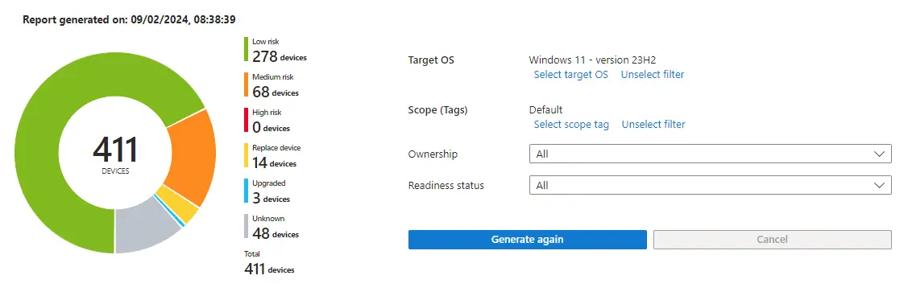
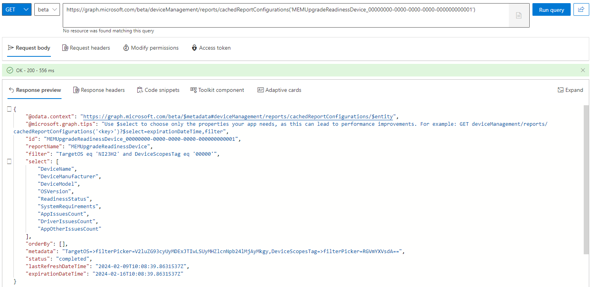
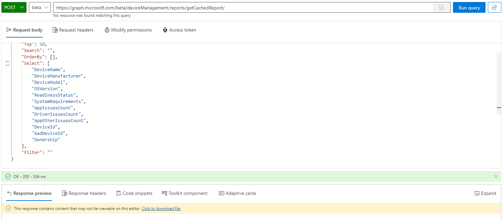
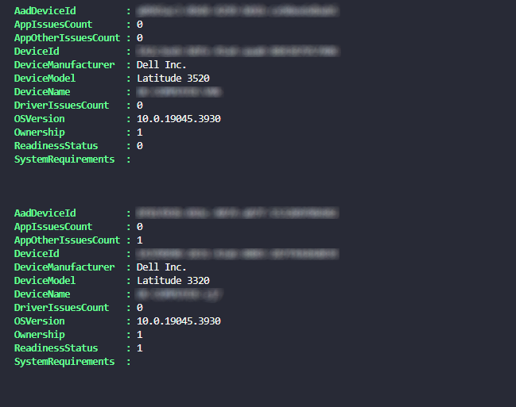
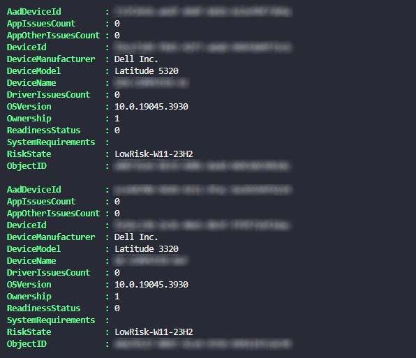

# Risk Based Windows 11 Feature Update Deployment - Reporting


At the time of writing we are only a [few hundred days](https://yourcountdown.to/windows-10-extended-support) away from the end of support of Windows 10 22H2, and really we should all be recommending the move to Windows 11, not just because it's shiny and new, but also it's going to actually get security updates.

Many organisations are happily running Windows 10 and have been for some time, and have probably dabbled with Windows 11, mainly IT staff who wanted to be on the latest and greatest. This however isn't going to get your devices to Windows 11 any time soon, and instead of distributing a Feature Update blindly, we should probably make use of the information in the [Feature Update Readiness Reports](https://learn.microsoft.com/en-us/mem/intune/protect/windows-update-compatibility-reports#use-the-windows-feature-update-device-readiness-report) in Microsoft Intune.

This report is useful from a visibility perspective, we can see the risk of updating a device to a specific Feature Update, drill into effected devices, and get a greater understanding of the overall Windows 11 readiness for a device estate. That's it though. What if we can extend the reports use?

Part one in this series looks at how we can create and capture the Feature Update Readiness Report data with PowerShell and Graph API, so at some point we can use it to make informed, but automated decisions for Windows 11 Feature Update deployment.

## Feature Update Readiness Report

We're going to lean onto this report and use it to be able to tag devices with their Feature Update readiness state, from the current supported values:

- Low risk - There are no known compatibility risks associated with the device.
- Medium risk - There are only minor, or non-blocking, compatibility risks associated with this device, such as applications that are automatically removed during upgrade.
- High risk - There are multiple or blocking compatibility risks associated with this device, such as applications that block an upgrade.
- Replace device - The device isn't capable of upgrading to the target OS version.
- Upgraded - The device is already running a version of Windows equal to or greater than the target OS version.
- Unknown - A readiness status couldn't be determined. Ensure that the device is properly configured to send Windows diagnostic data.



These readiness states are all going to be pretty handy, as we hopefully can capture those devices that are at a level of risk, or unknown risk of an update to Windows 11, and allow a targeted and safe deployment of the Feature Update.

### Report Pre-requisites

This one is a bit of a kicker, and I'd recommend looking at the [pre-requisites](https://learn.microsoft.com/en-gb/mem/intune/protect/windows-update-compatibility-reports#prerequisites) as soon as possible, in fact, go look at them now and come back when you've implemented them...

Right, now they're in place, let's talk about why I told you to just go ahead and turn some things on, well in order for us to use the report, we need to ensure that devices are able to send data, Microsoft is able to process the data, and the fact you have to wait [52 hours](https://learn.microsoft.com/en-gb/mem/intune/protect/windows-update-compatibility-reports#about-reporting-data-latency) for the data to be processed.

So based on this, anything we do using the data needs to be able to run multiple times, as not all devices in the estate are going to send their data at the same time.

## Graph and Feature Update Readiness Reports

Let's see how we can get the report data using the [Microsoft Graph PowerShell SDK](https://learn.microsoft.com/en-us/powershell/microsoftgraph/get-started?view=graph-powershell-1.0), as always I've investigated the calls to Graph using Developer Tools in my browser of choice (Microsoft Edge, obviously), and from my findings and the fact that reports are individual to the account running them, we need a way to start a report, and then get the report.

### Creating Feature Update Readiness Reports

We'll start with the call to create a new readiness report, we need to `POST` to [`deviceManagement/reports/cachedReportConfigurations`](https://learn.microsoft.com/en-us/graph/api/intune-reporting-devicemanagementcachedreportconfiguration-get?view=graph-rest-beta) with some JSON content in the below format, specifying the version of Feature Update we want to report on, for us, we want Windows 11 23H2, so the value we're after is `NI23H2`.

```JSON
{
    "id": "MEMUpgradeReadinessDevice_00000000-0000-0000-0000-000000000001",
    "filter": "(TargetOS eq 'NI23H2') and (DeviceScopesTag eq '00000')",
    "orderBy": [],
    "select": [
        "DeviceName",
        "DeviceManufacturer",
        "DeviceModel",
        "OSVersion",
        "ReadinessStatus",
        "SystemRequirements",
        "AppIssuesCount",
        "DriverIssuesCount",
        "AppOtherIssuesCount"
    ],
    "metadata": "TargetOS=>filterPicker=V2luZG93cyUyMDExJTIwLSUyMHZlcnNpb24lMjAyMkgy,DeviceScopesTag=>filterPicker=RGVmYXVsdA=="
}
```

This will then start the generation of a report in the background, which isn't instant, so we'll need a way to not only capture the report data, but also a way to wait until it's available. At least we've got a way to kick off a report, so we should create a function to do this, you know, so it's easily repeatable.


Ensure that you're connecting to Graph using the latest module and `Connect-MgGraph -Scopes 'DeviceManagementConfiguration.ReadWrite.All'`, we'll need some more scopes later, but for now this one will do.


```PowerShell
Function New-ReportFeatureUpdateReadiness() {

    [cmdletbinding()]

    param
    (
        [parameter(Mandatory = $true)]
        $JSON
    )

    $graphApiVersion = 'Beta'
    $Resource = 'deviceManagement/reports/cachedReportConfigurations'

    try {
        Test-Json -Json $JSON
        $uri = "https://graph.microsoft.com/$graphApiVersion/$($Resource)"
        Invoke-MgGraphRequest -Uri $uri -Method Post -Body $JSON -ContentType 'application/json'
    }
    catch {
        Write-Error $Error[0].ErrorDetails.Message
        break
    }
}
```

We can now start a new report using `New-ReportFeatureUpdateReadiness -JSON $JSONContent` passing through our JSON content for the creation of a report, now we need to detect whether the report is ready, and then when it is ready, to download the data in the report.

### Getting Feature Update Readiness Report Status

More digging with developer mode in Edge reveals surprisingly both a `GET` request to `deviceManagement/reports/cachedReportConfigurations('$Id')` (where `$Id` is the `Id` of a generated report), this will be useful as the output of this call gives us a status of the report.



So let's create ourselves a function to handle getting the Feature Update Readiness report.

```PowerShell
Function Get-ReportFeatureUpdateReadiness() {

    [cmdletbinding()]

    param (

        [parameter(Mandatory = $true)]
        $Id

    )

    $graphApiVersion = 'Beta'
    $Resource = "deviceManagement/reports/cachedReportConfigurations('$Id')"

    try {

        $uri = "https://graph.microsoft.com/$graphApiVersion/$($Resource)"
        Invoke-MgGraphRequest -Uri $uri -Method Get

    }
    catch {
        $exs = $Error.ErrorDetails
        $ex = $exs[0]
        Write-Host "Response content:`n$ex" -f Red
        Write-Host
        Write-Error "Request to $Uri failed with HTTP Status $($ex.Message)"
        Write-Host
        break
    }
}
```

With the function above and a little bit of common sense and a `while` loop, we can sit and happily wait until the report status equals `completed` after creating a new report.

```PowerShell
$featureUpdateCreateJSON = @"
{
    "id": "MEMUpgradeReadinessDevice_00000000-0000-0000-0000-000000000001",
    "filter": "(TargetOS eq 'NI23H2') and (DeviceScopesTag eq '00000')",
    "orderBy": [],
    "select": [
        "DeviceName",
        "DeviceManufacturer",
        "DeviceModel",
        "OSVersion",
        "ReadinessStatus",
        "SystemRequirements",
        "AppIssuesCount",
        "DriverIssuesCount",
        "AppOtherIssuesCount"
    ],
    "metadata": "TargetOS=>filterPicker=V2luZG93cyUyMDExJTIwLSUyMHZlcnNpb24lMjAyMkgy,DeviceScopesTag=>filterPicker=RGVmYXVsdA=="
}
"@

$startFeatureUpdateReport = New-ReportFeatureUpdateReadiness -JSON $featureUpdateCreateJSON
While ((Get-ReportFeatureUpdateReadiness -Id $startFeatureUpdateReport.id).status -ne 'completed') {
    Write-Host 'Waiting for the Feature Update report to finish processing...' -ForegroundColor Cyan
    Start-Sleep -Seconds 3
}
```

Great, creation of the report and understanding whether the report is complete is now in the bag, now we need to look at how we actually get the data in the report.

### Getting Feature Update Readiness Report Data

More fun with Edge Developer Mode when browsing around the Feature Update Readiness Reporting in the Microsoft Intune Portal, and a crawl through the [Graph API documentation](https://learn.microsoft.com/en-us/graph/api/intune-reporting-devicemanagementcachedreportconfiguration-get?view=graph-rest-beta), reveals another call to Graph, but this time it's another `POST`, but to `deviceManagement/reports/cachedReportConfigurations`, this time with slightly different JSON content. Interesting.

```JSON {hl_lines=["3-4"]}
{
    "Id": "MEMUpgradeReadinessDevice_00000000-0000-0000-0000-000000000001",
    "Skip": 0,
    "Top": 50,
    "Search": "",
    "OrderBy": [],
    "Select": [
        "DeviceName",
        "DeviceManufacturer",
        "DeviceModel",
        "OSVersion",
        "ReadinessStatus",
        "SystemRequirements",
        "AppIssuesCount",
        "DriverIssuesCount",
        "AppOtherIssuesCount",
        "DeviceId",
        "AadDeviceId",
        "Ownership"
    ],
    "filter": ""
}
```

I tell you what is going to be fun, the fact that this call works between device `0` in the `Skip` and device `50` in the `Top` parameters, so it isn't pulling back all data for all devices. Well that's great news, who doesn't love pagination?



When I first looked at this call to Graph, the report data was passed back nicely inline, not any more though, it downloads a file, but at least the file is just a plain text file and contains all the data for the first 50 devices.

As we have a new use case, we can update the `Get-ReportFeatureUpdateReadiness` function to handle both the initial call to get the status of a report, but also the data in the report, using logic to determine both the Graph endpoint as well as the request, and bit of a hacky way to deal with the downloaded file.

```PowerShell
Function Get-ReportFeatureUpdateReadiness() {

    [cmdletbinding()]

    param (

        [parameter(Mandatory = $false)]
        $Id,

        [parameter(Mandatory = $false)]
        $JSON

    )

    $graphApiVersion = 'Beta'

    if ($id) {
        $Resource = "deviceManagement/reports/cachedReportConfigurations('$Id')"
    }
    elseif ($JSON) {
        $Resource = 'deviceManagement/reports/getCachedReport'
    }

    try {

        $uri = "https://graph.microsoft.com/$graphApiVersion/$($Resource)"
        if ($id) {
            Invoke-MgGraphRequest -Uri $uri -Method Get
        }
        elseif ($JSON) {
            $tempFile = [System.IO.Path]::GetTempFileName()
            Invoke-MgGraphRequest -Uri $uri -Method Post -Body $JSON -ContentType 'application/json' -OutputFilePath $tempFile
            Get-Content -Raw $tempFile | ConvertFrom-Json
            Remove-Item $tempFile
        }

    }
    catch {
        $exs = $Error.ErrorDetails
        $ex = $exs[0]
        Write-Host "Response content:`n$ex" -f Red
        Write-Host
        Write-Error "Request to $Uri failed with HTTP Status $($ex.Message)"
        Write-Host
        break
    }
}
```

So now we can capture the data for the first 50 devices in the report, but we need a way to get all the data, and pass it into something we can call later on, because random data flying about in PowerShell is pretty useless.

### Handling Feature Update Readiness Report Data

Let's start with using our new functions and a call to Graph to create the report using `New-ReportFeatureUpdateReadiness -JSON $featureUpdateCreateJSON`, followed by a check to see if the report data is ready, then we can get the initial report data with `Get-ReportFeatureUpdateReadiness -JSON $featureUpdateGetJSON`, then we can iterate through the report data if there is more than 50 devices in the initial call to capture all the data, incrementing the `$i` variable by 50 each time, and continue to get device data until there are no more devices left, passing the data into a new array `$featureUpdateReportDetails`. Simple right :upside_down_face:

```PowerShell
$featureUpdateCreateJSON = @"
{
    "id": "MEMUpgradeReadinessDevice_00000000-0000-0000-0000-000000000001",
    "filter": "(TargetOS eq 'NI23H2') and (DeviceScopesTag eq '00000')",
    "orderBy": [],
    "select": [
        "DeviceName",
        "DeviceManufacturer",
        "DeviceModel",
        "OSVersion",
        "ReadinessStatus",
        "SystemRequirements",
        "AppIssuesCount",
        "DriverIssuesCount",
        "AppOtherIssuesCount"
    ],
    "metadata": "TargetOS=>filterPicker=V2luZG93cyUyMDExJTIwLSUyMHZlcnNpb24lMjAyMkgy,DeviceScopesTag=>filterPicker=RGVmYXVsdA=="
}
"@

$featureUpdateGetJSON = @'
{
    "Id": "MEMUpgradeReadinessDevice_00000000-0000-0000-0000-000000000001",
    "Skip": 0,
    "Top": 50,
    "Search": "",
    "OrderBy": [],
    "Select": [
        "DeviceName",
        "DeviceManufacturer",
        "DeviceModel",
        "OSVersion",
        "ReadinessStatus",
        "SystemRequirements",
        "AppIssuesCount",
        "DriverIssuesCount",
        "AppOtherIssuesCount",
        "DeviceId",
        "AadDeviceId",
        "Ownership"
    ],
    "filter": ""
}
'@

$startFeatureUpdateReport = New-ReportFeatureUpdateReadiness -JSON $featureUpdateCreateJSON
While ((Get-ReportFeatureUpdateReadiness -Id $startFeatureUpdateReport.id).status -ne 'completed') {
    Start-Sleep -Seconds 3
}

$featureUpdateReport = Get-ReportFeatureUpdateReadiness -JSON $featureUpdateGetJSON
$featureUpdateReportDetails = @()
$featureUpdateReportDetails += $featureUpdateReport.Values

$i = 0
if ($($featureUpdateReport.TotalRowCount) -gt 50) {
    while ($i -le $($featureUpdateReport.TotalRowCount)) {
        $i = $i + 50
        $getNextJSON = @"
    {
        "Id": "MEMUpgradeReadinessDevice_00000000-0000-0000-0000-000000000001",
        "Skip": $i,
        "Top": 50,
        "Search": "",
        "OrderBy": [],
        "Select": [
            "DeviceName",
            "DeviceManufacturer",
            "DeviceModel",
            "OSVersion",
            "ReadinessStatus",
            "SystemRequirements",
            "AppIssuesCount",
            "DriverIssuesCount",
            "AppOtherIssuesCount",
            "DeviceId",
            "AadDeviceId",
            "Ownership"
        ],
        "filter": ""
    }
"@
        # Sleep to stop throttling issues
        Start-Sleep -Seconds 3
        $featureUpdateReportNext = Get-ReportFeatureUpdateReadiness -JSON $getNextJSON
        $featureUpdateReportDetails += $featureUpdateReportNext.Values
    }
}
```

With all of this in hand, we now have an array `$featureUpdateReportDetails` variable with their readiness data, good, bad, and indifferent for all devices that have actually reported back. Now we need to format it into something useful.

## Processing Feature Update Report Data

We should take the data gathered from the Readiness Report in the `$featureUpdateReportDetails` variable, which looks ugly as sin, and create a new report using a `PSCustomObject` array variable `$reportArray`, but with some sense around the data that exists.

Looping through each object in the initial array, we can create the new array using the below.

```PowerShell
$reportArray = @()
foreach ($device in $featureUpdateReportDetails) {
    $reportArray += [PSCustomObject]@{
        'AadDeviceId'         = $device[0]
        'AppIssuesCount'      = $device[1]
        'AppOtherIssuesCount' = $device[2]
        'DeviceId'            = $device[3]
        'DeviceManufacturer'  = $device[4]
        'DeviceModel'         = $device[5]
        'DeviceName'          = $device[6]
        'DriverIssuesCount'   = $device[7]
        'OSVersion'           = $device[8]
        'Ownership'           = $device[9]
        'ReadinessStatus'     = $device[10]
        'SystemRequirements'  = $device[11]
    }
}
```

Giving us something a little easier to reference later down the line.



You might not know what's coming in part two of this series, but luckily I do, so, there are two bits of information we are going to add into the new report array that will be very useful.

### Readiness Status Value

Firstly is a translation of the risk state number to something useful, looking at the [documentation](https://learn.microsoft.com/en-us/mem/intune/protect/windows-update-compatibility-reports#windows-feature-update-device-readiness-report) we can establish that the values captured translate to the below.

| Readiness status value | Report value |
| :- | :- |
| `0` | Low risk |
| `1` | Medium risk |
| `2` | High risk |
| `3` | Replace device |
| `4` | Upgraded |
| `5` | Unknown |

With this, we should have some foresight that whatever value we're assigning to each status value must be repeatable, so let's use a `switch` on the value in the `foreach` loop, and assign a string based on the risk state, and Feature Update version associated with that risk state. This `$riskState` variable can then be added into the `$reportArray` array.

```PowerShell {hl_lines=["5-9",25]}
$reportArray = @()
foreach ($device in $featureUpdateReportDetails) {

    $riskState = switch ($device[10]) {
        '0' { "LowRisk-W11-23H2" }
        '1' { "MediumRisk-W11-23H2" }
        '2' { "HighRisk-W11-23H2" }
        '3' { "NotReady-W11-23H2" }
        '5' { "Unknown-W11-23H2" }
    }

    $reportArray += [PSCustomObject]@{
    'AadDeviceId'         = $device[0]
    'AppIssuesCount'      = $device[1]
    'AppOtherIssuesCount' = $device[2]
    'DeviceId'            = $device[3]
    'DeviceManufacturer'  = $device[4]
    'DeviceModel'         = $device[5]
    'DeviceName'          = $device[6]
    'DriverIssuesCount'   = $device[7]
    'OSVersion'           = $device[8]
    'Ownership'           = $device[9]
    'ReadinessStatus'     = $device[10]
    'SystemRequirements'  = $device[11]
    'RiskState'           = $riskState
    }
}
```

I've not bothered with dealing with `4`, as these are devices already upgraded to this version of Windows, so we don't care about them. So that deals with the risk state of a device, what else is up my sleeve.

### Entra ID Device Objects

Some of the avid readers of the blog, may have worked out why this next part is important, for those slower off the mark, hang tight, I'll do my best to talk you through it. If the end goal here is to tag a device with it's Feature Update risk status, making use of the information in the Feature Update Readiness Report, we need an object to tag.

To get these objects, we're going to have to query Entra ID for all device objects, and get their information, allowing us to compare the `AadDeviceId` from the report data, to the associated `objectId` in Entra ID.

Sadly the built-in functionality within the Graph PowerShell module is going to limit us to 999 devices, so we're leaning on an existing  to get more devices than the set device limit.

```PowerShell
Function Get-EntraIDDevice() {

    $graphApiVersion = 'beta'
    $Resource = 'devices'

    try {

        $uri = "https://graph.microsoft.com/$graphApiVersion/$Resource"
        $GraphResults = Invoke-MgGraphRequest -Uri $uri -Method Get

        $Results = @()
        $Results += $GraphResults.value

        $Pages = $GraphResults.'@odata.nextLink'
        while ($null -ne $Pages) {

            $Additional = Invoke-MgGraphRequest -Uri $Pages -Method Get

            if ($Pages) {
                $Pages = $Additional.'@odata.nextLink'
            }
            $Results += $Additional.value
        }
        $Results
    }
    catch {
        $exs = $Error.ErrorDetails
        $ex = $exs[0]
        Write-Host "Response content:`n$ex" -f Red
        Write-Host
        Write-Error "Request to $Uri failed with HTTP Status $($ex.Message)"
        Write-Host
        break
    }
}
```

We can now get all Windows devices, as we don't care about any other types this time around, and then compare the `AadDeviceId` with the `$windowsDevices` variable containing all Entra ID device objects, adding a new `ObjectID` into the mix.

```PowerShell {hl_lines=[1,28]}
$windowsDevices = Get-EntraIDDevice | Where-Object { $_.operatingSystem -eq 'Windows' }

$reportArray = @()
foreach ($device in $featureUpdateReportDetails) {

    $riskState = switch ($device[10]) {
        '0' { "LowRisk-W11-23H2" }
        '1' { "MediumRisk-W11-23H2" }
        '2' { "HighRisk-W11-23H2" }
        '3' { "NotReady-W11-23H2" }
        '5' { "Unknown-W11-23H2" }
    }

    $reportArray += [PSCustomObject]@{
        'AadDeviceId'         = $device[0]
        'AppIssuesCount'      = $device[1]
        'AppOtherIssuesCount' = $device[2]
        'DeviceId'            = $device[3]
        'DeviceManufacturer'  = $device[4]
        'DeviceModel'         = $device[5]
        'DeviceName'          = $device[6]
        'DriverIssuesCount'   = $device[7]
        'OSVersion'           = $device[8]
        'Ownership'           = $device[9]
        'ReadinessStatus'     = $device[10]
        'SystemRequirements'  = $device[11]
        'RiskState'           = $riskState
        'ObjectID'            = $(($windowsDevices | Where-Object { $_.deviceid -eq $device[0] }).id)
    }
}
```

A quick glimpse at the data in the array now, not only shows the assigned risk state for the Feature Update version we're looking to deploy, but also the Entra ID ObjectId for each device.



The array now has all the data we need for part two, we have the device details, including the Entra ID computer object Id, the risk state, and everything else we could possibly ask for to make our lives easier when deploying Windows 11 Feature Updates.

## Summary

I've learnt from watching both [Neighbours](https://en.wikipedia.org/wiki/Neighbours) and [Doctors](https://en.wikipedia.org/wiki/Doctors_(2000_TV_series)) as a student, that each episode should end on a cliffhanger and the viewer wanting more, so that's what's happened here, I hope.

At least for now, we've got a clear way to start, wait, capture, and process data from a [Feature Update Readiness Reports](https://learn.microsoft.com/en-us/mem/intune/protect/windows-update-compatibility-reports#use-the-windows-feature-update-device-readiness-report) in Microsoft Intune, and add some additional data to the report that will hopefully allow us to deploy our favourite flavour of Windows 11 using a phased, controlled, and risk based approach.

