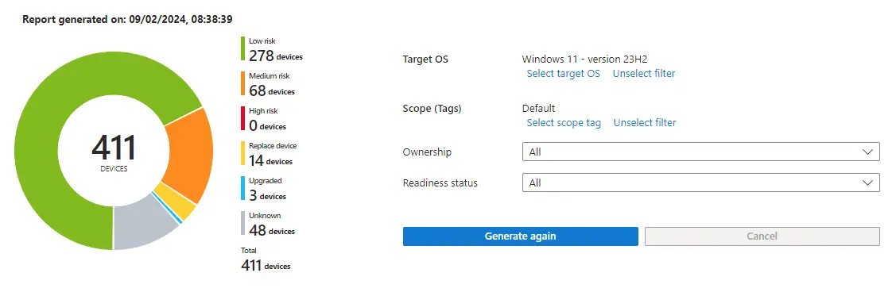
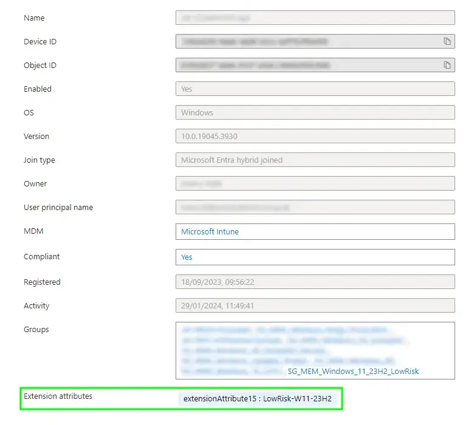
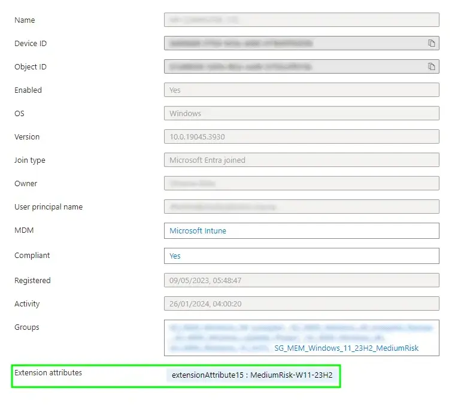

# Risk Based Windows 11 Feature Update Deployment - Device Attributes


I'd strongly suggest, if you haven't already, skimming over the first part of this series as this will give you a good understanding of where we started, and hopefully where we're trying to get to with putting the [Feature Update Readiness Reports](https://learn.microsoft.com/en-us/mem/intune/protect/windows-update-compatibility-reports#use-the-windows-feature-update-device-readiness-report) in Microsoft Intune to good use allowing for a risk based deployment approach of Windows 11 23H2.



With our precious data in hand, we can move onto how we group devices based on the risk, and hopefully make the transition to Windows 11 a relatively painless one.

## Device Attributes

Those with a keen pair of eyes, may have spotted a  allowing the tagging of a device using [device attributes](https://learn.microsoft.com/en-us/entra/identity/conditional-access/concept-condition-filters-for-devices#supported-operators-and-device-properties-for-filters) for exceptions to Conditional Access Policies, and I may have hinted at the time that these attributes may have other uses. Well guess what, they do.

We can take the data from the Readiness Report, that we formatted and updated with both a string representation of the risk state, and the Entra ID computer ObjectId of the device, and use this information to tag devices with their risk state for the Windows 11 Feature Update they were assessed against. Clever eh?

### Getting Existing Device Attribute Values

We've already got a function to update device attributes on device objects, and I say update, as the call to Graph is using `PATCH` which means that it will overwrite the existing value for the attribute we want to update.

This is both good, as it means we don't need to worry about changes to the devices Feature Update risk state, and bad, because we should probably check that our chosen attribute is not already used for something else, like for .

So can we find a way to pull back all devices where our device attribute of choice, this time `extensionAttribute15`, is not empty? Sure why not.


Connect to Graph using the latest module and `Connect-MgGraph -Scopes 'Device.ReadWrite.All'`.


```PowerShell
$extensionAttribute = 'extensionAttribute15'
$windowsDevices = Get-EntraIDDevice | Where-Object { $_.operatingSystem -eq 'Windows' }

foreach ($windowsDevice in $windowsDevices) {

    $attribute = ($windowsDevice.extensionAttributes | ConvertTo-Json | ConvertFrom-Json).$extensionAttribute

    if ($attribute){

        Write-Host "$($windowsDevice.displayName) already has a value of '$attribute' configured in extension attribute $extensionAttribute" -ForegroundColor Red
    }
}
```

This can be run in isolation, to check before assigning the risk based device attributes whether you're going to be overwriting anything important, as the `PATCH` to update the attribute is pretty destructive.

For our situation, we know what values to actually expect on the device attribute that are valid (`LowRisk-W11-23H2, MediumRisk-W11-23H2, HighRisk-W11-23H2, NotReady-W11-23H2, Unknown-W11-23H2`), so we should expand upon the above to add some depth to the logic by creating an array variable of safe extension attribute values in `$safeAttributes`, which will allow us to run the assignment of attribute values multiple times, which is going to be important.

```PowerShell
$extensionAttribute = 'extensionAttribute15'
$windowsDevices = Get-EntraIDDevice | Where-Object { $_.operatingSystem -eq 'Windows' }
$attributeErrors = 0
$safeAttributes = @("LowRisk-W11-23H2","MediumRisk-W11-23H2","HighRisk-W11-23H2","NotReady-W11-23H2","Unknown-W11-23H2")

foreach ($windowsDevice in $windowsDevices) {

    $attribute = ($windowsDevice.extensionAttributes | ConvertTo-Json | ConvertFrom-Json).$extensionAttribute
    if ($attribute -notin $safeAttributes){

        if ($null -ne $attribute){

            Write-Host "$($windowsDevice.displayName) already has a value of '$attribute' configured in extension attribute $extensionAttribute" -ForegroundColor Yellow
            $attributeErrors = $attributeErrors + 1
        }
    }
}

if ($attributeErrors -gt 0){

    Write-Host "Please review the devices reporting as having existing data in the selected attribute $extensionAttribute, and run the script using a different attribute selection." -ForegroundColor Red
    break
}
```

The above will now check to see if our selected extension attribute `extensionAttribute15` contains a value not in the safe list, or not null, and increment an error variable `$attributeErrors`, then throw a wobbly if the value of that variable is greater than zero.

Pre-flight checks over for now, onto assigning a value to our attribute.

### Updating Device Attributes

We've dealt with this function previously, so no need to go into detail on this one, but it is expecting some `JSON` content and an `Id` to be able to assign the attribute values.

```PowerShell
Function Add-DeviceAttribute() {

    [cmdletbinding()]

    param
    (
        [parameter(Mandatory = $true)]
        $JSON,

        [parameter(Mandatory = $true)]
        $Id
    )

    $graphApiVersion = 'Beta'
    $Resource = "devices/$Id"

    try {
        $uri = "https://graph.microsoft.com/$graphApiVersion/$($Resource)"
        Invoke-MgGraphRequest -Uri $uri -Method Patch -Body $JSON -ContentType 'application/json'
    }
    catch {
        Write-Error $Error[0].ErrorDetails.Message
        break
    }
}
```

Using the above and the data we have  in part one in the `$reportArray` variable:


We can loop through each and every device in the array, and with the values for both the `RiskState` and `ObjectID` we can happily update some attributes.

```PowerShell
Foreach ($object in $reportArray) {
  $JSON = @"
  {
      "extensionAttributes": {
          "$extensionAttribute": "$($object.RiskState)"
      }
  }
"@
  Add-DeviceAttribute -Id $object.ObjectID -JSON $JSON
  Start-Sleep -Seconds 3
}
```

Now while totally suitable, and will work it's way through the devices updating them based on the initial run, we need to be able to update the same extension attribute in subsequent runs, and with the call to Graph using `PATCH` we're covered, but there is no `RiskState` for devices already upgraded to the Windows 11 Feature Update version, so devices following an upgrade and new readiness report, will still be tagged with their old risk rating.

### Maintaining Device Attributes

I'm not usually this tidy with my scripts, but we should clean up after ourselves, and as the Feature Update Readiness Report relies on a number of moving parts, no less devices themselves sending data, and the [52 hours](https://learn.microsoft.com/en-gb/mem/intune/protect/windows-update-compatibility-reports#about-reporting-data-latency) of waiting for data to process, the aim here is to regularly run the whole script to ensure accurate assessment and tagging of devices.

So let's add a little something something, and using the values from `ReadinessStatus` we can assess whether a device is already upgraded to our Windows 11 Feature Update version or not based on the `ReadinessStatus` equalling `4` and send the correct `JSON` data to Graph to ensure consistent assignment of the value of the extension attribute.

```PowerShell
Foreach ($object in $reportArray) {
    if ($object.ReadinessStatus -ne '4') {
        $JSON = @"
        {
            "extensionAttributes": {
                "$extensionAttribute": "$($object.RiskState)"
            }
        }
"@
    }
    else {
        $JSON = @"
        {
            "extensionAttributes": {
                "$extensionAttribute": ""
            }
        }
"@
    }
  Add-DeviceAttribute -Id $object.ObjectID -JSON $JSON
  Start-Sleep -Seconds 3
}
```

There we go, we can tag our devices using extension attributes with their risk state, not just once, but many many times, and keep on top of devices that have been updated to Windows 11 already.

A quick straw poll of devices in Entra ID, we can see that the tag has applied successfully:



{}

{}

{}

{}

{}

{}

{}

{}



We should do something sensible with these tags on the devices now.

## Dynamic Security Groups

Ah my love affair between  rears it's head again, and despite the recommendations to stop using [certain](https://learn.microsoft.com/en-us/entra/identity/users/groups-dynamic-rule-more-efficient) operators, there are still times when Dynamic Groups are going to win out over Device Filters.

With Feature Update deployments in Microsoft Intune not supporting the use of Device Filters, and as we've tagged the Entra ID object of the device, and not the Microsoft Intune object, we don't have any say in the matter, so we have to use groups this time.


So what are we doing with the groups? Well we can create dynamic device groups to capture corporate owned Windows devices based on their risk state.

### Creating Dynamic Device Security Groups

So off you go, create some groups with the below rules, and if you've been following along, you'll realise that we now have ring-fenced devices based on just how ready they are to update to Windows 11. Cool eh? (rhetorical, it is *obviously* cool.)

| Group | Rule |
| :- | :- |
| Low Risk | `(device.extensionAttribute15 -eq LowRisk-W11-23H2) and (device.deviceOSType -eq Windows) and (device.deviceOwnership -eq Company)` |
| Medium Risk | `(device.extensionAttribute15 -eq MediumRisk-W11-23H2) and (device.deviceOSType -eq Windows) and (device.deviceOwnership -eq Company)` |
| High Risk | `(device.extensionAttribute15 -eq HighRisk-W11-23H2) and (device.deviceOSType -eq Windows) and (device.deviceOwnership -eq Company)` |
| Not Ready | `(device.extensionAttribute15 -eq NotReady-W11-23H2) and (device.deviceOSType -eq Windows) and (device.deviceOwnership -eq Company)` |
| Unknown | `(device.extensionAttribute15 -eq Unknown-W11-23H2) and (device.deviceOSType -eq Windows) and (device.deviceOwnership -eq Company)` |

Give the groups a little while to populate, hopefully not [24 hours](https://learn.microsoft.com/en-us/entra/identity/users/groups-troubleshooting#:~:text=If%20everything%20looks%20good%2C%20please%20allow%20some%20time%20for%20the%20group%20to%20populate.%20Depending%20on%20the%20size%20of%20your%20Microsoft%20Entra%20organization%2C%20the%20group%20may%20take%20up%20to%2024%20hours%20for%20populating%20for%20the%20first%20time%20or%20after%20a%20rule%20change.), but all being well and good, the members should flood in.

### Group Membership Check

Ok ok, let's not just take my word for it, after all we're not ~~best friends~~ colleagues just yet, in fact I bet some of you don't even follow me on [LinkedIn](https://www.linkedin.com/in/ennnbeee/) 😅, anyway let's look at the output of the report we initially created.


Let's look at the break down of devices in each risk category:

- Low Risk - 278 devices
- Medium Risk - 68 devices
- High Risk - 0 devices (lucky)
- Not Ready - 14 devices
- Unknown - 48 devices

Now have a look at the obviously un-doctored screenshots of each of our Dynamic Device Security Groups:



{}


{}

{}

{}

{}

{}

{}

{}

{}

{}



And there you have it, matchy matchy values for each of the risk types. You'll notice there isn't a group for the three devices already upgraded to Windows 11 23H2, as we don't care about these ones for the purpose of a Feature Update to the same version that's already installed.

## Summary

We're on the home stretch now, having captured all the data we need to truly assess the readiness state of a deployment of a Windows 11 23H2 feature update, successfully tagging the Windows device objects in Entra ID with a suitably named risk state, and gathered all devices of the same risk state using Dynamic Device Security Groups.

What else do you want from me? Ah yes, a way to utilise the groups we created as part of deploying the Feature Update, you know the whole point of this series. Tune in next ~~week~~ time for the next exciting post in this series. I bet you're thrilled about that.

