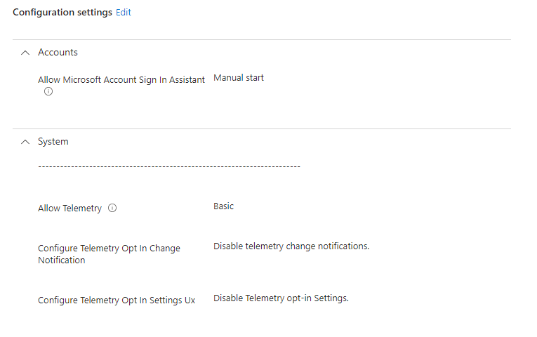
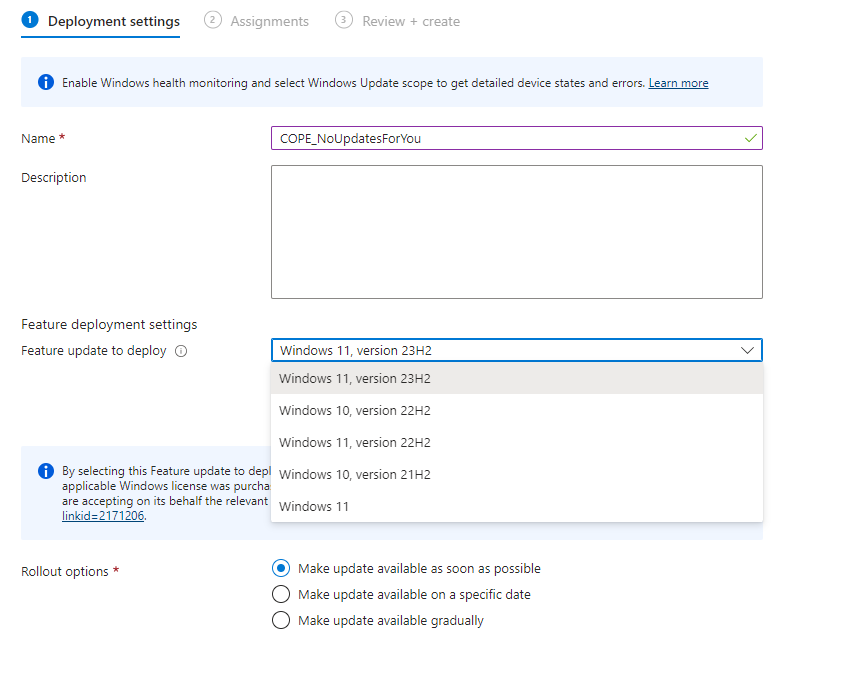
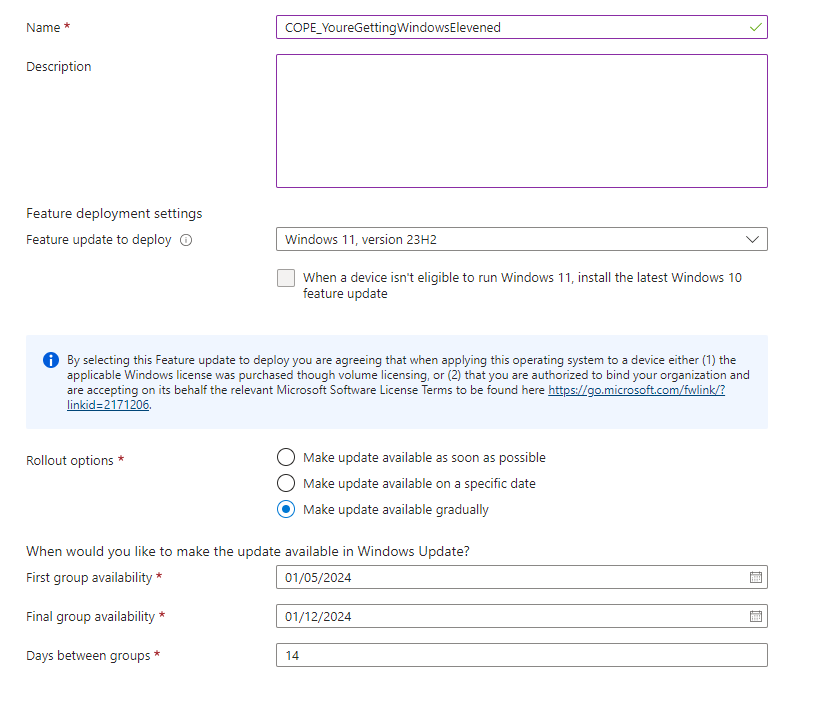
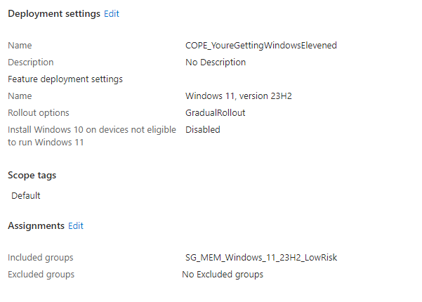

# Risk Based Windows 11 Feature Update Deployment - Feature Updates

We're almost there now; we've generated and captured the data from a  and we've  devices based on their readiness state using Dynamic Security Groups. All of this is useful when deploying a Windows 11 Feature Update, in this instance 23H2, to devices, so let's look at how we actually deploy the new Feature Update to these groups of devices and get you on your Windows 11 journey.

## Using Feature Update Profiles

Yes, I am usually against silently paywalled areas of Microsoft Intune, but there isn't really any better way of getting devices upgraded to a Feature Update in a controlled manner, you could use [`Target Release Version`](https://learn.microsoft.com/en-gb/windows/client-management/mdm/policy-csp-Update?WT.mc_id=Portal-Microsoft_Intune_Workflows#targetreleaseversion) but then you're risking all devices updating all at once, or using deferral settings for Feature Updates in Windows Update Rings, but that all relies on the data the Feature Update is released, not ideal really.

So I'm sorry, if you're not already covered by one of the (at time of writing) license pre-requisites to use [Feature Update profiles](https://learn.microsoft.com/en-us/mem/intune/protect/windows-10-feature-updates) then I suggest finding some cash down the back of the sofa.

### Licensing Pre-requisites

So let's make sure you're covered by the [requirements](https://learn.microsoft.com/en-us/mem/intune/protect/windows-10-feature-updates#prerequisites) for Feature Update first, starting with the licenses, make sure your are covered for the 'Windows Update for Business deployment service' with have one of the below licenses:

- Windows 10/11 Enterprise E3 or E5 (included in Microsoft 365 F3, E3, or E5)
- Windows 10/11 Education A3 or A5 (included in Microsoft 365 A3 or A5)
- Windows Virtual Desktop Access E3 or E5
- Microsoft 365 Business Premium

> In addition to a license for Intune, your organization must have one of the following subscriptions that include a license for Windows Update for Business deployment service.

That should be pretty easy to sort out, it's only *one* license isn't it Microsoft? Please don't audit me.

### Telemetry Pre-requisites

Reading through the other requirements, one of which we  in part one, and you should have configured as part of using the Feature Update Readiness Report, is telemetry data.

If you've gotten to this part of the series and you're still wondering why your reports are empty, it's probably the fact that when Windows 10 was first released all those years ago, you aggressively disabled telemetry reporting for fear of Microsoft using your data.

Well, here we are now, needed this telemetry data, go and configure a [Settings Catalog](https://learn.microsoft.com/en-us/mem/intune/configuration/settings-catalog) profile with the settings below and assign it to all your devices, do it now.

| Category | Setting | Value | Description |
| :- | :- | :- | :- |
| System | Allow Telemetry | `Basic` | Sends all required telemetry information to Microsoft. |
| System | Configure Telemetry Opt In Change Notification | `Disable telemetry change notifications` | Stops users panicking about data, what they don't know won't hurt them. |
| System | Configure Telemetry Opt In Settings Ux | `Disable Telemetry opt-in Settings` | Stops users from changing telemetry settings |

This, once Microsoft has processed your data, will allow for the delivery of Feature Updates.

We're almost done, I promise.

### Service Pre-requisites

Well, who's been caught out with the issue where monthly updates happily deploy, but you've been scratching your head about why Feature Updates haven't been offered to a device yet?

Yeah [me neither](https://learn.microsoft.com/en-us/troubleshoot/windows-client/deployment/windows-update-issues-troubleshooting#feature-updates-arent-being-offered-while-other-updates-are), but we should at least be definite with this requirement that the `Microsoft Account Sign-In Assistant (wlidsvc)` is not disabled.

| Category | Setting | Value | Description |
| :- | :- | :- | :- |
| Accounts | Allow Microsoft Account Sign In Assistant | `Manual start` | If this is disabled, will block the use of Feature Updates on Windows 10 and later devices. |

This will set the service is set to Manual (Trigger Start), which allows it to run when needed. You may as well lob the above setting into the same Settings Catalog profile as the telemetry data settings, saves creating multiple granular profiles when you're not dealing with specific exclusions, giving us something like the below.

Right, on to setting up the Feature Update profiles.

## Targetting Feature Update Profiles

As we're not using [deferral settings](https://learn.microsoft.com/en-us/windows/deployment/update/waas-manage-updates-wufb#defer-an-update) within Windows Update Rings, and instead opting for the use of Feature Update profiles to deploy new versions of the Windows operating system, we need to set all Feature Update deferrals in our existing Update Rings to be zero, but to stop the flood of devices attempt to update to a newer version of Windows 10 or 11, before we change this setting, let's look at how we keep devices at the required level.

### Feature Update Dynamic Groups

That's right, more Dynamic Device Security Groups, this time we're going to ring-fence devices based on the operating system they are currently running, and assign a corresponding Feature Update of the same version, yes this sounds a little backward when our end goal is to upgrade devices to Windows 11 23H2, but bear with me there's logic around this.

Based on the current (at time of writing) Feature Update versions available in Microsoft Intune, we need to create at groups for at least each of the below versions.

So go and create some new groups in Entra ID with the below rules to capture your corporate owned Windows devices at each Feature Update version

| Group | Rule |
| :- | :- |
| Windows 10 21H2 | `(device.deviceOwnership -eq "Company") and (device.deviceOSType -eq "Windows") and (device.deviceOSVersion -startswith "10.0.19044")` |
| Windows 10 22H2 | `(device.deviceOwnership -eq "Company") and (device.deviceOSType -eq "Windows") and (device.deviceOSVersion -startswith "10.0.19045")` |
| Windows 11 21H2 | `(device.deviceOwnership -eq "Company") and (device.deviceOSType -eq "Windows") and (device.deviceOSVersion -startswith "10.0.22000")` |
| Windows 11 22H2 | `(device.deviceOwnership -eq "Company") and (device.deviceOSType -eq "Windows") and (device.deviceOSVersion -startswith "10.0.22621")` |
| Windows 11 23H2 | `(device.deviceOwnership -eq "Company") and (device.deviceOSType -eq "Windows") and (device.deviceOSVersion -startswith "10.0.22631")` |

Your mileage may vary with this, as it could be you've got other devices that aren't covered by one of these Feature Update profile versions, if that is the case create dynamic device groups for these other versions too, and we'll work out what to do with them later.

### Feature Update Version

With our grouped devices based on version at hand, we can now create Feature Update Profiles for each of these versions, configuring them to be immediately available, and assigned to the dynamic device groups we/ve just created.

| Feature Update Version | Rollout options | Group |
| :- | :- | :- |
| Windows 10, version 21H2 | `Make update available as soon as possible` | Windows 10 21H2 |
| Windows 10, version 22H2 | `Make update available as soon as possible` | Windows 10 22H2 |
| Windows 11, version 21H2 | `Make update available as soon as possible` | Windows 11 21H2 |
| Windows 11, version 22H2 | `Make update available as soon as possible` | Windows 11 22H2 |
| Windows 11, version 23H2 | `Make update available as soon as possible` | Windows 11 23H2 |

For your devices that are running lower versions of Windows 10, then you've got a couple of options, either assign the group to one of the above newly created version targeting Feature Update profiles, or, using a Settings Catalog profile with [`Target Release Version`](https://learn.microsoft.com/en-gb/windows/client-management/mdm/policy-csp-Update?WT.mc_id=Portal-Microsoft_Intune_Workflows#targetreleaseversion) configured to the required version to keep your [LTSC](https://learn.microsoft.com/en-us/windows/whats-new/ltsc/overview) or otherwise Windows 10 devices exactly where they need to be.

With these now in place, we can happily remove the Feature Update deferral settings in our Windows Update rings, without the fear that devices are just going to jump to a version we don't want them to be on, yet.

## Deployment Feature Update Profiles

Now you may be thinking, all of this is well and good, but how are we going to distribute Windows 11 23H2 after gathering compatibility data and grouping devices based on their upgrade risk, well, fear not, as there is documented behaviour when a device is in scope of [multiple Feature Update profiles](https://learn.microsoft.com/en-us/mem/intune/protect/windows-10-feature-updates#update-behavior-when-multiple-policies-target-a-device), in short, a device will install the most recent Feature Update version, in long...

- Each Windows feature update policy supports a single update. When a device is targeted by more than one policy, it might be targeted with multiple update versions.
- The Windows Update service can only offer a device one feature update at a time, and always offers the latest update version that targets the device.
- Because Windows 11 updates are considered to be later versions than Windows 10, the service always offers the Windows 11 update to a device targeted by both Windows 10 and Windows 11 updates. This is done because deploying a Windows 11 update to a Windows 10 device is a supported upgrade path.

So this behaviour is exactly what we need, a way to keep devices on their current version, until they are in scope of a newer version, in this case, Windows 11 23H2.

### Deploying Windows 11 Feature Updates

Onto the fun part, the fruition of ~~my~~ our hard work, being able to roll out Windows 11 23H2 safely. Let's go and create a new Feature Update profile for Windows 11 23H2 for our low risk devices, this time instead of an immediate roll out option, we're going to utilise the 'Make update available gradually' option, which uses magic :magic_wand:.

Well it's not necessarily magic, there must be something in the background that allows the splitting of a targeted include assignment group or groups into equal sized smaller manageable [virtual groups](https://learn.microsoft.com/en-us/mem/intune/protect/windows-update-rollout-options#make-updates-available-gradually) between the start date and end date, separated by number of days between them.

A few things to note before we go and assign this profile:

1. The start of the first group availability must be at least two days in advance of the current date, which allows the magic to happen to split the devices.
2. The final group availability may not occur on the specified date, based on the how many days between groups has been configured, something about maths and whole numbers.
3. Installation deadlines and grace periods in Windows Update rings are adhered to, so ensure that you have this configured to something sensible, and lower than the number of days between groups otherwise you'll end up with overlapping deployments.

We're here, the end, we have a profile for deploying Windows 11 23H2 and we can assign this to our ready to go, low risk tagged, group of Windows 10 devices, that's exciting.

With these devices telling you that they're happy to update to Windows 11, you can safely sit back and watch the [reports](https://learn.microsoft.com/en-us/mem/intune/protect/windows-update-reports#reports-for-windows-10-and-later-feature-updates-policy) update with the status of the Feature Update deployment, giving you time to work through the issues reported by the medium and high risk device issues.

Or if you're like me, just take a chance deploying the Feature Update to the medium risk devices, I mean who cares if a driver get's removed, you should be [updating](https://learn.microsoft.com/en-us/mem/intune/protect/windows-driver-updates-overview) them anyway 😂.

## Summary

This should now give you confidence in deploying a Windows 11 Feature Update to the devices that have told you that they're OK to update, based on the Microsoft backed information captured from the Readiness Report, starting your migration to Windows 11 from Windows 10 well before the [end of support](https://yourcountdown.to/windows-10-extended-support), pat yourself on the back.

Even if *all* of your Windows 10 and later devices are reporting their compatibility information, this isn't the end of the story, what if you've resolved some of the medium or high risk issues? What if those devices that were captured by medium or high risk tags are now reporting as low risk? What if there are new Windows 10 devices enrolled into Microsoft Intune? What if devices that had low disk space now have enough free space?

These are all valid questions I've just come up with, and in the last part of this series, I'll be taking you through a PowerShell script that combines what we've covered into a fool-proof deployment that can be run regularly, ensuring that Windows 10 devices don't get left behind.

