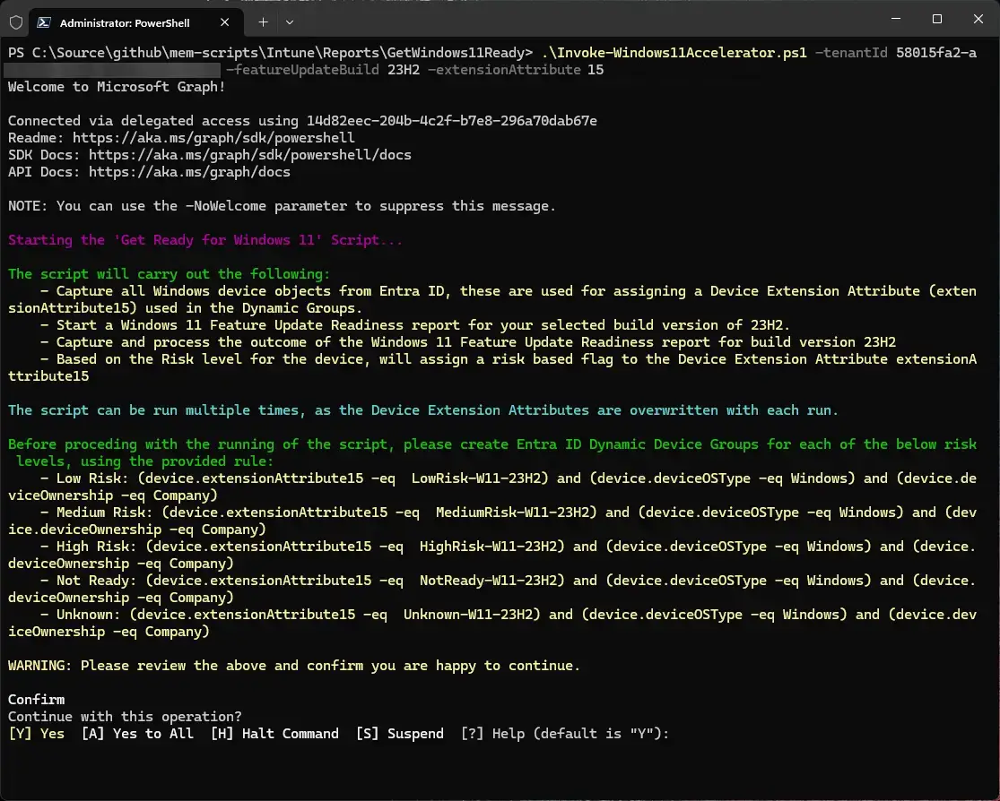
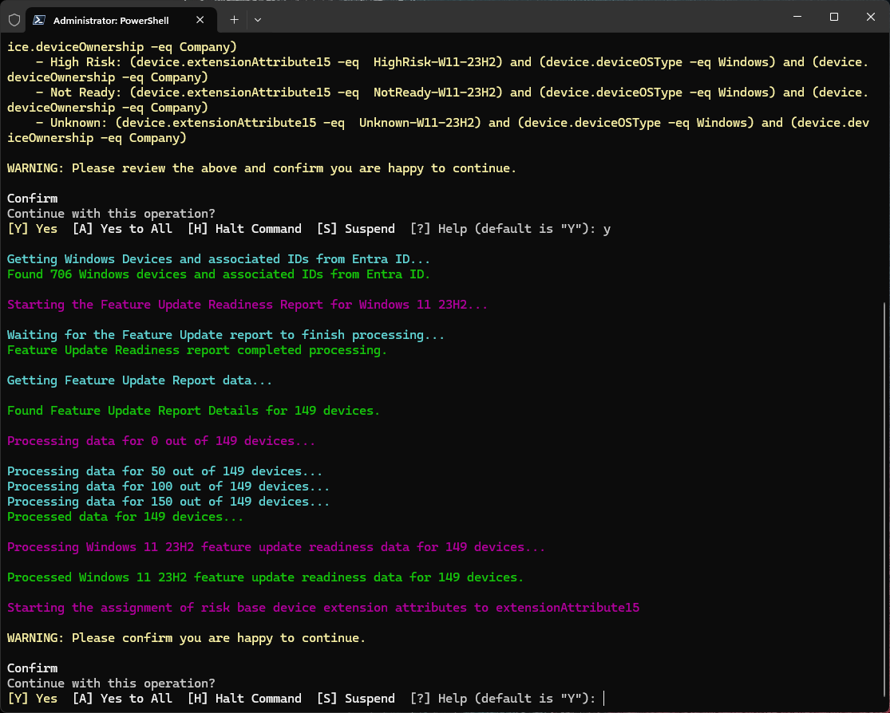
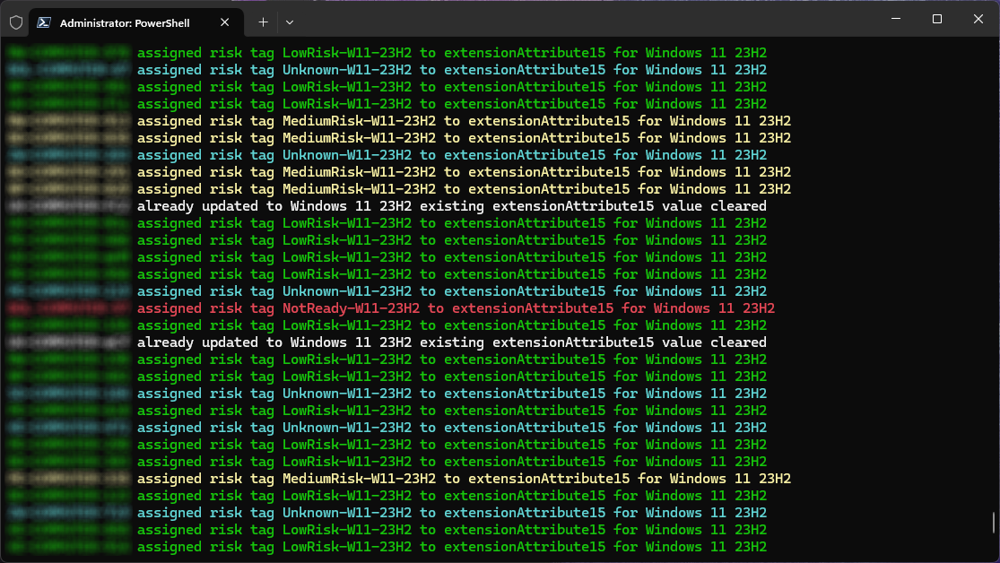

# Risk Based Windows 11 Feature Update Deployment - Automation


Finally we're at the end of the series, where be bring all the components together from the previous three posts into one ~~sub par~~ suitable looking PowerShell script, allowing us to not only kick off the [Feature Update Readiness](https://learn.microsoft.com/en-us/mem/intune/protect/windows-update-compatibility-reports) report, but capture the risk state for each device, tag each device using [Extension Attributes](https://learn.microsoft.com/en-us/graph/extensibility-overview?tabs=http), and then automatically group these devices with [Dynamic Security Groups](https://learn.microsoft.com/en-us/entra/identity/users/groups-dynamic-membership) in order to deploy our Windows 11 23H2 Feature Update to low risk devices whilst we give our selves breathing space to fix the others.

[Let's get down, let's get down to business](https://youtu.be/nCg3ufihKyU?si=4qZgpAxujbk5RMWA&t=28).

## Script Overview

Before I let you loose with the [script](https://www.youtube.com/watch?v=dQw4w9WgXcQ), and suggest that you go off and run this against your environment, let me talk you through what it actually does:

- **Connects to Microsoft Graph** - taking the `tenantId` and `scopes` from the script parameters, connects using `Connect-MgGraph` using the 'Microsoft.Graph' [PowerShell module](https://learn.microsoft.com/en-us/powershell/microsoftgraph/installation?view=graph-powershell-1.0).
- **Tells you what the script will do** - gives you an overview of what the script will actually do, I know, how kind of me.
- **Gives you the rules for the Dynamic Security Groups** - this is based on the `extensionAttribute` and `featureUpdateBuild` parameters selected when initially running the script, I could have automated this, but everyone has their own naming conventions so I cba.
- **Gives you the option to stop the script** - yeah, even I have panic moments when running these types of scripts, so it at least gives you the option to Alt+F4 out of it.
- **Checks that the extensionAttribute selected isn't already populated with something else** - this one is key, I don't want you blaming me when the script goes and overwrites an `extensionAttribute` you're using for something else. If it finds *any* device with data in the selected extensionAttribute other than something the script has set, it'll bin out the script.
- **Gets all Windows devices from Entra ID** - will enumerate all your Windows devices in Entra ID, as we need their `objectID` to allow us to add extension attributes to.
- **Kicks off and waits for a Windows Feature Update Readiness report** - using the `featureUpdateBuild` parameter, will start a report, wait for it to complete, then capture all the risk data.
- **Prompts if you want to assign extension attributes** - this is your final call for running away, nothing so far has been modified or updated, so use this as your option to escape if you need to.
- **Assigns the risk based extension attributes** - this is the bulk of the work, and with a little patience, depending on how many devices you actually have, will go and tag devices with their Feature Update risk rating on the `extensionAttribute` you chose.

That's all there is to it.


Importantly this script can be run many many times, as we want to ensure that your devices are getting tagged with the correct risk, or if their risk has changed that it get's updated, or if they haven't reported back to Microsoft Intune with their readiness state, or if Microsoft have taken [52 hours](https://learn.microsoft.com/en-gb/mem/intune/protect/windows-update-compatibility-reports#about-reporting-data-latency) to process the data and it's only just appeared.


## Running the Script

So now you have an overview of what the [script](https://github.com/ennnbeee/oddsandendpoints-scripts/blob/main/Intune/Reports/GetWindows11Ready/Invoke-Windows11Accelerator.ps1) 😇 actually does, let's see how we start it and what the output looks like.

If we want to start our journey to Windows 11 23H2, and by now you should really be looking at starting this migration, as it's not [that long](https://yourcountdown.to/windows-10-extended-support) until the support for Windows 10 ends, we can run the PowerShell script using the below, passing in your [Entra ID Tenant ID](https://learn.microsoft.com/en-us/entra/fundamentals/how-to-find-tenant) to `tenantId`, the selected `featureUpdateBuild`, in this case 23H2, and your `extensionAttribute` of choice:

```PowerShell
.\Invoke-Windows11Accelerator.ps1 -tenantId '36019fe7-a342-4d98-9126-1b6f94904ac7' -featureUpdateBuild '23H2' -extensionAttribute '15' -target 'device' -deploy
```


The script has been updated to support different targets, either user or device, along with an option to run this in demo mode without the `deploy` switch.


### Deployment Preparation

Following the authentication to Microsoft Graph PowerShell with `Connect-MgGraph`, with the scopes configured in the script as
`Group.ReadWrite.All, Device.ReadWrite.All, DeviceManagementManagedDevices.ReadWrite.All, DeviceManagementConfiguration.ReadWrite.All`, we're presented with the first stage in the process:



Providing us with the information I promised it would, including the generated Dynamic Security Group rules allowing your to create them in Entra ID to support the Windows 11 23H2 Feature Update deployment:

| Group | Rule |
| :- | :- |
| Low Risk | `(device.extensionAttribute15 -eq  LowRisk-W11-23H2) and (device.deviceOSType -eq Windows) and (device.deviceOwnership -eq Company)` |
| Medium Risk | `(device.extensionAttribute15 -eq  MediumRisk-W11-23H2) and (device.deviceOSType -eq Windows) and (device.deviceOwnership -eq Company)` |
| High Risk | `(device.extensionAttribute15 -eq  HighRisk-W11-23H2) and (device.deviceOSType -eq Windows) and (device.deviceOwnership -eq Company)` |
| Not Ready | `(device.extensionAttribute15 -eq  NotReady-W11-23H2) and (device.deviceOSType -eq Windows) and (device.deviceOwnership -eq Company)` |
| Unknown | `(device.extensionAttribute15 -eq  Unknown-W11-23H2) and (device.deviceOSType -eq Windows) and (device.deviceOwnership -eq Company)` |

### Getting Device Information

Blindly continuing the script, as so far the script has actually done nothing, it will happily go and get all your Windows devices from Entra ID, and check if there is any existing data we don't want, in the selected `extensionAttribute15`, for us this time, we're all clear, so it continues and starts the Feature Update Readiness report for Windows 11 23H2, and  processes all the associated data:




If there was data in `extensionAttribute15` for any device in Entra ID, then the script would break at this point telling you to go do your homework on [extensionAttributes](https://learn.microsoft.com/en-us/graph/extensibility-overview?tabs=http).


Now that we have details of all the devices, from both Entra ID and the Feature Update Readiness report, we're ready to start tagging devices.

This is your **last chance** to bail out.

### Risk Tagging Devices

Now that you've ~~not bottled it~~ continued with the script, congratulations you're on your way to delivering Windows 11 23H2 to your device estate, with the script happily churning away through the data and devices, assigning each and every one in scope of the Feature Update Readiness report.

Each device will now be tagged on your selected extensionAttribute with their associated update risk status from:

- **Low risk** - There are no known compatibility risks associated with the device.
- **Medium risk** - There are only minor, or non-blocking, compatibility risks associated with this device, such as applications that are automatically removed during upgrade.
- **High risk** - There are multiple or blocking compatibility risks associated with this device, such as applications that block an upgrade.
- **Not ready** - The device isn't capable of upgrading to the target OS version.
- **Unknown** - A readiness status couldn't be determined. Ensure that the device is properly configured to send Windows diagnostic data.

In the format of **[RiskState]-W11-[FeatureUpdate]** i.e., **LowRisk-W11-23H2**, **NotReady-W11-23H2**.



I thought I'd colour code the output of this section, though it serves no purpose other than to look nice.

What it does show though, are devices being assigned to their respective risk rating where appropriate, and when a device has been updated to Windows 11 23H2, it will clear the `extensionAttribute`. If you've created the Dynamic Security Groups based on the rules provided by the script, they should now start slowly populating with devices.

Leaping back to  in the series, you're now in a position to create your Feature Update profiles, allowing you to safely deploy the Windows 11 23H2 Feature Update to your devices categorised as low risk, whilst you assign someone else in your team to investigate the issues with the medium and high risk devices 😂.


Remember, this script is designed to run multiple times, so after your first run, you should probably set a reminder to run it again and again until either your number of 'unknown' devices is zero, or close enough that you're comfortable to move forward with the deployment of the Feature Update.


## Summary

Yes I know the script could have done more, it could have created the Dynamic Security Groups and the Feature Update profiles, and assigned them whilst it was there, but two things here, firstly no-one should just blindly run a script that punts a brand new operating system out to devices, and secondly, I wouldn't have been able to create a series of blog posts explaining each step of the way if I'd done all the work for you in PowerShell.

The script, and the content of this series gives you a better understanding on how to leverage the existing information in Microsoft Intune to assist you with deploying Windows 11 23H2, well in time for the end of support date of Windows 10. It also allows you to start the deployment of the Feature Update to known low risk devices, giving you more time to investigate those with applications or drivers that are going to get removed during the update, or will block the Feature Update entirely.

All in all, this is a great place to start with deploying Windows 11 23H2, but it isn't the end of your process. It is however the end of this series.

