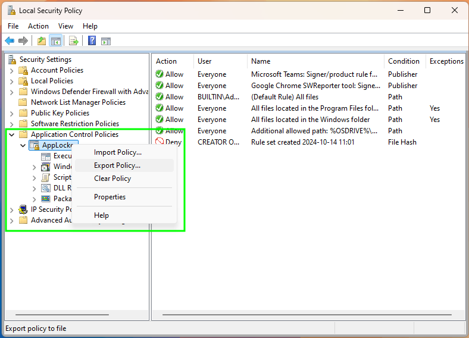
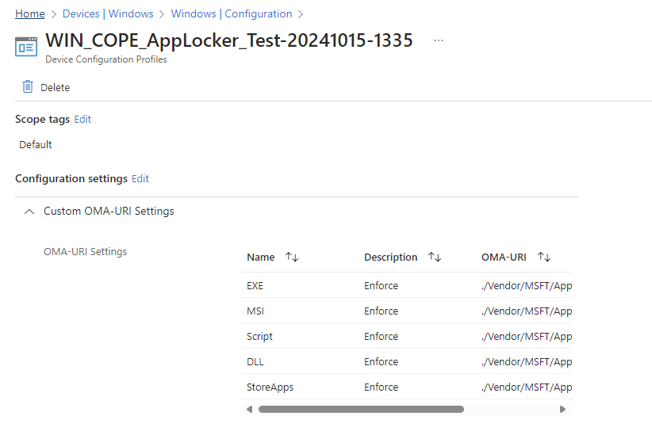
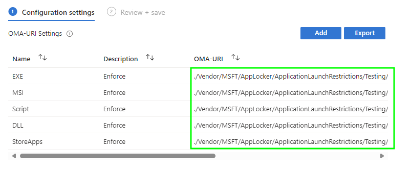
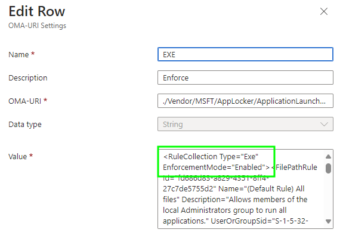
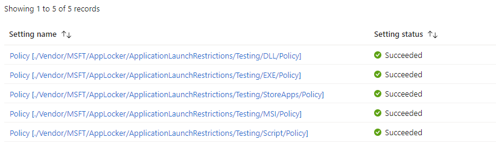

# Converting AppLocker Policies to Intune Profiles


There are [many posts](https://www.google.com/search?q=applocker+in+intune) about how to configure [AppLocker](https://learn.microsoft.com/en-us/windows/security/application-security/application-control/app-control-for-business/applocker/applocker-overview) in Intune, most of which I've used and looked at some point in my time, so why are we here (writing a post about it I mean, not an existential crisis thing) looking at it?

Well I had the pleasure of using [AaronLocker](https://github.com/microsoft/AaronLocker) in anger, with a customer who had five distinct device use cases, and consequently five distinct AppLocker policy groupings, and I honestly cba manually creating the policies in Intune.

So I didn't.

## AppLocker Policies

There isn't a nice GUI friendly way to create AppLocker policies using Intune, and everything suggests using [secpol.msc](https://learn.microsoft.com/en-us/previous-versions/windows/it-pro/windows-10/security/threat-protection/security-policy-settings/how-to-configure-security-policy-settings) to create your AppLocker policies first, or just exporting your existing AppLocker policies from Group Policy to XML, or if you're fancy, using the [AaronLocker](https://github.com/microsoft/AaronLocker) scripts to create the policies for you.

They also say you need strip out bits from the exported XML file for each of the rule collections for **Exe**, **Msi**, **Scripts**, **Dll**, and **Appx** policies.

Each of these rule collections then needs to be applied using a [Custom Profile](https://learn.microsoft.com/en-us/mem/intune/configuration/custom-settings-configure) using the corresponding OMA-URI somewhat detailed in the [AppLocker CSP](https://learn.microsoft.com/en-us/windows/client-management/mdm/applocker-csp).

| Rule Type | OMA-URI | Value |
| :- | :- | :- |
| Exe | `./Vendor/MSFT/AppLocker/ApplicationLaunchRestrictions/{Grouping}/EXE/Policy` | String |
| Msi | `./Vendor/MSFT/AppLocker/ApplicationLaunchRestrictions/{Grouping}/MSI/Policy` | String |
| Scripts | `./Vendor/MSFT/AppLocker/ApplicationLaunchRestrictions/{Grouping}/Script/Policy` | String |
| Dll | `./Vendor/MSFT/AppLocker/ApplicationLaunchRestrictions/{Grouping}/DLL/Policy` | String |
| Appx | `./Vendor/MSFT/AppLocker/ApplicationLaunchRestrictions/{Grouping}/StoreApps/Policy` | String |

Then Intune smushes these rules together based on the **{Grouping}** label to apply the AppLocker policy to the device.

All of this sounds painfully manual, so let's write us some PowerShell to do this for us.

### Exported Policy

We'll start off with our exported AppLocker policy, which has either come from [AaronLocker](https://github.com/microsoft/AaronLocker), or by just exporting your policy from [secpol.msc](https://learn.microsoft.com/en-us/previous-versions/windows/it-pro/windows-10/security/threat-protection/security-policy-settings/how-to-configure-security-policy-settings)



Which after you've saved the file, gives you an XML file looking something like the below.



We'll need this later.


The only difference between the AaronLocker export and the one from Security Policy is the header `<?xml version="1.0" encoding="UTF-16"?>` existing in the AaronLocker policy.


Now to add these AppLocker rules settings to Intune, we need to take each corresponding rule collection section **Exe**, **Msi**, **Scripts**, **Dll**, and **Appx** and add those to the corresponding OMA-URI settings detailed in the previous table.

So each **RuleCollection** needs taking from the XML and separating, something like the below for **Msi** rules:

```XML
<RuleCollection Type="Msi" EnforcementMode="AuditOnly">
  <FilePathRule Id="c64e52fe-bd05-43ed-ae91-f3612182829e" Name="All Windows Installer files under %windir%\ccmcache" Description="Allows everyone to run installer files in the SCCM cache." UserOrGroupSid="S-1-1-0" Action="Allow">
    <Conditions>
      <FilePathCondition Path="%WINDIR%\ccmcache\*" />
    </Conditions>
  </FilePathRule>
  <FilePathRule Id="5b290184-345a-4453-b184-45305f6d9a54" Name="(Default Rule) All Windows Installer files in %systemdrive%\Windows\Installer" Description="Allows members of the Everyone group to run all Windows Installer files located in %systemdrive%\Windows\Installer." UserOrGroupSid="S-1-1-0" Action="Allow">
    <Conditions>
      <FilePathCondition Path="%WINDIR%\Installer\*" />
    </Conditions>
  </FilePathRule>
  <FilePathRule Id="64ad46ff-0d71-4fa0-a30b-3f3d30c5433d" Name="(Default Rule) All Windows Installer files" Description="Allows members of the local Administrators group to run all Windows Installer files." UserOrGroupSid="S-1-5-32-544" Action="Allow">
    <Conditions>
      <FilePathCondition Path="*.*" />
    </Conditions>
  </FilePathRule>
  <FilePublisherRule Id="e9a69102-3de5-4a41-b22c-59e883eb253d" Name="Microsoft Teams: Signer/product rule for O=MICROSOFT CORPORATION, L=REDMOND, S=WASHINGTON, C=US/MICROSOFT TEAMS" Description="Information acquired from TrustedSigners.ps1" UserOrGroupSid="S-1-1-0" Action="Allow">
    <Conditions>
      <FilePublisherCondition PublisherName="O=MICROSOFT CORPORATION, L=REDMOND, S=WASHINGTON, C=US" ProductName="MICROSOFT TEAMS" BinaryName="*">
        <BinaryVersionRange LowSection="*" HighSection="*" />
      </FilePublisherCondition>
    </Conditions>
  </FilePublisherRule>
  <FilePublisherRule Id="16d78662-caa6-41ff-ab61-2f2e48287de5" Name="Microsoft-signed MSI files: Signer rule for O=MICROSOFT CORPORATION, L=REDMOND, S=WASHINGTON, C=US" Description="Information acquired from TrustedSigners.ps1" UserOrGroupSid="S-1-1-0" Action="Allow">
    <Conditions>
      <FilePublisherCondition PublisherName="O=MICROSOFT CORPORATION, L=REDMOND, S=WASHINGTON, C=US" ProductName="*" BinaryName="*">
        <BinaryVersionRange LowSection="*" HighSection="*" />
      </FilePublisherCondition>
    </Conditions>
  </FilePublisherRule>
</RuleCollection>
```

If you want to go ahead and do this manually, you just continue to the copy the **RuleCollection** sections from your exported XML, and use those to create your Custom Profile in Intune, oh and stop reading this post.

Otherwise, stay tuned.

## PowerShell

So I put together the following PowerShell [script](https://github.com/ennnbeee/oddsandendpoints-scripts/blob/main/Intune/EndpointSecurity/AppLockerConversion/Convert-AppLockertoIntune.ps1) to do the hard work for me, and reduce human error obviously, not just because I'm lazy.

To give you an understanding of what it's doing before you blindly run it:

- Captures each of the RuleCollections in the exported XML file
- Can change the Enforcement mode of the policies to **Audit** (safety first) or **Enforce** (you hate your users)
- Creates a new Custom Profile in Intune with the AppLocker Policy



### Running the Script

To allow these things to happen, you need to pass in some parameters:

- `$tenantId` - Your Entra ID tenant, you must have this memorised by now surely 😅
- `$xmlPath` - The path to the exported or created AppLocker XML file
- `$displayName` - The name of the Custom Profile to be created in Intune
- `$grouping` - The {Grouping} in the **OMA-URI** which is used to group (surprisingly) each of the RuleCollections into one AppLocker policy
- `$enforcement` - Whether you want the Intune AppLocker policy to be in Audit (`Audit`) or Enforcement (`Enforce`) mode

So to run the script and create your AppLocker policy in Intune, you ping the following into a PowerShell prompt:

```PowerShell
.\Convert-AppLockertoIntune.ps1 -tenantId '36019fe7-a342-4d98-9126-1b6f94904ac7' -xmlPath 'C:\Source\github\mve-scripts\Intune\EndpointSecurity\AppLockerConversion\AppLockerRules-Audit.xml' -displayName 'WIN_COPE_AppLocker_Test' -grouping 'Testing' -enforcement Enforce
```

You get the following, authenticating obviously:



### Validation

Checking in Intune for much need validation ~from Microsoft Daddy~, we now have a new Custom Profile AppLocker policy, with a date and time stamp just for fun:



Digging into the profile itself, we can see each of the required OMA-URI settings for each Rule collection, with the specified grouping of **Testing**:



As we specified that we'd like to ~piss off~ secure our users on their devices, by enforcing the AppLocker policy, the content of each OMA-URI setting has updated the enforcement mode to **Enabled** from the setting in the original XML, which was **AuditOnly**:



Applying this to devices, should result in some happy reports in Intune:



But maybe some unhappy users 😅.

## Summary

As much as people think AppLocker is dead, and I guess it is from a development perspective, it isn't actually dead.

> Although AppLocker will continue to receive security fixes, it will not undergo new feature improvements. - [Microsoft Learn](https://learn.microsoft.com/en-us/windows/security/application-security/application-control/app-control-for-business/appcontrol-and-applocker-overview#choose-when-to-use-app-control-or-applocker)

Although [App Control for Business](https://learn.microsoft.com/en-us/mem/intune/protect/endpoint-security-app-control-policy) (formerly [WDAC](https://learn.microsoft.com/en-us/hololens/windows-defender-application-control-wdac)) is the cutting edge of application protection now, AppLocker still [has it's place](https://learn.microsoft.com/en-us/windows/security/application-security/application-control/app-control-for-business/applocker/applocker-overview#when-to-use-applocker) in the modern device management world.

It's a little easier pill to swallow to take an established on-premises AppLocker policy, and move it to Intune to support your move to Entra joined Windows 11 devices, than it is to start a brand new journey with App Control, something about technical debt.

Either way, you can now easily move these AppLocker policies to Intune. Just don't ask me about troubleshooting AppLocker, App Control, or WDAC, take those questions to the Security people.

