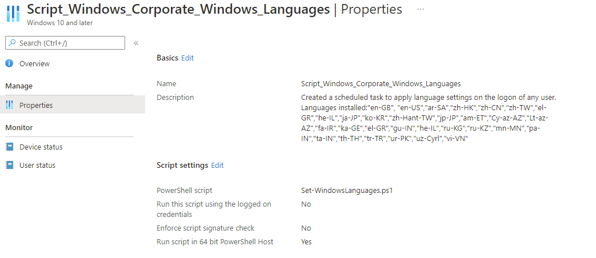
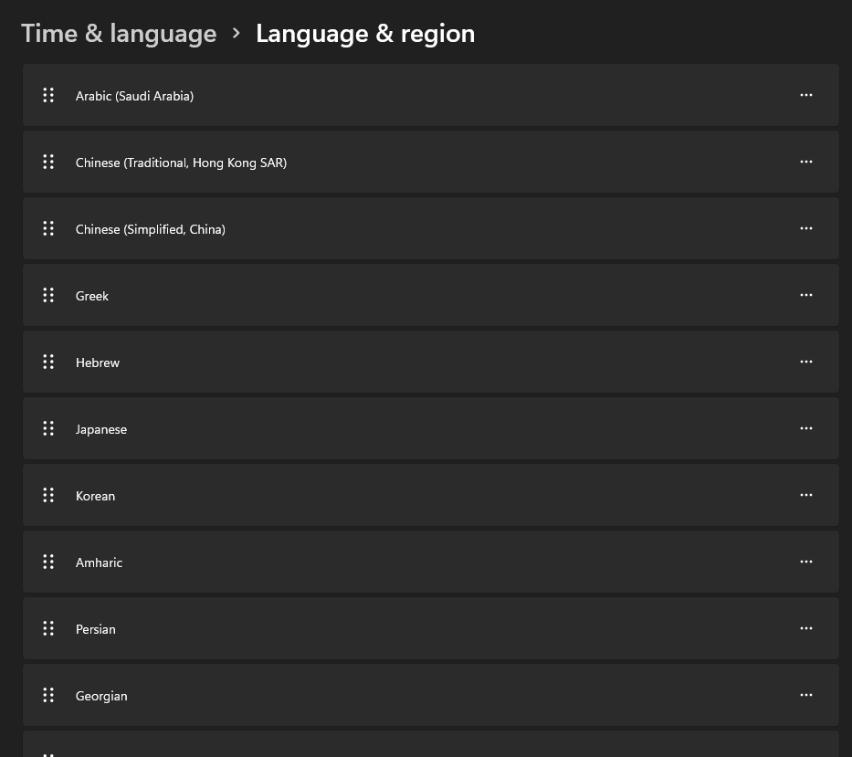

# Configuring Available User Languages on Windows Devices


Have you ever wondered how to ensure that a number of languages are available for selection to end users on shared Windows 10 devices? The thought hadn't crossed my mind, but then again, you encounter new use cases and requirements on a weekly basis. This was one of those occasions, needing a Library Kiosk machine to have a set of languages available to users upon login to the machine.

## Configuration

There are a number of posts out in the wild on how to fully change the Windows languages on a device by device basis, but in this instance we needed to keep the core language as `en-GB` but allow end users to select their preferred input language within Windows, and ensure that this language list can be modified in the event of new languages being required.

Let's crack on shall we...

### Windows User Language List

You may be familiar with the 'old' way of automating the setting user languages in [Windows 7](https://docs.microsoft.com/en-us/troubleshoot/windows-client/deployment/automate-regional-language-settings), calling `control.exe intl.cpl,,/f:"c:\Unattend.xml"` and assigning an [xml file](https://docs.microsoft.com/en-us/troubleshoot/windows-client/deployment/automate-regional-language-settings#sample-xml-answer-file) with the required user languages, luckily with Windows 10 comes the [Set-WinUserLanguageList](https://docs.microsoft.com/en-us/powershell/module/international/new-winuserlanguagelist) PowerShell command.

Microsoft does a great job of detailing how this command is used, so below is the way I've created a new list, and appended the required languages using the [region tag](https://docs.microsoft.com/en-us/windows-hardware/manufacture/desktop/available-language-packs-for-windows?view=windows-11).

This allows for new languages to be added to the script readily.

```PowerShell
# Sets the Windows Languages
$LanguageList = New-WinUserLanguageList -Language 'en-GB'
$Languages  = New-Object -TypeName System.Collections.ArrayList
$Languages.AddRange(@(
        "en-US",
        "ar-SA",
        "zh-HK",
        "zh-CN",
        "zh-TW",
        "el-GR",
        "he-IL",
        "ja-JP",
        "ko-KR",
        "zh-Hant-TW",
        "jp-JP",
        "am-ET",
        "Cy-az-AZ",
        "Lt-az-AZ",
        "fa-IR",
        "ka-GE"
    ))

Foreach($Language in $Languages){
 $LanguageList.Add($Language)
}

Try{
 Set-WinUserLanguageList -LanguageList $LanguageList -Force
 }
Catch{
 Write-Error "Unable to set the language list $($_.Exception.Message)"
}
```

### Task Scheduling

This script allows the creation and installation of a User Language List, containing the required languages needed for each user who accesses the shared device. This seemed all a bit too perfect for this requirement; updatable list of languages, uses native PowerShell commands, can be deployed via Microsoft Intune. That was until I realised this only works correctly under a user context, and I also need it to run each time a user logs on to the machine.

So now we need a way to create a Scheduled Task and have it run the PowerShell script, without the end user seeing it run.

Luckily, I was using a script to map network drives, generated from [here](https://intunedrivemapping.azurewebsites.net/) to do something similar, time to not reinvent the wheel and just make use of someone else's hard work.

Let's break down the sections of the script.

### Running as SYSTEM

First off the detecting whether the script is being run under a `SYSTEM` context; this is important, as when deployed via Microsoft Intune the script **will** be running under this context, at this time we want the script to create the scheduled task, not run the containing PowerShell, in this instance the addition of user languages.

```PowerShell
function Test-RunningAsSystem {
 [CmdletBinding()]
 param()
 process {
  return [bool]($(whoami -user) -match "S-1-5-18")
 }
}
```

### Creating the Task

Now we have determined whether we're running as `SYSTEM` or not, now time to create the Scheduled Task, and to have the script launched, using a dirty vbs file, to hide the PowerShell windows.

```PowerShell
if (Test-RunningAsSystem) {

 Start-Transcript -Path $(Join-Path -Path $env:temp -ChildPath "WindowsLanguages-ST.log")
 Write-Output "Running as System --> creating scheduled task which will run on user logon"

 # Get the current script path and content and save it to the client

 $currentScript = Get-Content -Path $($PSCommandPath)

 $schtaskScript = $currentScript[(0) .. ($currentScript.IndexOf("#!SCHTASKCOMESHERE!#") - 1)]

 $scriptSavePath = $(Join-Path -Path $env:ProgramData -ChildPath "Intune-Helper\Windows-Languages")

 if (-not (Test-Path $scriptSavePath)) {

  New-Item -ItemType Directory -Path $scriptSavePath -Force
 }

 $scriptSavePathName = "Set-WindowsLanguages.ps1"

 $scriptPath = $(Join-Path -Path $scriptSavePath -ChildPath $scriptSavePathName)

 $schtaskScript | Out-File -FilePath $scriptPath -Force

 # Create dummy vbscript to hide PowerShell Window popping up at logon

 $vbsDummyScript = "
 Dim shell,fso,file
 Set shell=CreateObject(`"WScript.Shell`")
 Set fso=CreateObject(`"Scripting.FileSystemObject`")
 strPath=WScript.Arguments.Item(0)
 If fso.FileExists(strPath) Then
  set file=fso.GetFile(strPath)
  strCMD=`"powershell -nologo -executionpolicy ByPass -command `" & Chr(34) & `"&{`" &_
  file.ShortPath & `"}`" & Chr(34)
  shell.Run strCMD,0
 End If
 "

 $scriptSavePathName = "WindowsLanguages-VBSHelper.vbs"

 $dummyScriptPath = $(Join-Path -Path $scriptSavePath -ChildPath $scriptSavePathName)

 $vbsDummyScript | Out-File -FilePath $dummyScriptPath -Force

 $wscriptPath = Join-Path $env:SystemRoot -ChildPath "System32\wscript.exe"

 # Register a scheduled task to run for all users and execute the script on logon

 $schtaskName = "Intune Helper - Windows Languages"
 $schtaskDescription = "Applies Windows Languages using a PowerShell script."

 $trigger = New-ScheduledTaskTrigger -AtLogOn
 #Execute task in users context
 $principal = New-ScheduledTaskPrincipal -GroupId "S-1-5-32-545" -Id "Author"
 #call the vbscript helper and pass the PosH script as argument
 $action = New-ScheduledTaskAction -Execute $wscriptPath -Argument "`"$dummyScriptPath`" `"$scriptPath`""
 $settings = New-ScheduledTaskSettingsSet -AllowStartIfOnBatteries -DontStopIfGoingOnBatteries

 $null = Register-ScheduledTask -TaskName $schtaskName -Trigger $trigger -Action $action  -Principal $principal -Settings $settings -Description $schtaskDescription -Force

 Start-ScheduledTask -TaskName $schtaskName

 Stop-Transcript
}
```

Now we've got the bones of the script, we can put it all together and deploy it using Microsoft Intune. The full script can be found [here](https://github.com/ennnbeee/oddsandendpoints-scripts/blob/main/Intune/PlatformScripts/PowerShell/AutopilotLanguages/Set-WindowsLanguages.ps1)

### Deployment

Save the above script and create a new PowerShell script deployment in [Microsoft Intune](https://endpoint.microsoft.com/#blade/Microsoft_Intune_DeviceSettings/DevicesWindowsMenu/powershell) using the following configuration settings, then deploy to a test group of devices.



Now we have a way to deploy additional languages to Windows 10 devices, and have the Keyboard inputs available when the user has logged onto the device. The user just needs to select the language from the notification area.



## Summary

Pretty straight forward right? Setting the language list, letting 'Windows Features on Demand' just download the required files, plus, you can amend the languages within the script and re-deploy, allowing you to add or remove any required languages for your users without having to deal with Language Packs.

