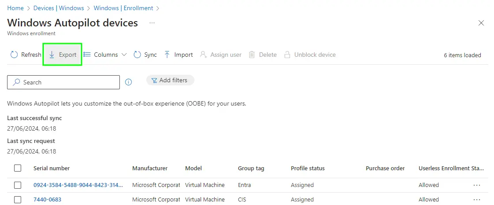
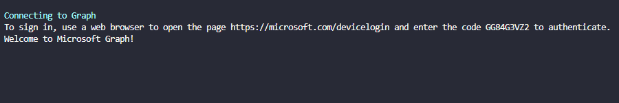
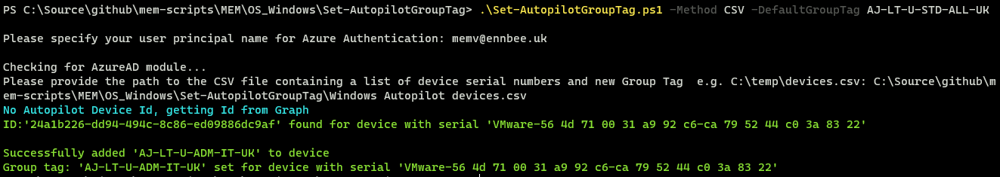
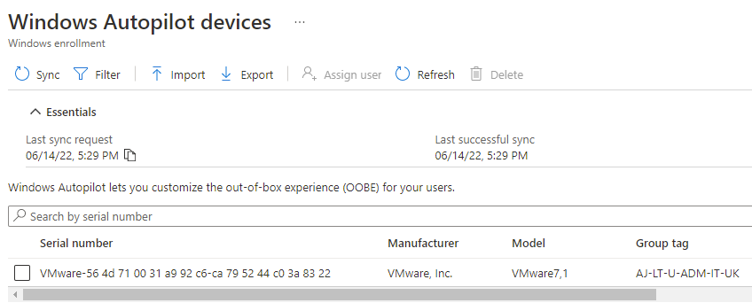
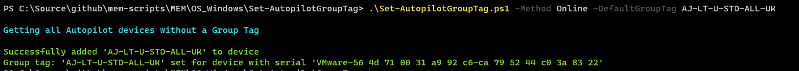
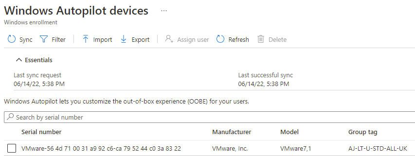

# Retrofitting Windows Autopilot Group Tags


Now I don't think I promised that I'd cover off bulk tagging Autopilot devices in a , but you know, I was running low on things to write about. So here we are.

As I like to practice what I preach, I'd left myself the task of updating 1000's of Autopilot devices with a new [Group Tag](https://techcommunity.microsoft.com/t5/intune-customer-success/support-tip-using-group-tags-to-import-devices-into-intune-with/ba-p/815336) after a successful Proof-of-Concept implementation of a suitable convention and syntax. Thanks past me.

So what does any good consultant do? ~~Run away?~~ ~~Come up with a janky script that you'll only ever run once, that contains nested 'foreach' loops?~~ Write a perfectly reusable and digestible PowerShell script using Graph API to update existing Autopilot devices...

## The Approach

Now I needed an easy way to tag specific devices with Group Tags, and then anything that didn't have a specific Group Tag to get a default one...so we're working with two distinct use cases here.

## Ready, Aim

For the first, we'll start with exporting the Autopilot Devices from the tenant, as this CSV file will contain the Serial Numbers we need further down the line.



Now with the CSV file exported, and looking something like the below:

```csv
Serial number,Manufacturer,Model,Group tag,Profile status,Purchase order,Userless Enrollment Status
"0924-3584-5488-9044-8423-3149-46","Microsoft Corporation","Virtual Machine","Entra","Assigned","","Unknown"
"7440-0683","Microsoft Corporation","Virtual Machine","CIS","Assigned","","Not Allowed"
"AAA-0263-9697-7653-AAAA-AAAA-AA","Microsoft Corporation","Virtual Machine","Entra","Assigned","","Not Allowed"
"DNuesTLjtKit","QEMU","QEMU Virtual Machine","CIS","Assigned","","Not Allowed"
"poiuytrewqlkjhgfdsa","Microsoft Corporation","Virtual Machine","CIS","Assigned","","Not Allowed"
"qwertyuiopasdfghjklzxcvbnm","Microsoft Corporation","Virtual Machine","CIS","Assigned","","Not Allowed"
```

Go ahead and laboriously update the CSV file with Group Tags and remove any devices that you want tagging with the default one.

## Repeat Offenders

We need a way to not only set the Group Tag, but fetch the ID of the Autopilot device, and as we're doing this potentially 100's of times, and I did say this was a repeatable and reusable script, we should create a PowerShell function or two.

### Handshake Time

~~Lets steal the PowerShell Authentication Function from the [Intune PowerShell Samples](https://github.com/microsoftgraph/powershell-intune-samples) GitHub repo to allow us to connect to Graph.~~


Connect to Graph using the latest module and `Connect-MgGraph -Scopes 'DeviceManagementManagedDevices.ReadWrite.All'`.


### Autopilot Functions

Now we can have a nice authenticated chat to Graph, we need to talk to the Autopilot section, [deviceManagement/windowsAutopilotDeviceIdentities](https://docs.microsoft.com/en-us/graph/api/resources/intune-enrollment-windowsautopilotdeviceidentity?view=graph-rest-beta) in fact.

So let's get all Autopilot devices, as we'll need this to:

1. Get all Autopilot devices without a Group Tag set
2. Get the Autopilot device Id for the entries in the CSV file we created

### Getting Autopilot Devices

```PowerShell
Function Get-AutopilotDevices() {

    $graphApiVersion = "Beta"
    $Resource = "deviceManagement/windowsAutopilotDeviceIdentities"

    try {
        $uri = "https://graph.microsoft.com/$graphApiVersion/$($Resource)"
            (Invoke-MgGraphRequest -Uri $uri -Method Get).Value
    }
    catch {
        Write-Error $Error[0].ErrorDetails.Message
        break
    }
}
```

### Update Autopilot Device Attributes

Now we can use the below function to set the Autopilot Group Tag (I ~~should~~ could probably update this to set other device attributes).

```PowerShell
Function Set-AutopilotDevice() {

    [CmdletBinding()]
    param(
        $Id,
        $GroupTag
    )

    $graphApiVersion = "Beta"
    $Resource = "deviceManagement/windowsAutopilotDeviceIdentities/$Id/updateDeviceProperties"

    try {
        if (!$id) {
            write-host "No Autopilot device Id specified, specify a valid Autopilot device Id" -f Red
            break
        }

        if (!$GroupTag) {
            $GroupTag = Read-host "No Group Tag specified, specify a Group Tag"
        }

        $Autopilot = New-Object -TypeName psobject
        $Autopilot | Add-Member -MemberType NoteProperty -Name 'groupTag' -Value $GroupTag
        $JSON = $Autopilot | ConvertTo-Json -Depth 3
        $uri = "https://graph.microsoft.com/$graphApiVersion/$($Resource)"
        Invoke-MgGraphRequest -Uri $uri -Method Post -Body $JSON -ContentType "application/json"
        write-host "Successfully added '$GroupTag' to device" -ForegroundColor Green
    }
    catch {
        Write-Error $Error[0].ErrorDetails.Message
        break
    }
}
```

## Scary Stuff Lies Ahead

So we now have the functions in order to connect, get and set all the things we need. Here comes the fun part, PowerShell logic driven by four cups of coffee.

### Script Parameters

Before that, some lovely parameters to ensure you can't really mess things up.

- **Method**: Set to be either 'CSV' or 'Online', used for loading that beautiful CSV created earlier, or to just grab all the Autopilot devices in the tenant with a blank Group Tag
- **DefaultGroupTag**: The 'Catch All' Group Tag for those devices that don't have one set already

### The Logic?

Here we have the guts of the script, designed so that you run it through once with the `CSV` option, then a second time using the `Online` option. Don't ask me why I did it this way, four coffees remember.

I was also kind enough to capture any of the devices in the CSV file missing a Group Tag and prompt to enter one in. Very kind.

```PowerShell
if ($method -eq 'csv') {
    $csvPath = Read-Host 'Please provide the path to the csv file containing a list of device serial numbers and new Group Tag  e.g. C:\temp\devices.csv'

    if (!(Test-Path "$csvPath")) {
        Write-Host "Import Path for csv file doesn't exist" -ForegroundColor Red
        Write-Host "Script can't continue" -ForegroundColor Red
        Write-Host
        break

    }
    else {
        $autopilotDevices = Import-Csv -Path $csvPath
    }
}
else {
    Write-Host 'Getting all Autopilot devices without a Group Tag' -ForegroundColor Cyan
    $autopilotDevices = Get-AutopilotDevices | Where-Object { ($null -eq $_.groupTag) -or ($_.groupTag) -eq '' }
    $groupTag = Read-Host "Please enter the default group tag for devices without a tag:"
}

# Sets Group Tag
foreach ($autopilotDevice in $autopilotDevices) {

    $id = $autopilotDevice.id
    if (!$id) {
        Write-Host 'No Autopilot Device Id, getting Id from Graph' -ForegroundColor Cyan
        $id = (Get-AutopilotDevices | Where-Object { ($_.serialNumber -eq $autopilotDevice.'serial Number') }).id
        Write-Host "ID:'$Id' found for device with serial '$($autopilotDevice.'Serial number')'" -ForegroundColor Green
    }

    if ($method -eq 'csv') {
        $groupTag = $autopilotDevice.'group Tag'
        if (!$groupTag) {
            Write-Host 'No Autopilot Device Group Tag found in csv' -ForegroundColor Cyan
            $groupTag = Read-Host "Please enter the group tag for device with serial $($autopilotDevice.'serial Number') now:"
        }
    }

    try {
        Set-AutopilotDevice -id $id -groupTag $groupTag
        Write-Host "Group tag: '$groupTag' set for device with serial $($autopilotDevice.'Serial number')" -ForegroundColor Green
    }
    catch {
        Write-Host "Group tag: '$groupTag' not set for device with serial $($autopilotDevice.'Serial number')" -ForegroundColor Red
    }
}
```

## Fire

So bring it all together into a [mega-script](https://github.com/ennnbeee/oddsandendpoints-scripts/blob/main/Intune/Enrolment/GroupTagAssignment/Set-AutopilotGroupTag.ps1) we now have a way to update the Autopilot Group Tags. So let's give it a go.


There is no `-whatif` command, so I'd start with the CSV of a couple of test devices.


### Sniper Time

Running the script with the CSV option:

```PowerShell
.\Set-AutopilotGroupTag.ps1 -tenantId 'bb690aa6-53c6-4d51-affe-ab80c6d710de' -method csv
```

We first have to Authenticate, we're using Device Authentication so following the instructions in the script:



Now we need to provide the path to the CSV file:

```txt
Please provide the path to the CSV file containing a list of device serial numbers and new Group Tag  e.g. C:\temp\devices.csv:
```

Now the script will run and update all the devices in the CSV file with their corresponding Group Tags:



And if we check in Intune:



Which amazingly, the Group Tag matches the data in the CSV file we created earlier. Too early to call this a win outright, but we're on the way.

### Shotgun Approach

We need to now clear up the remaining devices without Group Tags, this one we can't really test, unless you fancy improving the script.

Similar setup to the CSV run, but this time the arguments look like the below:

```PowerShell
.\Set-AutopilotGroupTag.ps1 -tenantId 'bb690aa6-53c6-4d51-affe-ab80c6d710de' -Method Online
```

We're already authenticated, so we can skip that bit, and we're not using the CSV option so it will get straight to the good stuff, where you will be prompted to set the default group tag:

```txt
Please enter the default group tag for devices without a tag: Entra
```

Then the script will go and update Autopilot devices missing the group tag:



And if we check in Intune:



This Group Tag matches the prompted tag we set when running the script. I'd call this one a win.

## Summary

There might be easier ways of doing this, or a little less caffeine fuelled at least, but if you want to bulk set Group Tags to your existing Autopilot devices, this does seem like a half decent approach.

For new devices, I recommend that you work with your supplier/OEM and get them to tag them as part of the on-boarding.

Also, you can run this many times, so if you do want to re-tag devices, you can use the CSV method to do so.

Also also, you should look at  about using dynamic groups to ring fence your newly tagged devices.

