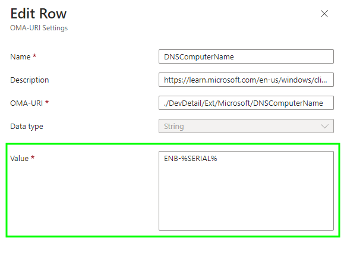

# Renaming Windows Autopilot v2 Devices

We're no stranger to renaming Windows Autopilot devices having looked at this with Hybrid joined devices not , but , to allow people to be happier with the names of their corporate owned devices, and not the random nature Windows Autopilot Hybrid Join deployments gives them.

So what gives, why am I looking at this again?

Yeah, it's [Windows Autopilot v2](https://learn.microsoft.com/en-us/autopilot/device-preparation/overview), (honestly I hope that name doesn't stick), and after looking at the [post](https://smbtothecloud.com/apv2-using-a-device-name-template-forcing-a-reboot-after-the-esp-autopilot-device-preparation/) [Gannon Novak](https://www.linkedin.com/in/gannon-n/) put together around the subject, I thought to myself, "I wonder if there are other ways to achieve this?".

Guess what? There are.

## Renaming Devices

I'll be frank, this method is misaligned to good practice (which is nice way of saying, *"janky"*), but until there is a way to do this in Microsoft Intune within the device preparation policy itself, and you still care about naming your devices and not just leaving users to decide their device names on Windows Pro devices at least...

...this is all you've got.

### Custom Profiles

[Ah shh, here we go again](https://www.youtube.com/watch?v=r0xBROc7rCI), digging around in the Policy CSP to try and find something to allow for a device rename.

There are a couple of settings detailed in the Policy CSP that support device naming, or device renaming, both [DNSComputerName](https://learn.microsoft.com/en-us/windows/client-management/mdm/devdetail-csp#extmicrosoftdnscomputername) and [ComputerName](https://learn.microsoft.com/en-us/windows/client-management/mdm/accounts-csp).

As we're only dealing with Windows 11 devices due to the [requirements](https://learn.microsoft.com/en-us/autopilot/device-preparation/requirements?tabs=software) for Windows Autopilot Device Preparation, we'll stick with **DNSComputerName** due to the note with **ComputerName**:

> For desktop PCs on Windows 10, version 2004 or later, use the Ext/Microsoft/DNSComputerName node in [DevDetail CSP](https://learn.microsoft.com/en-us/windows/client-management/mdm/devdetail-csp).

Taking stock of the provided **DNSComputerName** documentation, when configuring a device name, we should utilise one of the suggested variables:

> We recommend using `%SERIAL%` or `%RAND:x%` with a high character limit to reduce the chance of name collision when generating a random name. This feature doesn't check if a particular name is already present in the environment.

So when configuring our device name, we can utilise a prefix and a variable such as **ENB-%SERIAL%** to hope there are no device name clashes:

We can create a new [Custom Profile](https://learn.microsoft.com/en-us/mem/intune/configuration/custom-settings-configure) in Microsoft Intune with the below setting, allowing for the device to have a more suitable name:

*Windows Autopilot v2 - Device Rename*

| Name | OMA-URI | Data Type | Value |
| :- | :- | :- | :- |
| DNSComputerName | `./DevDetail/Ext/Microsoft/DNSComputerName` | String | `ENB-%SERIAL%` |

Device named, how do we make it stick, and by this, I mean how do we force a restart?

### Forcing the Restart

Well we can cheat, well we use the fact that there are some known issues with specific [Security settings](https://learn.microsoft.com/en-us/autopilot/policy-conflicts#:~:text=Enable%20virtualization%20based%20security) and their impact to Windows Autopilot causing device restarts, which we have looked at before.



So picking at least one of the settings from the Policy CSP for [Device Guard](https://learn.microsoft.com/en-us/windows/client-management/mdm/policy-csp-deviceguard), (which you should be applying to your Windows 11 devices anyway), we can look to force a restart as part of the application of the Custom Profile containing our device name settings:

*Windows Autopilot v2 - Device Rename*

| Name | OMA-URI | Data Type | Value |
| :- | :- | :- | :- |
| DNSComputerName | `./DevDetail/Ext/Microsoft/DNSComputerName` | String | `ENB-%SERIAL%` |
| EnableVirtualizationBasedSecurity | `./Device/Vendor/MSFT/Policy/Config/DeviceGuard/EnableVirtualizationBasedSecurity` | Integer | `1` |


I picked [EnableVirtualizationBasedSecurity](https://learn.microsoft.com/en-us/windows/client-management/mdm/policy-csp-deviceguard#enablevirtualizationbasedsecurity) but you can select any in the document, they all cause some type of restart during OOBE.


Making sure to assign this new profile to the same [group of devices](https://learn.microsoft.com/en-us/autopilot/device-preparation/tutorial/user-driven/entra-join-device-group) used in your APDP (*is this really any better than APv2?*) policy:

If you like screenshots of Microsoft Intune, here's another one for you, this time of the Custom Profile:

### Renaming in Action

You can see this rename process in action, and the device restart, following all the other OOBE gumph which I've kindly sped up:



Although the device itself is now happily renamed, Microsoft Intune is being a little whinge about the assignment of the profile:

Yeah, errors, and not ones we can do anything about either, but at least the device got renamed right? Nowt to complain about here. Jog on.

## Summary

There you have it, another way to rename shiny new APDP devices ([*stop trying to make "APDP" happen*](https://www.youtube.com/watch?v=Pubd-spHN-0)), but honestly, I'm almost done caring about device names at this point.

The whole Autopilot Deployment Device Preparation process is user centric, what exactly are you using device names *for*? Applying settings to specific dynamic security groups based on device name?

I mean this is a bad idea right, firstly APDP (*I'm still trying, leave me alone.*) hands you a group of devices which you can use, secondly, if you're applying settings to devices based on something trivial like the device name, what's stopping an Administrative user changing the device name and circumventing your policies? Literally nothing.

So instead of complaining that there are missing features with APDP (*last time I promise*), like renaming devices, or lack of other deployment methods, or that it takes longer than normal, or there's more user interaction, can we just all move on and find other better ways of grouping devices, you know like with [Device Filters](https://learn.microsoft.com/en-us/mem/intune/fundamentals/filters) and User assignments.

