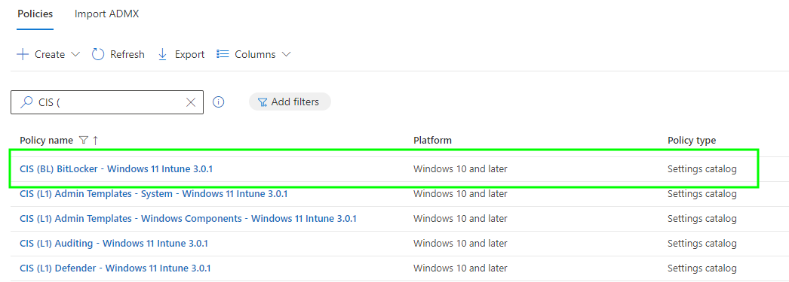

# Patching Gaps in the CIS Windows 11 Benchmark - BitLocker

With the release of the [CIS](https://www.cisecurity.org/) (Center for Internet Security) [Windows 11 Benchmark 3.0.1](https://www.cisecurity.org/benchmark/intune), the corresponding release of the Microsoft Intune build kit, and my colleague [Jonathan Fallis](https://www.linkedin.com/in/jonathan-fallis) covering the CIS [community version](https://www.everything365.online/2023/09/18/cis-microsoft-intune-for-windows-11-benchmark-in-settings-catalog-json/) of the benchmark (and the limitations) on his [website](https://deploymentshare.com/articles/bp-cis/), we both thought it would be best to share our combined experience when working with the newly available CIS build kit; focussing on BitLocker security settings in the initial part of this series.

Over the course of ~~three~~ four posts, we'll be aiming to find and fix any issues the build kit profiles create for Windows 11 cloud native devices, improve functionality using Microsoft Intune where we can, and add any missing configurations between the [downloadable benchmark documents](https://www.cisecurity.org/benchmark/intune) and the build kit.

Let's start with the obvious place.


As Custom Profile settings are on their way out (see Message Centre MC822716 and this [post](https://ourcloudnetwork.com/microsoft-to-start-blocking-custom-oma-uri-settings-in-intune/) by [Daniel Bradley](https://www.linkedin.com/in/danielbradley2/)) this post has been updated, along with the exported profiles, to use Settings Catalog profiles.


## CIS Build Kits

If you have access to the [CIS Workbench](https://workbench.cisecurity.org/) as part of an organisational account, you can download the Windows 11 build kit for Microsoft Intune, which when extracted will give you exported Settings Catalog profiles in JSON format, ready to [import](https://learn.microsoft.com/en-us/mem/intune/configuration/settings-catalog?tabs=sc-search-filter%2Csc-reporting#import-and-export-a-profile) into Microsoft Intune:


It turns out the we have more access in the CIS Workbench than we realised, you can still [register](https://workbench.cisecurity.org/registration) but this will only get you access to the benchmark documents, not the build kits.


Each of these profiles is aligned with the CIS benchmark whether **Level 1**, **Level 2**, or **BitLocker** settings, and instead of blindly applying these to your device estate, you really should have a look at the following sections on BitLocker profiles, as we build upon our [existing understanding](https://deploymentshare.com/articles/bp-cis/#:~:text=manages%20Intune%20Devices%3B-,Policy,-%2D%20CIS%20L0%20BitLocker) of their impact, and fix some issues along the way.

## CIS BitLocker Settings

With only the single BitLocker related policy in the build kit, you'd think encrypting a device with these benchmark settings would be easy.

Usually you just configure the use of TPM as the pre-boot authentication, allow Standard Users to encrypt the device, encryption method and cipher strength, encryption method, and boom there you have it, automatically and silently encrypted protected devices.

Well not according to CIS, and for good reason.

### Encryption Settings

Before we look at the rationale behind the recommended CIS settings for BitLocker, one thing that stood out to us when reviewing the provided policy, and the corresponding benchmark document, is a lack of actual encryption settings.

Specifically, the ones that allow for silent encryption to happen...so we need to create a supplemental Settings Catalog policy, to allow for [encryption to actually start](https://learn.microsoft.com/en-us/mem/intune/protect/encrypt-devices#silently-enable-bitlocker-on-devices) without pestering a user.

 *CIS (BL) BitLocker Supplement - Windows 11 Intune 3.0.1*

| Category | Setting | Value |
| :- | :- | :- |
| Administrative Templates > BitLocker | Require Device Encryption | `Enabled` |
| Administrative Templates > BitLocker | Allow Warning For Other Disk Encryption | `False` |
| Administrative Templates > BitLocker | Allow Standard User Encryption | `Enabled` |

Along with our preferred **encryption ciphers** for encryption.

 *CIS (BL) BitLocker Supplement - Windows 11 Intune 3.0.1*

| Category | Setting | Value |
| :- | :- | :- |
| Administrative Templates > Windows Components > BitLocker Drive Encryption | Choose drive encryption method and cipher strength (Windows 10 [Version 1511] and later) | `Enabled` |
| Administrative Templates > Windows Components > BitLocker Drive Encryption | Select the encryption method for operating system drives: | `XTS-AES 256-bit` |
| Administrative Templates > Windows Components > BitLocker Drive Encryption | Select the encryption method for fixed data drives: | `XTS-AES 256-bit` |
| Administrative Templates > Windows Components > BitLocker Drive Encryption | Select the encryption method for removable data drives: | `XTS-AES 256-bit` |

Finally, our **encryption method** selecting either **Full encryption** or **Used Space Only encryption**.

 *CIS (BL) BitLocker Supplement - Windows 11 Intune 3.0.1*

| Category | Setting | Value |
| :- | :- | :- |
| Administrative Templates > Windows Components > BitLocker Drive Encryption > Operating System Drives | Enforce drive encryption type on operating system drives | `Enabled` |
| Administrative Templates > Windows Components > BitLocker Drive Encryption > Operating System Drives | Select the encryption type: (Device) | `Used Space Only encryption` |

With the gaps in the CIS benchmark policy now plugged, we can look into some of the other settings and see if our silent encryption settings are going to work.


You can import the [CIS (BL) BitLocker Supplement - Windows 11 Intune 3.0.1](https://github.com/ennnbeee/oddsandendpoints-scripts/blob/main/Intune/Configuration/CIS/BL/) into your Microsoft Intune tenant instead of manually creating the profile.


### TPM with PIN Authentication

Well here's a problem, the CIS provided BitLocker profile doesn't allow for TPM only authentication, so out the window goes our ability to [silently encrypt](https://learn.microsoft.com/en-us/mem/intune/protect/encrypt-devices#tpm-startup-pin-or-key) the device then.

> - Compatible TPM startup - Configure this as Allow TPM or Require TPM
> - Compatible TPM startup PIN - Configure this as Do not allow startup PIN with TPM
> - Compatible TPM startup key - Configure this as Do not allow startup Key with TPM
> - Compatible TPM startup key and PIN - Configure this as Do not allow startup Key and PIN with TPM

Why are CIS requiring both TPM and PIN for BitLocker authentication and stopping us having fun with device encryption?

> BitLocker with TPM-only authentication allows for a computer to enter the power-on state without any pre-boot authentication. Therefore, an attacker may be able to perform DMA (Direct Memory Access) attacks.

Ah yeah, a security reason, makes sense. The settings from the profile below show the pre-boot authentication options, requiring startup PIN *with* TPM, and blocking everything else.

 *CIS (BL) BitLocker - Windows 11 Intune 3.0.1*

| Category | Setting | Value |
| :- | :- | :- |
| Administrative Templates > Windows Components > BitLocker Drive Encryption > Operating System Drives | Configure TPM startup key and PIN | `Do not allow startup key and PIN with TPM` |
| Administrative Templates > Windows Components > BitLocker Drive Encryption > Operating System Drives | Configure TPM startup | `Do not allow TPM` |
| Administrative Templates > Windows Components > BitLocker Drive Encryption > Operating System Drives | Configure TPM startup PIN | `Require startup PIN with TPM` |
| Administrative Templates > Windows Components > BitLocker Drive Encryption > Operating System Drives | Configure TPM startup key | `Do not allow startup key with TPM` |

What we *could* do to alleviate the requirement for a user to configure a PIN to start BitLocker encryption, is slightly amend the policy (and hope that we don't get audited), changing the below settings to **allow** the use of TPM and TPM with PIN protectors.

CIS (BL) BitLocker Silent Encryption - Windows 11 Intune 3.0.1

| Category | Setting | Value |
| :- | :- | :- |
| Administrative Templates > Windows Components > BitLocker Drive Encryption > Operating System Drives | Configure TPM startup | `Allow TPM` |
| Administrative Templates > Windows Components > BitLocker Drive Encryption > Operating System Drives | Configure TPM startup PIN | `Allow startup PIN with TPM` |

With the settings in Microsoft Intune looking something like this:

This will enable silent encryption, protecting the data on the device, but also allowing a PIN to be configured afterwards.


You can import the [CIS (BL) BitLocker Silent Encryption - Windows 11 Intune 3.0.1](https://github.com/ennnbeee/oddsandendpoints-scripts/blob/main/Intune/Configuration/CIS/Windows/BL/) into your Microsoft Intune tenant instead of updating the existing profile.


### BitLocker PIN

So how about setting this BitLocker PIN then?

Well to remove a user from the equation, we can deploy a PowerShell script to set the BitLocker PIN based on the serial number of the device.

 *CIS (BL) BitLocker TPMandPIN - Windows 11 Intune 3.0.1.ps1*



The script, in short will carry out the following:

- Removes any existing **TpmPin** key protectors, as there can only be one #highlander.
- If a **Recovery Key** key protector doesn't exist, it will create one.
- Get the serial number of the device, converting it to uppercase, and shortening it to the first 14-characters if it's longer than that.
- Creates a new **TpmPin** key protector with the PIN set to the converted serial number.
- Backups the recovery key to Entra.

It can then be deployed to your Windows Autopilot devices using a [Platform Script](https://learn.microsoft.com/en-us/mem/intune/apps/intune-management-extension) in Microsoft Intune in conjunction with the supplemental policy we created, with the below settings:

Using a Platform script over a remediation script allows this to be run (maybe) during Windows Autopilot, or if you're fancy and using the new [Windows Autopilot device preparation](https://learn.microsoft.com/en-us/autopilot/device-preparation/overview) method, actually [guarantee](https://learn.microsoft.com/en-us/autopilot/device-preparation/tutorial/user-driven/entra-join-assign-apps-scripts) that it runs during the deployment.

For our test Windows Autopilot device with the inventive serial number **qwertyuiopasdfghjklzxcvbnm**, set using [Advanced Settings Editor for Hyper-V Virtual Machines](https://www.altaro.com/hyper-v/free-tool-advanced-settings-editor-hyper-v-virtual-machines/) and by running a hand across a keyboard...

We can see that after restarting during Windows Autopilot (forced by another CIS setting, but more on that another time), the device is now asking for a BitLocker PIN, and low and behold it's the first 14-characters of the device serial number in uppercase:



After deploying the PowerShell script, remember to tell your end users what their BitLocker PIN is, and get them to [change it themselves](https://learn.microsoft.com/en-us/microsoft-desktop-optimization-pack/mbam-v2/using-your-pin-or-password#changing-your-pin-or-password) within Windows after the Windows Autopilot deployment has completed.


The [CIS (BL) BitLocker TPMandPIN - Windows 11 Intune 3.0.1.ps1](https://github.com/ennnbeee/oddsandendpoints-scripts/blob/main/Intune/PlatformScripts/PowerShell/CIS/BL/) PowerShell script should be added to a Platform script in Microsoft Intune, but feel free to test it manually first.


### Thunderbolt DMA Protection

We've looked at  settings previously, but looking at exceptions to security hardening not the implementation of them, but we're familiar with what they are at least.

The settings in the CIS profile basically reduce [two threat types to BitLocker](https://support.microsoft.com/en-gb/topic/blocking-the-sbp-2-driver-and-thunderbolt-controllers-to-reduce-1394-dma-and-thunderbolt-dma-threats-to-bitlocker-bf0ef10b-f563-5cfc-9740-8340b1d86a0c); what it actually does from an end user experience perspective, is stop peripherals connected to a dock using a Thunderbolt port connection to a Windows device from being used prior to logon.

 *CIS (BL) BitLocker - Windows 11 Intune 3.0.1*

| Category | Setting | Value |
| :- | :- | :- |
| Administrative Templates > System > Device Installation > Device Installation Restrictions | Prevent installation of devices that match any of these device IDs | `Enabled` |
| Administrative Templates > System > Device Installation > Device Installation Restrictions | Also apply to matching devices that are already installed. | `True` |
| Administrative Templates > System > Device Installation > Device Installation Restrictions | Prevented device IDs | `PCI\CC_0C0A` |
| Administrative Templates > System > Device Installation > Device Installation Restrictions | Prevent installation of devices using drivers that match these device setup classes | `Enabled` |
| Administrative Templates > System > Device Installation > Device Installation Restrictions | Also apply to matching devices that are already installed. | `True` |
| Administrative Templates > System > Device Installation > Device Installation Restrictions | Prevented Classes | `{d48179be-ec20-11d1-b6b8-00c04fa372a7}, {7ebefbc0-3200-11d2-b4c2-00a0C9697d07}, {c06ff265-ae09-48f0-812c-16753d7cba83}, {6bdd1fc1-810f-11d0-bec7-08002be2092f}` |

To further secure BitLocker and protect from attacks, additional controls exist in the same CIS policy to disable standby power states:

 *CIS (BL) BitLocker - Windows 11 Intune 3.0.1*

| Category | Setting | Value |
| :- | :- | :- |
| Administrative Templates > System > Power Management > Sleep Setting | Allow standby states (S1-S3) when sleeping (on battery) | `Disabled` |
| Administrative Templates > System > Power Management > Sleep Setting | Allow standby states (S1-S3) when sleeping (plugged in) | `Disabled` |

Leaving us only with one potential exposure of the three in the linked article:

- **Systems that are left turned on.**
- Systems that are left in the Standby power state.
- Systems that use the TPM-only BitLocker protector.

We can't do much about devices that are left turned on sadly, short of powering down systems programmatically, which isn't going to please anyone, so these DMA settings are going to have to stay exactly as they are.

### Miscellaneous Settings

So this won't be the first example of where it's important to review the benchmark documentation and not just use the build kit, as there are additional BitLocker settings under section **86.1.4 (BL) Ensure 'Enumeration policy for external devices incompatible with Kernel DMA Protection' is set to 'Enabled: Block All'** surrounding device enumeration policies and more DMA protection:


This setting now exists within **Settings Catalog**, so we no longer need a Custom Profile, as pointed out in the CIS Intune community (which we have finally joined 😅)


To meet these additional requirements, we *did* need to configure a new [Custom Profile](https://learn.microsoft.com/en-us/mem/intune/configuration/custom-settings-configure), in Microsoft Intune to align to the [DeviceEnumerationPolicy](https://learn.microsoft.com/en-us/windows/client-management/mdm/policy-csp-dmaguard#deviceenumerationpolicy) recommendation in the benchmark, but now we can just use a Settings Catalog profile instead.

 *CIS (BL) BitLocker Misc - Windows 11 Intune 3.0.1*

| Category | Setting | Value |
| :- | :- | :- |
| Dma Guard | Device Enumeration Policy | `Block all (Most restrictive)` |

Which was created based on the details in the [Policy CSP](https://learn.microsoft.com/en-us/windows/client-management/mdm/policy-csp-dmaguard#deviceenumerationpolicy) article. This is another device impact setting, adding to the Thunderbolt DMA protection settings, and stopping DMA capable devices that cannot be sandboxed, remapped, or isolated in memory.

Be cautious though, as this policy setting does require a restart, but doesn't force one.


You can now import the [CIS (BL) BitLocker Misc - Windows 11 Intune 3.0.1](https://github.com/ennnbeee/oddsandendpoints-scripts/blob/main/Intune/Configuration/CIS/Windows/BL/) into your Microsoft Intune tenant instead of having to use a Custom profile.


## Summary

So that's all there is to the CIS benchmark for Windows 11 BitLocker security in Microsoft Intune, pretty simple really 😅.

We hope you now have a good grasp on exactly what the benchmark and policy settings are doing regarding BitLocker and the security around it, why the policies are applying these settings, and importantly how to improve and work with the restrictions to make not only the implementation in Microsoft Intune more straight forward, but also the end-user experience.

This saves you just implementing the benchmark build kit settings in Microsoft Intune and being all  when your devices don't just encrypt themselves, or your keyboards connected to docks don't work at the sign-in screen.

Next up for us in the series are the CIS Level 1 settings, and if you thought the BitLocker settings were painful, you're in for a shock 😆.

