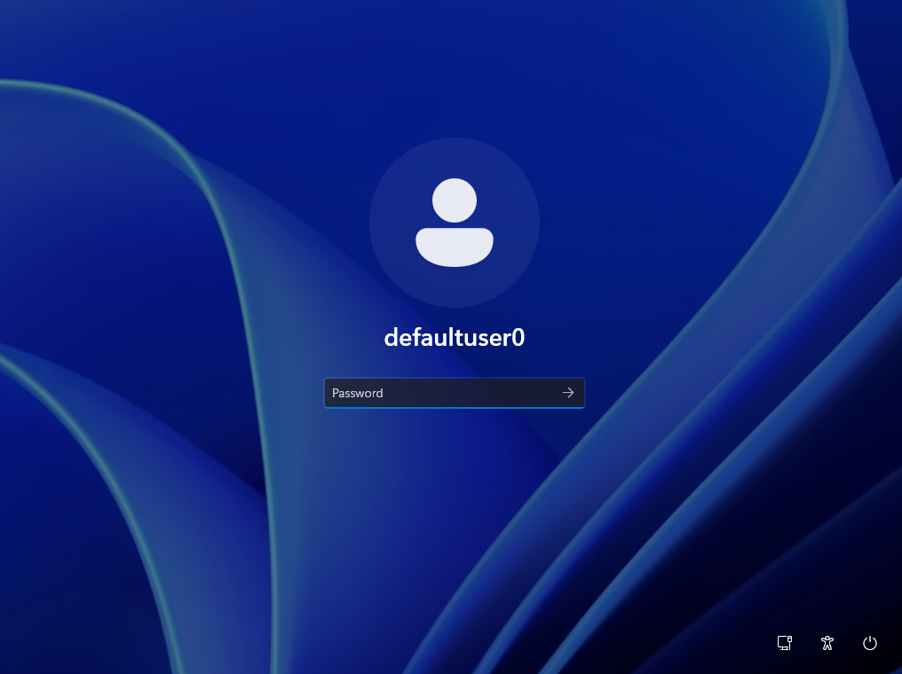

# Patching Gaps in the CIS Windows 11 Benchmark - Level 1 Windows Autopilot

We started with the  settings in the first post in this [Windows 11 CIS benchmark](https://www.cisecurity.org/benchmark/intune) based series, now is the time we dig deeper into the broader Level 1 settings, this time looking at the impact to Windows Autopilot cloud native deployments.

Jonathan has more than enough experience with testing these policies and the impact to Windows Autopilot, as I ~~made~~ asked him to help me review the impact of them following his [initial run in](https://deploymentshare.com/articles/bp-cis/) with the community version of the CIS Microsoft Intune templates.

So please send him your [thanks](https://www.linkedin.com/in/jonathan-fallis), as without his turmoil of dealing with the CIS policies breaking his devices, and the constant nagging from me as to when he's done with testing and finding solutions, there wouldn't be the content for this post or in fact the series.

Right, onto the fruits of ~~my~~ our labour.

## CIS Level 1 Settings

We already have a grasp of the settings that cause problems with Windows Autopilot, so we can start to try and find solutions to the discovered issues, all without reducing the overall security of the Windows 11 operating system *too* much 🤐.

There might be a surprising amount of wiggle room with some of the CIS Level 1 benchmark settings, that maybe aren't entirely obvious at first, starting with the documented problems...

### Disable Automatic Admin Logon

You're correct CIS, of course you should disable the use of automatic logons for administrator accounts, and it should be implemented without hesitation.

No one should be automatically logging on to a Windows device as a administrator, unless you're maybe **defaultuser0** as part of the Windows Autopilot process right?

 *CIS (L1) Section 1 - 3.9.1.1 - Windows 11 Intune 3.0.1*

| Category | Setting | Value |
| :- | :- | :- |
| Administrative Templates > MSS (Legacy) | MSS: (AutoAdminLogon) Enable Automatic Logon (not recommended) | `Disabled` |

The above configuration, will bin out the [Enrolment Status Page](https://learn.microsoft.com/en-us/autopilot/enrollment-status), reboot, and leave you with a Windows Autopilot device at a logon screen with the **defaultuser0** being your only option for sign in, and pretty much nothing from Microsoft Intune applied to it:

We did already know about the **AutoAdminLogon** setting causing the issue with Windows Autopilot, as it is [documented](https://learn.microsoft.com/en-us/autopilot/policy-conflicts), but who has time to read all of these articles 😂.

But how do we stop this from breaking Autopilot exactly?


As pointed out in the comments, the Policy CSP documentation is a little vague around supported operating system versions, so we've found an alternative way to meet this requirement without breaking Windows Autopilot deployments.


Instead of attempting to using Microsoft Intune native configuration, we can lean on the [registry setting](https://admx.help/?Category=security-compliance-toolkit&Policy=Microsoft.Policies.MSS::Pol_MSS_AutoAdminLogon) to configure this CIS level 1 requirement:

To ensure it doesn't break anything, we can deploy a remediation script to set the registry value, assigning the script to **users**, meaning that it won't apply until after the Autopilot process has completed.

The detection script will look for the **AutoAdminLogon** string value, and if it does not exist, or it is not set to **0** will report an error:

 *CIS (L1) Section 3.5.1 - Windows 11 Intune 3.0.1_Detection.ps1*



With the remediation configured to create the **AutoAdminLogon** if required, and set it to **0**, to disable this option:

 *CIS (L1) Section 3.5.1 - Windows 11 Intune 3.0.1_Remediation.ps1*



Deploying this to a group of users in Microsoft Intune, with settings similar to the below, with a suitable evaluation schedule:


The [CIS (L1) Section 3.5.1 - Windows 11 Intune 3.0.1](https://github.com/ennnbeee/oddsandendpoints-scripts/tree/main/Intune/Remediation/CIS/L1) detection and remediation scripts are available for your to add into your Microsoft Intune tenant.


### Interactive Logon Messages

More breaking of Windows Autopilot, this time with pre-provisioned deployments, with another known and [documented](https://learn.microsoft.com/en-us/autopilot/policy-conflicts#:~:text=Windows%20Autopilot%20pre%2Dprovisioning) ~~feature~~ problem. Thanks CIS 😬.

 *CIS (L1) Local Policies Security Options - Windows 11 Intune 3.0.1*

| Category | Setting | Value |
| :- | :- | :- |
| Local Policies Security Options | Interactive Logon Message Text For Users Attempting To Log On | `Configured` |
| Local Policies Security Options | Interactive Logon Message Title For Users Attempting To Log On | `Configured` |

I know a logon message is important, and is included in other security baselines and not just for Windows devices either, but come on now, do we really need this?

Well yes if you want to stick with the CIS benchmark.

So once more to stripping out this setting into a separate profile, this time keeping the same configuration settings, but assigning this to all your corporate-owned devices, but excluding a group of Windows Autopilot devices configured for pre-provisioned deployments using rules based on the [`enrollmentProfileName`](https://learn.microsoft.com/en-us/entra/identity/users/groups-dynamic-membership#rules-for-devices) associated with the device.

 *CIS (L1) Section 45.10-45.11 - Windows 11 Intune 3.0.1*

| Category | Setting | Value |
| :- | :- | :- |
| Local Policies Security Options | Interactive Logon Message Text For Users Attempting To Log On | `Configured` |
| Local Policies Security Options | Interactive Logon Message Title For Users Attempting To Log On | `Configured` |

Don't forget to actually configure these settings, unlike in the CIS profiles where they're just set to **Test test test** 😂:


You can import [CIS (L1) Section 45.10-45.11 - Windows 11 Intune 3.0.1](https://github.com/ennnbeee/oddsandendpoints-scripts/blob/main/Intune/Configuration/CIS/Windows/L1/) and the amended [CIS (L1) Local Policies Security Options - Windows 11 Intune 3.0.1](https://github.com/ennnbeee/oddsandendpoints-scripts/blob/main/Intune/Configuration/CIS/Windows/L1/) profiles into your Microsoft Intune tenant.


### Virtualization Based Security

We'd encountered a rogue device restart during Windows Autopilot when configuring a , which did actually work to our advantage, but what caused them?

 *CIS (L1) Virtualization Based Technology - Windows 11 Intune 3.0.1*

| Category | Setting | Value |
| :- | :- | :- |
| Device Guard | Configure System Guard Launch | `Unmanaged Enables Secure Launch if supported by hardware` |
| Device Guard | Credential Guard | `Configured` |
| Device Guard | Enable Virtualization Based Security | `enable virtualization based security.` |
| Device Guard | Require Platform Security Features | `Turns on VBS with Secure Boot.` |

Yeah it's those ones, that are specifically [called out](https://learn.microsoft.com/en-us/autopilot/policy-conflicts#:~:text=Enable%20virtualization%20based%20security) to cause device restarts.

> These policies require a reboot... to work around this issue, the policies can be targeted to users instead of devices so that they apply later in the process.

Luckily for us we've been given a workaround, just assign the **CIS (L1) Virtualization Based Technology - Windows 11 Intune 3.0.1** profile to a group of users instead of devices.

Strangely enough this isn't mentioned in the CIS documentation anywhere, so thanks to Microsoft for looking out for us.

### Disable Network Selection UI

We'd come across this issue one a while ago, with the below setting stopping users from connecting to a new wireless network at the logon screen. You'd think this wouldn't be too much of an issue, even during [User-Driven Windows Autopilot](https://learn.microsoft.com/en-us/autopilot/user-driven), but where it does become a problem though, is with [pre-provisioning](https://learn.microsoft.com/en-us/autopilot/pre-provision).

 *CIS (L1) Admin Templates - System - Windows 11 Intune 3.0.1*

| Category | Setting | Value |
| :- | :- | :- |
| Administrative Templates > System > Logon | Do not display network selection UI | `Enabled` |

With a user deploying their own device, they're asked to connect to a wireless network (who has network cables in their own house? Jonathan apparently 😅) before starting Windows Autopilot, so this network will now be available at logon, and no need to select a new one.

With pre-provisioned deployments, only the network that was connected to during deployment, and/or wireless or wired networks deployed to the device from Microsoft Intune are available to connect to from the logon screen.

Meaning if you build devices on-premises, and then give them to end-users to take home, with the setting above, they won't be able to connect to a new network from the logon screen.

Saving changing this across all devices, as it only impacts Windows Autopilot devices, you can remove this setting from the benchmark profiles, and create a new policy with the below settings:

 *CIS (L1) Section 3.10.25.2 - Windows 11 Intune 3.0.1*

| Category | Setting | Value |
| :- | :- | :- |
| Administrative Templates > System > Logon | Do not display network selection UI | `Disabled` |

Then assign it to your corporate devices, excluding Dynamic Security Groups containing Windows Autopilot Devices where their profile allows the use of pre-provisioning as in the [Interactive Logon Messages](/posts/windows-cis-patching-gaps-part2/#interactive-logon-messages) section.

This will enable these devices, and these only, to select a new network not previously connected to, before logging onto their device, which if they've been deployed somewhere other than the current location, means they can actually sign in 😆.


Despite this only being one setting to create, we've been nice and made the [CIS (L1) Section 3.10.25.2 - Windows 11 Intune 3.0.1](https://github.com/ennnbeee/oddsandendpoints-scripts/tree/main/Intune/Configuration/CIS/Windows/L1) profile available for you to import, along with the amended original profile [CIS (L1) Admin Templates - System - Windows 11 Intune 3.0.1](https://github.com/ennnbeee/oddsandendpoints-scripts/tree/main/Intune/Configuration/CIS/Windows/L1).


### Windows Hello for Business

Now [Windows Hello for Business](https://learn.microsoft.com/en-us/windows/security/identity-protection/hello-for-business/) isn't strictly a Windows Autopilot thing, but if you're deploying a [Windows Hello for Business policy](https://learn.microsoft.com/en-us/windows/security/identity-protection/hello-for-business/configure#configure-windows-hello-for-business-using-microsoft-intune) to either your users or devices, then they're going to get prompted to configure Windows Hello when they sign in.

So we were happy to see the use of Windows Hello for Business as an authentication method, to add multi-factor authentication to Windows 11 accounts, recommend by CIS 🎉.

 *CIS (L1) Device Lock & WHFB - Windows 11 Intune 3.0.1*

| Category | Setting | Value |
| :- | :- | :- |
| Windows Hello For Business | Minimum PIN Length | `6` |
| Windows Hello For Business | Require Security Device | `true` |
| Windows Hello For Business | Facial Features Use Enhanced Anti Spoofing | `true` |

You haven't configured additional settings somewhere else that will impact the use of Windows Hello have you CIS?

What's that? You have? You're advising that Windows Hello for Business should be used to protect accounts, but you're [stopping the use of convenience PINs](https://learn.microsoft.com/en-us/troubleshoot/windows-client/user-profiles-and-logon/cannot-configure-a-convenience-pin), that are required to setup Windows Hello.

 *CIS (L1) Admin Templates - System - Windows 11 Intune 3.0.1*

| Category | Setting | Value |
| :- | :- | :- |
| Administrative Templates > System > Logon | Turn on convenience PIN sign-in | `Disabled` |

As pointed out in the comments, this isn't strictly true; although **Windows Hello** and **Windows Hello for Business** share the same "Windows Hello" family name, they aren't actually related, sort of like a [step-brother](https://learn.microsoft.com/en-us/windows/security/identity-protection/hello-for-business/#the-difference-between-windows-hello-and-windows-hello-for-business) 👀 setup.

So although the above setting will stop a user from setting up a PIN in the more traditional sense, it will not stop the Windows Hello for Business configuration from applying.

Be aware though, there are settings in the **CIS (L1) Device Lock & WHFB - Windows 11 Intune 3.0.1** profile, that will impact the configuration of Windows Hello if you don't have a policy in place to require PIN complexity settings.

Yeah, it's these ones they're talking about.

 *CIS (L1) Device Lock & WHFB - Windows 11 Intune 3.0.1*

| Category | Setting | Value |
| :- | :- | :- |
| Device Lock | Device Password Enabled | `Enabled` |
| Device Lock | Alphanumeric Device Password Required | `Password, Numeric PIN, or Alphanumeric PIN required.` |
| Device Lock | Device Password Expiration | `365` |
| Device Lock | Device Password History | `24` |
| Device Lock | Min Device Password Length | `14` |
| Device Lock | Minimum Password Age | `1` |


These [Device Lock](https://learn.microsoft.com/en-us/autopilot/troubleshooting-faq#troubleshooting-policy-conflicts-with-windows-autopilot:~:text=a%20deletion%20occurs.-,Device%20restriction,-/Password%20Policy) settings are known to cause problems with Windows Autopilot, to get around that, it is recommended to assign the below profile to **Users** and not devices where applicable.


So make sure you've got a [Windows Hello for Business policy](https://learn.microsoft.com/en-us/windows/security/identity-protection/hello-for-business/configure) already created and deployed to your **users**, with at least the below setting configured to enable Windows Hello for Business.

 *CIS (L1) Windows Hello for Business (User) - Windows 11 Intune 3.0.1*

| Category | Setting | Value |
| :- | :- | :- |
| Windows Hello For Business | Use Passport For Work (User) | `true` |


The amended profile [CIS (L1) Admin Templates - System - Windows 11 Intune 3.0.1](https://github.com/ennnbeee/oddsandendpoints-scripts/tree/main/Intune/Configuration/CIS/Windows/L1) and Windows Hello profile are available for import [CIS (L1) Windows Hello for Business - Windows 11 Intune 3.0.1](https://github.com/ennnbeee/oddsandendpoints-scripts/tree/main/Intune/Configuration/CIS/Windows/L1).




With the above configuration, your users will get the post logon Windows Hello experience following a successful Windows Autopilot deployment.


If you don't want to force the setup of Windows Hello for Business, you can disable the post logon setup using a [Custom Profile](https://learn.microsoft.com/en-us/windows/client-management/mdm/passportforwork-csp#devicetenantidpoliciesdisablepostlogonprovisioning), though there are [consequences](https://www.rockenroll.tech/2024/06/17/windows-11-whfb-disablepostlogonprovisioning).


## Summary

We  that the impact of the CIS Level 1 settings on Windows Autopilot was going to be a little difficult to deal with, but we got there, with some creative assignments, mild exclusions, and a little bit of common sense.

Security and end-user experience don't tend to wander off hand in hand into the distance to live happily ever after, but there is now a way to deal with these issues using Microsoft Intune native tooling, and a good understanding of the application of the CIS benchmark.

The next chapter in this investigation of the CIS benchmark for Windows 11 covers the impact on the wider Windows 11 operating system, and happily there aren't *as* many things that break functionality. There are however, some interesting [choices](https://www.youtube.com/watch?v=Ocaq2-RqFNQ).

