# Patching Gaps in the CIS Windows 11 Benchmark - Level 1 Windows 11

With the investigation into the impact of the CIS benchmark on  and  now a fond and distant memory, it's time for me to stand [Jonathan](https://www.linkedin.com/in/jonathan-fallis) down (it was his Birthday after all, *and* he has his own [content](https://deploymentshare.com/) to create), pull up my sleeves, and get to testing the CIS Level 1 settings across the full Windows 11 operating system itself.

This decision to go it alone, had absolutely nothing to do with me already knowing that there were more missing settings in the benchmark  than settings that actually break Windows 11, I promise 🤫.

So what *is* the CIS Level 1 benchmark missing?


As Custom Profile settings are on their way out (see Message Centre MC822716 and this [post](https://ourcloudnetwork.com/microsoft-to-start-blocking-custom-oma-uri-settings-in-intune/) by [Daniel Bradley](https://www.linkedin.com/in/danielbradley2/)) this post has been updated, along with the exported profiles, to use Settings Catalog profiles.


## CIS Level 1 Issues

Well probably a few things, but let's sadly look at the settings in the CIS Level 1 benchmark that are going to cause some headaches across Windows 11.

### User Rights Assignment

It looks like when configuring [User Rights](https://learn.microsoft.com/en-us/previous-versions/windows/it-pro/windows-10/security/threat-protection/security-policy-settings/user-rights-assignment) in the Microsoft Intune benchmark, CIS "did a Microsoft", and forgot that languages other than English are used across the vanilla Windows 11 operating system, just like the initial release of the [Security Baseline for Windows 11 23H2](https://learn.microsoft.com/en-us/mem/intune/protect/security-baseline-settings-mdm-all?pivots=mdm-23h2) identified by [James Robinson](https://www.linkedin.com/in/skiptotheendpoint/):



In short, the CIS policy uses english language names, instead of the [well-known SIDs](https://learn.microsoft.com/en-us/windows-server/identity/ad-ds/manage/understand-security-identifiers) across all of the User Rights settings, meaning operating systems in a non-english language will hit some issues, mainly with users actually being able to logon to the device.

Microsoft fixed this slight oversight pretty sharpish, however the same can't be said for CIS 👀.

To give you a sample of the User Rights assignment policy, have a look at the below, covering some of the settings and associated account names in english:

 *CIS (L1) User Rights - Windows 11 Intune 3.0.1*

| Category | Setting | Value |
| :- | :- | :- |
| User Rights | Access From Network | `Administrators, Remote Desktop Users` |
| User Rights | Allow Local Log On | `Administrators, Users` |
| User Rights | Create Global Objects | `Administrators, LOCAL SERVICE, NETWORK SERVICE, SERVICE` |
| User Rights | Deny Access From Network | `Guests, Local account` |
| User Rights | Increase Scheduling Priority | `Administrators, Window Manager\Window Manager Group` |

Compared with the below extract of the updated policy, which has been amended to support the use of the SIDs:

 *CIS (L1) User Rights Global - Windows 11 Intune 3.0.1*

| Category | Setting | Value |
| :- | :- | :- |
| User Rights | Access From Network | `*S-1-5-32-544, *S-1-5-32-555` |
| User Rights | Allow Local Log On | `*S-1-5-32-544, *S-1-5-32-545` |
| User Rights | Create Global Objects | `*S-1-5-32-544, *S-1-5-19, *S-1-5-20, *S-1-5-6` |
| User Rights | Deny Access From Network | `*S-1-5-32-546, *S-1-5-113` |
| User Rights | Increase Scheduling Priority | `*S-1-5-32-544, *S-1-5-90-0` |

If we just applied and trusted CIS here, then it is quite likely that for non-English operating systems, users would not have been able to sign-in to their Windows device.


You can import the updated version of the [CIS (L1) User Rights Global - Windows 11 Intune 3.0.1](https://github.com/ennnbeee/oddsandendpoints-scripts/tree/main/Intune/Configuration/CIS/Windows/L1) profile into your Microsoft Intune tenant instead of manually updating the profile, like we had to 🙃.


Edited...


Thanks to [Jimmy Winberg](https://github.com/jimmywinberg) in the comments, the areas in the CIS profile that reference a null identifier, have now been updated to use the [NULL SID](https://learn.microsoft.com/en-us/windows-server/identity/ad-ds/manage/understand-security-identifiers#well-known-sids) `S-1-0-0` to stop errors in the event logs.


### Miscellaneous Settings

~~These settings that exist in the benchmark document, can only, as of today, be added into Microsoft Intune using a [Custom Profile](https://learn.microsoft.com/en-us/mem/intune/configuration/custom-settings-configure) which should be pretty easy (foreshadowing).~~


This setting now exists within **Settings Catalog**, so we no longer need a Custom Profile.


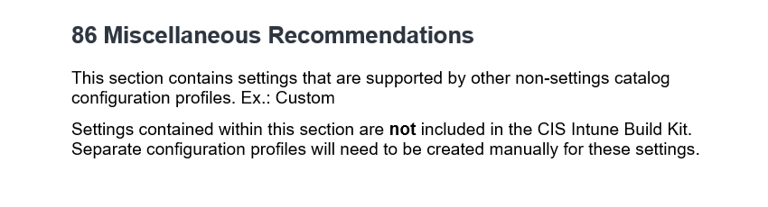

So we should create a new profile to capture the three CIS Level 1 settings detailed in the document with the below Settings Catalog settings.

 *CIS (L1) Level 1 Misc - Windows 11 Intune 3.0.1*

| Category | Setting | Value |
| :- | :- | :- |
| Experience | Allow Windows Consumer Features | `Block` |
| Microsoft App Store | Block Non Admin User Install | `Allow` |
| Wi-Fi Settings | Allow Auto Connect To Wi Fi Sense Hotspots | `Block` |


You can now import the [CIS (L1) Level 1 Misc - Windows 11 Intune 3.0.1](https://github.com/ennnbeee/oddsandendpoints-scripts/tree/main/Intune/Configuration/CIS/Windows/L1) into your Microsoft Intune tenant instead of having to use a Custom profile.


For reference, the below are the legacy custom profiles settings.

| Name | OMA-URI | Data Type | Value |
| :- | :- | :- | :- |
| [BlockNonAdminUserInstall](https://learn.microsoft.com/en-us/windows/client-management/mdm/policy-csp-applicationmanagement#blocknonadminuserinstall) | `./Device/Vendor/MSFT/Policy/Config/ApplicationManagement/BlockNonAdminUserInstall` | Integer | `1` |
| [AllowWindowsConsumerFeatures](https://learn.microsoft.com/en-us/windows/client-management/mdm/policy-csp-experience#allowwindowsconsumerfeatures) | `./Device/Vendor/MSFT/Policy/Config/Experience/AllowWindowsConsumerFeatures` | Integer | `0` |
| [AllowAutoConnectToWiFiSenseHotspots](https://learn.microsoft.com/en-us/windows/client-management/mdm/policy-csp-wifi#allowautoconnecttowifisensehotspots) | `./Device/Vendor/MSFT/Policy/Config/Wifi/AllowAutoConnectToWiFiSenseHotspots` | Integer | `0` |

Anyone spot a problem? I'll give you a minute.

Now we can't blame CIS for the issues their recommended settings cause, as this one fully goes to Microsoft. Devices getting the setting **BlockNonAdminUserInstall** set to enabled, causes [issues with the Photos app](https://www.theregister.com/2024/06/19/problems_upgrading_win_11_pro/) on the device for devices running the [April 2024 patch](https://support.microsoft.com/en-gb/topic/april-9-2024-kb5036893-os-builds-22621-3447-and-22631-3447-a674a67b-85f5-4a40-8d74-5f8af8ead5bb).

 *CIS (L1) Level 1 Misc - Windows 11 Intune 3.0.1*

| Name | OMA-URI | Data Type | Value |
| :- | :- | :- | :- |
| [BlockNonAdminUserInstall](https://learn.microsoft.com/en-us/windows/client-management/mdm/policy-csp-applicationmanagement#blocknonadminuserinstall) | `./Device/Vendor/MSFT/Policy/Config/ApplicationManagement/BlockNonAdminUserInstall` | Integer | `1` |

We also can't blame CIS for both **AllowWindowsConsumerFeatures** and **BlockNonAdminUserInstall** failing to apply to devices either, as due to the [June 2024 patch](https://support.microsoft.com/en-gb/topic/june-11-2024-kb5039212-os-builds-22621-3737-and-22631-3737-d7f574c0-2b13-48ca-a9fc-a63093b1a2c2) devices which *should* be activated to **Windows 11 Enterprise** as part of subscription activation, don't, leaving devices at their original Windows edition, in this case Windows Pro.

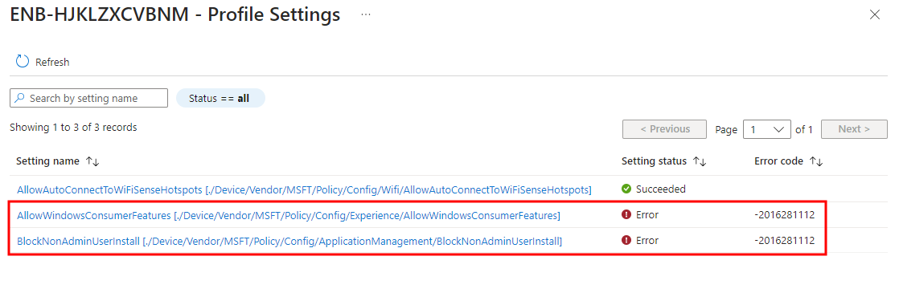

Meaning that neither [AllowWindowsConsumerFeatures](https://learn.microsoft.com/en-us/windows/client-management/mdm/policy-csp-experience#allowwindowsconsumerfeatures) and [BlockNonAdminUserInstall](https://learn.microsoft.com/en-us/windows/client-management/mdm/policy-csp-applicationmanagement#blocknonadminuserinstall) will apply to non-Enterprise editions of Windows:

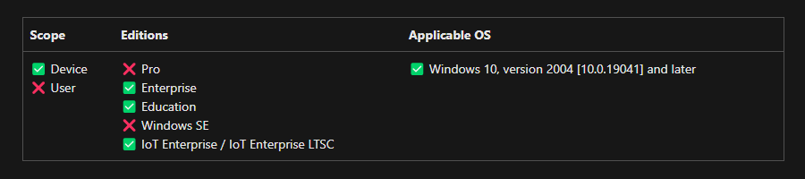

Are there any other settings in the benchmark require specific Windows editions?

### Windows Edition Requirements

The Windows subscription activation issues, and subsequent edition downgrade, highlighted something I hadn't considered, just how many settings in the CIS 3.0.1 benchmark for Level 1 actually require an Enterprise or Education editions of Windows, or at least just don't work on Pro editions?

Well I'm not going to count them for you (I actually did, it's seven).

| Setting | Profile |
| :- | :- |
| [AllowWindowsConsumerFeatures](https://learn.microsoft.com/en-us/windows/client-management/mdm/policy-csp-experience#allowwindowsconsumerfeatures) | CIS (L1) Level 1 Misc - Windows 11 Intune 3.0.1 |
| [BlockNonAdminUserInstall](https://learn.microsoft.com/en-us/windows/client-management/mdm/policy-csp-applicationmanagement#blocknonadminuserinstall) | CIS (L1) Level 1 Misc - Windows 11 Intune 3.0.1 |
| [Allow Spotlight Collection (User)](https://learn.microsoft.com/en-us/windows/client-management/mdm/policy-csp-experience#allowspotlightcollection) | CIS (L1) Section 22 - 80 (User) - Windows 11 Intune 3.0.1 |
| [Disable Consumer Account State Content](https://learn.microsoft.com/en-us/windows/client-management/mdm/policy-csp-experience#disableconsumeraccountstatecontent) | CIS (L1) Section 22 - 80 - Windows 11 Intune 3.0.1 |
| [Require Private Store Only](https://learn.microsoft.com/en-us/windows/client-management/mdm/policy-csp-applicationmanagement#requireprivatestoreonly) | CIS (L1) Section 22 - 80 - Windows 11 Intune 3.0.1 |
| [Credential Guard](https://learn.microsoft.com/en-us/windows/client-management/mdm/policy-csp-deviceguard#lsacfgflags) | CIS (L1) Virtualization Based Technology - Windows 11 Intune 3.0.1 |
| [Require Platform Security Features](https://learn.microsoft.com/en-us/windows/client-management/mdm/policy-csp-deviceguard#requireplatformsecurityfeatures) | CIS (L1) Virtualization Based Technology - Windows 11 Intune 3.0.1 |

If you've only got devices running Windows Professional, you can say goodbye to blocking the Windows Consumer Features, or by requiring the Windows Private Store, blocking access to the store itself, or worse, device security settings in **Credential Guard** and **Secure Boot** not applying.

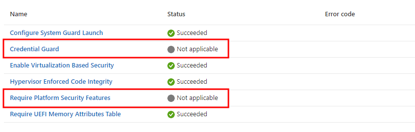

So this leaves a bit of a gap in the Level 1 benchmark for these Windows Professional cloud native devices, or does it?

Well no, we just can't use Microsoft Intune native settings to configure them. What we can do is use our favourite tooling ~~Group Policy~~, PowerShell, to go and set some corresponding registry settings to ensure we're in-line with the benchmark.

We can create a PowerShell script to create the six, (yes I said six), registry settings. These exist in the [HKLM](https://learn.microsoft.com/en-us/windows-hardware/drivers/install/hklm-system-currentcontrolset-services-registry-tree) registry hive, so we can happily update them using a PowerShell and a Platform Script in Microsoft Intune.

 *CIS (L1) Windows Pro Settings - Windows 11 Intune 3.0.1.ps1*



Sadly, the **Allow Spotlight Collection** setting, only exists in the [HKCU](https://admx.help/?Category=Windows_11_2022&Policy=Microsoft.Policies.CloudContent::DisableSpotlightCollectionOnDesktop) part of the registry, and sits under the **HKCU:\Software\Policies** key which standard users don't have access to write to. So we don't have a way to create this new item using PowerShell and Platform Scripts natively.


Jonathan has informed me that you could apply the **Allow Spotlight Collection** setting in **HKCU** using the [PSAppDeployToolkit](https://psappdeploytoolkit.com/), specifically the [Invoke-HKCURegistrySettingsForAllUsers](https://psappdeploytoolkit.com/docs/reference/functions/Invoke-HKCURegistrySettingsForAllUsers/) functionality, so off you trot and do that.


The rest of registry entries in **CIS (L1) Windows Pro Settings - Windows 11 Intune 3.0.1.ps1** are fine, so deploy them to your devices using a Platform Script:

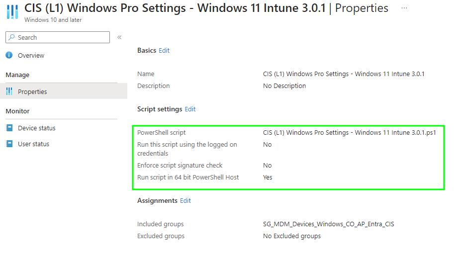

Using Platform Scripts, we're currently limited to assignments without [Device Filters](https://learn.microsoft.com/en-us/mem/intune/fundamentals/filters), so we don't have a way to target just Windows devices that aren't on Windows 11 Enterprise/Education (operating system edition isn't an attribute stored in the Entra ID computer object, so no Dynamic Groups either).

Seeing the script do it's thing, we now have the configured registry settings, (at least those in HKLM), set on the device, with the expected behaviour of the CIS benchmark:

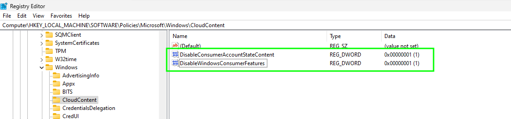

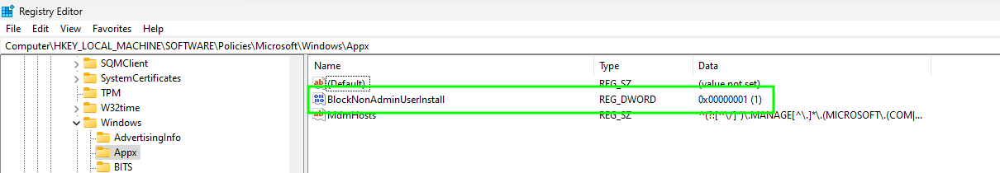

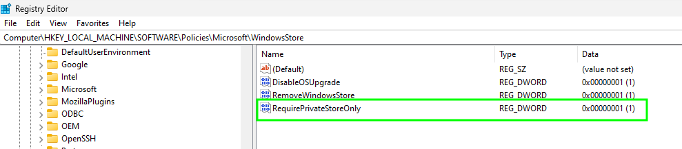

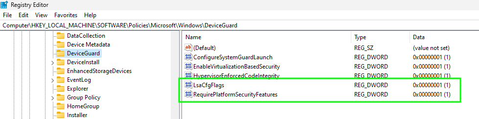


The [CIS (L1) Windows Pro Settings - Windows 11 Intune 3.0.1.ps1](https://github.com/ennnbeee/oddsandendpoints-scripts/blob/main/Intune/PlatformScripts/PowerShell/CIS/L1/) PowerShell scripts should be added as Platform scripts in Microsoft Intune.


### User Settings

Any other assignment issues you want to throw our way and not document CIS? No? Are you sure?

Having reviewed the device assignment states after by default assigning the imported build kit settings to groups of devices in Microsoft Intune, I was left pondering as to why CIS wouldn't mention that there are User only settings in each of the profiles.

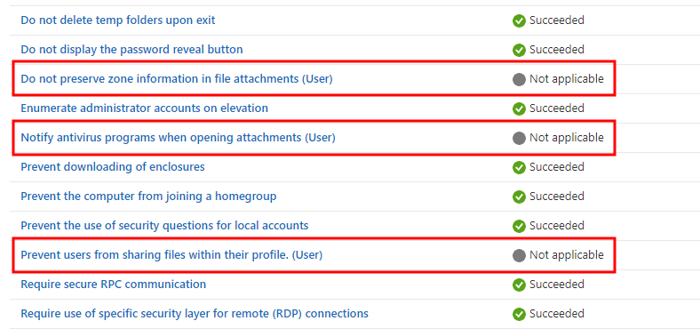

This isn't such a bad thing, as you're just going to get a **Not Applicable** state when assigned to the SYSTEM context of the device, the user on the device will be fine though.

However, for good practice assignment, we should split out the user settings from the profiles, and create new ones, allowing a consistent assignment of settings.

 *CIS (L1) Admin Templates - Windows Components (User) - Windows 11 Intune 3.0.1*

| Category | Setting | Value |
| :- | :- | :- |
| Administrative Templates > Windows Components > Network Sharing | Prevent users from sharing files within their profile. (User) | `Enabled` |
| Administrative Templates > Windows Components > Attachment Manager | Do not preserve zone information in file attachments (User) | `Disabled` |
| Administrative Templates > Windows Components > Attachment Manager | Notify antivirus programs when opening attachments (User) | `Enabled` |

 *CIS (L1) Section 22 - 80 (User) - Windows 11 Intune 3.0.1*

| Category | Setting | Value |
| :- | :- | :- |
| Experience | Allow Spotlight Collection (User) | `0` |
| Microsoft App Store | MSI Always Install With Elevated Privileges (User) | `Disabled` |
| Administrative Templates > Windows Components > Attachment Manager | Notify antivirus programs when opening attachments (User) | `Enabled` |

 *CIS (L1) Section 1 - 3.9.1.1 (User) - Windows 11 Intune 3.0.1*

| Category | Setting | Value |
| :- | :- | :- |
| Administrative Templates > Start Menu and Taskbar > Notifications | Turn off toast notifications on the lock screen (User) | `Enabled` |
| Administrative Templates > Control Panel > Personalization | Enable screen saver (User) | `Enabled` |


The amended profiles and the new user based profiles, [CIS (L1) Admin Templates - Windows Components (User) - Windows 11 Intune 3.0.1](https://github.com/ennnbeee/oddsandendpoints-scripts/tree/main/Intune/Configuration/CIS/Windows/L1), [CIS (L1) Section 22 - 80 (User) - Windows 11 Intune 3.0.1](https://github.com/ennnbeee/oddsandendpoints-scripts/tree/main/Intune/Configuration/CIS/Windows/L1) and [CIS (L1) Section 1 - 3.9.1.1 (User) - Windows 11 Intune 3.0.1](https://github.com/ennnbeee/oddsandendpoints-scripts/tree/main/Intune/Configuration/CIS/Windows/L1) are available for you to import, don't say I'm not kind to you all.


## CIS Level 1 Settings

Now hopefully we're done with settings in the Level 1 benchmark that just don't work properly, we can look at settings that are missing, or settings that are just going to annoy your end-users or support teams 🫠.

### Local Administrator Password Solution

On to recommendations that exist in the Benchmark [document](https://www.cisecurity.org/benchmark/intune) but not in the build kit, we can start with [Windows LAPS](https://learn.microsoft.com/en-us/windows-server/identity/laps/laps-overview).

The Windows LAPS settings don't exist in the build kit as it's configured under [Account Protection](https://learn.microsoft.com/en-us/mem/intune/protect/endpoint-security-account-protection-policy) in the [Endpoint Security](https://learn.microsoft.com/en-us/mem/intune/protect/endpoint-security-policy) section of Microsoft Intune, so I assume CIS just didn't include it as there is no native import functionality.

Taking the information provided in the benchmark document, we need to cover off everything under section **85 Windows LAPS**, as they're all CIS Level 1 settings.

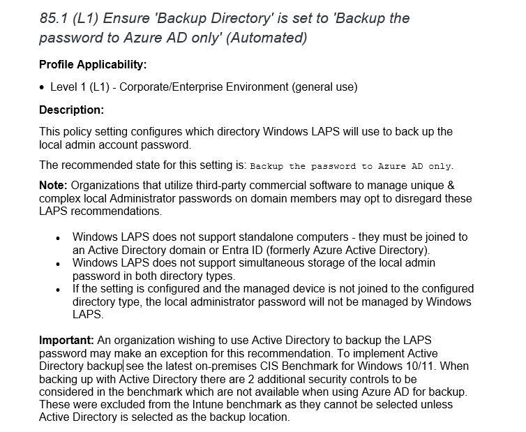

We can easily create a new **Account Protection** policy in Microsoft Intune to meet these requirements, with the settings below:

 *CIS (L1) Windows LAPS - Windows 11 Intune 3.0.1*

| Category | Setting | Value |
| :- | :- | :- |
| LAPS | Backup Directory | `Backup the password to Azure AD only` |
| LAPS | Password Age Days | `30 or fewer`__*__ |
| LAPS | Administrator Account Name | `Admin` |
| LAPS | Password Complexity | `Large letters + small letters + numbers + special characters (improved readability)` |
| LAPS | Password Length | `15 or more`__*__ |
| LAPS | Post Authentication Actions | `Reset the password and logoff the managed account (or higher)`__*__ |
| LAPS | Post Authentication Reset Delay | `8 (or fewer hours, but not 0)`__*__ |

**These are the minimum settings to adhere to the CIS benchmark, so amend as you see fit.*


Don't forget if you are going to use Windows LAPS, that you [enable](https://learn.microsoft.com/en-us/entra/identity/devices/howto-manage-local-admin-passwords#enabling-windows-laps-with-microsoft-entra-id) the feature in Entra ID, and review the [requirements](https://learn.microsoft.com/en-us/windows-server/identity/laps/laps-overview) to allow you to actually use it on your Windows 11 devices.


The **CIS (L1) Local Policies Security Options - Windows 11 Intune 3.0.1** CIS policy sets the built-in administrator account name to **Admin**, so make sure either you update the setting below in the imported policy to match any changes to the LAPS setting, or be happy with what it's called:

 *CIS (L1) Local Policies Security Options - Windows 11 Intune 3.0.1*

| Category | Setting | Value |
| :- | :- | :- |
| Local Policies Security Options | Accounts Rename Administrator Account | `Admin` |


We can't export a Endpoint Security profile, even if they're technically Settings Catalog profiles, so we're using the [Intune Management](https://github.com/Micke-K/IntuneManagement) tool, allowing you to import the [CIS (L1) Windows LAPS - Windows 11 Intune 3.0.1](https://github.com/ennnbeee/oddsandendpoints-scripts/tree/main/Intune/Configuration/CIS/Windows/L1) profile instead of having to create it.


### Windows Updates and Delivery Optimisation

Is it all good in the world of Windows Update for Business settings in the CIS benchmark? Well kind of, if you want all of your devices to install updates every day, with no phasing, and just blindly update to the latest Feature Update after 180 days.

 *CIS (L1) Windows Update - Windows 11 Intune 3.0.1*

| Category | Setting | Value |
| :- | :- | :- |
| Windows Update For Business | Defer Feature Updates Period In Days | `180` |
| Windows Update For Business | Defer Quality Updates Period (Days) | `0` |
| Windows Update For Business | Scheduled Install Day | `Every day` |

It's not like there's even much room for manoeuvre; the Feature Update deferral is a *minimum* of 180 days, so you could phase the delivery of Feature Updates at least, but the Quality Update deferral can only be zero days, so out goes the window for any kind of .

Maybe CIS has more faith in Windows Updates not breaking devices than others 🫢.

At least there's a setting in the build kit for [Delivery Optimisation](https://learn.microsoft.com/en-us/mem/intune/configuration/delivery-optimization-windows), so all our devices installing Quality and Feature updates at the same time don't smash the WAN connection to bits...

 *CIS (L1) Section 22 - 80 - Windows 11 Intune 3.0.1*

| Category | Setting | Value |
| :- | :- | :- |
| Delivery Optimization | DO Download Mode | `HTTP only, no peering` |

Oh.

It's OK, we can have any of the settings available to us in Microsoft Intune, just not **HTTP blended with Internet peering.**

 Ensure 'DO Download Mode' is NOT set to 'HTTP blended with Internet Peering'.")

Just goes to show that you do really need to read the associated CIS Benchmark document along with using the build kit, or just take the word of someone on the internet that things work 😬.

### Microsoft Store

As mentioned previously, having a Microsoft Intune setting to **Require Private Store Only** is only a Windows Enterprise edition feature, however we sorted that with the PowerShell script, so now that the setting is applying to all devices correctly, it blocks the store.

 *CIS (L1) Section 22 - 80 - Windows 11 Intune 3.0.1*

| Category | Setting | Value |
| :- | :- | :- |
| Microsoft App Store | Require Private Store Only | `Only Private store is enabled.` |

As there isn't such as thing as a Private Store now the the [Microsoft Store for Business](https://learn.microsoft.com/en-us/microsoft-store/) has been retired (has it?), then the outcome of the setting above just blocks access to the store.

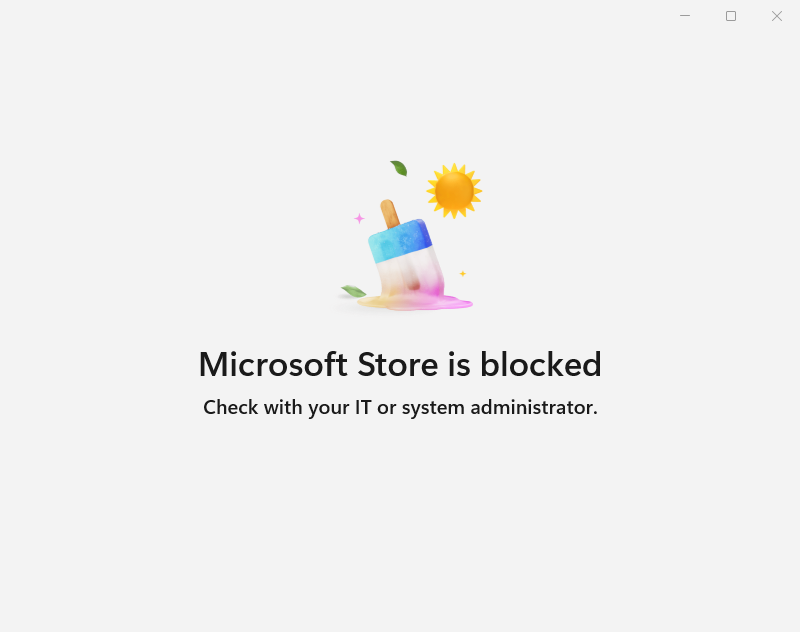

In the same profile though at least the store apps are being kept up to date:

 *CIS (L1) Section 22 - 80 - Windows 11 Intune 3.0.1*

| Category | Setting | Value |
| :- | :- | :- |
| Microsoft App Store | Allow apps from the Microsoft app store to auto update | `Allowed.` |

But with no way easy way to check that apps are actually being updated, you'd better look at another option to ensure the built-in apps are  😉.

### Windows Defender

You'd think there'd be nothing majorly wrong with the [Windows Defender](https://www.microsoft.com/en-gb/windows/comprehensive-security) settings in the build kit, or the benchmark document itself, and on first glance all looks well apart from the lack of any kind [remediations](https://learn.microsoft.com/en-us/mem/intune/protect/antivirus-microsoft-defender-settings-windows#remediation) to quarantine or delete detected threats.

You might not be using Windows Defender as your primary antivirus solution, so CIS not assuming you are is a good thing.

But based on this, CIS wouldn't include anything in the imported profiles that *does* require Windows Defender to be acting a as primary solution and/or in active mode though?

 *CIS (L1) Defender - Windows 11 Intune 3.0.1*

| Category | Setting | Value |
| :- | :- | :- |
| Defender | Block executable content from email client and webmail | `Block` |
| Defender | Block Office applications from injecting code into other processes | `Block` |
| Defender | Block Office applications from creating executable content | `Block` |
| Defender | Block abuse of exploited vulnerable signed drivers (Device) | `Block` |
| Defender | Block persistence through WMI event subscription | `Block` |
| Defender | Block untrusted and unsigned processes that run from USB | `Block` |
| Defender | Block JavaScript or VBScript from launching downloaded executable content | `Block` |
| Defender | Block credential stealing from the Windows local security authority subsystem | `Block` |
| Defender | Block Adobe Reader from creating child processes | `Block` |
| Defender | Block all Office applications from creating child processes | `Block` |
| Defender | Block Office communication application from creating child processes | `Block` |
| Defender | Block Win32 API calls from Office macros | `Block` |
| Defender | Block execution of potentially obfuscated scripts | `Block` |

Ah, **13** [Attack Surface Reduction Rules](https://learn.microsoft.com/en-us/defender-endpoint/attack-surface-reduction-rules-deployment), and all in **block** mode , not an [audit](https://learn.microsoft.com/en-gb/defender-endpoint/attack-surface-reduction?WT.mc_id=Portal-fx#audit-mode-for-evaluation) setting in sight. Brilliant.

So even if you do meet the [dependencies](https://learn.microsoft.com/en-us/defender-endpoint/attack-surface-reduction-rules-deployment#attack-surface-reduction-rules-dependencies) below for the ASR rules to actually apply, they're all going to straight up block everything they find that matches the rules.

> Microsoft Defender Antivirus must be enabled and configured as primary anti-virus solution, and must be in the following mode:
> - Primary antivirus/antimalware solution
> - State: Active mode

Which is another good reason to actually check to see what these build kit profiles are configuring, without blindly applying them to you device estate and being all surprised when stuff stops working.

### Windows System Services

CIS provide a PowerShell script as part of the Level 1 benchmark to disable some ~~scary looking~~ Windows System Services, specifically the below (even if the Xbox ones are already disabled by **CIS (L1) System Services - Windows 11 Intune 3.0.1**).

The table below details the apparent effect of disabling these services.

| Service Name | Service Description | Impact |
| :- | :- | :- |
| `Browser` | Computer Browser | No more discovery of network devices. |
| `IISADMIN` | IIS Admin Service | No SMTP or FTP configuration in IIS. |
| `irmon` | Infrared monitor service | No transfer of data using Infrared. |
| `SharedAccess` | Internet Connection Sharing | No sharing of network connections, bye bye Hyper-V bridging. |
| `LxssManager` | LxssManager | Bye bye Windows Subsystem for Linux. |
| `FTPSVC` | Microsoft FTP Service | Clearly no more FTP servers. |
| `sshd` | OpenSSH SSH Server | Same as above but SSH servers. |
| `RpcLocator` | Remote Procedure Call (RPC) Locator | Nowt, legacy service. |
| `RemoteAccess` | Routing and Remote Access | As on the tin, used for RRAS servers. |
| `simptcp` | Simple TCP/IP LocalServices$LocalServices | Apparently has little use in modern environments, and is an optional Windows feature. |
| `sacsvr` | Special Administration Console Helper | Remote command prompt used as part of Windows Emergency Management Services and Serial Console. |
| `SSDPSRV` | SSDP Discovery | UPnP device discovery is now dead. |
| `upnphost` | UPnP Device Host | UPnP device discovery is still dead. |
| `WMSvc` | Web Management Service | No more management of local web servers. |
| `WMPNetworkSvc` | Windows Media Player Network Sharing Service | No media sharing from Windows Media Player. |
| `icssvc` | Windows Mobile Hotspot Service | No creation of Mobile hotspots. |
| `W3SVC` | World Wide Web Publishing Service | No more local web servers. |
| `XboxGipSvc` | Xbox Accessory Management Service | No playing games. |
| `XblAuthManager` | Xbox Live Auth Manager | No logging into games. |
| `XblGameSave` | Xbox Live Game Save | No saving games. |
| `XboxNetApiSvc` | Xbox Live Networking Service | No games. |

So happy with all the functionality that is being prevented, we can deploy the provided script using Microsoft Intune Platform Scripts with deployment settings looking something like this:

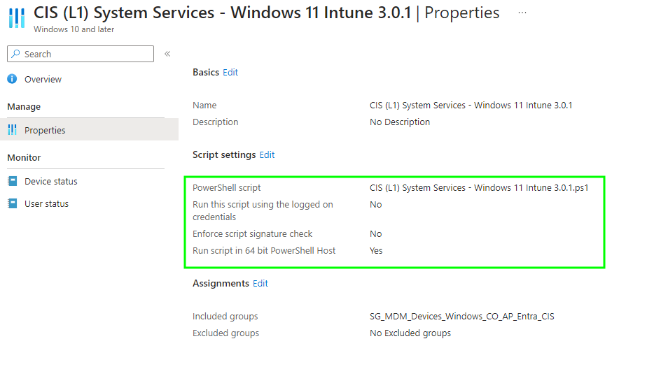


The PowerShell Script [CIS (L1) System Services - Windows 11 Intune 3.0.1](https://github.com/ennnbeee/oddsandendpoints-scripts/tree/main/Intune/PlatformScripts/PowerShell/CIS/L1) is available to download and add as a new Platform Script to Microsoft Intune.


Now this is all well and good for disabling the services, *once*, but what happens if someone manages to enable them after the script has run, now what?

Well [Remediations](https://learn.microsoft.com/en-us/mem/intune/fundamentals/remediations) that's what.

A quick modification to the existing script, to use some logic round how many of the services are not currently disabled, passing this back to Microsoft Intune as part of a detection script:

 *CIS (L1) System Services - Windows 11 Intune 3.0.1_Detection.ps1*



Then a simple remediation script to loop through each service and disable it:

 *CIS (L1) System Services - Windows 11 Intune 3.0.1_Remediation.ps1*



Deployed using Microsoft Intune to your devices:

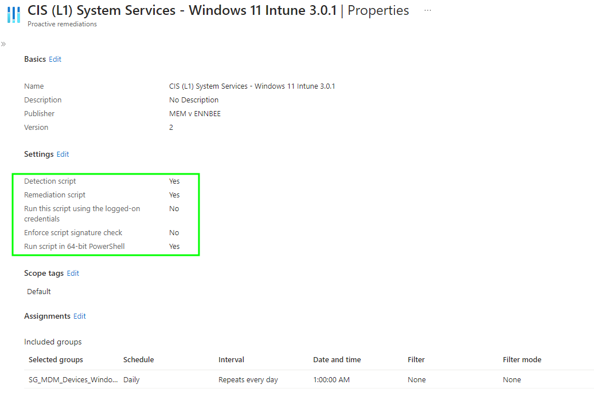

Ensuring you set a suitable schedule for the remediation to run, daily is probably overkill, just make sure it's running before any kind of CIS audit 😂.


The [CIS (L1) System Services - Windows 11 Intune 3.0.1](https://github.com/ennnbeee/oddsandendpoints-scripts/tree/main/Intune/Remediation/CIS/L1) detection and remediation scripts are available for your to add into your Microsoft Intune tenant.


## Summary

What I've learnt looking over the CIS Level 1 settings, is that there are some pretty large gaps in the build kit; settings that just don't exist such as with Windows LAPS, settings that only apply to users and not devices, settings that only apply to specific editions of Windows, minimum settings that will cause unexpected behaviour, and some normal good practice settings for security solutions such as Windows Defender that are just plain missing.

This does mean though, that applying a CIS benchmark is only *part* of the story when it comes to securing your Windows 11 cloud native devices, and it's worth looking into other [Security Baselines](https://learn.microsoft.com/en-us/mem/intune/protect/security-baselines) (cough Microsoft cough) to help harden not only the operating system, but applications that reside on top.

Next up is the final part in the series, the dreaded CIS Level 2 settings, surely it can't get any worse?

