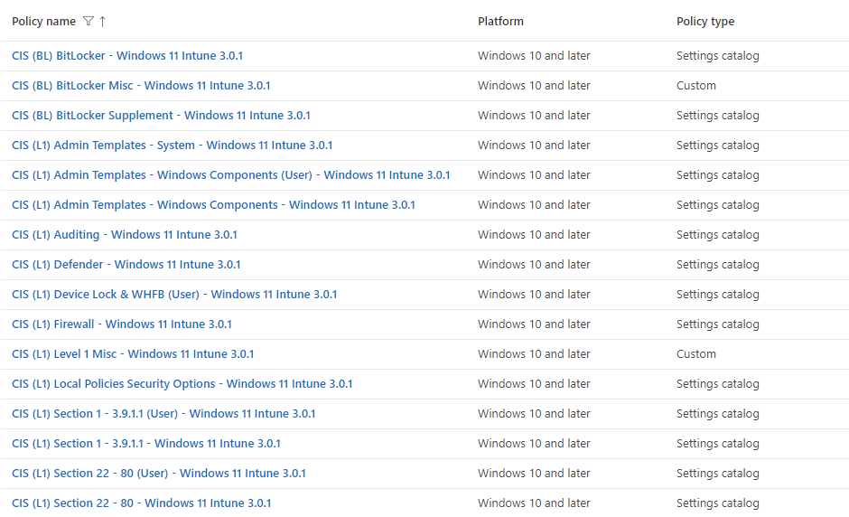
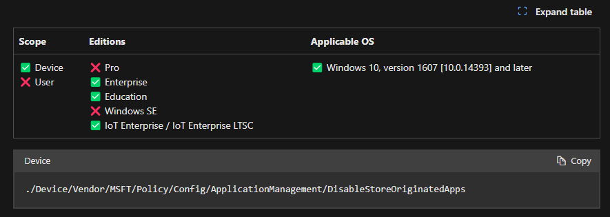
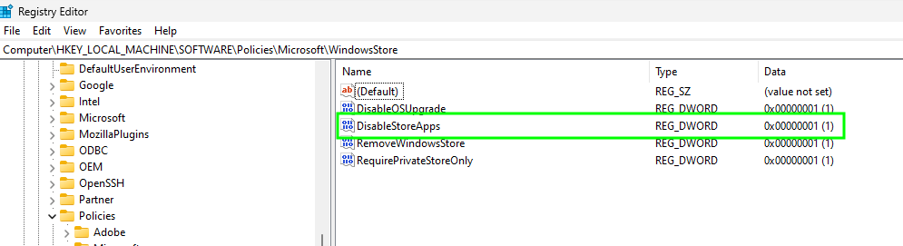
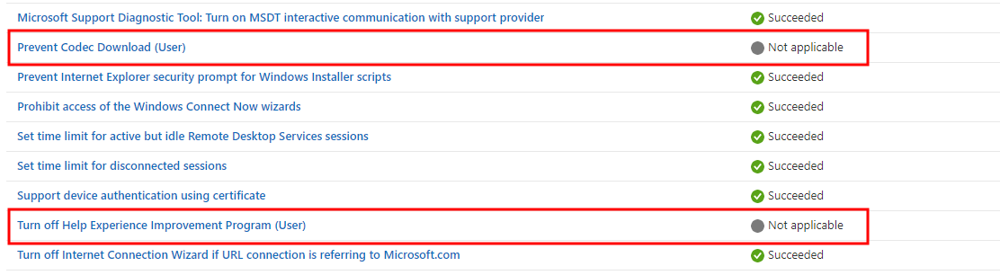
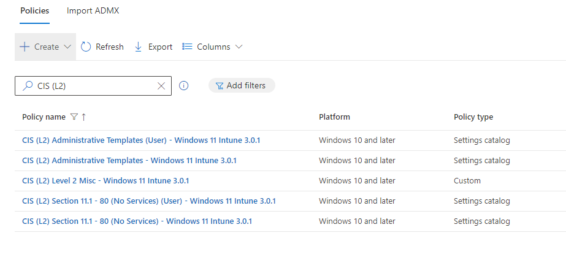
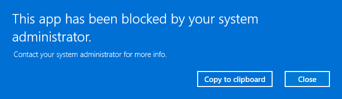
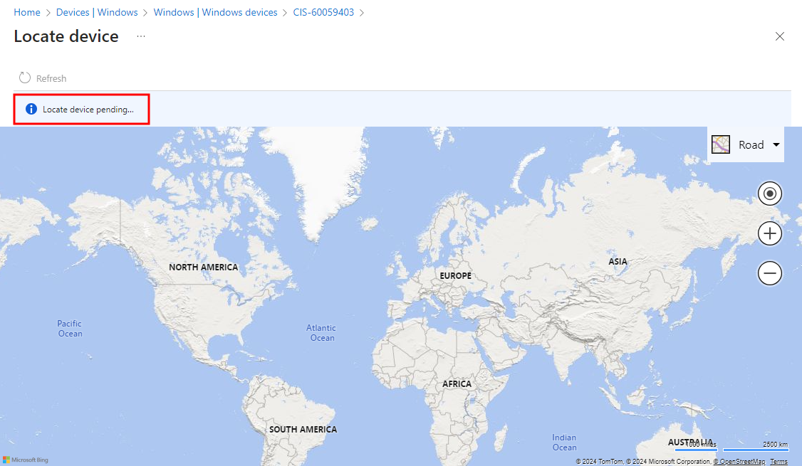
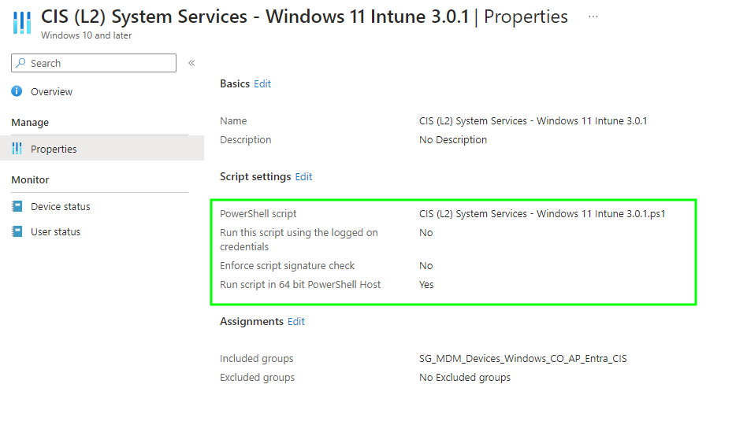
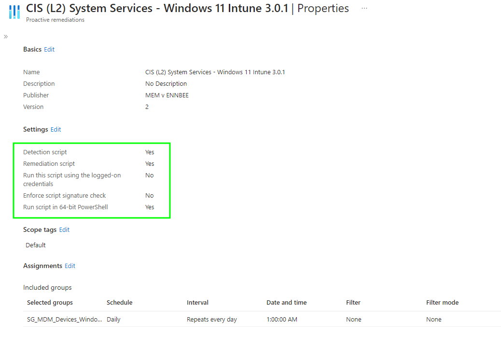

# Patching Gaps in the CIS Windows 11 Benchmark - Level 2 Windows 11

This is the final part in this series, covering the ~~final boss~~ CIS Level 2 settings; I've brought back [Jonathan](https://www.youtube.com/watch?v=WDpipB4yehk) to share the pain again.

After the weeks reviewing and working on the benchmark, we can both happily say that we're very glad to not have to look at CIS benchmarks for a while...until they release a new one for you know iOS 18 or something (foreshadowing).

The settings in the CIS Level 2 benchmark are for the hardcore security fans out there, high security environments, or for when you just plain hate your end-users and just want to stop them from using their Windows 11 devices in normal ways.

Let's start on a positive note though, and look into some of the settings in the CIS build kit that just weren't put together with logical though processes.


As Custom Profile settings are on their way out (see Message Centre MC822716 and this [post](https://ourcloudnetwork.com/microsoft-to-start-blocking-custom-oma-uri-settings-in-intune/) by [Daniel Bradley](https://www.linkedin.com/in/danielbradley2/)) this post has been updated, along with the exported profiles, to use Settings Catalog profiles.


## CIS Level 2 Issues

Remember that the CIS Level 2 settings on their own aren't particularly useful without their BitLocker and Level 1 counterparts, issues or otherwise 😄.

So make sure you have a good understanding of the impact of these levels by looking at all posts in this series.

For now though, let's continue into CIS Level 2 build kit profiles and work out where the issues sit.

### Windows Enterprise Edition

Before we even look at the problems enabling the **DisableStoreOriginatedApps** setting will cause, it's worth mentioning that this setting is a [Windows Enterprise/Education edition](https://learn.microsoft.com/en-us/windows/client-management/mdm/policy-csp-applicationmanagement#disablestoreoriginatedapps) *only* configuration:

So exactly like the , a quick PowerShell script *would* allow us to configure the [registry equivalent](https://admx.help/?Category=Windows_10_2016&Policy=Microsoft.Policies.WindowsStore::DisableStoreApps) setting.

Sadly though, this is a true Windows Enterprise/Education setting and will do absolutely nothing on any other Windows edition, so there's no point in building a PowerShell script to apply the registry setting to our Windows Professional or otherwise devices.

### User Settings

We've seen this  so for the sake of completeness we should also break out the user specific settings into their own profiles, and assign these to **users** and not devices.

 *CIS (L2) Administrative Templates (User) - Windows 11 Intune 3.0.1*

| Category | Setting | Value |
| :- | :- | :- |
| Administrative Templates > Windows Components > Windows Media Player > Playback | Prevent Codec Download (User) | `Enabled` |
| Administrative Templates > System > Internet Communication Management > Internet Communication settings | Turn off Help Experience Improvement Program (User) | `Enabled` |

More user only settings.

 *CIS (L2) Section 11.1 - 80 (No Services) (User) - Windows 11 Intune 3.0.1*

| Category | Setting | Value |
| :- | :- | :- |
| Experience | Allow Windows Spotlight (User) | `Block` |


The amended profiles and the new user based profiles, [CIS (L2) Administrative Templates (User) - Windows 11 Intune 3.0.1](https://github.com/ennnbeee/oddsandendpoints-scripts/tree/main/Intune/Configuration/CIS/Windows/L2) and [CIS (L2) Section 11.1 - 80 (No Services) (User) - Windows 11 Intune 3.0.1](https://github.com/ennnbeee/oddsandendpoints-scripts/tree/main/Intune/Configuration/CIS/Windows/L2) are available for you to import into Microsoft Intune.


### Miscellaneous Settings

As with CIS Level 1, there ~~are~~ were some settings they couldn't shoehorn into a Settings Catalog policy, ~~leaving us to create a new Custom Profile picking up the pieces~~ allowing us now to create a Settings Catalog policies with the previously miscellaneous Custom profiles settings.

 *CIS (L2) Level 2 Misc - Windows 11 Intune 3.0.1*

| Category | Setting | Value |
| :- | :- | :- |
| Microsoft App Store | Allow Shared User App Data | `Block` |
| Notifications | Disallow Cloud Notification | `Allow` |
| System | Allow Location | `Force Location Off.` |
| System | Disable Enterprise Auth Proxy | `Enable` |


You can now import the [CIS (L2) Level 2 Misc - Windows 11 Intune 3.0.1](https://github.com/ennnbeee/oddsandendpoints-scripts/tree/main/Intune/Configuration/CIS/Windows/L2) into your Microsoft Intune tenant instead of having to use a Custom profile.


For reference the custom profiles contained the below settings:

| Name | OMA-URI | Data Type | Value |
| :- | :- | :- | :- |
| [AllowSharedUserAppData](https://learn.microsoft.com/en-us/windows/client-management/mdm/policy-csp-applicationmanagement#allowshareduserappdata) | `./Device/Vendor/MSFT/Policy/Config/ApplicationManagement/AllowSharedUserAppData` | Integer | `0` |
| [DisableEnterpriseAuthProxy](https://learn.microsoft.com/en-us/windows/client-management/mdm/policy-csp-system#disableenterpriseauthproxy) | `./Device/Vendor/MSFT/Policy/Config/System/DisableEnterpriseAuthProxy` | Integer | `1` |
| [AllowLocation](https://learn.microsoft.com/en-us/windows/client-management/mdm/policy-csp-system#allowlocation) | `./Device/Vendor/MSFT/Policy/Config/System/AllowLocation` | Integer | `0` |
| [DisallowCloudNotification](https://learn.microsoft.com/en-us/windows/client-management/mdm/policy-csp-notifications#disallowcloudnotification) | `./Device/Vendor/MSFT/Policy/Config/Notifications/DisallowCloudNotification` | Integer | `1` |

We'll deal with the impact of these settings later on, for now just be happy we can create them in Microsoft Intune.

## CIS Level 2 Settings

Now we've covered the missing or at least misconfigured CIS Level 2 settings, let's dig into their impact on Windows 11 cloud native devices.

Starting in no particular order (we lied, it's the worst one first).

### Blocking Store Apps

Well this one is a a bit of a kicker, we could deal with some end user experience changes as part of the CIS benchmark, what we can't deal with are Microsoft Store apps being disabled entirely.

 *CIS (L2) Section 11.1 - 80 (No Services) - Windows 11 Intune 3.0.1*

| Category | Setting | Value |
| :- | :- | :- |
| Microsoft App Store | Disable Store Originated Apps | `Enabled` |

This kind of takes the ~~piss~~ mick really, it's not just the built-in apps such as Paint, Calculator and the like, but any [UWP](https://learn.microsoft.com/en-us/windows/uwp/get-started/universal-application-platform-guide) app that has come from the store originally, including the Company Portal, and any UWP based Microsoft Store app (new) apps you've deployed from Microsoft Intune like Mozilla Firefox.



Microsoft Intune deployed Store Win32 Apps, such as Adobe Reader, are safe though, which does align with the CIS benchmark documents reasoning:

> The Store service is a retail outlet built into Windows, primarily for consumer use. In an enterprise managed environment, the IT department should be managing the installation of all applications to reduce the risk of the installation of vulnerable software.

Did someone not tell CIS that we *are* managing the installation of apps, they just happen to be store apps now?


UWP Store (new) Apps from Microsoft Intune will still get installed on your devices, they just won't actually run 😬.


### Blocking App Updates

It's not enough that the Store originated apps are gone, but also the ability to allow them to update.

> Disable turns off the launch of all apps from the Microsoft Store that came pre-installed or were downloaded. Apps will not be updated. Your Store will also be disabled.

So that leave's us with outdated unpatched applications, which doesn't make any sense from a security stand point.

Even if you can't actually use the applications, you're stopping them from being updated? Surely this is a bad move CIS?

Either way, you can force them to update using a [Remediation](https://learn.microsoft.com/en-us/mem/intune/fundamentals/remediations) script, as has been covered before:



### OneDrive Settings

Let's say goodbye to OneDrive whilst we're at it; the CIS Level 2 settings actively stop OneDrive from being available across all of Windows 11.

 *CIS (L2) Section 11.1 - 80 (No Services) - Windows 11 Intune 3.0.1*

| Category | Setting | Value |
| :- | :- | :- |
| System | Disable One Drive File Sync | `Sync disabled.` |

This doesn't just block the ability synchronise files locally from OneDrive or SharePoint Online, but removes OneDrive from File Explorer, and any integration into applications as well.

> Enabling this setting prevents users from accidentally (or intentionally) uploading confidential or sensitive corporate information to the OneDrive cloud service using the Next Generation Sync Client.

Where on earth are users meant to upload corporate information if not to OneDrive ffs 🧐.

No working around this one, leaving your end-users only able to access files in OneDrive from the web, and pretty much breaking any option to utilise [known folder move](https://learn.microsoft.com/en-us/sharepoint/redirect-known-folders) across Windows devices.

### Cloud Search

More feature breaking settings inbound, with the below settings stopping users having the ability to search either OneDrive or SharePoint Online content from within the Windows 11 search bar.

 *CIS (L2) Section 11.1 - 80 (No Services) - Windows 11 Intune 3.0.1*

| Category | Setting | Value |
| :- | :- | :- |
| Search | Allow Cloud Search | `Not allowed.` |

Do CIS hate Microsoft integrations? Or do they love the Microsoft Edge homepage integration with OneDrive and SharePoint, and are just forcing uses to access this to find their recently worked on documents, or collaborations?

> Due to privacy concerns, data should never be sent to any third-party since this data could contain sensitive information.

Do they realise that these Windows 11 devices are already sharing quite a lot of information with Microsoft, what's a few extra documents going to hurt?

### Remote Desktop

It just keeps getting better. No remote desktop access, even for those users explicitly given permission to remote desktop.

 *CIS (L2) Administrative Templates - Windows 11 Intune 3.0.1*

| Category | Setting | Value |
| :- | :- | :- |
| Administrative Templates > Windows Components > Remote Desktop Services > Remote Desktop Session Host > Connections | Allow users to connect remotely by using Remote Desktop Services | `Disabled` |

Surely there must be a bit of wriggle room with this one based upon the rationale in the CIS Benchmark document?

> Any account with the `Allow log on through Remote Desktop Services` user right can log on to the remote console of the computer. If you do not restrict access to legitimate users who need to log on to the console of the computer, unauthorized users could download and execute malicious code to elevate their privileges.

It looks like you might be able to get away with not disabling this, *if* you're controlling the **Allow log on through Remote Desktop Services**, which we actually are, in the Level 1 profile **CIS (L1) User Rights Global - Windows 11 Intune 3.0.1**.

### Locating Devices

You might not have any interest in using the [locate device](https://learn.microsoft.com/en-us/mem/intune/remote-actions/device-locate) functionality within Microsoft Intune, to legitimately find lost or stolen Windows devices (and not to be nosey and abuse privileges), but some people do.

Those people should not try and align themselves to CIS Level 2, as one of the key requirements for locating a device, is allowing location services, which after we configured the miscellaneous settings earlier is now disabled.

 *CIS (L2) Level 2 Misc - Windows 11 Intune 3.0.1*

| Name | OMA-URI | Data Type | Value |
| :- | :- | :- | :- |
| [AllowLocation](https://learn.microsoft.com/en-us/windows/client-management/mdm/policy-csp-system#allowlocation) | `./Device/Vendor/MSFT/Policy/Config/System/AllowLocation` | Integer | `0` |

Turns out though, if you have a legitimate reason, you might be able to change this setting, and maybe some others...

> This setting affects the location feature (e.g. GPS or other location tracking). From a security perspective, it’s not a good idea to reveal your location to software in most cases, but there are legitimate uses, such as mapping software. However, they should not be used in high security environments.

...and allow location services to find ~~out if your dad really went to get milk~~ your lost and stolen devices.

### Organisational Messages

Whoever is using these in Microsoft Intune, please let us know 😂.

Either way to use [Organisational Messages](https://learn.microsoft.com/en-gb/mem/intune/remote-actions/organizational-messages-overview) there are a handful of [pre-requisites](https://learn.microsoft.com/en-gb/mem/intune/remote-actions/organizational-messages-prerequisites#windows-spotlight-policy), specifically **Windows Spotlight**, which we are now blocking.

 *CIS (L2) Section 11.1 - 80 (No Services) (User) - Windows 11 Intune 3.0.1*

| Category | Setting | Value |
| :- | :- | :- |
| Experience | Allow Windows Spotlight (User) | `Block` |

So another bit of Microsoft Intune functionality is gone.

Next.

### Windows System Services

We've seen something like this  before, this time it's another whole set of system services up for the chop, with the impact of disabling these services detailed below.

 *CIS (L2) System Services - Windows 11 Intune 3.0.1*

| Service Name | Service Description | Impact |
| :- | :- | :- |
| `BTAGService` | Bluetooth Audio Gateway Service | No more Bluetooth headsets or speakers. |
| `bthserv` | Bluetooth Support Service | No more Bluetooth devices. |
| `MapsBroker` | Downloaded Maps Manager | Makes no difference as Maps is blocked anyways |
| `lfsvc` | Geolocation Service | There goes Location services again. |
| `lltdsvc` | Link-Layer Topology Discovery Mapper | No network device discovery maps. |
| `MSiSCSI` | Microsoft iSCSI Initiator Service | No iSCSI attached devices. |
| `PNRPsvc` | Peer Name Resolution Protocol | No chatting to internet devices about their names. |
| `p2psvc` | Peer Networking Grouping | Definitely no chatting to internet devices about their names. |
| `p2pimsvc` | Peer Networking Identity Manager | Seriously no chatting to internet devices about their names. |
| `PNRPAutoReg` | PNRP Machine Name Publication Service | We get it, no chatting to internet devices about their names. |
| `Spooler` | Print Spooler | No printing, not even to PDF but you know [PrintNightmare](https://msrc.microsoft.com/update-guide/vulnerability/CVE-2021-34527) was a thing. |
| `wercplsupport` | Problem Reports and Solutions Control Panel Support | No reporting issues, shhhhhh your mouth. |
| `RasAuto` | Remote Access Auto Connection Manager | No Always On VPN device tunnel connections. |
| `SessionEnv` | Remote Desktop Configuration | Just no Remote Desktop access. |
| `TermService` | Remote Desktop LocalServices | Still no Remote Desktop access. |
| `UmRdpService` | Remote Desktop LocalServices UserMode Port Redirector | More no Remote Desktop Access. |
| `RemoteRegistry` | Remote Registry | No Remote Registry access. |
| `LanmanServer` | Server | No File or Print sharing. |
| `SNMP` | SNMP Service | No SNMP communication. |
| `WerSvc` | Windows Error Reporting Service | CIS hates errors. |
| `Wecsvc` | Windows Event Collector | Also events. Bet it hates Birthdays as well. |
| `WpnService` | Windows Push Notifications System Service | We can assume that Organisation Messages are dead, as the [network endpoints](https://learn.microsoft.com/en-us/mem/intune/fundamentals/intune-endpoints?tabs=north-america#windows-push-notification-services-wns-dependencies) are specifically called out. |
| `PushToInstall` | Windows PushToInstall Service | Does this kill the deployment of Store Apps from Microsoft Intune? It does not, phew. |
| `WinRM` | Windows Remote Management | No remote PowerShell sessions. |

If after understanding the entire impact of disabling these services, you still ~~want to~~ have to disable them, you can deploy the provided PowerShell script using Microsoft Intune with deployment settings:


The PowerShell Script [CIS (L2) System Services - Windows 11 Intune 3.0.1](https://github.com/ennnbeee/oddsandendpoints-scripts/tree/main/Intune/PlatformScripts/PowerShell/CIS/L2) is available to download and add as a new Platform Script to Microsoft Intune.


And following on from the previous improvement, you can deploy a [Remediation](https://learn.microsoft.com/en-us/mem/intune/fundamentals/remediations) detection script to devices in scope of CIS Level 2.

 *CIS (L2) System Services - Windows 11 Intune 3.0.1_Detection.ps1*



Along with a suitable remediation script, to ensure that the CIS Level 2 services are set to disabled, and all the nice functionality is gone.

 *CIS (L2) System Services - Windows 11 Intune 3.0.1_Remediation.ps1*



Deployed using Microsoft Intune to your devices:

Set a suitable schedule for the remediation to run, so you know, you're breaking things on the regular.


The [CIS (L2) System Services - Windows 11 Intune 3.0.1](https://github.com/ennnbeee/oddsandendpoints-scripts/tree/main/Intune/Remediation/CIS/L2) detection and remediation scripts are available for your to add into your Microsoft Intune tenant.


## Summary

That's it. We are done.

What we have realised over the course of this series, is that unless you are required to align to CIS Level 2 settings, don't do it.

No seriously, unless you really want to limit what features and functionality your end users, and support teams have access to, to allow them to carry out their normal day to day workloads, there is limited value to implement the CIS Level 2 settings just for nish and giggles.

Overall though, these CIS benchmarks do provide a baseline for device security on Windows 11, but it isn't the complete story, they're not a cheat sheet to full device security, they're just a component part.

Have a go yourself implementing the profiles, and see for yourself exactly where the gaps are, what the actual impact is to your own devices, and try and make sense of all 1040 pages of the [CIS Windows 11 Benchmark document](https://www.cisecurity.org/benchmark/intune) 😅.

