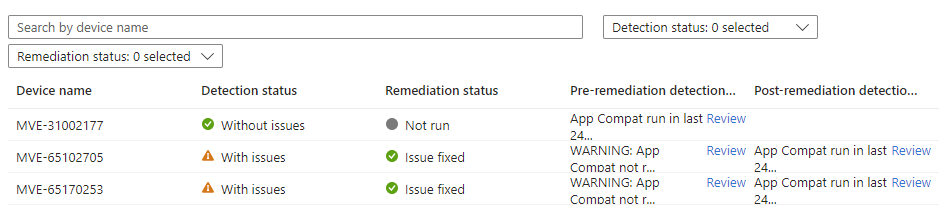

# Forcing Windows 11 Feature Update Readiness Assessments


I've spent far too much time digging into the [Windows Feature Update Readiness reports](https://learn.microsoft.com/en-us/mem/intune/protect/windows-update-compatibility-reports#use-the-windows-feature-update-device-readiness-report) available in Intune, having used them extensively in a previous series of posts:

- 
- 
- 
- 
- 

Using the data within the report to tag devices with their update risk score, hopefully making that move to Windows 11 a little smoother and without incident.

What happens to your devices that haven't sent their precious readiness data to Microsoft for ~~snooping~~ processing, or those devices with results that have changed from say [High to Low risk](https://learn.microsoft.com/en-us/mem/intune/protect/windows-update-compatibility-reports#use-the-windows-feature-update-device-readiness-report:~:text=following%20applies%20to-,Readiness%20status,-%3A), or the devices that are marked as Unknown by the report because the data hasn't been sent yet?


Can we help the devices with missing or stale data especially now that the Windows 11 24H2 report is now available?

Sure we can.

## Microsoft Compatibility Appraiser

Before we start fiddling (ahem) with settings on devices to get them to send their data to Microsoft, we need an understanding of where the Feature Update Readiness data is stored on the device...


...yeah it's the registry, where else would it be?

Thanks to [Johan Arwidmark](https://www.linkedin.com/in/jarwidmark/) for his [post](https://www.deploymentresearch.com/understanding-upgrade-experience-indicators-for-windows-11-upgrade-readiness/) on the data stored in the registry and what it means, and the linked [post](https://www.asquaredozen.com/2020/07/26/demystifying-windows-10-feature-update-blocks/) from [Adam Gross](https://www.linkedin.com/in/asquaredozen/) about the Compatibility Appraiser itself, we now have some way of identifying whether a device has been assessed for the feature updates available to it based on the data in the registry.

Simply put, we can use a [detection script](https://learn.microsoft.com/en-us/mem/intune/fundamentals/remediations) in Intune to check *if* the appraisal has run, *when* it has run, and then a remediation script to force the tool to run if we need to.

## Remediation Scripts

Both PowerShell [scripts](https://github.com/ennnbeee/oddsandendpoints-scripts/tree/main/Intune/Remediation/FeatureUpdateAppraisal) are available in my GitHub repo, but to give you a little background to them, and how to use them, keep reading.

### Detection

As I'm only interested in the latest and greatest Windows 11 Feature Update compatibility data, we only really need to check on the keys located in:

```text
HKLM:\SOFTWARE\Microsoft\Windows NT\CurrentVersion\AppCompatFlags\CompatMarkers\
```

Specifically these ones:

| Registry Key | Feature Update Version |
| :- | :- |
| `GE24H2` | Windows 11 24H2 |
| `NI23H2` | Windows 11 23H2 |

We can populate the `$featureUpdate` variable in the detection script with the corresponding Registry Key to check to see if data exists, and if it doesn't we'll exit in a way that Intune will start a remediation.

So for Windows 11 24H2 it's `$featureUpdate = 'GE24H2'`, and for Windows 11 23H2 it would be `$featureUpdate = 'NI23H2'`.

```PowerShell
$featureUpdate = 'GE24H2' # Windows 11 24H2
#$featureUpdate = 'NI23H2' # Windows 11 23H2
$registry = "HKLM:\SOFTWARE\Microsoft\Windows NT\CurrentVersion\AppCompatFlags\CompatMarkers\$featureUpdate"
```

If the registry key does exist, we can then query the value of the string **TimestampEpochString** which is populated by the App Compatibility tool when it was last run successfully, and compare it to the date and time when the script runs, minus a set number of hours (in [Epoch](https://en.wikipedia.org/wiki/Unix_time) format), configured using the `$schedule` variable.

```PowerShell
$featureUpdate = 'GE24H2' # Windows 11 24H2
#$featureUpdate = 'NI23H2' # Windows 11 23H2
$registry = "HKLM:\SOFTWARE\Microsoft\Windows NT\CurrentVersion\AppCompatFlags\CompatMarkers\$featureUpdate"

$lastRun = Get-ItemPropertyValue -Path $registry -Name TimestampEpochString -ErrorAction SilentlyContinue
$schedule = 24 # update based on the remediation schedule
$nowLessHours = Get-Date $((Get-Date).AddHours(-$schedule)) -UFormat +%s

if ($lastRun -lt $nowLessHours) {
    Write-Warning "App Compat not run in last $schedule hours"
    Exit 1
}
```


Depending on your Remediation script schedule will depend on the value of this variable, you don't want remediations running indefinitely.


If you're running this every seven days for example, you want to set `$schedule = 168`, so the remediation will only run if the App Compatibility tool hasn't run in the last seven days (7 x 24 = 168), more [quick maths](https://www.youtube.com/watch?v=M3ujv8xdK2w).


So with a bit of error capture, we now have a complete detection script that can be tailored based on the Feature Update we want the data for, and the schedule that the remediation in Intune will be run.



### Remediation

The detection now sorted, we should test a concept of a remediation.

Go and delete the following key in the registry from a test device, or your own if you feel like it:

```txt
Computer\HKEY_LOCAL_MACHINE\SOFTWARE\Microsoft\Windows NT\CurrentVersion\AppCompatFlags\CompatMarkers\GE24H2
```

We'll bring the data in that key back, I promise, [truss mi daddi](https://www.youtube.com/watch?v=v5yYDKEVItE).

We do need a way to kick off the App Compatibility tool using a remediation script, so we can start the application itself **CompatTelRunner.exe** located **$env:windir\system32**, with the associated arguments:

```PowerShell
$filePath = "$env:windir\system32\CompatTelRunner.exe"
$argumentList = "-m:appraiser.dll -f:DoScheduledTelemetryRun"
Start-Process -WindowStyle Hidden -FilePath $filePath -ArgumentList $argumentList -Wait
```

To bring back the registry data we deleted, just run the above from an elevated PowerShell prompt...



And all being well, the App Compatibility tool will have run successfully, and the registry will be populated with the report information we so desperately need:


So throwing those three lines into something that should handle errors, we get a remediation script.



So if the detection identifies either that the key doesn't exist, or if the last time the App Compatibility tool was run is outside of your schedule, it will kick off the tool to run and evaluate the Feature Updates it has available.

## Deployment

You should be using remediation scripts in Intune already, so go and create one using the [two provided scripts](https://github.com/ennnbeee/oddsandendpoints-scripts/tree/main/Intune/Remediation/FeatureUpdateAppraisal) after updating the variables in the detection script, with it looking something like this:


With whatever schedule you've decided and updated the `$schedule` variable in the detection script to, in this example it's once daily i.e., 24 hours.

If you're lucky your devices will then start checking to see the last time the tool was run, and kick off a new run if needed.



Now just to wait a quick [52 hours](https://learn.microsoft.com/en-gb/mem/intune/protect/windows-update-compatibility-reports#about-reporting-data-latency) for the report data to update 😅.

## Summary

You should be aiming to get your devices to Windows 11 sharpish if you haven't done so already, and Intune provides you with the tooling to at least understand the impact of what that update process looks like with the readiness report.

The readiness report needs your devices to send them data, and if the data doesn't exist, then they'll have nothing to send, hence the raft of devices classified as 'Unknown' when it comes to their update risk state.

All we're doing is helping those devices along, and ensuring that they have their compatibility data ready to send to Microsoft, so you can make informed choices when it comes to distributing Windows 11 feature updates.

Off you trot now, you've got Windows 10 devices to update.

